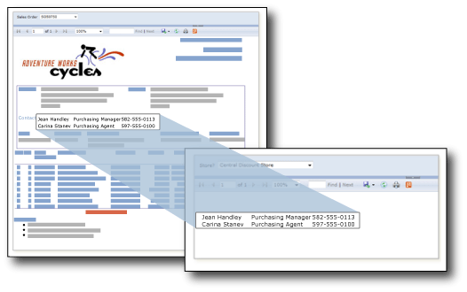

# Underrapporter i sidnumrerade Power BI-rapporter

En *underrapport* är ett sidnumrerat rapportobjekt som visar en annan sidnumrerad rapport inuti brödtexten i en sidnumrerad huvudrapport. En underrapport i en rapport påminner om en bildruta på en webbsida. Du kan använda den för att bädda in en rapport i en rapport. Du kan använda valfri rapport som underrapport. Du lagrar rapporten som visas som underrapport i samma Premium-arbetsyta som den överordnade rapporten. Du kan utforma den överordnade rapporten för att skicka parametrar till underrapporten. En underrapport kan upprepas i dataregioner med hjälp av en parameter för att filtrera data i varje instans av underrapporten.  
  
   
  
 I den här bilden kommer den kontaktinformation som visas i huvudrapporten för Försäljningsorder faktiskt från en kontaktunderrapport.  
  
Du skapar och ändrar definitionen för sidnumrerad rapport (.rdl) i Power BI Report Builder. Du kan ladda upp underrapporter som lagras i SQL Server Reporting Services till en Premium-arbetsyta i Power BI-tjänsten. Huvudrapporterna och underrapporterna måste publiceras på samma arbetsyta. Installera [Power BI Report Builder](https://go.microsoft.com/fwlink/?linkid=2086513).
  
## Arbeta med Report Builder och Power BI-tjänsten

Power BI Report Builder kan arbeta med sidnumrerade rapporter på datorn (kallas lokala rapporter) eller med rapporter i Power BI-tjänsten.  När du öppnar Report Builder för första gången uppmanas du att logga in på ditt Power BI-konto. Om det inte händer väljer du **Logga in** i det övre högra hörnet.

:::image type="content" source="media/subreports/report-builder-sign-in.png" alt-text="Logga in i Power BI":::

När du har loggat in visas alternativet **Power BI-tjänst** i Power BI Report Builder för alternativen **Öppna** och **Spara som** på **Arkiv**-menyn. När du väljer alternativet **Power BI-tjänst** för att spara en rapport skapar du en liveanslutning mellan Power BI Report Builder och Power BI-tjänsten. 

:::image type="content" source="media/subreports/report-builder-subreport-open-service.png" alt-text="Öppna från Power BI-tjänsten":::

## Spara en lokal rapport i Power BI-tjänsten

Innan du kan lägga till en underrapport i en huvudrapport måste du först skapa de två rapporterna och spara dem på samma Power BI Premium-arbetsyta. 

1. Om du vill öppna en befintlig lokal rapport går du till **Arkiv**-menyn och väljer **Öppna** > **Den här datorn** och väljer en .rdl-fil.  

2. På **Arkiv**-menyn väljer du **Spara som** > **Power BI-tjänst**.  Mer information finns i [Publicera en sidnumrerad rapport i Power BI-tjänsten](paginated-reports-save-to-power-bi-service.md).

    > [!NOTE]
    > Du kan också ladda upp en rapport genom att starta i Power BI-tjänsten. Samma artikel, [Publicera en sidnumrerad rapport i Power BI-tjänsten](paginated-reports-save-to-power-bi-service.md), innehåller mer information.

3. I dialogrutan **Spara som** väljer du en Power BI Premium-arbetsyta där du kan lagra dina sidnumrerade rapporter.  Premium-arbetsytor visas med en diamantikon  bredvid sitt namn.

    :::image type="content" source="media/subreports/report-builder-subreport-save-as-service.png" alt-text="Spara som till Power BI-tjänsten":::

4. Välj **Spara**.

## Lägga till en underrapport i en rapport

Nu när du har sparat båda rapporterna till samma Premium-arbetsyta kan du lägga till en till den andra som en underrapport. Du kan lägga till en underrapport på två sätt. 

1. På menyfliksområdet **Infoga** väljer du knappen **Underrapport** eller högerklickar på rapportarbetsytan och väljer **Infoga** > **Underrapport**.

    :::image type="content" source="media/subreports/report-builder-insert-subreport.png" alt-text="Infoga en underrapport i en rapport":::

    Dialogrutan **Egenskaper för underrapport** öppnas.  

2. Välj knappen **Bläddra** > gå till den rapport som du vill använda som underrapport > Ange namnet på underrapporten i textrutan **Namn**.

3. Konfigurera andra egenskaper efter behov, däribland [parametrar](#use-parameters-in-subreports).

## Använda parametrar i underrapporter  
 Om du vill skicka parametrar från den överordnade rapporten till underrapporten definierar du en rapportparameter i rapporten som du använder som underrapport. När du placerar underrapporten i den överordnade rapporten kan du välja rapportparametern och ett värde att skicka från den överordnade rapporten till rapportparametern i underrapporten.  
  
> [!NOTE]  
> Parametern som du väljer från underrapporten är en *rapport*-parameter, inte en *fråge*-parameter.  
  
 Du kan placera en underrapport i huvuddelen av rapporten eller i ett dataområde. Om du placerar en underrapport i ett dataområde upprepas underrapporten med varje instans av gruppen eller raden i dataområdet. Du kan skicka ett värde från gruppen eller raden till underrapporten. I underrapportens värdeegenskap använder du ett fältuttryck för det fält som innehåller värdet som du vill skicka till underrapportens parameter.  
  
 Mer information om hur du arbetar med parametrar och underrapporter finns i [Add a subreport and parameters](https://docs.microsoft.com/sql/reporting-services/report-design/add-a-subreport-and-parameters-report-builder-and-ssrs) (Lägga till en underrapport och parametrar) i SQL Server Reporting Services-dokumentationen.  

## Förhandsgranska sidnumrerade rapporter i Report Builder

Du kan förhandsgranska rapporter i Report Builder.

- På **Start**-menyfliksområdet, väljer du **Kör**. 

Eftersom Report Builder är ett designverktyg kan förhandsgranskningen av rapporten se annorlunda ut återgivning av rapporten i Power BI-tjänst.

### Information om förhandsgranskning

- Report Builder lagrar inte autentiseringsuppgifter för datakällor som används i rapporter.  Report Builder ber dig om varje uppsättning autentiseringsuppgifter under förhandsgranskningen.  
- Om rapportens datakällor finns lokalt måste du konfigurera en gateway när du har sparat rapporten till Power BI-arbetsytan.
- Om Report Builder påträffar ett fel under förhandsgranskningen returneras ett allmänt meddelande.  Om felet är svårt att felsöka kan du överväga att återge rapporten i Power BI-tjänsten.  

## Att tänka på

### Upprätthålla anslutningen

Report Builder inte sparar anslutningen till Power BI när du stänger filen.  Det är möjligt att arbeta med en lokal huvudrapport med underrapporter lagrade i Power BI-arbetsytan. Se till att spara huvudrapporten i Power BI-arbetsytan innan du stänger rapporten.  Om du inte gör det kan du få meddelandet ”Hittades inte” under förhandsgranskningen, eftersom det inte finns någon liveanslutning till Power BI-tjänsten.  I så fall går du till en underrapport och väljer dess egenskaper.  Öppna underrapporten igen från Power BI-tjänsten.  Detta upprättar anslutningen och alla andra underrapporter bör vara som de ska.

### Byta namn på en underrapport

Om du byter namn på en underrapport på arbets ytan måste du korrigera namnreferensen i huvudrapporten. Annars återges inte underrapporten. Huvudrapporten återges fortfarande med ett felmeddelande i underrapportobjektet.

## Migrera stora rapporter

Om du migrerar stora rapporter till Power BI bör du överväga att använda verktyget [RdlMigration](../guidance/migrate-ssrs-reports-to-power-bi.md).  RdlMigration-verktyget har uppdaterats för att hantera dubbla underrapportsnamn.  Dubbla underrapportsnamn kan uppstå när två eller fler rapporter delar samma namn men finns i olika underkataloger.  Om namnen inte är unikt matchade identifieras bara den första underrapporten.

Om du vill använda Report Builder för att migrera stora rapporter rekommenderar vi att du arbetar med underrapporterna först. Spara var och en på Power BI-arbetsytan för att förhindra dubbletter av rapportnamn.

## Dela rapporter med underrapporter

Som vi har angivit måste huvudrapporten och underrapporterna finnas i samma arbetsyta. Annars återges inte underrapporten. När du delar huvudrapporten måste du också dela underrapporterna. Om du delar huvudrapporten i en app ska du även inkludera underrapporter i appen. Om du delar huvudrapporten med användare eller användargrupper direkt ser du till att du även delar varje underrapport med samma uppsättning användare eller användargrupper.
  
## Nästa steg

[Felsöka underrapporter i sidnumrerade Power BI-rapporter](subreports-troubleshoot.md)

[Visa en sidnumrerad rapport i Power BI-tjänsten](../consumer/paginated-reports-view-power-bi-service.md)

Har du fler frågor? [Prova Power BI Community](https://community.powerbi.com/)
