# Ändra storleken på en rapportsida (självstudier)
I den [föregående artikeln och videon](power-bi-report-display-settings.md) fick du lära dig två olika sätt för att styra sidvisningen i Power BI-rapporter: **Visa** och **Sidstorlek**. Nu ska vi prova på det.

## Vi börjar med att ändra inställningarna för Sidvisning
1. Öppna du en rapport i Läsvy eller Redigeringsvy. I det här exemplet används sidan ”New Stores (Nya butiker)” i [Exempel på detaljhandelsanalys](sample-retail-analysis.md).  Den här sidan visas med hjälp av inställningen **Anpassa till sida**.  I det här fallet visar Anpassa till sida rapportsidan utan rullningslister, men vissa detaljer och rubriker är för små för att kunna läsas.
   
   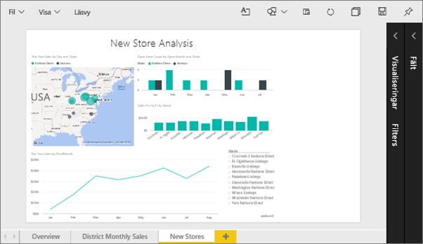
2. Kontrollera att inga visualiseringar är markerade på arbetsytan. Välj **Visa** och granska visningsalternativen.

* I Läsvy visas följande.
  
     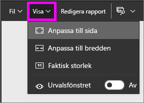
* I Redigeringsvy visas följande.
  
    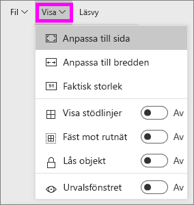

1. Nu ska vi se hur sidan visas med hjälp av inställningen **Faktisk storlek**.
   
   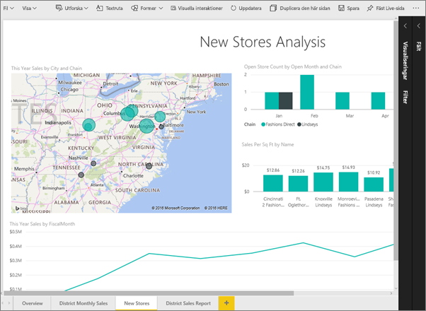
   
   Inte så bra, instrumentpanelen har nu dubbla rullningslister.
2. Växla till **Anpassa till bredd**.
   
   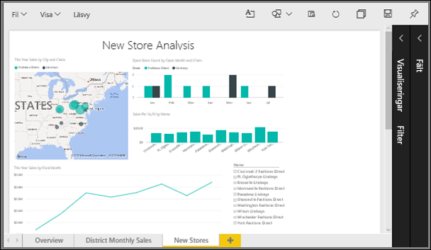
   
   Ser bättre ut, nu har vi rullningslister och det är lättare att läsa detaljerna.

## Ändra standardvyn för en rapportsida
Alla Power BI-rapporter visas som standard i vyn **Anpassa till sida**. Hur gör man om man vill att den här rapportsidan alltid ska öppnas i vyn **Faktisk storlek**?

1. På sidan **New stores (Nya butiker)** i rapporten växlar du tillbaka till vyn **Faktisk storlek**.
   
   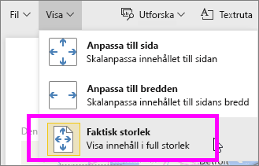
2. Spara rapporten med ett annat namn genom att välja **Arkiv > Spara som**. Du har nu två kopior av den här rapporten. I den ursprungliga rapporten fortsätter **New stores (Nya butiker)** att öppnas i standardvyn men i den nya rapporten öppnas den i vyn **Faktisk storlek**. Nu ska vi se.
   
   
3. Välj namnet på den aktuella arbetsytan från det övre navigeringsfältet för att återgå till den arbetsytan.  
   
   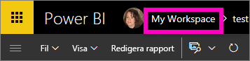
4. Välj fliken **Rapporter** och välj den nya rapporten som du precis skapade (den har en gul asterisk).
   
    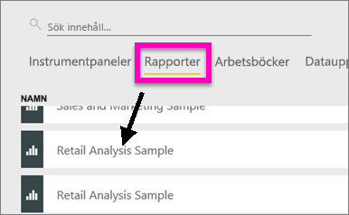
5. Rapporten öppnas i **Faktisk storlek**!
   
   

## Nu ska vi titta närmare på inställningen *Sidstorlek*.
Inställningarna för sidstorlek är bara tillgängliga i [Redigeringsvy](service-interact-with-a-report-in-editing-view.md). Du måste ha ägarbehörighet för en rapport som du vill öppna i redigeringsvyn. Om du har anslutit till något av våra [exempel](sample-datasets.md), har du ägarbehörighet för dessa rapporter.

1. Öppna sidan ”District monthly sales (Månadsvis distriktsförsäljning)” i [Exempel på detaljhandelsanalys ](sample-retail-analysis.md) i redigeringsvyn.
2. Kontrollera att inga visualiseringar är markerade på arbetsytan.  I fönstret **Visualiseringar** väljer du färgrollerikonen.
3. Välj **Sidstorlek** &gt; **Typ** för att visa alternativen för sidstorlek.
   
   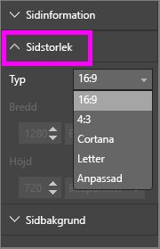
4. Välj **Letter**.  På arbetsytan återstår bara det innehåll som passar för 816 x 1056 bildpunkter (Letter-storlek) på den vita delen av arbetsytan.
   
   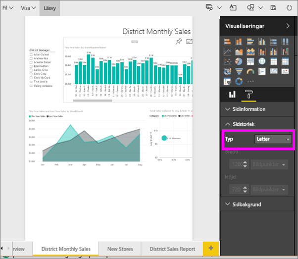
5. Om vi ändrar **Visa** till ”Anpassa till bredd”, visar nu vår arbetsyta endast det sidinnehåll som passar i Letter-storleken.
   
   
6. Välj **Sidstorlek** och förhållandet **16:9**.
   
   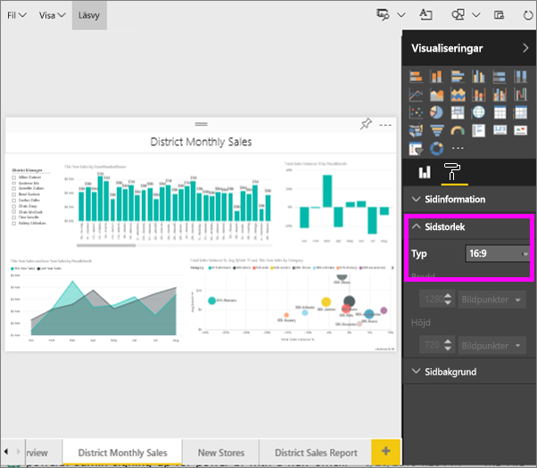
   
   Rapportsidan visas med hjälp av ett förhållande på 16 brett med 9 högt. Om du vill visa den faktiska bildpunktsstorlek som används, kan du ta en titt på de gråmarkerade fälten Bredd och Höjd (1 280 x 720). Det är mycket tomt utrymme runt rapportarbetsytan, vilket beror på att vi tidigare ställde in **Visa** på ”Anpassa till bredd”.
7. Fortsätt att utforska **Sidstorlek**-alternativen.

## Använda Sidvisning och Sidstorlek tillsammans
Du kan använda Sidvisning och Sidstorlek tillsammans för att skapa en rapport som ser bra ut när den är inbäddad i ett annat program.

I den här övningen kommer du att skapa en rapportsida som ska visas i ett program som har utrymme för 500 bildpunkter på bredden och 750 bildpunkter på höjden.

Kom ihåg att vi i det föregående steget såg att rapportsidan för närvarande visas med 1 280 på bredden och 720 på höjden. Så vi vet att vi behöver göra många storleksändringar och nya arrangemang om vi vill att alla våra visuella objekt ska få plats.

1. Ändra storlek på och flytta de visuella objekten så att de passar in på mindre än hälften av den aktuella arbetsytan.
   
    
2. Välj **Sidstorlek** &gt; **Anpassad**.
3. Ange bredden till 500 och höjden till 750.
   
    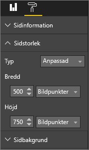
4. Justera rapportsidan så att den ser så bra ut som möjligt. Växla mellan **Visa > Faktisk storlek** och **Visa > Anpassa till sida** för att göra justeringar.
   
    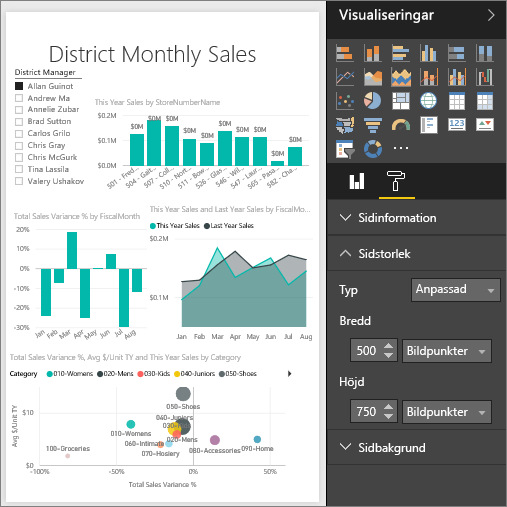

## Nästa steg
[Skapa rapporter för Cortana](service-cortana-answer-cards.md)

Tillbaka till [Sidvisningsinställningar i en Power BI-rapport](power-bi-report-display-settings.md)

Läs mer om [rapporter i Power BI](service-reports.md)

Har du fler frågor? [Försök med att fråga Power BI Community](http://community.powerbi.com/)

