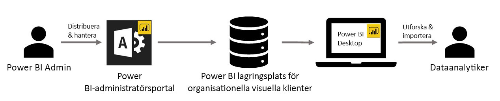

# Anpassade visuella objekt för organisationer i Power BI

Du kan använda anpassade visuella objekt med Power BI om du vill skapa en unik typ av visuella objekt som är skräddarsydd för dig. Dessa anpassade visuella objekt skapas av utvecklare, och de skapas ofta när flera av de visuella objekt som ingår i Power BI inte riktigt uppfyller deras behov.

I vissa organisationer är anpassade visuella objekt ännu viktigare – de kan vara nödvändiga för att förmedla specifika data eller insikter som är unika för organisationen, de kan ha särskilda datakrav eller de kan lyfta fram privata affärsmetoder. Sådana organisationer behöver utveckla anpassade visuella objekt, dela dem i hela organisationen och se till att de är underhålls ordentligt. Med anpassade visuella objekt i Power BI kan organisationer göra just detta.

I följande bild visas den process genom vilken organisationens anpassade visuella objekt i Power BI flödar från administratören, via utveckling och underhåll, för att slutligen hamna hos dataanalytikern.

Visuella objekt för organisationer distribueras och hanteras av Power BI-administratören från administrationsportalen. När de anpassade visuella objekten väl har distribuerats till organisationens databas, kan användarna i organisationen enkelt identifiera och importera dem till sina rapporter direkt från Power BI Desktop.

Mer information om hur du använder anpassade visuella objekt i en organisation i rapporter som du har skapat finns i följande artikel: [Lär dig mer om att importera organisationens visuella objekt i dina rapporter](power-bi-custom-visuals.md).

## Administrera anpassade visuella objekt i en organisation

Mer information om hur du administrerar, distribuerar och hanterar anpassade visuella objekt i din organisation finns i följande artikel: [Mer information om distribution och hantering av en organisations anpassade visuella objekt](https://go.microsoft.com/fwlink/?linkid=866790).

> [!WARNING]
> Ett anpassat visuellt objekt kan innehålla kod som innebära säkerhets- eller integritetsrisker. Kontrollera att författaren eller källan till alla anpassade visuella objekt är tillförlitlig innan du distribuerar dem till organisationens databas.

## Överväganden och begränsningar

Det finns flera överväganden och begränsningar som du behöver känna till.

Administration:

* Äldre anpassade visuella objekt (t.ex anpassade visuella objekt som inte har byggts ovanpå den nya versionens API:er) stöds inte

* Om ett anpassat visuellt objekt tas bort från databasen upphör alla befintliga rapporter som använder det borttagna visuella objektet att återges. Det går inte att ångra borttagningen från databasen. För att tillfälligt inaktivera anpassad visualisering, använder du funktionen ”inaktivera”.

Slutanvändare:

* En organisations anpassade visuella objekt är privata visuella objekt som importerats från organisationens centrallager. Som alla privata visuella objekt kan de inte [exporteras till PowerPoint](https://docs.microsoft.com/power-bi/consumer/end-user-powerpoint) eller visas i e-postmeddelanden som tas emot när en användare [prenumererar på rapportsidor](https://docs.microsoft.com/power-bi/consumer/end-user-subscribe). Endast [certifierade anpassade visuella objekt](https://docs.microsoft.com/power-bi/power-bi-custom-visuals-certified) som importeras direkt från marknadsplatsen stöder dessa funktioner.

* Visuella Visio-objekt, visuella PowerApps-objekt, visuella kartruteobjekt och visuella GlobeMap-objekt från AppSource-marknadsplatsen återges inte om de distribueras via organisationens centrallager.

## Felsök

Information om felsökning finns i [Felsöka dina anpassade visuella objekt i Power BI](power-bi-custom-visuals-troubleshoot.md).

## Vanliga frågor och svar

Mer information och svar på frågor finns i [Vanliga frågor och svar om anpassade visuella Power BI-objekt](power-bi-custom-visuals-faq.md#organizational-custom-visuals).

Har du fler frågor? [Testa Power BI Community](http://community.powerbi.com/).
