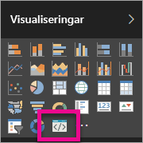

# Felsöka anpassade visuella objekt i Power BI

## Felsök

**Pbiviz-kommandot hittades inte (eller liknande fel)**

När du kör `pbiviz` på kommandoraden i terminalen bör du se hjälpskärmen. Om du inte gör det så har den inte installerats korrekt. Kontrollera att du har installerat version 4.0 av NodeJS eller senare.

**Det gick inte att hitta det visuella felsökningsobjektet på fliken Visualiseringar**

Det visuella felsökningsobjektet ser ut som en frågeikon på fliken **Visualiseringar**.

Kontrollera att du har aktiverat det på inställningarna för Power BI om du inte kan se det.

> [!NOTE]
> Det går för närvarande endast att felsöka visuella objekt i Power BI-tjänsten och inte i Power BI Desktop eller mobilappen. Det paketerade visuella objektet kommer fortfarande att fungera överallt.

**Det går inte att kontakta den visuella servern**

Kör den visuella servern `pbiviz start` på kommandoraden i terminalen från roten av ditt visuella projekt. Om servern inte körs är det troligt att dina SSL-certifikat inte har installerats korrekt.

Ta gärna kontakt med supporten för anpassade visuella objekt: *pbicvsupport@microsoft.com*  om du har frågor, kommentarer eller problem.

## Nästa steg

Mer information finns i [Vanliga frågor och svar om anpassade visuella Power BI-objekt](power-bi-custom-visuals-faq.md#organizational-custom-visuals).
