# Ta en titt på panelen för rapportfilter
Den här artikeln tar en djup titt på filterrapportfönstret. Du ser fönstret för Power BI-rapporter i redigeringsvyn och i läsvyn.

Det finns många olika sätt att filtrera data i Power BI och vi rekommenderar att först läsa [Om filter och markering](power-bi-reports-filters-and-highlighting.md).

## Arbeta med filter
Rapporter kan öppnas i [redigeringsvyn eller läsvyn](service-reading-view-and-editing-view.md). I redigeringsvyn kan rapportägare [lägga till filter för en rapport](power-bi-report-add-filter.md) och dessa filter sparas i rapporten. Personer som visar rapporten i läsvyn kan interagera med filtren, men de kan inte spara filterändringar i rapporten.

## Filter i läsvyn
När en rapporten har öppnats i läsläge visar fönsterfiltret längst till höger i rapportarbetsytan. Om du inte ser fönstret väljer du pilen i det övre högra hörnet för att expandera det.

I det här exemplet har vi valt ett visuellt objekt som innehåller 6 filter. Sidan har också filter som visas under rubriken **Sidonivåfilter**. Det finns ett [filter för detaljerad information](power-bi-report-add-filter.md) och hela rapporten har också ett filter: **räkenskapsår** är 2013 eller 2014.

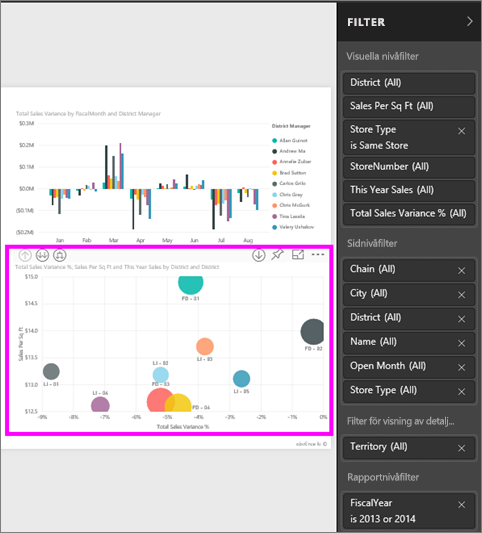

Vissa filter har ordet **alla** och detta innebär att alla värden ingår i filtret.  Som exempel kan vi av **Chain(All) (Kedja(alla))** på skärmbilden nedan avläsa att den här rapportsidan innehåller data om alla butikskedjorna.  Å andra sidan berättar filtret på rapportnivå för **Räkenskapsår 2013 eller 2014** att rapporten bara innehåller data för räkenskapsåren 2013 och 2014.

Alla som visar den här rapporten kan interagera med filtren.

* visa information om filtret genom att hålla muspekaren över och klicka på pilen bredvid filtret.
  
   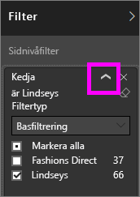
* ändra filtret, till exempel, ändra **Lindseys** till **Fashion Direct**.
  
     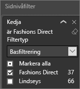
* ta bort filtret genom att välja **x** intill filternamnet.
  
  När du tar bort ett filter försvinner den från listan och data raderas från rapporten.  Till exempel, om du tar bort filtret **räkenskapsår är 2013 eller 2014** finns räkenskapsårets informationen kvar i rapporten men den kommer inte längre att filtreras så att endast 2013 och 2014 visas. Istället visas alla räkenskapsår som innehåller data.  När du tar bort filtret, kommer inte du att kunna ändra det igen eftersom det har tagits bort från listan. Ett bättre alternativ är att ta bort filtret genom att välja ikonen Radera .
  
  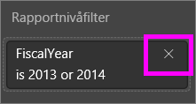

## Filter i redigeringsvyn
När en rapporten har öppnats i redigeringsläge visar fönsterfiltret längst till höger i rapportarbetsytan i den nedre delen av fönstret **Visualisering**. Om du inte ser fönstret väljer du pilen i det övre högra hörnet för att expandera det.

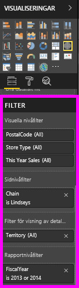.  

Om inga visuella objekt markeras på arbetsytan visar fönstret Filter endast de filter som gäller för hela rapportsidan eller hela rapporten, samt eventuella filter för detaljerad information (om några sådana finns). I nedanstående exempel har inga visuella objekt valts och det finns inga filter på sidnivå eller filter för detaljerad information, men det finns ett filter på rapportnivå.  

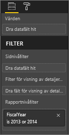  

Om ett visuellt väljs i arbetsytan visas också de filter som endast gäller för det visuella objektet:   

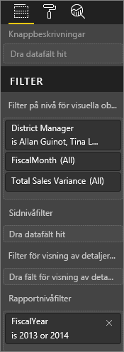

Välj nedpilen bredvid namnet på filtret om du vill visa alternativ för ett visst filter.  I exemplet nedan ställs filtret för rapporten in på 2013 och 2014. Och det här är ett exempel på **grundläggande filtrering**.  Om du vill visa avancerade alternativ väljer du **avancerade filter**.

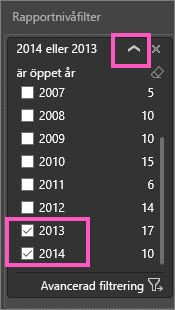

## Rensa ett filter
 Välj ikonen Radera  i antingen grundläggande eller avancerat filtreringsläge för att återställa filtret. 

## Lägg till ett filter
* I redigeringsvyn lägger du till ett filter i ett visuellt objekt, en sida, en visning av detaljerad information eller en rapport genom att välja ett fält från fönstret Fält och dra den till en lämplig filterbrunn, där du ser orden **Dra fält hit**. När ett fält har lagts till som ett filter, finjustera det med hjälp av grundläggande filtrering och avancerad filtrering (beskrivs nedan).

Om du drar ett nytt fält till området för filter på visuell nivå läggs fältet inte till i det visuella objektet, men du kan filtrera det visuella objektet med det nya fältet. I exemplet nedan, har **Kedja** lagts till som ett nytt filter i det visuella objektet. Observera när du lägger till **Kedja** som ett filter att detta inte ändrar det visuella objektet förrän du använder grundläggande eller avancerade filtreringskontroller.

    

* Alla fält som används för att skapa ett visuellt objekt är också tillgängliga som filter. Välj först ett visuellt objekt för att aktivera det. Fält som används i det visuella objektet visas i fönstret visualiseringar (om du är i redigeringsvyn) och i fönstret filter under rubriken **Visuella nivåfilter**.
  
   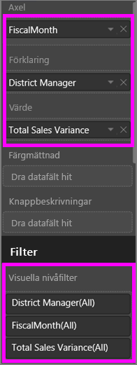  
  
   Finjustera något av fälten med hjälp av grundläggande filtrering och avancerad filtrering (beskrivs nedan).

## Typer av filter: textfältfilter
### Listläge
Om du markerar en kryssruta markeras eller avmarkeras värdet. Kryssrutan **Alla** kan användas för att växla tillståndet för alla kryssrutor. Kryssrutorna representerar de tillgängliga värdena för det här fältet.  När du justerar filtret uppdateras omformuleringen efter dina val. 

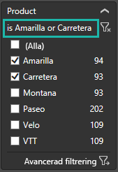

Nu står det ”är Amarilla eller Carretera” i omformuleringen

### Avancerat läge
Välj **Avancerade filter** för att övergå till avancerat läge. Använd listrutekontroller och textrutor för att ange vilka fält som ska inkluderas. Genom att välja mellan **Och** och **Eller** kan du skapa komplexa filteruttryck. Välj knappen **Använd Filter** när du har angett dina önskade värden.  

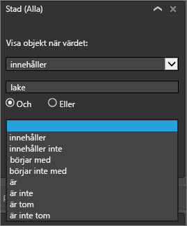

## Typer av filter: sifferfältfilter
### Listläge
Om värdena är begränsade, visar fältnamnet en lista.  Se **Textfältfilter** &gt; **Listläge** ovan för att få hjälp med att använda kryssrutor.   

### Avancerat läge
Om värdena är oändliga eller motsvarar ett värde öppnas det avancerade filterläget när du markerar fältnamnet. Använd listrutan och textrutor för att ange ett intervall med värden som du vill se. 

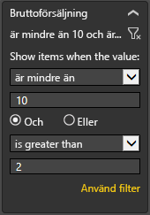

Genom att välja mellan **Och** och **Eller** kan du skapa komplexa filteruttryck. Välj knappen **Använd Filter** när du har angett dina önskade värden.

## Typer av filter: datum och tid
### Listläge
Om värdena är begränsade, visar fältnamnet en lista.  Se **Textfältfilter** &gt; **Listläge** ovan för att få hjälp med att använda kryssrutor.   

### Avancerat läge
Om fältvärdena representerar datum och tid, kan du ange en starttid/sluttid med datum/tid-filter.  

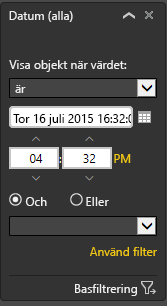

## Nästa steg
[Filtrera och markera i rapporter](power-bi-reports-filters-and-highlighting.md)  
[Interagera med filter och markeringar i rapportens läsvy](service-reading-view-and-editing-view.md)  
[Skapa filter i rapportens redigeringsvy](power-bi-report-add-filter.md)  
[Ändra hur en rapports visuella objekt korsfiltrerar och korsmarkerar varandra](service-reports-visual-interactions.md)

Läs mer om [rapporter i Power BI](service-reports.md)  
[Power BI – grundläggande begrepp](service-basic-concepts.md)

Har du fler frågor? [Prova Power BI Community](http://community.powerbi.com/)

