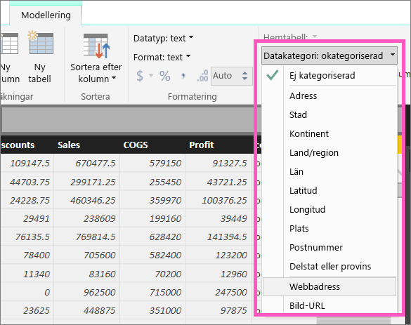
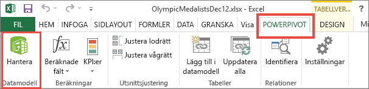

# Hyperlänkar i tabeller
I det här ämnet lär du dig hur du använder Power BI Desktop för att skapa hyperlänkar. När hyperlänkarna har skapats använder du Desktop eller Power BI-tjänsten för att lägga till dem till dina rapporttabeller och -matriser. 

> **OBS**: Hyperlänkarna i [paneler på instrumentpaneler](service-dashboard-edit-tile.md) och [textrutor på instrumentpaneler](service-dashboard-add-widget.md) kan skapas i farten med Power BI-tjänsten. Hyperlänkar i [textrutor i rapporter](service-add-hyperlink-to-text-box.md) kan skapa i farten med Power BI-tjänsten och Power BI Desktop.
> 
> 

## Skapa en hyperlänk i en tabell eller matris med Power BI Desktop
Hyperlänkar i tabeller och matriser kan skapas i Power BI Desktop, men inte från Power BI-tjänsten. Hyperlänkar kan även skapas i Excel Power Pivot innan arbetsboken importeras till Power BI. Båda metoderna beskrivs nedan.

## Skapa en tabell- eller en matrishyperlänk i Power BI Desktop
Proceduren för att lägga till en hyperlänk beror på om du har importerat dina data eller anslutit dem med hjälp av DirectQuery. Båda scenarierna beskrivs nedan.

### För data som importerats till Power BI
1. Om hyperlänken inte redan finns som ett fält i datauppsättningen, använder du Desktop för att lägga till den som en [anpassad kolumn](desktop-common-query-tasks.md).
2. I datavyn väljer du kolumnen och på fliken **Modellering** väljer du listrutan för **Datakategori**.
   
    
3. Välj **Webbadress**.
4. Växla till rapportvyn och skapa en tabell eller matris med hjälp av fältet som kategoriserats som en webbadress. Hyperlänkarna är blå och understrukna.
   
    
5. Om du inte vill visa en lång URL i en tabell, kan du visa en hyperlänkikon  i stället. Observera att du inte kan visa ikoner i matriser.
   
   * Välj diagrammet för att aktivera det.
   * Välj färgrollerikonen  för att öppna formateringsfönstret.
   * Expandera **Värden**, leta upp **URL-ikonen** och **aktivera** den.
6. (Valfritt) [Publicera rapporten från Desktop till Power BI-tjänsten](guided-learning/publishingandsharing.yml?tutorial-step=2) och öppna rapporten i Power BI-tjänsten. Hyperlänkarna fungerar där också.

### För data anslutna med DirectQuery
Du kan inte skapa en ny kolumn i DirectQuery-läge.  Men om dina data redan innehåller URL:er, kan du förvandla dem till hyperlänkar.

1. Skapa en tabell med ett fält som innehåller URL:er i rapportvyn.
2. Markera kolumnen och välj listrutan för **Datakategori** på fliken **Modellering**.
3. Välj **Webbadress**. Hyperlänkarna är blå och understrukna.
4. (Valfritt) [Publicera rapporten från Desktop till Power BI-tjänsten](guided-learning/publishingandsharing.yml?tutorial-step=2) och öppna rapporten i Power BI-tjänsten. Hyperlänkarna fungerar där också.

## Skapa en tabell- eller en matrishyperlänk i Excel Power Pivot
Ett annat sätt för att lägga till hyperlänkar till dina Power BI-tabeller och -matriser är att skapa hyperlänkarna i datauppsättningen innan du importerar/ansluter till datauppsättningen från Power BI. I det här exemplet används en Excel-arbetsbok.

1. Öppna arbetsboken i Excel.
2. Välj fliken **PowerPivot** och sedan **Hantera**.
   
   
3. När PowerPivot öppnas väljer du fliken **Avancerat**.
   
   
4. Placera markören i den kolumn som innehåller de URL:er som du vill förvandla till hyperlänkar i Power BI-tabeller.
   
   > **OBS**: URL-adresserna måste börja med **http://, https://** eller **www**.
   > 
   > 
5. I gruppen **Rapporteringsegenskaper** väljer du listrutan **Datakategori** och sedan **Webbadress**. 
   
   
6. Anslut till eller importera den här arbetsboken från Power BI-tjänsten eller Power BI Desktop.
7. Skapa en tabellvisualisering som innehåller URL-fältet.
   
   

## Överväganden och felsökning
F: Kan jag använda en anpassad URL som en hyperlänk i en tabell eller matris?    
S: Nej. Du kan använda en länkikon. Om du behöver anpassad text för hyperlänkarna och listan över URL:er är kort kan du använda en textruta i stället.

## Nästa steg
[Visualiseringar i Power BI-rapporter](power-bi-report-visualizations.md)

[Power BI – grundläggande begrepp](service-basic-concepts.md)

Har du fler frågor? [Prova Power BI Community](http://community.powerbi.com/)

