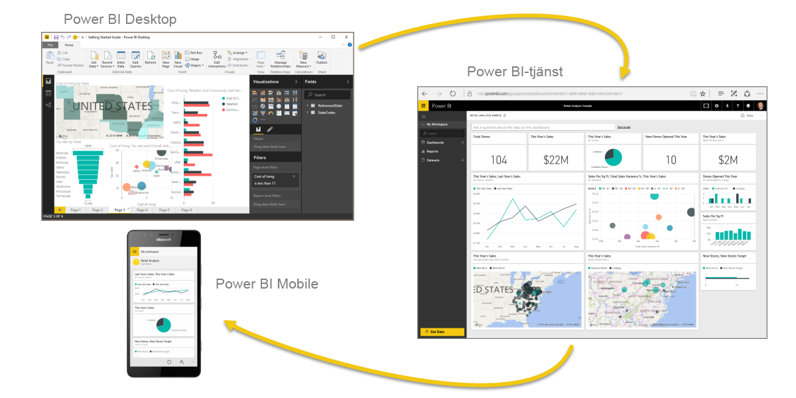

# Vad är Power BI?
**Power BI** är en samling programvarutjänster, appar och kopplingar som arbetar tillsammans för att förvandla dina orelaterade datakällor till sammanhängande, visuellt fördjupande och interaktiva insikter. Oavsett om dina data består av ett enkelt Excel-kalkylblad eller en samling molnbaserade och lokala hybridinformationslager, kan du med **Power BI** enkelt ansluta till dina datakällor, visualisera (eller identifiera) vad som är viktigt och dela det med någon eller alla du vill.

**Power BI** kan vara enkelt och snabbt och kan på ett ögonblick skapa snabba insikter från ett Excel-kalkylblad eller en lokal databas. Men **Power BI** är också robust och håller företagsklass och möjliggör omfattande modellering och analys i realtid samt anpassad utveckling. Så det kan vara ditt personliga verktyg för rapportering och visualisering och även fungera som analys- och beslutsmotor till grupprojekt, avdelningar eller hela bolag.

## Power BI:s delar
Power BI består av ett Windows-skrivbordsprogram som heter **Power BI Desktop**, en SaaS-tjänst (*programvara som en tjänst*) online som kallas **Power BI-tjänsten** och Power BI **-mobilappar** som finns tillgängliga för Windows-telefoner och -surfplattor, samt för iOS- och Android-enheter.

Dessa tre delar – **skrivbordet**, **tjänsten** och **mobilapparna** – är utformade för att människor ska kunna skapa, dela och använda affärsinsikter på det sätt som passar dem bäst beroende på roll.

## Hur Power BI matchar din roll
Hur du använder Power BI kan bero på vilken roll du har i ett projekt eller i ett team. Och andra personer i andra roller kan använda Power BI på annat sätt, vilket fungerar lika bra.

Du kanske som exempel i första hand använder **Power BI-tjänsten** men din siffertokiga affärsrapportskapande kollega kanske i stor utsträckning använder sig av **Power BI Desktop** (och publicerar skrivbordsrapporterar till Power BI-tjänsten, som du sedan läser). En annan kollega på försäljningssidan kanske främst använder sin Power BI-mobilapp för att övervaka sina försäljningskvoter och för att sätta sig in i ny information om ett potentiellt försäljningstillfälle.

Om du är utvecklare kan du använda Power BI:s API:er för att skicka data till datauppsättningar eller för att bädda in instrumentpaneler och rapporter i dina egna anpassade program. Har du en idé till ett nytt visuellt objekt? Skapa det själv och dela det med andra.  

Du kan också använda delarna i **Power BI** vid olika tidpunkter, beroende på vad du vill uppnå eller vilken din roll är för ett visst projekt eller en viss uppgift.

Du kanske vill visa utvecklingen för lager och tillverkning på en instrumentpanel i realtid i tjänsten och även använda **Power BI Desktop** för att skapa rapporter för ditt team om kundengagemangsstatistik. Hur du använder Power BI kan baseras på vilken funktion eller tjänst i Power BI som är det bästa verktyget för din situation – men alla delar av Power BI är tillgängliga för dig, vilket är anledningen till att det är så flexibelt och övertygande.

## Arbetsflödet i Power BI
Ett vanligt arbetsflöde i Power BI börjar med att ansluta till datakällor och skapa en rapport i **Power BI Desktop**. Rapporten publiceras därefter från **Desktop** till **Power BI-tjänsten** och delas så att användare av **tjänsten** och **mobilappen** kan *använda* (visa och interagera med) rapporten.
Ibland kan du vilja ge kollegor behörigheter som liknar dina egna (behörigheter för *skapare*) så att de också kan använda **tjänsten** för att redigera rapporter, skapa instrumentpaneler och dela sitt arbete.

Det går inte alltid till på det här viset men detta är ett av de vanligaste arbetsflödena och det visar hur de tre huvudsakliga Power BI-elementen kompletterar varandra.

Men vad händer om du inte är redo att flytta till molnet och vill behålla dina rapporter bakom en företagsbrandvägg?  Då läser du vidare.

## Lokal rapportering med Power BI-rapportservern
Skapa, distribuera och hantera Power BI, mobila och sidnumrerade rapporter lokalt med det utbud av verktyg och tjänster som är klara att användas som Power BI-rapportservern ger dig.

Power BI-rapportservern är en lösning som du distribuerar bakom brandväggen och som skickar dina rapporter till rätt användare på olika sätt, oavsett om de som får dem ska visa dem i en webbläsare, på en mobil enhet eller som ett e-postmeddelande. Och eftersom Power BI-rapportservern är kompatibel med Power BI i molnet, kan du flytta över till molnet när du är redo.

## Nästa steg
[Logga in, hämta vissa data och lär dig använda Power BI-tjänsten](consumer/end-user-experience.md)   
[Självstudie: Kom igång med Power BI-tjänsten](service-get-started.md)
