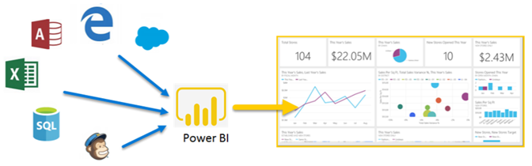
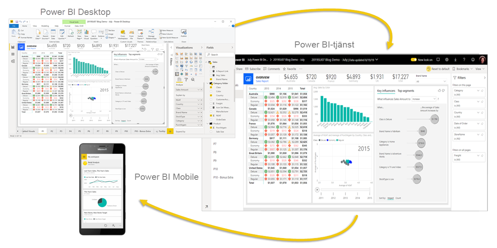
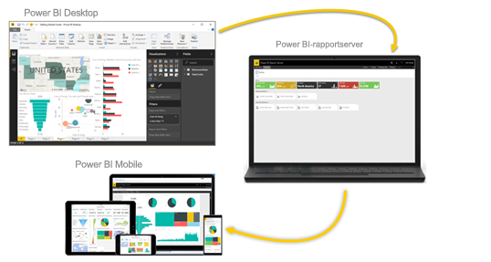

# Vad är Power BI?
**Power BI** är en samling programvarutjänster, appar och kopplingar som arbetar tillsammans för att förvandla dina orelaterade datakällor till sammanhängande, visuellt fördjupande och interaktiva insikter. Dina data kan finnas i ett Excel-kalkylblad eller i en samling molnbaserade och lokala hybridinformationslager. Med Power BI kan du enkelt ansluta till dina datakällor, visualisera och upptäcka det som är viktigt och dela resultat med alla du vill.

Power BI kan vara enkelt och snabbt, och kan skapa snabba insikter från ett Excel-kalkylblad eller en lokal databas. Men Power BI är även robust och håller företagsklass. Det möjliggör omfattande modellering och analys i realtid samt anpassad utveckling. Det kan vara ditt personliga verktyg för rapportering och visualisering och även fungera som analys- och beslutsmotor till grupprojekt, avdelningar eller hela bolag.

## Power BI:s delar
Power BI består av: 
- Ett Windows-skrivbordsprogram som heter **Power BI Desktop**.
- En onlinebaserad SaaS-tjänst (*programvara som en tjänst*) som kallas **Power BI-tjänsten**. 
- Power BI-**mobilappar** för enheter med Windows, iOS och Android.

Dessa tre delar – Power BI Desktop, tjänsten och mobilapparna – är utformade för att hjälpa personer att skapa, dela och använda affärsinsikter på det sätt som passar dem bäst beroende på deras roll.

Med hjälp av en fjärde del som kallas **Power BI-rapportserver** kan du publicera Power BI-rapporter som du har skapat i Power BI Desktop till en lokal rapportserver. Läs mer om [Power BI-rapportservern](#on-premises-reporting-with-power-bi-report-server).

## Hur Power BI matchar din roll
Hur du använder Power BI kan bero på vilken roll du har i ett projekt eller i ett team. Andra personer som har andra roller kan använda Power BI på något annat sätt.

Till exempel använder du kanske själv främst **Power BI-tjänsten**. Men din siffertokiga kollega som är mer intresserad av affärsrapporter kanske i större utsträckning använder sig av **Power BI Desktop** för att skapa rapporter och sedan publicera dem till Power BI-tjänsten, där du läser dem. En annan kollega på försäljningssidan använder kanske främst **Power BI-mobilappen** för att övervaka sina försäljningskvoter och sätta sig in i ny information om potentiella kundleads.

Om du är utvecklare kan du använda Power BI:s API:er för att skicka data till datauppsättningar eller för att bädda in instrumentpaneler och rapporter i dina egna anpassade program. Har du en idé till ett nytt visuellt objekt? Skapa det själv och dela det med andra.  

Det är även vanligt att använda varje del i Power BI vid olika tidpunkter, beroende på vad man vill uppnå eller vilken roll man har i ett visst projekt.

Hur du använder Power BI kan ändra enligt vilken funktion eller tjänst i Power BI som är det bästa verktyget för din aktuella situation. Till exempel kan du använda Power BI Desktop för att skapa rapporter för ditt eget team om kundengagemangsstatistik, och du kan se lagret och tillverkningsförloppet på en realtidsinstrumentpanel i Power BI-tjänsten. Varje del av Power BI finns tillgänglig för dig, vilket också är orsaken till att det är så flexibelt och attraktivt.

Utforska dokument som hör till din roll:
- Power BI för [***designers***](desktop-what-is-desktop.md)
- Power BI för [***konsumenter***](consumer/end-user-consumer.md)
- Power BI för [***utvecklare***](developer/what-can-you-do.md)
- Power BI för [***administratörer***](service-admin-administering-power-bi-in-your-organization.md)

## Arbetsflödet i Power BI
Ett vanligt arbetsflöde i Power BI börjar med att ansluta till datakällor och skapa en rapport i Power BI Desktop. Sedan publicerar du rapporten från Power BI Desktop till Power BI-tjänsten och delar den så att slutanvändarna i Power BI-tjänsten och mobila enheter kan läsa och interagera med den.
Det här är det vanliga arbetsflödet, som visar hur de tre huvuddelarna i Power BI kompletterar varandra.

Här är en detaljerad [jämförelse av Power BI Desktop och Power BI-tjänsten](service-service-vs-desktop.md).

Men vad händer om du inte är redo att flytta till molnet och vill behålla dina rapporter bakom en företagsbrandvägg?  Då läser du vidare.

## Lokal rapportering med Power BI-rapportservern
Skapa, distribuera och hantera mobila och sidnumrerade Power BI-rapporter lokalt med det utbud av verktyg och tjänster som är klara att användas som Power BI-rapportservern ger dig.

Power BI-rapportservern är en lösning som du distribuerar bakom brandväggen och som skickar dina rapporter till rätt användare på olika sätt, oavsett om de som får dem ska visa dem i en webbläsare, på en mobil enhet eller som ett e-postmeddelande. Och eftersom Power BI-rapportservern är kompatibel med Power BI i molnet, kan du flytta över till molnet när du är redo. 

Läs mer om [Power BI-rapportservern](report-server/get-started.md).

## Nästa steg
- [Snabbstart: Lär dig använda Power BI-tjänsten](service-the-new-power-bi-experience.md)   
- [Självstudier: Kom igång med Power BI-tjänsten](service-get-started.md)
- [Snabbstart: Ansluta till data i Power BI Desktop](desktop-quickstart-connect-to-data.md)
