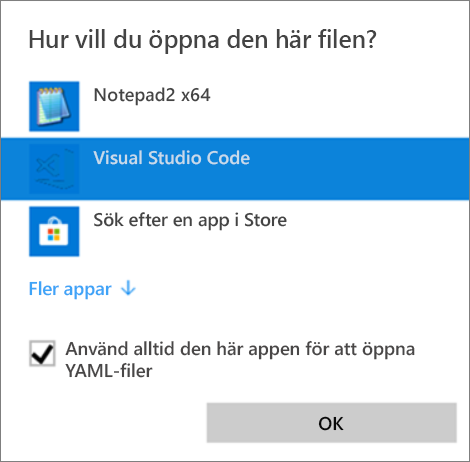
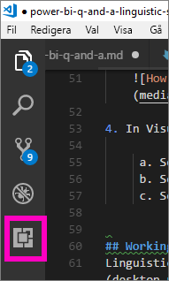
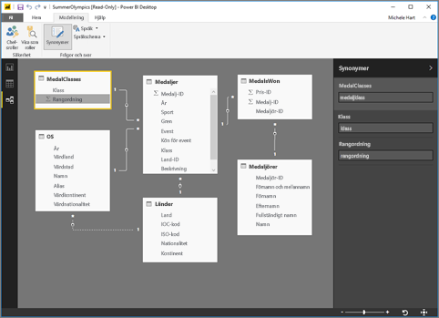
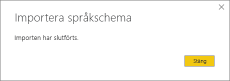

# <a name="language-modeling-and-the-linguistic-schema"></a>Språkmodellering och språkschemat 
Användning av vanliga fraser och naturligt språk för att ställa frågor till dina data är kraftfullt. Ännu mer kraftfullt är det när dina data svarar, vilket är precis vad du kan åstadkomma med Frågor och svar i Power BI. När du ställer en fråga till Frågor och svar i Power BI, gör funktionen vad den kan för att svara korrekt. 

Men du kan förbättra interaktionerna med Frågor och svar ännu mer genom att optimera svaren på olika sätt – ett sätt är genom att redigera språkschemat. 

Allt börjar med dina företagsdata.  Ju bättre datamodell, desto lättare blir det för användarna att få relevanta svar. Ett sätt att förbättra modellen är att lägga till ett språkschema som definierar och kategoriserar terminologi och relationer mellan tabell- och kolumnnamn i din datauppsättning. Du hanterar dina språkscheman i Power BI Desktop. 

## <a name="what-is-a-linguistic-schema"></a>Vad är ett språkschema?
Ett språkschema beskriver termer och fraser som Frågor och svar bör förstå om objekt i en datauppsättning, t.ex. ordklasser, synonymer och uttryck som relaterar till datauppsättningen. När du importerar eller ansluter till en datauppsättning skapar Power BI ett språkschema baserat på datauppsättningens struktur. När du ställer en fråga till Frågor och svar letar funktionen efter matchningar och relationer i datauppsättningen för att försöka förstå avsikten med din fråga. Till exempel söker den efter substantiv, verb, adjektiv, frasering och andra element. Funktionen letar också efter relationer, t.ex vilka kolumner som är objekt till ett verb. 

Du är förmodligen bekant med ordklasser (om inte, se nedan), men frasering kanske inte är lika välbekant.  Frasering beskriver hur du talar om (eller ”fraserar”) relationerna mellan saker. Anta till exempel att du för att beskriva relationen mellan kunder och produkter säger ”kunder köper produkter”. Eller att du för att beskriva relationen mellan kunder och ålder säger ”ålder anger hur gamla kunder är”. Eller att du för att beskriva relationen mellan kunder och telefonnummer kanske bara säger ”kunder har telefonnummer”.

Dessa fraser kan ha flera olika former och storlekar. En del överensstämmer exakt med relationer i datamodellen. Andra relaterar kolumner med deras tillhörande tabeller. Ytterligare andra relaterar flera tabeller och kolumner till varandra i komplexa relationer. I samtliga fall beskriver de i alldagliga termer hur saker är relaterade till varandra.

Språkscheman sparas i YAML-format. Det här formatet är relaterat till det mycket populära JSON-formatet, men har en mer flexibel och lättbegriplig syntax. Språkscheman kan redigeras, exporteras och importeras till Power BI Desktop.

## <a name="prerequisites"></a>Förutsättningar
- Om du inte redan har läst artikeln om hur du [förbättrar datamodellen för Frågor och svar](desktop-qna-in-reports.md) rekommenderar vi att du läser den innan du fortsätter. Den innehåller flera tips som hjälper dig att utforma och förbättra datamodellen, samt ett viktigt avsnitt om hur du lägger till synonymer.  

- Frågor och svar har två sidor.  Den första är förberedelsen, eller ”modelleringen”.  Den andra handlar om att ställa frågor och utforska data, dvs. själva ”användningen”. På vissa företag ansvarar särskilda anställda, kallade datamodellerare eller IT-administratörer, för att sätta ihop datauppsättningarna, skapa datamodellerna och publicera datauppsättningarna till Power BI,  medan andra anställda är de som ”använder” dessa data online.  På andra företag kombineras dessa roller. 

    Det här avsnittet riktar sig till datamodellerarna. De personer som optimerar en datauppsättning för att uppnå bästa möjliga resultat från Frågor och svar. 

- [YAML- och PBIX-exempelfiler](https://go.microsoft.com/fwlink/?linkid=871858)    
- Den YAML-filredigerare som vi rekommenderar är [Visual Studio Code](https://code.visualstudio.com/)


### <a name="set-up-an-editor-for-yaml-files"></a>Konfigurera en redigerare för YAML-filer
Vi rekommenderar att du använder Visual Studio Code när du redigerar YAML-filer för språkscheman. Visual Studio Code har inbyggt stöd för YAML-filer och kan utökas för att specifikt validera Power BI-språkschemaformatet.
1. Installera [Visual Studio Code](https://code.visualstudio.com/).    

2. Välj exempelspråkschemat som du sparade tidigare: [YAML-fil](https://go.microsoft.com/fwlink/?linkid=871858) (SummerOlympics.lsdl.yaml).    
4. Välj **Visual Studio Code** och **Always use this app to open .yaml files** (Använd alltid den här appen för att öppna YAML-filer).

    

4. Installera tillägget YAML Support by Red Hat (YAML-stöd via Red Hat) i Visual Studio Code.

   

    a. Välj fliken **Tillägg** (den sista fliken till vänster) eller tryck på CTRL+SKIFT+X.    
        
    b. Leta efter ”yaml” och välj **YAML Support by Red Hat** (YAML-stöd via Red Hat) i listan.    
    c. Välj **Installera > Läs in på nytt**.


## <a name="working-with-linguistic-schemas"></a>Arbeta med språkscheman
Språkscheman kan redigeras, importeras och exporteras i [vyn Relationer](desktop-relationship-view.md) i Power BI Desktop. Ett sätt att redigera ett språkschema är att [lägga till synonymer i fönstret **Synonymer**](desktop-qna-in-reports.md). Du behöver inte öppna YAML-filen för att lägga till synonymer.




 Det andra sättet att redigera ett språkschema är att exportera och redigera YAML-filen direkt.  När du redigerar YAML-filen för ett språkschema märker du kolumner i tabellen som olika grammatiska element och definierar ord som en kollega kan använda för att formulera en fråga. Du definierar till exempel de kolumner som motsvarar subjektet och objektet till verbet och lägger till alternativa ord som kollegor kan använda för att referera till tabeller, kolumner och mått i modellen. 


Innan du kan redigera ett språkschema måste du öppna (exportera) det från Desktop. När du sedan sparar YAML-filen till samma plats igen betraktas det som en import.  Men du kan även importera andra YAML-filer i stället.  Du kanske exempelvis har en liknande datauppsättning som du redan lagt ned mycket arbete på genom att lägga till ordklasser, identifiera relationer, skapa fraser och synonymer. 

Frågor och svar använder den här informationen tillsammans med eventuella förbättringar som du gör för att returnera ett bättre svar, tillhandahålla autokomplettering och visa en sammanfattning av frågorna.


## <a name="edit-a-linguistic-schema"></a>Redigera ett språkschema
När du exporterar språkschemat från Desktop genereras merparten eller allt innehåll i filen automatiskt av motorn för Frågor och svar. Dessa entiteter, ord (synonymer), relationer och fraser som genereras tilldelas taggen **Tillstånd: Genererad** och tas främst med i filen i informationssyfte, men kan vara en bra utgångspunkt för dina egna ändringar. 

> [!NOTE]
> YAML-exempelfilen som ingår i den här självstudien innehåller inte taggarna **Tillstånd: Genererad** eller **Tillstånd: Borttagen** eftersom filen har skapats specifikt för den här självstudien. Om du vill visa dessa taggar öppnar du en oredigerad PBIX-fil i vyn Relationer och exporterar språkschemat.


När du importerar tillbaka filen för språkschemat till Power BI Desktop ignoreras i själva verket (för att senare återskapas) allt som är märkt med **Tillstånd: Genererad**. Om du vill göra ändringar i genererat innehåll måste du därför även ta bort taggen **Tillstånd: Genererad** för innehållet. Om du vill ta bort genererat innehåll måste du på motsvarande sätt ändra taggen **Tillstånd: Genererad** till **Tillstånd: Borttagen** så att innehållet inte återskapas när du importerar språkschemafilen.

1. Öppna datauppsättningen i *vyn Relationer* i Power BI Desktop. 
2. Välj fliken **Modellering** och välj **Exportera språkschema**.
3. Välj Visual Code (eller en annan redigerare).
4. Gör dina ändringar och spara YAML-filen.
5. I Desktop väljer du **vyn Relationer > fliken Modellering > Språkschema > Importera språkschema**.
6. Navigera till den plats där du sparade den redigerade YAML-filen och välj den. Ett meddelande visas som anger att YAML-filen för språkschemat har importerats.

    

### <a name="add-phrasings-to-the-linguistic-schema"></a>Lägg till frasering till språkschemat
Frasering beskriver hur du talar om (eller ”fraserar”) relationerna mellan saker. Anta till exempel att du för att beskriva relationen mellan kunder och produkter säger ”kunder köper produkter”. Eller att du för att beskriva relationen mellan kunder och ålder säger ”ålder anger hur gamla kunder är”. Eller att du för att beskriva relationen mellan idrottare och medaljer säger ”idrottare vinner medaljer”.

Dessa fraser kan ha flera olika former och storlekar. Vissa överensstämmer exakt med relationerna i den semantiska modellen. Andra relaterar kolumner med deras tillhörande tabeller. Ytterligare andra relaterar flera tabeller och kolumner till varandra i komplexa relationer. I samtliga fall beskriver de i alldagliga termer hur saker är relaterade till varandra.

## <a name="where-do-phrasings-come-from"></a>Var kommer fraserna från?
Många enkla fraser läggs till automatiskt i språkschemat, baserat på modellens struktur och en del gissningar som baseras på kolumnernas namn. Till exempel:
- De flesta kolumner är relaterade till den tillhörande tabellen med enkla fraser som ”produkter har beskrivningar”.
- Modellens relationer resulterar i standardfraser i båda riktningar av relationen, t.ex. ”order har produkter” och ”produkter har order”.
- Vissa modellrelationer kan, baserat på deras kolumnnamn, ha en mer komplex standardfrasering som ”order skickas till städer”.

Dina användare kan emellertid tala om saker på sätt som Frågor och svar inte kan gissa sig till. För dessa kan du lägga till egna fraser manuellt.


## <a name="why-should-i-add-phrasings"></a>Varför bör jag lägga till fraser?
Den första anledningen till varför du bör lägga till fraser är för att definiera en ny term. Om du till exempel vill kunna ställa en fråga för att “visa gamla kunder” måste du först lära Frågor och svar vad du menar med ”gammal”. Du gör det genom att lägga till en fras som ”ålder anger hur gamla kunder är”.

Den andra anledningen till varför du bör lägga till fraser är för att lösa problem med tvetydigheter. Enkel nyckelordssökning är inte optimalt i de fall orden har mer än en betydelse. Exempelvis betyder ”flyg till Chicago” något helt annat än ”flyg från Chicago”, men Frågor och svar kan inte veta vilket du menar om du inte lägger till fraserna ”flyg är från avreseorter” och ”flyg är till destinationer”. På samma sätt är skillnaden mellan ”bilar som Johan sålt till Maria” och ”bilar som Johan köpt från Maria” endast begriplig om du har lagt till fraserna ”kunder köper bilar från anställda” och ”anställda säljer bilar till kunder”.

En sista anledning till varför du bör lägga till fraser är för att förtydliga och konkretisera. I stället för att begränsa Frågor och svar till ”Visa kunderna och deras produkter”, skulle till exempel ”Visa kunderna och de produkter de köpt” eller ”Visa kunderna och de produkter de tittat på” vara tydligare och mer konkret, beroende på hur frågan tolkas av Frågor och svar. Genom att lägga till anpassade fraser kan du skapa tydlighet och undvika tvetydigheter.


## <a name="what-kinds-of-phrasings-are-there"></a>Vilka typer av fraser finns det?
För att förstå de olika typerna av fraser behöver du först fräscha upp dina kunskaper om några grundläggande grammatika termer:
- Ett *substantiv* är en person, plats eller sak. 
    - Exempel: bil, tonåring, Martin, kondensator
- Ett *verb* är en handling eller ett tillstånd. 
    - Exempel: fundera, brista, förstöra, skjuta ut
- Ett *adjektiv* är ett beskrivande ord som modifierar ett substantiv. 
    - Examples: kraftfull, magisk, gyllene, stulen
- En *preposition* är ett ord som används före ett substantiv som knyter det till ett tidigare substantiv, verb eller adjektiv. 
    - Exempel: av, för, nära, från
-  Ett *attribut* är en kvalitet eller en funktion som något har.
-  Ett *namn* är ett ord eller en uppsättning ord som en person, ett djur, en plats eller en sak kallas eller heter.   


## <a name="attribute-phrasings"></a>Attributfraser
Attributfraserna står för det tunga arbetet i Frågor och svar, och används när något fungerar som ett attribut till något annat. De är enkla, direkta och gör merparten av grovjobbet när inga subtilare, mer detaljerade fraser har definierats. Attributfraser beskrivs med grundverbet ”ha” (”produkter har kategorier” och ”värdländer har värdstäder”) och stöder även frågor med prepositionerna ”av” och ”för” (”kategorier av produkter”, ”order för produkter” osv.), samt possessiv form (”Johans order”). Attributfraser används i frågor som dessa:
- Vilka kunder har order?
- Visa en lista med värdstäder efter land i stigande ordning
- Visa order som innehåller chai
- Visa en lista över kunder med order
- Vilken är kategorin för respektive produkt?
- Räkna Robert Karlssons order    

Det stora flertalet av attributfraser som behövs i din modell genereras automatiskt, baserat på tabell- och kolumninnehållet och modellrelationerna, så oftast behöver du inte skapa dem själv.
Det här är ett exempel på hur en attributfras ser ut i ett språkschema:

```json
product_has_category:
  Binding: {Table: Products}
  Phrasings:
  - Attribute: {Subject: product, Object: product.category}
```
 
## <a name="name-phrasings"></a>Namnfraser
Namnfraser är användbara om din datamodell har en tabell som innehåller namngivna objekt, t.ex. namn på idrottare och kunder. Exempelvis är frasen ”produktnamn är namn på produkter” nödvändig för att kunna använda produktnamn i frågor. Namnfraser stöder även verbformuleringar med ”namn” (t.ex. ”Visa en lista över kunder med namnet Johan Ståhl”), men de är viktigast när de används tillsammans med andra fraser, så att ett namnvärde kan användas för att referera till en specifik tabellrad. I fraser som ”Kunder som köpt chai” kan Frågor och svar exempelvis förstå att värdet ”chai” refererar till hela raden i produkttabellen, i stället för bara ett värde i kolumnen för produktnamn. Namnfraser används i frågor som dessa:    
- Vilka anställda har namnet Robert King?
- Vem har namnet Ernst Handel?
- Fernand De Montignys sport
- Räkna idrottare som har namnet Maria
- Vad köpte Robert Karlsson?

Förutsatt att du har använt en lämplig namngivningskonvention för namnkolumner i din modell (t.ex. ”Namn” eller ”Produktnamn” i stället för ”Prdnm”), genereras merparten av de namnfraser som behövs i din modell automatiskt, så att du oftast inte behöver skapa dem själv.

Det här är ett exempel på hur en namnfras ser ut i språkschemat:

```json
employee_has_name:
  Binding: {Table: Employees}
  Phrasings:
  - Name:
      Subject: employee
      Name: employee.name
```

 
## <a name="adjective-phrasings"></a>Adjektivfraser
Adjektivfraser definierar nya adjektiv som används för att beskriva saker i din modell. Exempelvis behövs frasen ”nöjda kunder är kunder där betyg > 6” för att ställa frågor som ”visa en lista över nöjda kunder i Östersund”. Det finns flera former av adjektivfraser, som används i olika situationer.

*Enkla adjektivfraser* definierar ett nytt adjektiv baserat på ett villkor, t.ex. ”utgångna produkter är produkter där status = U”. Enkla adjektivfraser används i frågor som dessa:
- Vilka produkter har utgått?
- Visa en lista över utgångna produkter
- Visa en lista över guldmedaljörer
- Produkter som är restnoterade

Det här är ett exempel på hur en enkel adjektivfras ser ut i språkschemat product_is_discontinued:

```json
Binding: {Table: Products}
  Conditions:
  - Target: product.discontinued
    Operator: Equals
    Value: true
  Phrasings:
  - Adjective:
      Subject: product
      Adjectives: [discontinued]
```

*Adjektivfraser för mått* definierar ett nytt adjektiv baserat på ett numeriskt värde som anger i vilken omfattning adjektivet gäller, t.ex. ”längd anger hur långa floder är” och ”små regioner har små landområden”. Adjektivfraser för mått används i frågor som dessa:
- Visa en lista över långa floder
- Vilka floder är längst?
- Visa en lista över de minsta regionerna som vann guld i basket
- Hur lång är Rio Grande?

Det här är ett exempel på hur adjektivfraser för mått ser ut i språkschemat river_has_length:

 ```json
Binding: {Table: Rivers}
  Phrasings:
  - Adjective:
      Subject: river
      Adjectives: [long]
      Antonyms: [short]
      Measurement: river.length
```

*Dynamiska adjektivfraser* definierar en uppsättning nya adjektiv baserat på värden i en kolumn i modellen, t.ex. ”färger beskriver produkter” och ”event har könsindelning”. Dynamiska adjektivfraser används i frågor som dessa:
- Visa en lista över röda produkter
- Vilka produkter är gröna?
- Visa skridskoåkningsevent för kvinnor
- Räkna antalet frågor som är aktiva

Det här är ett exempel på hur en dynamisk adjektivfras ser ut i språkschemat product_has_color:
```json
Binding: {Table: Products}
  Phrasings:
  - DynamicAdjective:
      Subject: product
      Adjective: product.color
```

 
## <a name="noun-phrasings"></a>Substantivfraser
Substantivfraser definierar nya substantiv som beskriver delmängder av saker i din modell. De innehåller ofta någon typ av modellspecifikt mått eller villkor. I vår OS-modell kanske vi till exempel vill lägga till fraser som skiljer på stjärnidrottare och medaljörer, bollsporter och vattensporter, lagsporter och individuella sporter, ålderskategorier för tävlande (tonåringar, vuxna, seniorer) osv. I vår filmdatabas kanske vi vill lägga till substantivfraser för ”floppar är filmer där nettovinst < 0”, så att vi kan ställa frågor som ”räkna antalet floppar per år”. Det finns två typer av substantivfraser, som används i olika situationer.

*Enkla substantivfraser* definierar ett nytt substantiv baserat på ett villkor, t.ex. ”leverantörer är anställda där heltid = falskt” och ”stjärnidrottare är idrottare där antalet medaljer > 5”. Enkla substantivfraser används i frågor som dessa:

- Vilka anställda är leverantörer?
- Räkna antalet leverantörer i Stockholm
- Hur många stjärnidrottare fanns det 2016?

Det här är ett exempel på hur en enkel substantivfras ser ut i språkschemat employee_is_contractor:

```json
Binding: {Table: Employees}
  Conditions:
  - Target: employee.full_time
    Operator: Equals
    Value: false
  Phrasings:
  - Noun:
      Subject: employee
      Nouns: [contractor]
```

*Dynamiska substantivfraser* definierar en uppsättning nya substantiv baserat på värden i en kolumn i modellen, t.ex. ”jobb definierar undergrupper med anställda”. Dynamiska substantivfraser används i frågor som dessa:

- Visa en lista över kassörer i Uppsala
- Vilka anställda är baristas?
- Visa en lista över domare 1992

Det här är ett exempel på hur en dynamisk substantivfras ser ut i språkschemat employee_has_job:

 ```json
Binding: {Table: Employees}
  Phrasings:
  - DynamicNoun:
      Subject: employee
      Noun: employee.job
```

## <a name="preposition-phrasings"></a>Prepositionsfraser
Prepositionsfraser används för att beskriva hur saker i din modell är relaterade till varandra genom prepositioner. Exempelvis gör fraser som ”städer finns i länder” det lättare att förstå frågor som ”räkna städerna i Dalarna”. Vissa prepositionsfraser skapas automatiskt när en kolumn identifieras som en geografisk enhet. Prepositionsfraser används i frågor som dessa:

- Räkna antalet kunder i Västerås
- Visa en lista över böcker om språkvetare
- Vilken stad finns John Galt i?
- Hur många böcker är skrivna av Stephen Pinker?
 
Det här är ett exempel på hur en prepositionsfras ser ut i språkschemat customers_are_in_cities:

 ```json
Binding: {Table: Customers}
  Phrasings:
  - Preposition:
      Subject: customer
      Prepositions: [in]
      Object: customer.city
```

 
## <a name="verb-phrasings"></a>Verbfraser
Verbfraser används för att beskriva hur saker i din modell är relaterade till varandra genom verb. Exempelvis gör fraser som ”kunder köper produkter” det lättare att förstå frågor som ”vem köpte ost?” och ”vad köpte Johan?” Verbfraser är de mest flexibla av alla typer av fraser och relaterar ofta mer än två saker till varandra, som i ”anställda säljer produkter till kunder”. Verbfraser används i frågor som dessa:

- Vem sålde vad till vem?
- Vilka anställda sålde chai till Johan?
- Hur många kunder sålde Maria chai till?
- Visa en lista över produkter som Maria sålde till John.
- Vilka utgångna produkter såldes till kunder i Stockholm av anställda i Borås?

Verbfraser kan också innehålla prepositionsfraser, vilket gör dem mer flexibla, som i ”idrottare vinner medaljer på tävlingar” eller ”kunder får återbetalning för produkter”. Verbfraser med prepositionsfraser används i frågor som dessa:

- Hur många idrottare vann guldmedalj på Visa Championships?
- Vilka kunder fick återbetalning för ost?
- På vilken tävling vann Danell Leyva bronsmedalj?

Vissa verbfraser skapas automatiskt när en kolumn innehåller både ett verb och en preposition.

Det här är ett exempel på hur en verbfras ser ut i språkschemat customers_buy_products_from_salespeople:

```json
Binding: {Table: Orders}
  Phrasings:
  - Verb:
      Subject: customer
      Verbs: [buy, purchase]
      Object: product
      PrepositionalPhrases:
      - Prepositions: [from]
        Object: salesperson
```

## <a name="relationships-with-multiple-phrasings"></a>Relationer med flera fraser
Ofta kan en och samma relation beskrivas på flera sätt. I dessa fall kan samma relation ha mer än en frasering. Det är ganska vanligt att relationen mellan en tabellentitet och en kolumnentitet har både en attributfrasering och en annan frasering. I relationen mellan kund och kundnamn är det exempelvis bra att ha både en attributfras (t.ex. ”kunder har namn”) och en namnfras (t.ex. ”kundnamn är namn på kunder”), så att du kan ställa båda typer av frågor.

Det här är ett exempel på hur en relation med två fraser ser ut i språkschemat customer_has_name:

  ```json
Binding: {Table: Customers}
  Phrasings:
    - Attribute: {Subject: customer, Object: customer.name}
    - Name:
        Subject: customer
        Object: customer.name
```

Ett annat exempel är om du lägger till den alternativa frasen ”anställda säljer produkter till kunder” till relationen ”kunder köper produkter från anställda”. Observera att du inte behöver lägga till varianter som ”anställda säljer produkter **till kunder**” eller ”produkter säljs till kunder **av anställda**” eftersom Frågor och svar automatiskt identifierar subjektets och det indirekta objektets varianter ”av” och ”till”.

## <a name="considerations-and-troubleshooting"></a>Överväganden och felsökning
Om du gör en ändring i en .lsdl.yaml-fil som inte matchar språkschemats format, visas verifieringsindikatorer som de nedan för att uppmärksamma dig på problemet: 

    


Har du fler frågor? [Prova Power BI Community](http://community.powerbi.com/)
