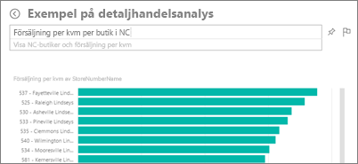
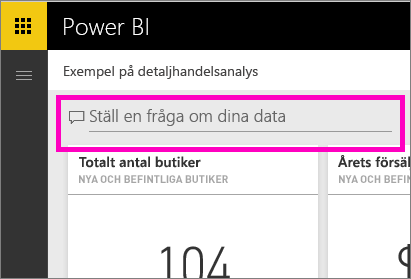
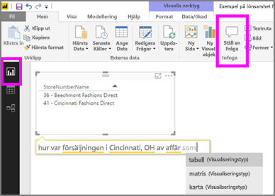

# Frågor och svar i Power BI-tjänsten och Power BI Desktop
## Vad är frågor och svar?
Ibland är det snabbaste sättet att få svar från dina data att ställa en fråga med hjälp av naturligt språk. Till exempel hur mycket sålde vi förra året.  Använd frågor och svar för att utforska dina data med hjälp av intuitiva, naturliga språkfunktioner och få svar i form av tabeller och diagram. Frågor och svar skiljer sig från en sökmotor – den ger dig bara resultat om data i Power BI.

Den här artikeln är startpunkten för allt som rör frågor och svar. Välj en länk nedan för att lära dig hur frågor och svar fungerar i Power BI-tjänsten (instrumentpaneler och rapporter), Power BI Desktop (rapporter), Power BI Embedded och Power BI Mobile.  

Att ställa frågan är bara början.  Roa dig med att resa igenom dina data och förfina eller expandera din fråga. Hitta betrodd ny information och gå till botten med information eller zooma ut för en bredare vy. Du kommer att fascineras av de insikter och upptäckter du kan göra.

Upplevelsen är helt interaktiv... och snabb! Det drivs av en minnesintern lagring och svaret är nästan omedelbart.

##  Frågor och svar för *konsumenter*
När en kollega delar en instrumentpanel med dig, hittar du frågerutan för frågor och svar på instrumentpanelen i Power BI-tjänsten (app.powerbi.com), längst ned i instrumentpanelen i Power BI Mobile och ovanför visualiseringen i Power BI Embedded. Om inte ägaren har gett dig redigeringsbehörigheter, kommer du att kunna använda frågor och svar för att utforska data men inte för att spara visualiseringar som skapats med frågor och svar.

## Frågor och svar för *skapare*
Om du är en *skapare* av Power BI-rapporter eller har redigeringsbehörigheter till en datauppsättning, hittar du frågerutan för frågor och svar på instrumentpanelen i Power BI-tjänsten och på varje rapportsida i Power BI-tjänsten och Power BI Desktop. Alla visualiseringar som du skapar med frågor och svar kan sparas på en instrumentpanel och sparas i en rapport.

Förutom att använda frågor och svar för att utforska sina data, kan skapare och datauppsättningsägare förbättra frågor och svar-upplevelsen för konsumenter genom att [ändra sina datauppsättningar](service-prepare-data-for-q-and-a.md), lägga till [aktuella frågor](service-q-and-a-create-featured-questions.md) och [aktivera och inaktivera frågor och svar](service-q-and-a-direct-query.md) för datauppsättningar med en lokal live-anslutning. I [inbäddade scenarier](developer/qanda.md), kan utvecklare välja mellan 2 lägen: **interaktivt** och **enbart resultat**.

## Hur kan frågor och svar veta hur de ska svara på frågor?
### Vilka datauppsättningar använder sig frågor och svar av?
Hur kan frågor och svar veta hur de ska svara på dataspecifika frågor? Den förlitar sig på namnen på tabellerna, kolumnerna och de beräknade fälten i den underliggande datauppsättningen. Så det du (eller datauppsättningens ägare) kallar saker och ting är viktigt!

Anta att du har en Excel-tabell som heter försäljning, med kolumner som heter produkt, månad, sålda enheter, bruttoförsäljning och resultat. Du skulle kunna ställa frågor om vilken som av de entiteterna.  Du skulle kunna säga visa *försäljning*, totala *vinster* per *månad*, sortera *produkter* efter *sålda enheter* och mer.

Frågor och svar kan besvara frågor som baseras på hur din datauppsättning är strukturerad. Hur fungerar detta för data i Salesforce? När du ansluter till ditt konto i salesforce.com, skapar Power BI automatiskt en instrumentpanel.  Innan du börjar ställa frågor med frågor och svar, kan du kolla på de data som visas i instrumentpanelens visualiseringar och på de data som visas i listmenyn för frågor och svar.

* Om visualiseringarnas axeletiketter och värden inkluderar försäljning, konto, månad och affärsmöjligheter så kan du ställa frågor som: vilket *konto* har de högsta *affärsmöjligheterna*, eller visa *försäljning* per månad som ett stapeldiagram.
* Om listmenyn innehåller säljare, status och år, kan du till exempel fråga frågor som: vilken *säljare* hade den lägsta *försäljningen* i *Florida* under *2013*.

Om du har webbplats-prestandadata i Google Analytics, kan be frågor och svar om tiden som lagts ner på en webbsida, antalet unika besök och användarengagemang. Eller, om du frågar demografisk data, kan du ställa frågor om ålder om hushållets inkomst efter plats.

### Vilken visualisering använder sig frågor och svar av?
Frågor och svar väljer den bästa visualiseringen baserat på de data som visas. Ibland definieras data i de underliggande datauppsättningarna som en viss typ eller kategori och det hjälper frågor och svar att veta hur de ska visas. Om data till exempel har definierats som en datumtyp, är det troligare att de ska visas som ett linjediagram. Data som kategoriseras som en stad visas mer troligt som en karta.

Du kan också säga till frågor och svar vilka visualiseringar som ska användas genom att lägga till det i din fråga. Men kom ihåg att det inte alltid är möjligt för frågor och svar att visa data i den visualiseringstyp du begärt.

Information om nyckelord som frågor och svar känner igen finns i [tips för att ställa frågor](service-q-and-a-tips.md).

## Mer information om Power BI frågor och svar
[Översikt: så här använder du frågor och svar i Power BI-instrumentpaneler och -rapporter](power-bi-tutorial-q-and-a.md): stegvisa instruktioner om hur du använder frågor och svar och en översikt över hur allt fungerar.

[Microsoft Power BI-mobilappen](mobile-apps-ios-qna.md) för iOS på iPad-, iPhone- och iPod Touch-enheter.

[Microsoft Power BI Embedded](developer/qanda.md) bädda in frågor och svar i ett program.

[Tips för att ställa frågor i frågor och svar](service-q-and-a-tips.md): Lär dig hur du prata till frågor och svar för att få bästa möjliga resultat.

[Lägg till aktuella frågor i dina datauppsättningar](service-q-and-a-create-featured-questions.md) så kommer frågor och svart att föreslå dessa frågor till dina kollegor.

[Aktivera frågor och svar för dina lokala datauppsättningar](service-q-and-a-direct-query.md) om du behöver en gateway för att ansluta till datauppsättningen, använd Power BI-inställningarna för att aktivera eller inaktivera frågor och svar.

[Självstudier: använd frågor och svar med detaljhandelsexemplet i Power BI-tjänsten](power-bi-visualization-introduction-to-q-and-a.md): använd frågor och svar i en realistisk branschsjälvstudie.

[Få dina data att fungera väl med frågor och svar](service-prepare-data-for-q-and-a.md): är du den person som skapar datauppsättningar och -modeller?  Då är det här avsnittet för dig.

Har du fler frågor? [Prova Power BI Community](http://community.powerbi.com/)
