# Lägga till ett filter till en rapport i redigeringsvyn

Den här artikeln förklarar hur du lägger till ett sidfilter, ett visualiseringsfilter, ett rapportfilter eller detaljerad information i en rapport i Power BI. Exemplen i den här artikeln finns i Power BI-tjänsten. Men stegen är nästan identiska i Power BI Desktop.

**Visste du att?** Power BI har en ny filterupplevelse som för närvarande är i förhandsversion. Läs mer om [den nya filterupplevelsen i Power BI-rapporter](power-bi-report-filter-preview.md).

## Filter i redigeringsvyn jämfört med läsvyn
Du kan interagera med rapporter i två olika vyer: läsvyn och redigeringsvyn. Vilka filtreringsfunktioner som är tillgängliga beror på vilket läge du befinner dig i. Läs allt [om filter och markeringar i Power BI-rapporter](power-bi-reports-filters-and-highlighting.md) för mer information.

Den här artikeln beskriver hur du skapar filter i rapportens **Redigeringsvy**.  Mer information om filter i läsvyn finns i [Interagera med filter i rapportens läsvy](consumer/end-user-reading-view.md).

## Filtertyper i Filterpanelen
Oavsett om du använder Desktop eller Power BI-tjänsten visas fönstret Filter till höger i rapportarbetsytan. Om inte fönstret Filter visas kan du öppna det genom att välja ikonen ">" längst upp till höger.

Det finns fyra typer av filter: **sidfilter**, **visuellt filter**, **filter för detaljerad information** och **rapportfilter**.

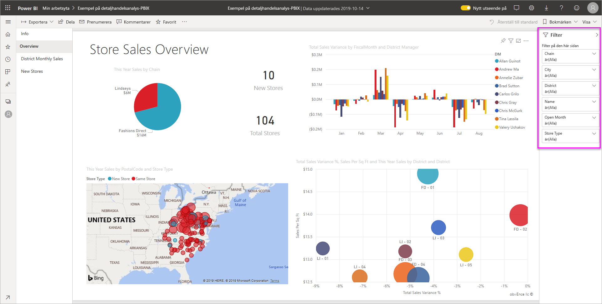

Eftersom filter *bevaras* sparas filtren, utsnitten och andra datavisningsändringar som du gjort när du lämnar Power BI. På så sätt kan du fortsätta där du slutade när du återvänder till rapporten. Om du inte vill att filterändringarna ska sparas väljer du **Återställ till standard** från den översta menyraden.

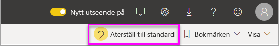

## Lägga till ett filter i ett visuellt objekt
Du kan lägga till ett filter i ett specifikt visuellt objekt på två olika sätt (även kallat ett ”visuellt filter”). 

* Filtrera ett fält som redan används av visualiseringen.
* Identifiera ett fält som inte redan används av visualiseringen och lägga till fältet direkt till bucketen **Visuella nivåfilter**.

Den här proceduren använder förresten, detaljhandelsanalys om du vill ladda ned och följa den. Hämta Exempel på [Detaljhandelsanalys](sample-retail-analysis.md).

### Filtrera fälten i det visuella objektet

1. Öppna [rapporten i Redigeringsvyn](service-the-report-editor-take-a-tour.md).
   
   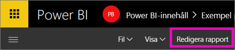
2. Öppna panelerna Visualiseringar och Filter samt Fält (om de inte redan är öppna).
   
   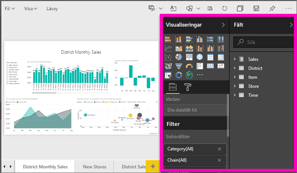
3. Välj ett visuellt objekt för att aktivera det. Alla fält som används av det visuella objektet finns på panelen **Fält** och anges även på panelen **Filter** under rubriken **Visuella nivåfilter**.
   
   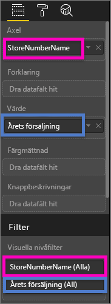
4. Nu ska vi lägga till ett filter till ett fält som redan används av visualiseringen. 
   
    Rulla ned till området **Visuella nivåfilter** och välj pilen för att expandera fältet som du vill filtrera. I det här exemplet ska vi filtrera **StoreNumberName**.
     
    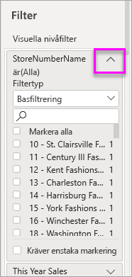 
    
    Välj någon av filtreringskontrollerna **Grundläggande**, **Avancerade** eller **Top N**. I det här exemplet ska vi söka i grundläggande filtrering för **cha** och välja de fem butikerna.
     
    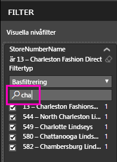 
   
    Det visuella objektet ändras för att återspegla det nya filtret. Om du sparar rapporten med filtret kan rapportens läsare se det filtrerade innehållet från början och interagera med filtret i läsvyn genom att välja eller rensa värden.
     
    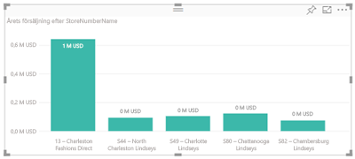

### Filtrera med ett fält som inte finns i det visuella objektet

Nu ska vi lägga till ett helt nytt fält som ett filter på visuell nivå i vårt visuella objekt.
   
1. På panelen Fält väljer du det fält som du vill lägga till som ett nytt visuellt nivåfilter och drar det till **området för visuella nivåfilter**.  I det här exemplet ska vi dra **Distriktschef** till bucketen **Visuella nivåfilter**, söka efter **an** och välja dessa tre chefer. 
     
    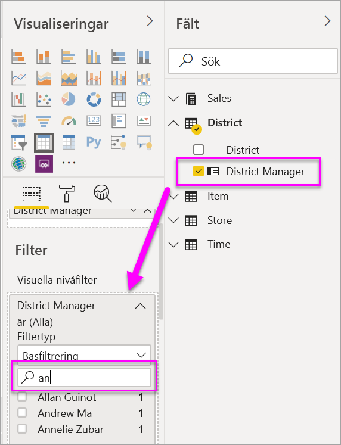

    Observera att **Distriktschef***inte* läggs till i själva visualiseringen. Visualiseringen består fortfarande av **StoreNumberName** som axel och **This Year Sales (Årets försäljning)** som värde.  
     
    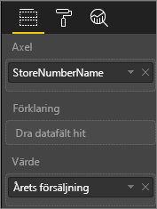

    Själva visualiseringen filtreras nu för att bara visa dessa chefers försäljning i år för de angivna butikerna.
     
    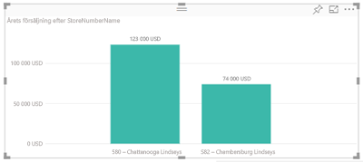

    Om du sparar rapporten med filtret kan rapportens läsare interagera med filtret **Distriktschef** i läsvyn genom att välja eller rensa värden.

## Lägg till ett filter för en hel sida

Du kan även lägga till ett filter för en hel sida (det vill säga sidvisningsfilter)
1. Öppna [rapporten i Redigeringsvyn](service-the-report-editor-take-a-tour.md).
2. Öppna panelerna Visualiseringar och Filter samt Fält (om de inte redan är öppna).
3. På panelen Fält väljer du det fält som du vill lägga till som ett nytt sidnivåfilter och drar det till **området för sidnivåfilter**.  
4. Välj de värden som du vill filtrera och ange **Grundläggande** eller **Avancerade** filtreringskontroller.
   
   All visualisering på sidan som påverkas av det här filtret ritas om för att avspegla ändringen. 
   
   

    Om du sparar rapporten med filtret kan rapportens läsare interagera med filtret i läsvyn genom att välja eller rensa värden.

## Lägga till ett filter för detaljerad information
Med visning av detaljerad information i Power BI-tjänsten och Power BI Desktop kan du skapa en *målrapportsida* som fokuserar på en specifik enhet – som en leverantör, kund eller tillverkare. Användarna kan nu från övriga rapportsidor högerklicka på en datapunkt för denna entitet och gå in i detalj på fokussidan.

### Skapa ett filter för detaljerad information
Om du vill hänga på öppnar du Exempel på kundlönsamhet i redigeringsvyn. Anta att du vill skapa en sida som fokuserar på affärsområden för chefer.   

1. Lägg till en ny sida i rapporten och döp den till **Team Executive (Teamchef)**. Den här sidan blir *målet* för den detaljerade informationen.
2. Lägg till visualiseringar som spårar nyckelvärden för teamchefernas affärsområden.    
3. Lägg även till **Chef (Executive) > Executive Name (Chefens namn)** till området för filtren för detaljerad information.    
   
    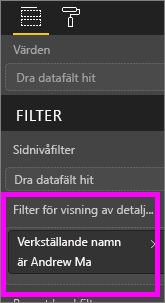
   
    Observera att Power BI lägger till en bakåtpil på rapportsidan.  Om du väljer bakåtpilen returneras du till den *ursprungliga* rapportsidan, den sida där du befann dig när du valde alternativet för visning av detaljerad information. Bakåtpilen fungerar bara i läsvyn.
   
     

### Använda filter för detaljerad information
Nu ska vi se hur filtret för detaljerad information fungerar.

1. Starta på rapportsidan **Teamresultatkort**.    
2. Låt oss anta att du är Andrew Ma och du vill se rapportsidan för teamchefer filtrerad bara för dina data.  Högerklicka på valfri grön datapunkt i det övre vänstra ytdiagrammet för att öppna menyalternativet Visning av detaljerad information.
   
    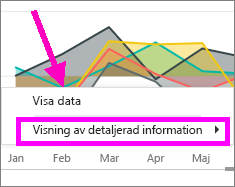
3. Välj **Visning av detaljerad information > Team Executive (Teamchef)** för att komma till rapportsidan med namnet **Team Executive (Teamchef)**. Sidan filtreras för att visa information om datapunkten som du högerklickade på, i det här fallet Andrew Ma. Endast fältet som finns i filtren för detaljerad information skickas vidare till rapportsidan för detaljerad information.  
   
    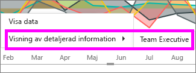

## Lägga till ett filter för en hel rapport (dvs. rapportfilter)
1. Öppna [rapporten i Redigeringsvyn](service-the-report-editor-take-a-tour.md).
2. Öppna panelerna Visualiseringar och Filter samt Fält (om de inte redan är öppna).
3. På panelen Fält väljer du det fält som du vill lägga till som ett nytt rapportnivåfilter och drar det till **området för rapportnivåfilter**.  
4. Välj de värden du vill filtrera.

    Visualiseringarna på den aktiva sidan, och på alla sidor i rapporten, ändras för att återspegla det nya filtret. Om du sparar rapporten med filtret kan rapportens läsare interagera med filtret i läsvyn genom att välja eller rensa värden.

1. Välj bakåtpilen för att återgå till den föregående rapportsidan.

## Överväganden och felsökning

- Ibland kan det hända att ett filter på visuell nivå och ett filter på sidnivå returnerar olika resultat.  När du till exempel lägger till ett filter på visuell nivå, filtrerar Power BI de aggregerade resultaten.  Aggregeringstypen är som standard Summa, men du kan [ändra aggregeringstypen](service-aggregates.md).  

    När du sedan lägger till ett filter på sidnivå filtrerar Power BI utan aggregering.  Det aggregerar inte eftersom en sida kan ha många visuella objekt som var och ett kan använda olika aggregeringstyper.  Så filtret tillämpas på varje datarad.

- Kontrollera att du är i rapportens [Redigeringsvy](service-interact-with-a-report-in-editing-view.md) om du inte ser panelen Fält.    
- Om du har gjort många filterändringar och vill återgå till standardinställningarna som rapportförfattaren använde väljer du **Återställ till standard** från den översta menyraden.

## Nästa steg
[Ta en titt på panelen för rapportfilter](consumer/end-user-report-filter.md)

[Filtrera och markera i rapporter](power-bi-reports-filters-and-highlighting.md)

[Interagera med filter och markeringar i rapportens läsvy](consumer/end-user-reading-view.md)

[Ändra hur en rapports visuella objekt korsfiltrerar och korsmarkerar varandra](consumer/end-user-interactions.md)

Har du fler frågor? [Prova Power BI Community](http://community.powerbi.com/)

