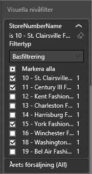
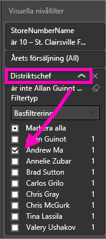

# Lägga till ett filter i en rapport i Power BI-tjänsten (i redigeringsvyn)
> [!TIP]
> Vi rekommenderar att du först läser [Om filter och markeringar i Power BI-rapporter](power-bi-reports-filters-and-highlighting.md).

Exemplen i den här artikeln gäller Power BI-tjänsten. Men stegen är nästan identiska i Power BI Desktop.
> 
> 

## Vad är skillnaden mellan rapportfiltren i redigeringsvyn jämfört med läsvyn?
Det finns två lägen för att interagera med rapporter: [Läsvy](service-reading-view-and-editing-view.md) och [Redigeringsvy](service-interact-with-a-report-in-editing-view.md).  Och vilka filtreringsfunktioner som är tillgängliga beror på vilket läge du befinner dig i.

* Du kan lägga till rapportfilter, sidfilter och visuella filter i redigeringsvyn. När du sparar rapporten, sparas filtren med den. De som tittar på rapporten i läsvyn kan interagera med de filter som du har lagt till.
* I läsvyn kan du interagera med alla rapportfilter, sidfilter, filter för visning av detaljerad information och visuella filter som redan finns i rapporten, men du kan inte lägga till nya filter. De ändringar du gör i fönstret Filter sparas med rapporten, även om du visar rapporten i en mobilapp.  

> [!NOTE]
> Den här artikeln beskriver hur du skapar filter i rapportens **Redigeringsvy**.  Mer information om filter i läsvyn finns i [Interagera med filter i rapportens läsvy](service-reading-view-and-editing-view.md).

## Filter som är tillgängliga i fönstret *Filter* i Power BI
Oavsett om du använder Desktop eller Power BI-tjänsten visas fönstret Filter till höger i rapportarbetsytan. Om inte fönstret Filter visas kan du öppna det genom att välja ikonen ">" längst upp till höger.

Det finns fyra typer av filter.

- **sidfilter** gäller för alla visuella objekt på rapportsidan     
- **visuellt filter** gäller för ett enskilt visuellt objekt på en rapportsida    
- **filter för visning av detaljerad information** gäller för en enda entitet i en rapport    
- **rapportfilter** gäller för alla sidor i rapporten    

    

## Lägga till ett filter till en specifik visualisering (dvs. ett visuellt filter)
Det finns två sätt att göra detta: 

* genom att filtrera ett fält som redan används av visualiseringen
* genom att identifiera ett fält som inte redan används av visualiseringen och lägga till fältet direkt till bucketen **Visuella nivåfilter**.

### Genom att filtrera fälten som redan finns i visualiseringen
1. Öppna [rapporten i redigeringsvyn](service-reading-view-and-editing-view.md).
   
   
2. Öppna panelerna Visualiseringar och Filter samt Fält (om de inte redan är öppna).
   
   
3. Välj ett visuellt objekt för att aktivera det. Alla fält som används av det visuella objektet identifieras på panelen **Fält** och anges även på panelen **Filter** under rubriken **Visuella nivåfilter**.
   
   
4. Nu ska vi lägga till ett filter till ett fält som redan används av visualiseringen. 
   
   * Rulla ned till området **Visuella nivåfilter** och välj pilen för att expandera fältet som du vill filtrera. I det här exemplet ska vi filtrera **StoreNumberName**
     
       
   * Välj någon av filtreringskontrollerna **Grundläggande**, **Avancerade** eller **Top N** (se [Så här använder du rapportfilter](power-bi-how-to-report-filter.md)). I det här exemplet väljer vi grundläggande filtrering och placerar bockar bredvid siffrorna 10, 11, 15 och 18.
     
       
   * Det visuella objektet ändras för att återspegla det nya filtret. Om du sparar rapporten med filtret kan rapportens läsare interagera med filtret i läsvyn genom att välja eller rensa värden.
     
      
5. Nu ska vi lägga till ett helt nytt fält, som ett filter på visuell nivå, till vår visualiseringen.
   
   * På panelen Fält väljer du det fält som du vill lägga till som ett nytt visuellt nivåfilter och drar det till **området för visuella nivåfilter**.  I det här exemplet ska vi dra **Distriktschef** till bucketen **Visuella nivåfilter** och bara välja Andrew Ma. 
     
      
   * Observera att **Distriktschef** *inte* läggs till själva visualiseringen. Visualiseringen består fortfarande av **StoreNumberName** som axel och **This Year Sales (Årets försäljning)** som värde.  
     
      
   * Och själva visualiseringen filtreras nu för att bara visa Andrews försäljning i år för de angivna butikerna.
     
     

## Lägga till ett filter för en hel sida (det vill säga sidvisningsfilter)
1. Öppna [rapporten i redigeringsvyn](service-reading-view-and-editing-view.md).
2. Öppna panelerna Visualiseringar och Filter samt Fält (om de inte redan är öppna).
3. På panelen Fält väljer du det fält som du vill lägga till som ett nytt sidnivåfilter och drar det till **området för sidnivåfilter**.  
4. Välj de värden som du vill filtrera och ange **Grundläggande** eller **Avancerade** filtreringskontroller (se [Så här använder du rapportfilter](power-bi-how-to-report-filter.md)).
   
   All visualisering på sidan som påverkas av det här filtret ritas om för att avspegla ändringen. 
   
   

Om du sparar rapporten med filtret kan rapportens läsare interagera med filtret i läsvyn genom att välja eller rensa värden.

## Lägga till ett filter för detaljerad information
Med visning av detaljerad information i Power BI-tjänsten och Power BI Desktop kan du skapa en *målrapportsida* som fokuserar på en specifik enhet – som en leverantör, kund eller tillverkare. Användarna kan nu från övriga rapportsidor högerklicka på en datapunkt för denna entitet och gå in i detalj på fokussidan.

### Skapa ett filter för detaljerad information
Om du vill hänga på öppnar du Exempel på kundlönsamhet i redigeringsvyn. Anta att du vill skapa en sida som fokuserar på affärsområden för chefer.   

1. Lägg till en ny sida i rapporten och döp den till **Team Executive (Teamchef)**. Detta blir *målsidan* för den detaljerade informationen.
2. Lägg till visualiseringar som spårar nyckelvärden för teamchefernas affärsområden.    
3. Lägg även till **Chef (Executive) > Executive Name (Chefens namn)** till området för filtren för detaljerad information.    
   
    
   
    Observera att Power BI lägger till en bakåtpil på rapportsidan.  Om du väljer bakåtpilen returneras du till den *ursprungliga* rapportsidan, den sida där du befann dig när du valde alternativet för visning av detaljerad information. Bakåtpilen fungerar bara i läsvyn.
   
     

### Använda filter för detaljerad information
Nu ska vi se hur filtret för detaljerad information fungerar.

1. Starta på rapportsidan **Teamresultatkort**.    
2. Låt oss anta att du är Andrew Ma och du vill se rapportsidan för teamchefer filtrerad bara för dina data.  Högerklicka på valfri grön datapunkt i det övre vänstra ytdiagrammet för att öppna menyalternativet Visning av detaljerad information.
   
    
3. Välj **Visning av detaljerad information > Team Executive (Teamchef)** för att komma till rapportsidan med namnet **Team Executive (Teamchef)**. Sidan filtreras för att visa information om datapunkten som du högerklickade på, i det här fallet Andrew Ma. Endast fältet som finns i filtren för detaljerad information skickas vidare till rapportsidan för detaljerad information.  
   
    

## Lägga till ett filter för en hel rapport (dvs. rapportfilter)
1. Öppna [rapporten i redigeringsvyn](service-reading-view-and-editing-view.md).
2. Öppna panelerna Visualiseringar och Filter samt Fält (om de inte redan är öppna).
3. På panelen Fält väljer du det fält som du vill lägga till som ett nytt rapportnivåfilter och drar det till **området för rapportnivåfilter**.  
4. Markera de värden som du vill filtrera (se [Så här använder du rapportfilter](power-bi-how-to-report-filter.md)).

    Visualiseringarna på den aktiva sidan, och på alla sidor i rapporten, ändras för att återspegla det nya filtret. Om du sparar rapporten med filtret kan rapportens läsare interagera med filtret i läsvyn genom att välja eller rensa värden.

1. Välj bakåtpilen för att återgå till den föregående rapportsidan.

## Överväganden och felsökning
### Varför ditt visuella nivåfilter och sidnivåfilter kan returnera olika resultat
När du lägger till ett filter på visuell nivå, filtrerar Power BI de aggregerade resultaten.  Aggregeringstypen är som standard Summa, men du kan [ändra aggregeringstypen](service-aggregates.md).  

När du lägger till ett sidnivåfilter, filtrerar Power BI utan aggregering.  Detta sker eftersom en sida kan ha många visuella objekt som var och en kan använda olika aggregeringstyper.  Så filtret tillämpas på varje datarad.

Kontrollera att du är i rapportens [Redigeringsvy](service-interact-with-a-report-in-editing-view.md) om du inte ser panelen Fält.

## Nästa steg
 [Så här använder du rapportfilter](power-bi-how-to-report-filter.md)

  [Filtrera och markera i rapporter](power-bi-reports-filters-and-highlighting.md)

[Interagera med filter och markeringar i rapportens läsvy](service-reading-view-and-editing-view.md)

[Ändra hur en rapports visuella objekt korsfiltrerar och korsmarkerar varandra](service-reports-visual-interactions.md)

Har du fler frågor? [Prova Power BI Community](http://community.powerbi.com/)

