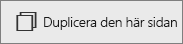

# Lägg till en sida i en Power BI-rapport i Power BI-tjänsten och Power BI Desktop
Det finns inte någon anledning att fylla en rapportsida – lägg till en ny tom sida i stället. 

Tillägg och duplicering av rapportsidor kräver redigeringsbehörighet för rapporten. I Power BI-tjänsten innebär detta att öppna rapporten i [redigeringsvyn](consumer/end-user-reading-view.md). 

## Lägga till en ny tom sida
Välj den gula plusikonen och skriv sedan ett nytt namn för sidan.  

## Duplicera en sida
Gå till det översta kontrollfältet i [redigeringsvyn](service-interact-with-a-report-in-editing-view.md) och välj ikonen **Duplicera den här sidan**.

Den nya sidan skapas och blir aktiv. Byt namn på den genom att dubbelklicka på fliken för att markera den och skriv sedan ett nytt namn.  Mer information finns i [Byta namn i Power BI-tjänsten](service-rename.md)

## Nästa steg
Läs mer om [rapporter i Power BI](consumer/end-user-reports.md)

[Power BI – grundläggande begrepp](consumer/end-user-basic-concepts.md)

Har du fler frågor? [Prova Power BI Community](http://community.powerbi.com/)

