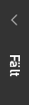
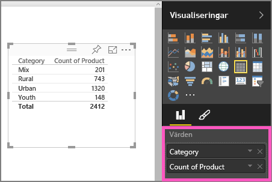
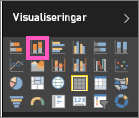

# Del 1, lägg till visualiseringar i en Power BI-rapport
Den här artikeln ger en snabb introduktion till att skapa en visualisering i en rapport med antingen Power BI-tjänsten eller Power BI Desktop.  För mer avancerat innehåll, se [del II](power-bi-report-add-visualizations-ii.md). Amanda visar ett par sätt att skapa, redigera och formatera visuella objekt på rapportarbetsytan. Prova sedan att skapa en egen rapport med hjälp av den [Försäljning- och marknadsföringsexempel](sample-datasets.md).

<iframe width="560" height="315" src="https://www.youtube.com/embed/IkJda4O7oGs" frameborder="0" allowfullscreen></iframe>

## Öppna en rapport och lägg till en ny sida
1. Öppna en rapport i [redigeringsvyn](service-reading-view-and-editing-view.md). Den här kursen använder exemplet för [försäljning och marknadsföring](sample-datasets.md).
2. Om fönstret Fält inte visas, väljer du på pilikonen för att öppna den. 
   
   
3. [Lägg till en ny sida i rapporten](power-bi-report-add-page.md).

## Lägg till visuella objekt i rapporten
1. Skapa ett visuellt objekt genom att välja ett fält från fönstret **Fält**.  
   
   **Börja med ett numeriskt fält** som Försäljning > Försäljning $: Power BI skapar ett stapeldiagram med en enda kolumn.
   
   
   
   **Börja med ett kategorifält**, till exempel namn eller produkt: Power BI skapar en tabell och lägger till fältet till brunnen **Värden**.
   
   
   
   **Börja med ett geografiskt fält**, till exempel Geo > Stad. Power BI och Bing Maps skapar en kartvisualisering.
   
   
2. Skapa en visualisering och ändra dess typ. Välj **Produkt > Antal produkter** och **Produkt > Kategori** för att lägga till dem i brunnen **Värden**.
   
   
3. Ändra visualiseringen till ett stapeldiagram genom att välja ikonen stapeldiagram.
   
   
4. När du skapar visualiseringar i rapporten kan du [fästa dem på din instrumentpanel](service-dashboard-pin-tile-from-report.md). Välj fästikonen  för att fästa visualiseringen.
   
   
5. Nu kan du:
   
   Fortsätta till [Del 2, Lägga till visualiseringar i en Power BI-rapport](power-bi-report-add-visualizations-ii.md)
   
   [Interagera med visualiseringar](service-reading-view-and-editing-view.md) i rapporten.
   
   [Gör ännu mer med visualiseringar](power-bi-report-visualizations.md).
   
   [Spara rapporten](service-report-save.md).

## Nästa steg
Mer om [Visualiseringar i Power BI-rapporter](power-bi-report-visualizations.md).

[Rapporter i Power BI](service-reports.md)

Har du fler frågor? [Prova Power BI Community](http://community.powerbi.com/)

