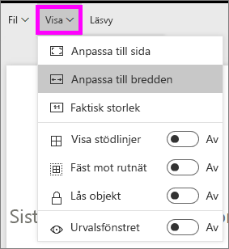
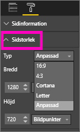

# Sidvisningsinställningar i en Power BI-rapport
Vi förstår att det är viktigt att hålla din rapportlayout perfekt. Ibland är det kan vara en utmaning, eftersom du och dina kollegor visar rapporterna på era skärmar med olika bredd–höjd-förhållanden och storlekar. 

Standardvyn för visning är **Anpassa till sida** och standardstorleken för visning är **16:9**. Om du vill låsa ett annat bredd–höjd-förhållande eller vill anpassa rapporten på annat sätt, finns det två verktyg som hjälper dig: inställningarna ***Sidvisning*** och ***Sidstorlek***.

<iframe width="560" height="315" src="https://www.youtube.com/embed/5tg-OXzxe2g" frameborder="0" allowfullscreen></iframe>

## Var hittar jag sidvisningsinställningarna i Power BI-tjänsten och Power BI Desktop?
Sidvisningsinställningarna är tillgängliga i både Power BI-tjänsten och Power BI Desktop men gränssnittet skiljer sig lite åt. I de två avsnitten nedan beskrivs var du hittar visningsinställningarna i varje Power BI-verktyg.

### I Power BI Desktop
I rapportvyn väljer du fliken **Visa** för att öppna sidvisningsinställningarna och telefonlayoutinställningarna.

  

### I Power BI-tjänsten (app.powerbi.com)
I Power BI-tjänsten öppnar du en rapport och väljer **Visa** i den övre vänstra menyraden.

Inställningarna för sidvisning är tillgängliga i både [läsvyn och redigeringsvyn](consumer/end-user-reading-view.md). I redigeringsvyn kan en rapportägare tilldela sidvisningsinställningar för enskilda rapportsidor och dessa inställningar sparas med rapporten. När en kollegor öppnar rapporten i läsvyn ser de rapportsidevisningen med ägarens inställningar.  I läsvyn kan kollegor ändra *vissa* sidvisningsinställningar men ändringarna sparas inte när de lämnar rapporten.

##    Inställningar för Sidvisning
Den första uppsättningen inställningar för *Sidvisning* styr visningen av din rapportsida i förhållande till webbläsarfönstret.  Välj mellan:

* **Anpassa till sida** (standard): Innehållet skalas så att det passar sidan på bästa sätt
* **Anpassa till bredd**: Innehållet skalas för att passa sidans bredd
* **Faktisk storlek**: Innehållet visas i full storlek

Den andra uppsättningen inställningar för *Sidvisning* styr placeringen av objekt på rapportarbetsytan.

* **Visa stödlinjer**: Aktivera stödlinjer för hjälp med att placera objekt på rapportarbetsytan.
* **Fäst mot rutnät**: Använd denna funktion med **Visa stödlinjer** för att på ett exakt sätt placera och rikta in objekt på rapportarbetsytan. 
* **Lås objekt**: Du kan låsa alla objekt på arbetsytan så att de inte kan flyttas eller ändra storlek.
* **Markeringsfönster**: Markeringsfönstret innehåller alla objekt på arbetsytan och du kan välja vilka som ska visas och vilka som ska döljas.

    

## Inställningar för Sidstorlek

Inställningarna för *Sidstorlek* är bara tillgängliga för rapportägare. I Power BI-tjänsten (app.powerbi.com) innebär detta att man kan öppna rapporten i [redigeringsvyn](consumer/end-user-reading-view.md). Dessa inställningar styr visningsförhållandet och den faktiska storleken (i bildpunkter) för rapportarbetsytan.   

* Förhållandet 4:3
* Förhållandet 16:9 (standard)
* Cortana
* Letter
* Anpassad (höjd och bredd i bildpunkter)

## Nästa steg
[Lär dig hur du använder inställningarna för Sidvisning och Sidstorlek i dina Power BI-rapporter](consumer/end-user-report-view.md).

Läs mer om [rapporter i Power BI](consumer/end-user-reports.md)

[Power BI – grundläggande begrepp](consumer/end-user-basic-concepts.md)

Har du fler frågor? [Prova Power BI Community](http://community.powerbi.com/)

