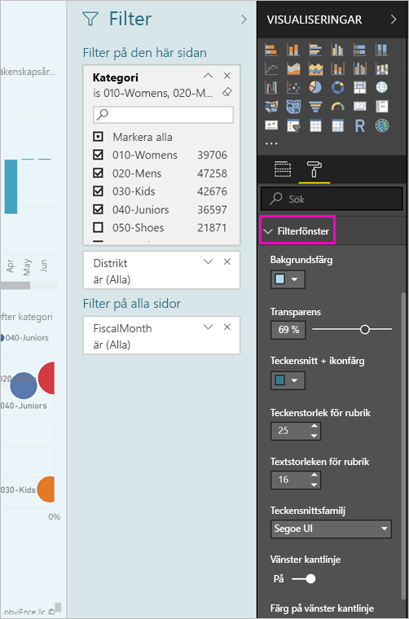
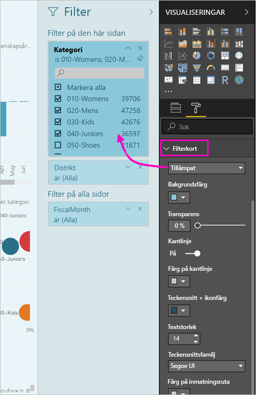

# <a name="the-new-filter-experience-in-power-bi-reports-preview"></a>Den nya filterupplevelsen i Power BI-rapporter (förhandsversion)

Filter i Power BI har nya funktioner och en ny design. När du anmäla dig till den nya filter-miljön, kan du formatera fönstret filter ska se ut som resten av rapporten. Du kan låsa och även dölja filter. När du skapar din rapport, visas inte längre gamla filterfönstret alls i fönstret visualiseringar. Du kan göra ditt filter redigering och formatering i en enda filterfönstret. 


> [!NOTE]
> Den nya filterupplevelsen finns som förhandsversion. Nya versioner kan åsidosätta den formatering som du redan har ställt in.

När en rapport kan du här är vad du kan göra i fönstret ny enda filter:

- Lägg till och ta bort fält att filtrera på. 
- Ändra filtret tillstånd.
- Formatera och anpassa fönstret filter så att det fungerar en del av rapporten.
- Definiera om Filter-fönstret är öppet eller minimerat som standard när en användare öppnar rapporten.
- Dölja hela filterfönstret eller specifika filter som du inte vill rapportkonsumenterna se.
- Kontroll och även bokmärke synlighet, öppna och komprimerad tillståndet för fönstret filter.
- Lås filter som du inte vill att användarna ska kunna redigera.

Med den nya filter-upplevelsen kan rapportkonsumenterna även hovra över valfritt visuellt objekt att visa en skrivskyddad lista över alla filter eller utsnitt påverkar det visuella objektet.


## <a name="turn-on-the-new-filter-experience"></a>Aktivera den nya filterupplevelsen 

Du aktiverar den nya upplevelsen i Power BI Desktop. Därefter kan du ändra filter där eller i Power BI-tjänsten (https://app.powerbi.com). Eftersom det här filtret är i förhandsversion, måste du först aktivera det i Power BI Desktop. Om du börjar genom att skapa en rapport i Power BI-tjänsten så kan den inte ha de nya filtren.

### <a name="turn-on-new-filters-for-all-new-reports"></a>Aktivera nya filter för alla nya rapporter

1. I Power BI Desktop så väljer du **Arkiv** > **Alternativ och inställningar** > **Alternativ** > **Förhandsgranskningsfunktioner** och markerar därefter kryssrutan **Den nya filterupplevelsen**. 
2. Starta om Power BI Desktop för att se den nya filterupplevelsen i alla nya rapporter.

Efter att du startar om Power BI Desktop så aktiveras den som standard för alla nya rapporter som du skapar.  

### <a name="turn-on-new-filters-for-an-existing-report"></a>Aktivera nya filter för en befintlig rapport

Du kan också aktivera de nya filtrena för befintliga rapporter.

1. I Power BI Desktop i en befintlig rapport väljer du **Arkiv** > **Alternativ och inställningar** > **Alternativ**
2. I det vänstra navigeringsfältet under **aktuell fil**väljer **rapportera inställningar**.
3. Under **filtrering upplevelse**väljer **aktivera uppdaterade filterfönstret och visa filter i sidhuvudet för visuella objekt för den här rapporten**.

## <a name="view-filters-for-a-visual-in-reading-mode"></a>Visa filter för ett visuellt objekt i Läsläge

I Läsläge kan du hovra över filterikonen för att se ett popup-fönster med alla filter, sektorer och så vidare som påverkar det visuella objektet. Formateringen av popup-fönstret är samma som filter formatering. 


Här är de typer av filter som den här vyn visar: 
- Grundläggande filter
- Utsnitt
- Korsmarkering 
- Korsfiltrering
- Avancerad filtrering
- Högsta N-filter
- Relativa datumfiltrer
- Synkroniseringsutsnitt
- Inkludera/exkludera filter
- Filter som skickas via en URL

## <a name="build-the-new-filters-pane"></a>Skapa ny filterfönstret

När du aktiverar fönstret filter får se du den till höger på rapportsidan, formaterad som standard baserat på de aktuella inställningarna för rapporten. Du kan använda fönstret filter för att konfigurera vilka filter som ska ingå och uppdatera befintliga filter i den nya rutan. Fönstret filter visas vilka rapportkonsumenterna visas när du publicerar rapporten. 

1. Som standard kan din rapportkonsumenterna se fönstret filter. Om du inte vill att se den, väljer du på ögonikonen bredvid **filter**.

    

2. Dra intresseområden i fönstret filter som kan sidan för att börja bygga din nya filterfönstret, eller på rapportnivå.

När du lägger till ett visuellt objekt en rapportarbetsytan, lägger Power BI automatiskt till ett filter till fönstret filter för varje fält i det visuella objektet. 

## <a name="lock-or-hide-filters"></a>Låsa eller dölja filter

Du kan låsa eller dölja enskilda filterkort. Om du låser ett filter, kan dina rapportanvändare se men inte ändra det. Om du döljer det så kan de inte ens se det. Det är användbart att dölja filterkort om du vill dölja datarensningsfilter som exkluderar nullvärden eller oväntade värden. 

- I fönstret filter, markerar eller avmarkerar du den **Zamknout filtr** eller **Dölj filter** ikonerna i ett filterkort.

   

När du aktiverar de här inställningarna och inaktivera i fönstret filter visas ändringarna återspeglas i rapporten. Dolda filter visas inte i popup-fönstret för filter för ett visuellt objekt.

Du kan också konfigurera det nya filter ruta läget flöde med dina bokmärken i rapporten. Fönstrets status för öppna, stäng och synlighet går alla att bokmärka.
 
## <a name="format-the-new-filters-pane"></a>Formatera det nya Filter-fönstret

En stor del av denna nya upplevelse med är att du kan formatera filterfönstret för att matcha utseendet och känslan av rapporten. Du kan formatera fönstret filter på olika sätt för varje sida i rapporten. Här följer element som du kan formatera: 

- Bakgrundsfärg
- Bakgrundstransparens
- Border eller inaktivera
- Färg på kantlinje
- Rubrik och huvud teckensnitt, färg och storlek

Du kan också formatera de här elementen för filterkort, beroende på om de används (är inställda på något) eller tillgängliga (rensade): 

- Bakgrundsfärg
- Bakgrundstransparens
- Kantlinje: på eller av
- Färg på kantlinje
- Teckensnitt, färg och textstorlek
- Färg på inmatningsruta

### <a name="format-the-filters-pane-and-cards"></a>Formatera filterfönstret och kort

1. I rapporten klickar du på själva rapporten eller på bakgrunden (*skrivbordsunderlägget*) därefter går du till **Visualiseringar** och väljer **Format**. 
    Du kan se alternativ för att formatera rapportsidan, skrivbordsunderlägg, och även filterfönstret och Filter-kort.

        

1. Expandera **Filter-fönstret** för att ange färg för bakgrund, ikon och vänster kantlinje så att de matchar rapportsidan.

    

1. Expandera **Filterkort** för att ange färg och kantlinje för **Tillgänglig** och **Använd**. Om du gör korten tillgänglig och använd olika färger så blir det uppenbart vilka filter som används. 
  
    

## <a name="theming-for-filter-pane"></a>Teman för filterfönstret
Du kan nu ändra standardinställningarna för filterfönstret med temafilen. Här är ett exempel tema kodfragment för att komma igång:

 
```
"outspacePane": [{ 

"backgroundColor": {"solid": {"color": "#0000ff"}}, 

"foregroundColor": {"solid": {"color": "#00ff00"}}, 

"transparency": 50, 

"titleSize": 35, 

"headerSize": 8, 

"fontFamily": "Georgia", 

"border": true, 

"borderColor": {"solid": {"color": "#ff0000"}} 

}], 

"filterCard": [ 

{ 

"$id": "Applied", 

"transparency": 0, 

"backgroundColor": {"solid": {"color": "#ff0000"}}, 

"foregroundColor": {"solid": {"color": "#45f442"}}, 

"textSize": 30, 

"fontFamily": "Arial", 

"border": true, 

"borderColor": {"solid": {"color": "#ffffff"}}, 

"inputBoxColor": {"solid": {"color": "#C8C8C8"}} 

}, 

{ 

"$id": "Available", 

"transparency": 40, 

"backgroundColor": {"solid": {"color": "#00ff00"}}, 

"foregroundColor": {"solid": {"color": "#ffffff"}}, 

"textSize": 10, 

"fontFamily": "Times New Roman", 

"border": true, 

"borderColor": {"solid": {"color": "#123456"}}, 

"inputBoxColor": {"solid": {"color": "#777777"}} 

}] 
```

## <a name="sort-the-filter-pane"></a>Sortera filterfönstret

Anpassad sortering funktionen är en del av den nya upplevelsen för filter-fönstret. Rapportskapare kan dra och släpp filter för att ordna om dem i den ordning som de vill ha.


Sortera standardordningen alfabetisk för filter. Starta anpassad Sorteringsläge genom att bara dra filter till en ny plats. Du kan bara sortera filter inom den nivå som de gäller för, till exempel ett visuell nivå, sidnivå och Rapportnivå filter.

## <a name="filters-pane-scaling"></a>Filtrerar fönstret skalning

Fönstret filter kan skalas med rapportsida och visuella objekt, så rapportsidan och filtrerar fönstret stanna i proportion med varandra.

## <a name="improved-filters-pane-accessibility"></a>Förbättrad filter rutan hjälpmedel

Vi har förbättrat tangentbordsnavigering för fönstret filter. Du kan växla mellan alla delar i fönstret filter och Använd kontext-tangenten på tangentbordet eller SKIFT + F10 för att öppna snabbmenyn.


## <a name="rename-filters"></a>Byt namn på filter
När du redigerar fönstret filter kan du dubbelklicka på rubriken för att redigera den. Det är användbart om du vill uppdatera filterkortet så att det är mer användbar för dina slutanvändare att byta namn på. Tänk på att byta namn på filterkortet har *inte* Byt namn på visningsnamnet för fält i fältlistan. Det ändrar bara visningsnamnet används i filterkort.


## <a name="restrict-changes-to-filter-type"></a>Begränsa ändringar för att filtrera typ

Upplev i rapportinställningarna har du möjlighet att styra om användare kan ändra vilken filtertyp under filtrera.


## <a name="next-steps"></a>Nästa steg

Testa den nya filterupplevelsen. Ge oss din feedback om den här funktionen och hur vi kan fortsätta att förbättra det, på den [Power BI-idéer plats](https://ideas.powerbi.com/forums/265200-power-bi). 

- [Så här använder du rapportfilter](consumer/end-user-report-filter.md)
- [Filtrera och markera i rapporter](power-bi-reports-filters-and-highlighting.md)

Har du fler frågor? [Prova Power BI Community](http://community.powerbi.com/)

