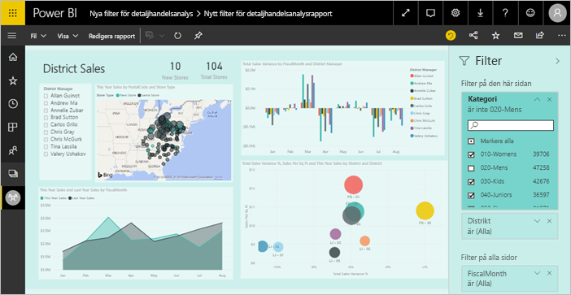
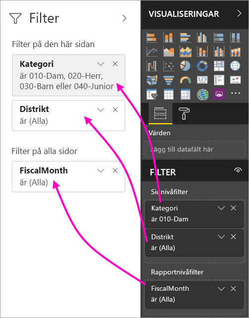
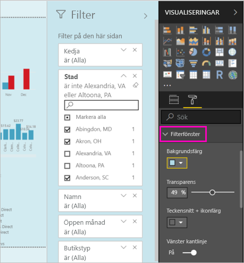
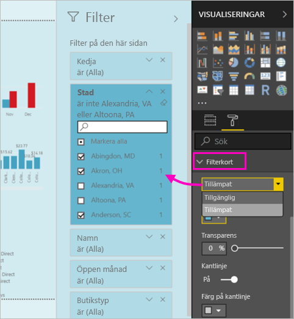
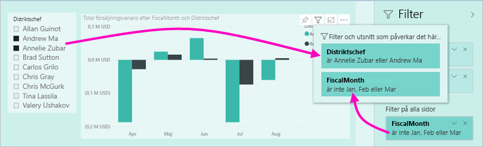

# Den nya filterupplevelsen i Power BI-rapporter (förhandsversion)

Den här artikeln beskriver den nya filtreringsmetoden: Filter i Power BI får nya funktioner och en ny design. När du designar rapporter i Power BI Desktop eller Power BI-tjänsten så kan du få Filter-fönstret att se ut som och fungerar med hela rapporten. I den nya upplevelsen agerar det gamla filterfönstret som ett filterredigeringsfönster och det nya filterfönstret är den enda dina rapportkonsumenter ser. 
 

Det här är vad du kan göra med de nya filtrena som rapportdesigner:

- Visa en skrivskyddad vy av filter i sidhuvudet för visuella objekt så att kunderna ser exakt vilka filter eller utsnitt som påverkar en viss visualisering.
- Formatera och anpassa filterfönstret så att det känns som en del av din rapport.
- Definiera om Filter-fönstret är öppet eller minimerat som standard när en användare öppnar rapporten.
- Dölja hela filterfönstret eller specifika filter som du inte vill att rapportanvändarna ser.
- Styr och till och med bokmärk synligheten, öppet och minimerat tillstånd för det nya filterfönstret.
- Lås filter som du inte vill att användarna ska kunna redigera.

## Aktivera den nya filterupplevelsen 

Du aktiverar den nya upplevelsen i Power BI Desktop. Därefter kan du ändra filter där eller i Power BI-tjänsten (https://app.powerbi.com). Eftersom det här filtret är i förhandsversion, måste du först aktivera det i Power BI Desktop. Om du börjar genom att skapa en rapport i Power BI-tjänsten så kan den inte ha de nya filtren.

### Aktivera nya filter för alla nya rapporter

1. I Power BI Desktop så väljer du **Arkiv** > **Alternativ och inställningar** > **Alternativ** > **Förhandsgranskningsfunktioner** och markerar därefter kryssrutan **Den nya filterupplevelsen**. 
2. Starta om Power BI Desktop för att se den nya filterupplevelsen i alla nya rapporter.

Efter att du startar om Power BI Desktop så aktiveras den som standard för alla nya rapporter som du skapar.  

### Aktivera nya filter för en befintlig rapport

Du kan också aktivera de nya filtrena för befintliga rapporter.

1. I Power BI Desktop i en befintlig rapport väljer du **Arkiv** > **Alternativ och inställningar** > **Alternativ**
2. Under **Rapportinställningar** väljer du **Aktivera det uppdaterade filterfönstrer och visa filter i det visuella sidhuvudet för den här rapporten**.

## Skapa det ny filterfönstret

När du aktiverar det nya filterfönstret så ser du det till höger på rapportsidan, formaterat som standard baserat på dina aktuella rapportinställningar. Det gamla filterfönstret fungerar nu som filterredigeringsfönstret. Det nya filterfönstret visar vad dina rapportanvändare visas när du publicerar din rapport. Du kan uppdatera befintliga filter i det nya fönstret, men du använder det äldre filterfönstret för att konfigurera vilka filter som ska ingå.

1. Börja med att bestämma om du vill att dina rapportanvändare ser filterfönstret. Om du vill att de ska se det, väljer du ögonikonen  bredvid Filter.

2. Börja bygga ditt nya filterfönster genom att dra fält av intresse till filterredigeringsfönstret, antingen som filter på visuellt objekt-, sida- eller rapportnivå. Du ser dem i det nya Filter-fönstret.

    

När du lägger till ett visuellt objekt på en rapportarbetsyta, lägger Power BI automatiskt till ett filter för varje fält i det visuella objektet. Power BI lägger inte till de automatiska filtren i det skrivskyddade filterfönstret. Du måste uttryckligen välja ögonikonen för att lägga till dem.

 
## Låsa eller dölja filter

Du kan låsa eller dölja enskilda filterkort. Om du låser ett filter, kan dina rapportanvändare se men inte ändra det. Om du döljer det så kan de inte ens se det. Det är användbart att dölja filterkort om du vill dölja datarensningsfilter som exkluderar nullvärden eller oväntade värden. 

- I filterredigeringsfönstret markerar eller avmarkerar du ikonerna **Lås filter** eller **Dölj filter** i ett filterkort.

   

När du aktiverar eller inaktiverar de här inställningarna i filterredigeringsfönstret så ser du ändringarna i det nya filterfönstret. Dolda filter visas inte i popup-fönstret för filter för ett visuellt objekt.

Du kan även konfigurera status för ditt filterfönster att flöde med din rapports bokmärken. Fönstrets status för öppna, stäng och synlighet går alla att bokmärka.
 
## Formatera det nya Filter-fönstret

En stor del av den här nya upplevelsen är att du nu kan formatera filterfönstret att matcha utseendet och känslan i din rapport. Du kan formatera filterfönstret på olika sätt för varje sida i rapporten. Här följer element som du kan formatera: 

- Bakgrundsfärg
- Bakgrundstransparens
- Kant på filterfönstret på eller av
- Kantfärg för filterfönstret

Du kan också formatera de här elementen för filterkort, beroende på om de används (är inställda på något) eller tillgängliga (rensade): 

- Bakgrundsfärg
- Bakgrundstransparens
- Kantlinje: på eller av
- Färg på kantlinje

### Ange format för filterfönstret och korten

1. I rapporten klickar du på själva rapporten eller på bakgrunden (*skrivbordsunderlägget*) därefter går du till **Visualiseringar** och väljer **Format**. 
    Du ser alternativ för att formatera rapportsidan, skrivbordsunderlägget och även Filter-fönstret och Filter-kort.

        

1. Expandera **Filter-fönstret** för att ange färg för bakgrund, ikon och vänster kantlinje så att de matchar rapportsidan.

    

1. Expandera **Filterkort** för att ange färg och kantlinje för **Tillgänglig** och **Använd**. Om du gör korten tillgänglig och använd olika färger så blir det uppenbart vilka filter som används. 
  
    

## Visa filter för ett visuellt objekt i Läsläge

I Läsläge kan du hovra över ett visuellt objekt och se ett popup-fönster med alla filter, utsnitt och så vidare som påverkar det visuella objektet. Formateringen av popup-fönstret är samma som den för filterfönstret. 

Här är de typer av filter som den här vyn visar: 
- Grundläggande filter
- Utsnitt
- Korsmarkering 
- Korsfiltrering
- Avancerad filtrering
- Högsta N-filter
- Relativa datumfiltrer
- Synkroniseringsutsnitt
- Inkludera/exkludera filter
- Filter som skickas via en URL

## Kommer snart

Under de kommande månaderna så planerar vi att lägga till följande förbättringar:
- Möjlighet att ändra ordningen på filterkorten
- Enskild filterfönsterupplevelse för rapportskapare 
- Fler formateringsalternativ

Testa den nya filterupplevelsen. Ge oss din feedback om den här funktionen och hur vi kan fortsätta att förbättra den här upplevelsen. 

## Nästa steg
[Så här använder du rapportfilter](consumer/end-user-report-filter.md)

[Filtrera och markera i rapporter](power-bi-reports-filters-and-highlighting.md)

[Interagera med filter och markeringar i rapportens läsvy](consumer/end-user-reading-view.md)

[Ändra hur en rapports visuella objekt korsfiltrerar och korsmarkerar varandra](consumer/end-user-interactions.md)

Har du fler frågor? [Prova Power BI Community](http://community.powerbi.com/)

