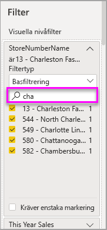

# Om filter och markeringar i Power BI-rapporter
 Den här artikeln ger en introduktion till filtrering och markering i Power BI-tjänsten. Upplevelsen är nästan exakt samma som i Power BI Desktop. ***Filter*** ta bort allt utan de data som du vill fokusera på. ***Markering*** är inte samma sak som filtrering. Data tas inte bort. Istället markeras en delmängd av synliga data; de data som inte är markerade förblir synliga men nedtonade.

Det finns många olika metoder för att filtrera och markera rapporter i Power BI. Att ta med all denna information i en artikel skulle bli förvirrande, så vi har delat upp det så här:

* Introduktion till filter och markeringar (den artikel du läser nu)
* Metoder för att [skapa och använda filter i redigeringsvyn](power-bi-report-add-filter.md) i rapporter. När du har redigeringsbehörighet för en rapport, kan du skapa, ändra och ta bort filter i rapporter.
* Metoder för att [använda filter och markeringar i en rapport som delas med dig eller i rapportens läsvy](consumer/end-user-reading-view.md). Vad du kan göra är mer begränsat, men du har fortfarande tillgång till en mängd olika filtrerings- och markeringsalternativ.  
* [En detaljerad genomgång av de filtrerings- och markeringskontroller som är tillgängliga i redigeringsvyn](consumer/end-user-report-filter.md), inklusive en djupgående inblick i olika typer av filter (till exempel datum och tid, numeriska och text) och skillnaden mellan grundläggande och avancerade alternativ.
* Nu när du har lärt dig hur filter och markeringar fungerar som standard, [kan du lära dig hur man ändrar hur visualiseringar på en sida kan filtrera och markera varandra](consumer/end-user-interactions.md)

## Introduktion till fönstret Filter

Du kan använda filter i fönstret **filter** eller genom att [göra urval i utsnitt](visuals/power-bi-visualization-slicers.md) direkt i själva rapporten. I fönstret Filter visas de tabeller och fält som används i rapporten och de filter som har tillämpats, i förekommande fall. 

Det finns fyra typer av filter.

- **sidfilter** gäller för alla visuella objekt på rapportsidan     
- **visuellt filter** gäller för ett enskilt visuellt objekt på en rapportsida. Du kan bara se filter på visuell nivå om du har valt en visualisering på rapportarbetsytan.    
- **rapportfilter** gäller för alla sidor i rapporten    
- **filter för visning av detaljerad information** gäller för en enda entitet i en rapport    

Du kan söka på sidor, visuella objekt och rapportfilter i läs- eller redigeringsläge för att hitta och välja värdet du letar efter. 

Om filtret har ordet **alla** bredvid det innebär det att alla värden i fältet ingår i filtret.  Som exempel kan vi av **Chain(All) (Kedja(alla))** på skärmbilden nedan avläsa att den här rapportsidan innehåller data om alla butikskedjorna.  Å andra sidan berättar filtret på rapportnivå för **Räkenskapsår 2013 eller 2014** att rapporten bara innehåller data för räkenskapsåren 2013 och 2014.

## Filter i läs- eller redigeringsvyn
Det finns två lägen för att interagera med rapporter: [läsvyn](consumer/end-user-reading-view.md) och redigeringsvyn. Vilka filtreringsfunktioner som är tillgängliga beror på vilket läge du befinner dig i.

* Du kan lägga till rapportfilter, sidfilter, filter för visning av detaljerad information och visuella filter i redigeringsvyn. När du sparar rapporten sparas filtren med rapporten, även om du har öppnat den i en mobilapp. De som tittar på rapporten i läsvyn kan interagera med de filter som du har lagt till, men inte lägga till nya filter.
* I läsvyn kan du interagera med alla filter som redan finns i rapporten och spara dina val. Du kan inte lägga till nya filter.

### Filter i läsvyn
Om du bara har åtkomst till en rapport i läsvyn ser fönstret Filter ut ungefär så här:

Så den här sidan i rapporten har sex filter på sidnivå och ett på rapportnivå.

Varje visuellt objekt kan ha filter för alla fält i det visuella objektet och en rapportskapare kan lägga till fler. I bilden nedan har bubbeldiagrammet sex filter.

I läsvyn kan du utforska data genom att ändra befintliga filter. De ändringar du gör sparas med rapporten, även om du har öppnat rapporten i en mobilapp. Läs mer i [guiden om panelen för rapportfilter](consumer/end-user-report-filter.md)

När du avslutar rapporten sparas dina filter. Om du vill ångra din filtrering och återgå till standardfiltreringen, standardsegmenteringen, standarddetaljnivån och standardsorteringen som rapportförfattaren konfigurerat väljer du **Återställ till standard** från den översta menyraden.

### Filter i redigeringsvyn
När du har ägarbehörighet för en rapport och öppnar den i redigeringsvyn ser du att **Filter** bara är ett av flera tillgängliga fönster för redigering.

Precis som i läsvyn ser vi att den här sidan i rapporten har sex filter på sidnivå och ett på rapportnivå. Och genom att välja bubbeldiagrammet ser vi att den har sex filter på visuell nivå.

Vi kan göra mer med filter och markeringar i redigeringsvyn. Främst kan vi lägga till nya filter. Lär dig hur du kan [lägga till ett filter i en rapport](power-bi-report-add-filter.md) och mycket mer.

## Ad hoc-markering
Välj ett fält på rapportarbetsytan för att markera andra visuella objekt av sidan. Välj ett tomt utrymme i samma visuella objekt för att ta bort det. Den här typen av markering är ett roligt sätt att snabbt utforska påverkan av dina data. Mer information om att finjustera den här typen av korsmarkering finns i [Visuella interaktioner](consumer/end-user-interactions.md).

## Nästa steg
[Lägga till ett filter i en rapport (i redigeringsvyn)](power-bi-report-add-filter.md)

[Ta en titt på rapportfiltren](consumer/end-user-report-filter.md)

[Ändra hur en rapports visuella objekt korsfiltrerar och korsmarkerar varandra](consumer/end-user-interactions.md)

Har du fler frågor? [Prova Power BI Community](http://community.powerbi.com/)

