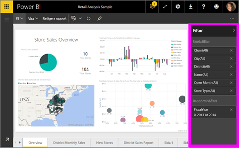
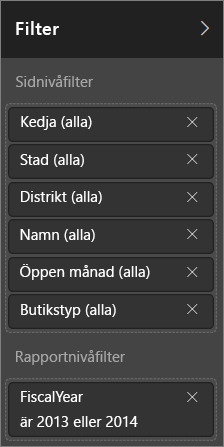
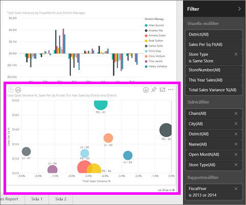
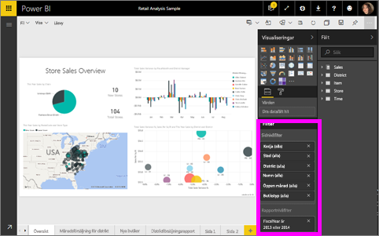
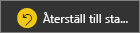

# Om filter och markeringar i Power BI-rapporter
***Filter*** ta bort allt utan de data som du vill fokusera på.  ***Markering*** är inte detsamma som filtrering eftersom inga data tas bort. Istället markeras en delmängd av synliga data; de data som inte är markerade förblir synliga men nedtonade.

Det finns många olika metoder för att filtrera och markera rapporter i Power BI. Att ta med all denna information i en artikel skulle bli förvirrande, så vi har delat upp det så här:

* Introduktion till filter och markeringar (den artikel du läser nu)
* Metoder för att [skapa och använda filter och markeringar i redigeringsvyn/rapporter som du äger](power-bi-report-add-filter.md). När du har redigeringsbehörighet för en rapport, kan du skapa, ändra och ta bort filter och markeringar i rapporter.
* De sätt på vilka du kan [använda filter och markeringar i en rapport som delas med dig eller i rapportens läsvy](consumer/end-user-reading-view.md). Vad du kan göra är mer begränsat, men Power BI ger dig fortfarande tillgång till en mängd olika filtrerings- och markeringsalternativ.  
* [En detaljerad genomgång av de filtrerings- och markeringskontroller som är tillgängliga i redigeringsvyn](consumer/end-user-report-filter.md), inklusive en djupgående inblick i olika typer av filter (till exempel datum och tid, numeriska och text) och skillnaden mellan grundläggande och avancerade alternativ.
* Nu när du har lärt dig hur filter och markeringar fungerar som standard, [kan du lära dig hur man ändrar hur visualiseringar på en sida kan filtrera och markera varandra](consumer/end-user-interactions.md)

> [!TIP]
> Hur vet Power BI hur data är relaterade?  Power BI använder relationerna mellan olika tabeller och fält i den underliggande [datamodellen](https://support.office.com/article/Create-a-Data-Model-in-Excel-87e7a54c-87dc-488e-9410-5c75dbcb0f7b?ui=en-US&rs=en-US&ad=US) för att få objekten på en rapportsida att interagera med varandra.
> 
> 

## Introduktion till filter och markeringar i rapporter med hjälp av filterfönstret
 Den här artikeln ger en introduktion till filtrering och markering i Power BI-tjänsten.  Men upplevelsen är nästan exakt samma som i Power BI Desktop.  

Filter och markeringar kan användas med hjälp av fönstret **Filter** eller genom att göra val direkt på själva rapporten (ad hoc, se längst ned på sidan). I fönstret Filter visas de tabeller och fält som används i rapporten och de filter som har tillämpats, i förekommande fall. Filtren är indelade i **sidnivå**, **rapportnivå**, **visning av detaljerad information** och **visuell nivå**.  Du kan bara se filter på visuell nivå om du har valt en visualisering på rapportarbetsytan.

> [!TIP]
> Om filtret har ordet **Alla** bredvid sig, inkluderas hela fältet som ett filter.  Som exempel kan vi av **Chain(All) (Kedja(alla))** på skärmbilden nedan avläsa att den här rapportsidan innehåller data om alla butikskedjorna.  Å andra sidan berättar filtret på rapportnivå för **Räkenskapsår 2013 eller 2014** att rapporten bara innehåller data för räkenskapsåren 2013 och 2014.
> 
> 

## Filter i läsvyn jämfört med redigeringsvyn
Det finns två lägen för att interagera med rapporter: [Läsvy och Redigeringsvy](consumer/end-user-reading-view.md).  Och vilka filtreringsfunktioner som är tillgängliga beror på vilket läge du befinner dig i.

* Du kan lägga till rapportfilter, sidfilter, filter för visning av detaljerad information och visuella filter i redigeringsvyn. När du sparar rapporten sparas filtren med rapporten, även om du har öppnat den i en mobilapp. De som tittar på rapporten i läsvyn kan interagera med de filter som du har lagt till, men inte lägga till nya filter.
* I läsvyn kan du interagera med alla filter som redan finns i rapporten och spara dina val.  Men du kan inte lägga till nya filter.

### Fönstret Filter i läsvyn
Om du bara har åtkomst till en rapport i läsvyn ser fönstret Filter ut ungefär så här:

Så den här sidan i rapporten har sex filter på sidnivå och ett på rapportnivå.

Välj ett visuellt objekt för att se om det finns några filter på visuell nivå. I bilden nedan har bubbeldiagrammet sex filter.

I läsvyn kan du utforska data genom att ändra befintliga filter. De ändringar du gör sparas med rapporten, även om du har öppnat rapporten i en mobilapp. Läs om hur gör i [Läsvyn och redigeringsvyn i Power BI-tjänsterapporter](consumer/end-user-reading-view.md)

### Fönstret Filter i redigeringsvyn
När du har ägarbehörighet för en rapport och öppnar den i redigeringsvyn ser du att **Filter** bara är ett av flera tillgängliga fönster för redigering.

Som i läsvyn (ovan) ser vi att den här sidan i rapporten har sex filter på sidnivå och ett på rapportnivå. Och genom att välja bubbeldiagrammet ser vi att den har sex filter på visuell nivå.

Men i redigeringsvyn finns det mycket mer som man kan göra med filter och markeringar. Den huvudsakliga skillnaden är att vi kan lägga till nya filter. Du kan lära dig hur du gör detta och mycket annat i artikeln [Lägga till ett filter i en rapport](power-bi-report-add-filter.md).

## Ad hoc-filtrering och -markering
Välj ett fält på rapportarbetsytan för att filtrera och markera resten av sidan. Välj ett tomt utrymme i samma visuella objekt för att ta bort det. Den här typen av filtrering och markering är ett roligt sätt att snabbt utforska påverkan av dina data. Mer information om att finjustera den här typen av korsfiltrering och korsmarkering finns i [Visuella interaktioner](consumer/end-user-interactions.md).

När du avslutar rapporten sparas dina ändringar. Om du vill ångra din filtrering och återgå till standardfiltreringen, standardsegmenteringen, standarddetaljnivån och standardsorteringen som rapportförfattaren konfigurerat väljer du **Återställ till standard** från den översta menyraden.

## Nästa steg
[Interagera med filter och markeringar (i läsvyn)](consumer/end-user-reading-view.md)

[Lägga till ett filter i en rapport (i redigeringsvyn)](power-bi-report-add-filter.md)

[Ta en titt på rapportfiltren](consumer/end-user-report-filter.md)

[Ändra hur en rapports visuella objekt korsfiltrerar och korsmarkerar varandra](consumer/end-user-interactions.md)

Läs mer om [rapporter i Power BI](consumer/end-user-reports.md)

Har du fler frågor? [Prova Power BI Community](http://community.powerbi.com/)

