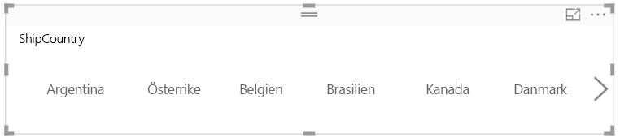
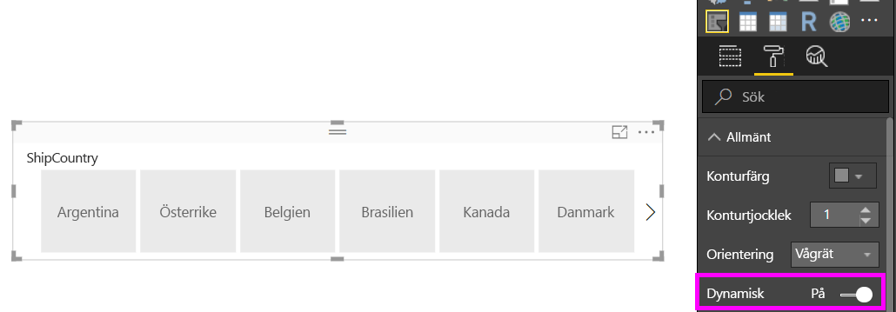

# Skapa ett dynamiskt utsnitt som du kan ändra storlek på i Power BI

Dynamiska utsnitt ändrar storlek för att passa i alla olika utrymmen i rapporten. Du kan ändra storlek på de dynamiska utsnitten till olika storlekar och former, från vågräta till kvadratiska, till lodräta och värdena i utsnittet ordnar om sig själva på samma sätt som du gör. I Power BI Desktop och Power BI-tjänsten kan du göra vågräta utsnitt och datum-/intervallutsnitt dynamiska. Datum-/intervallutsnitt har också förbättrade pekområden så att det är lättare att ändra dem med ett fingertryck. Du kan göra dynamiska utsnitt så små eller stora som du vill. De ändrar också storlek automatiskt så att de passar bra för rapporter i Power BI-tjänsten och även i Power BI-appar. 

## Skapa ett utsnitt

Det första steget för att skapa ett dynamiskt utsnitt är att skapa ett grundläggande utsnitt. 

1. Välj ikonen **Utsnitt**  i fönstret **Visualiseringar**.
2. Dra fältet som du vill filtrera till **Fält**.

    

## Konvertera till ett vågrätt utsnitt

1. Med det valda utsnittet väljer du fliken **Format** i fönstret **Visualiseringar**.
2. Expandera avsnittet **Allmänt** och välj sedan **Vågrätt** som **Orientering**.

     

1.  Du vill förmodligen göra det bredare för att visa fler värden.

     

## Gör det dynamiskt och experimentera med det

Det här steget är enkelt. 

1. Precis under **Orientering** i avsnittet **Allmänt** under fliken **Format** drar du **Responsiv** till **På**.  

    

1. Nu kan du experimentera med det. Dra i hörnen för att göra det kortare, längre, bredare och smalare. Om du gör det tillräckligt litet, blir det bara en filterikon.

    

## Lägg till det i en telefonrapportlayout

I Power BI Desktop kan du skapa en telefonlayout för varje sida i en rapport. Om en sida har en telefonlayout, visas den på en mobiltelefon i stående vy. I annat fall måste du visa den i liggande vy. 

1. På menyn **Visa** väljer du **Telefonlayout**.

     
    
1. Dra all visuell information du vill ha i telefonrapporten till rutnätet. Dra det dynamiska utsnittet till den storlek du önskar – i det här fallet bara en filterikon.

    

Läs mer om hur du skapar [rapporter som är optimerade för Power BI-appar](desktop-create-phone-report.md).

## Gör ett tids- eller intervallutsnitt dynamiskt

Du kan följa samma steg för att göra en panel eller ett intervallutsnitt dynamiskt. När du ställer in **Dynamiskt** till **På**, upptäcker du några saker:

- Visuell information optimerar ordningen på indatarutorna beroende på arbetsytans storlek. 
- Visningen av dataelement är optimerad för att göra utsnittet så användbart som möjligt, baserat på den storleken som är tillåten på arbetsytan. 
- Nya runda handtag på reglagen optimerar pekinteraktioner. 
- När en visuell information blir för liten för att användas, blir den en ikon som representerar typen av visuell information i dess ställe. För att interagera med den dubbelklickar du bara på den för att öppna den i Fokusläge. Detta sparar värdefullt utrymme på sidan utan att förlora funktionerna.

## Nästa steg

- [Utsnitt i Power BI-tjänsten](visuals/power-bi-visualization-slicers.md)
- Har du fler frågor? [Fråga Power BI Community](http://community.powerbi.com/)