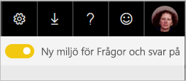
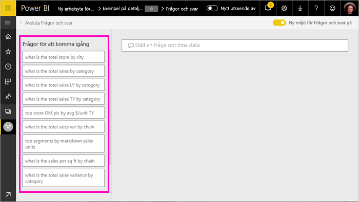
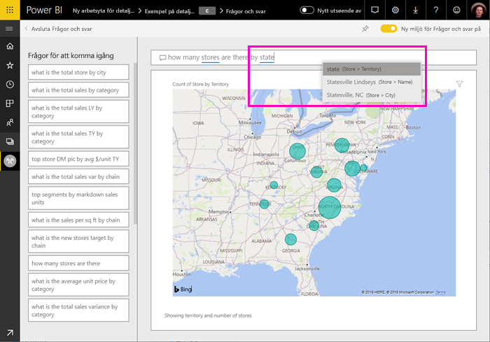

# Använd Frågor och svar i Power BI till att utforska dina data och skapa visuella objekt

Ibland är det snabbaste sättet att få svar från dina data att ställa en fråga med hjälp av naturligt språk. Med hjälp av funktionen Frågor och svar i Power BI kan du utforska dina data med dina egna ord.  I den första delen av den här artikeln visas hur du använder Frågor och svar i instrumentpaneler i Power BI-tjänsten. I den andra delen beskriver vi vad du kan göra med Frågor och svar när du skapar rapporter i antingen Power BI-tjänsten eller Power BI Desktop. Mer bakgrundsinformation finns i artikeln [Frågor och svar för konsumenter](consumer/end-user-q-and-a.md). 

[Frågor och svar i Power BI-mobilappar](consumer/mobile/mobile-apps-ios-qna.md) och [Frågor och svar med Power BI Embedded](developer/qanda.md) täcks i separata artiklar. 

Frågor och svar är både interaktivt och roligt att använda. En fråga leder ofta till en annan när visualiseringarna avslöjar intressanta sökvägar. Titta när Amanda demonstrerar frågor och svar för att skapa visuella objekt, detaljgranska dem och fästa dem till instrumentpaneler.

<iframe width="560" height="315" src="https://www.youtube.com/embed/qMf7OLJfCz8?list=PL1N57mwBHtN0JFoKSR0n-tBkUJHeMP2cP" frameborder="0" allowfullscreen></iframe>

## Del 1: Använda Frågor och svar på en instrumentpanel i Power BI-tjänsten

I Power BI-tjänsten (app.powerbi.com) innehåller en instrumentpanel paneler som fästs från en eller flera datamängder så att du kan ställa frågor om data som finns i någon av datamängderna. Om du vill se vilka rapporter och datamängder som användes för att skapa instrumentpanelen, väljer du **Visa relaterade** från menyraden.

Frågerutan för Frågor och svar finns i det övre vänstra hörnet i instrumentpanelen och det är här du skriver in din fråga på naturligt språk. Ser du inte någon ruta i Frågor och svar? Se [Överväganden och felsökning](consumer/end-user-q-and-a.md#considerations-and-troubleshooting) i artikeln **Frågor och svar för konsumenter**.  Frågor och svar kan identifiera de ord du skriver och räkna ut var (i vilken datamängd) svaret finns. Frågor och svar hjälper dig också att formulera din fråga med automatisk komplettering, omformulering och andra textbaserade och visuella hjälpmedel.

Svaret på din fråga visas som en interaktiv visualisering och uppdateras allteftersom du ändrar frågan.

1. Öppna en instrumentpanel och placera din markör i frågerutan. Välj **Ny miljö för Frågor och svar** i det övre högra hörnet.

    

1. Innan du ens börjar skriva, visar frågor och svar en ny skärm med förslag för att hjälpa dig formulera din fråga. Du ser fraser och kompletta frågor som innehåller namnen på tabellerna i underliggande datamängder och du kan även se kompletta frågor i listan ifall datamängdens ägare har skapat [aktuella frågor](service-q-and-a-create-featured-questions.md).

   

   Du kan välja någon av dessa frågor som en startpunkt och fortsätta att förfina frågan för att hitta ett specifikt svar. Du kan också använda ett tabellnamn för att hjälpa dig formulera en ny fråga.

2. Välj i listan med frågor eller börja skriva en egen fråga och välj bland förslagen i listrutan.

   

3. När du skriver en fråga väljer Frågor och svar den bästa visualiseringen för ditt svar.

   

4. Visualiseringen ändras dynamiskt när du ändrar frågan.

   

1. Medan du skriver en fråga, letar Power BI efter det bästa svaret i alla datauppsättningar som har en panel på den instrumentpanelen.  Om alla paneler är från *datauppsättning A* så kommer ditt svar att komma från *datauppsättning A*.  Om det finns paneler från *datasetA* och *datasetB*, kommer Frågor och svar att leta efter det bästa svaret i de två datamängderna.

   > [!TIP]
   > Så var försiktig, om du bara har en panel från *datauppsättning A* och du tar bort den från instrumentpanelen, kommer frågor och svar inte längre att ha åtkomst till *datauppsättning A*.
   >

5. När du är nöjd med resultatet fäster du visualiseringen på en instrumentpanel genom att välja fästikonen i det övre högra hörnet. Om instrumentpanelen har delats med dig, eller är en del av en app, kan du inte fästa.

   

## Del 2: Använd frågor och svar i en rapport i Power BI-tjänsten eller Power BI Desktop

Använd frågor och svar för att utforska dina datauppsättningar och lägga till visualiseringar i rapporten och instrumentpanelerna. En rapport är baserad på en enda datauppsättning och kan vara helt tom eller innehålla mängder av sidor med visualiseringar. Men bara för att en rapport är tom, behöver det inte betyda att det inte finns några data som du kan utforska – datauppsättningen är länkad till rapporten och väntar på att du ska utforska den och skapa visualiseringar.  Om du vill se vilken datauppsättning som används för att skapa en rapport så öppnar du rapporten i Power BI-tjänstens läsvy och väljer **Visa relaterade** från menyraden.

Du måste ha behörighet att redigera rapporten och den underliggande datamängden för att kunna använda Frågor och svar i rapporter. I artikeln [Frågor och svar för konsumenter](consumer/end-user-q-and-a.md) kallar vi detta för en *skapare* av scenariot. Om du i stället *använder* en rapport som har delats med dig, är Frågor och svar inte tillgängligt.

1. Öppna en rapport i redigeringsvyn (Power BI-tjänsten) eller rapportvyn (Power BI Desktop) och välj **Ställ en fråga** i menyraden.

    **Power BI Desktop**    
    

    **Tjänsten**    
    

2. En frågor och svar-frågeruta visas på din rapportarbetsyta. I exemplet nedan visas frågerutan ovanpå en annan visualisering. Det fungerar, men det kan vara bättre att lägga till en tom sida i rapporten innan du ställer en fråga.

    

3. Placera markören i frågerutan. När du skriver, visar frågor och svar förslag för att hjälpa dig att skapa din fråga.

   

4. Allteftersom du skriver in en fråga så väljer frågor och svar den bästa [visualiseringen ](visuals/power-bi-visualization-types-for-reports-and-q-and-a.md)för att visa ditt svar. Visualiseringen ändras dynamiskt medan du ändrar frågan.

   

5. När du har den visualiseringen som du vill ha, väljer du RETUR. Om du vill spara visualiseringen rapporten, väljer du **Fil > Spara**.

6. Interagera med den nya visualiseringen. Det spelar ingen roll hur du skapade visualiseringen – samma interaktivitet, formatering och funktioner finns tillgängliga oavsett.

   

   Om du skapade visualiseringen i Power BI-tjänsten, kan du till och med [fästa den på en instrumentpanel](service-dashboard-pin-tile-from-q-and-a.md).

## Berätta för Frågor och svar vilket visuellt objekt som ska användas
Med frågor och svar, kan du inte bara be dina data att tala för sig själva, du kan säga hur Power BI ska visa svaret. Lägg bara till som en <visualization type> i slutet av din fråga.  Till exempel visa lagervolymer efter anläggning som en karta och visa totalt lager som ett kort.  Prova själv.

## Överväganden och felsökning
- Om du har anslutit till en datauppsättning med en live-anslutning eller gateway, behöver frågor och svar vara [aktiverat för den datauppsättningen](service-q-and-a-direct-query.md).

- Du har öppnat en rapport och ser inte frågor och svar-alternativet. Om du använder Power BI-tjänsten, se till att du öppnar rapporten i Redigeringsvyn. Om du inte kan öppna redigeringsvyn, betyder det att du inte har redigeringsbehörigheter för den rapporten och inte kan använda Frågor och svar med just den rapporten.

## Nästa steg

- [Frågor och svar för konsumenter](consumer/end-user-q-and-a.md)   
- [Tips för att ställa frågor i frågor och svar](consumer/end-user-q-and-a-tips.md)   
- [Förbered en arbetsbok för frågor och svar](service-prepare-data-for-q-and-a.md)  
- [Förbered en lokal datamängd för Frågor och svar](service-q-and-a-direct-query.md)   
- [Fäst en panel på instrumentpanelen från frågor och svar](service-dashboard-pin-tile-from-q-and-a.md)
