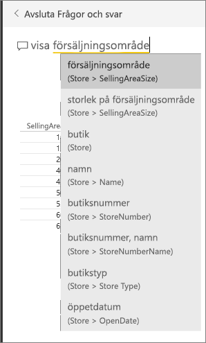
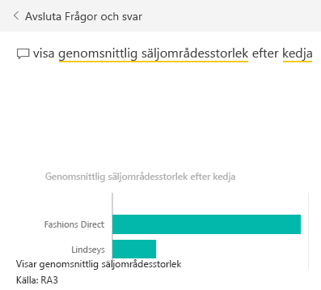
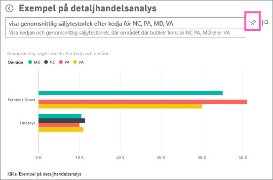
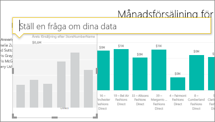
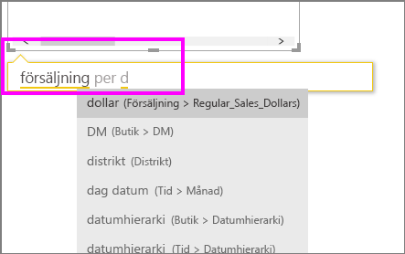
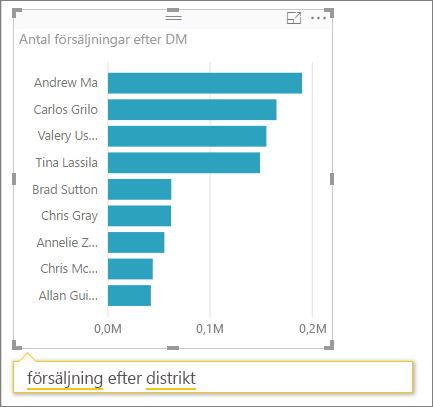

# Självstudie: använd frågor och svar för att skapa visualiseringar och rapporter
[Översikt över frågor och svar](power-bi-q-and-a.md) introducerade dig till Power BI frågor och svar och visade på skillnaden mellan *konsumenter* (får instrumentpaneler och rapporter delade med sig) och *skapare* ( äger de underliggande rapporterna och datauppsättningarna). Den första delen av den här självstudien är främst avsedd för personer som använder instrumentpaneler med Power BI-tjänsten. Den andra delen är skapad för folk som skapar rapporter med hjälp av antingen Power BI-tjänsten eller Power BI Desktop. [Frågor och svar och Power BI Mobile](mobile-apps-ios-qna.md) och [Frågor och svar med Power BI Embedded](developer/qanda.md) täcks i separata artiklar.

Frågor och svar är interaktivt och till och med roligt. Ofta leder en fråga till flera andra när visualiseringarna avslöjar intressanta spår att följa upp. Titta när Amanda demonstrerar frågor och svar för att skapa visuella objekt, detaljgranska dem och fästa dem till instrumentpaneler.

<iframe width="560" height="315" src="https://www.youtube.com/embed/qMf7OLJfCz8?list=PL1N57mwBHtN0JFoKSR0n-tBkUJHeMP2cP" frameborder="0" allowfullscreen></iframe>

## Del 1: Använd frågor och svar på en instrumentpanel i Power BI-tjänsten (app.powerbi.com)
En instrumentpanel innehåller paneler som fästs från en eller flera datauppsättningar så du kan ställa frågor om data som finns i någon av de datauppsättningarna. Om du vill se vilka rapporter och datauppsättningar som användes för att skapa instrumentpanelen, väljer du **Visa relaterade** från menyraden.

Frågerutan för frågor och svar finns i det övre vänstra hörnet i instrumentpanelen och det är här du skriver in din fråga med naturligt språk. Frågor och svar kan identifiera de ord du skriver och lista ut var (i vilken datauppsättning) som svaret finns. Frågor och svar hjälper dig också att formulera din fråga med automatisk komplettering, omformulering och andra textbaserade och visuella hjälpmedel.

Svaret på din fråga visas som en interaktiv visualisering och uppdateras allteftersom du ändrar frågan.

1. Öppna en instrumentpanel och placera din markör i frågerutan. Innan du ens börjar skriva, visar frågor och svar en ny skärm med förslag för att hjälpa dig formulera din fråga. Du ser namnen på tabellerna i de [underliggande datauppsättningarna](service-get-data.md) och kan även se fullständiga frågor listade om datauppsättningens ägare har skapat [aktuella frågor](service-q-and-a-create-featured-questions.md),

   

   Du kan alltid välja en av dessa frågor som en startpunkt och fortsätta att förfina frågan för att hitta det specifika svar som du letar efter. Eller använd ett tabellnamn för att hjälpa dig uttrycka en ny fråga.

2. Välj från datauppsättningsalternativen eller börja skriva en egen fråga och välj från förslagen i listrutan.

   

3. Allteftersom du skriver in en fråga så väljer frågor och svar den bästa [visualiseringen ](power-bi-visualization-types-for-reports-and-q-and-a.md)för att visa ditt svar. Visualiseringen ändras dynamiskt medan du ändrar frågan.

   

4. Medan du skriver en fråga, letar Power BI efter det bästa svaret i alla datauppsättningar som har en panel på den instrumentpanelen.  Om alla paneler är från *datauppsättning A* så kommer ditt svar att komma från *datauppsättning A*.  Om det finns paneler från *datauppsättning A* och *datauppsättning B* så letar frågor och svar efter det bästa svaret från de två datauppsättningarna.

   > [!TIP]
   > Så var försiktig, om du bara har en panel från *datauppsättning A* och du tar bort den från instrumentpanelen, kommer frågor och svar inte längre att ha åtkomst till *datauppsättning A*.
   >
   >
5. När du är nöjd med resultatet, [fäster du visualiseringen till en instrumentpanel](service-dashboard-pin-tile-from-q-and-a.md) genom att välja fästikonen i det övre högra hörnet. Om instrumentpanelen har delats med dig, eller är en del av en app, kan du inte fästa.

   

##    Del 2: Använd frågor och svar i en rapport i Power BI-tjänsten eller Power BI Desktop

Använd frågor och svar för att utforska dina datauppsättningar och lägga till visualiseringar i rapporten och instrumentpanelerna. En rapport är baserad på en enda datauppsättning och kan vara helt tom eller innehålla mängder av sidor med visualiseringar. Men bara för att en rapport är tom, behöver det inte betyda att det inte finns några data som du kan utforska – datauppsättningen är länkad till rapporten och väntar på att du ska utforska den och skapa visualiseringar.  Om du vill se vilken datauppsättning som används för att skapa en rapport så öppnar du rapporten i Power BI-tjänstens läsvy och väljer **Visa relaterade** från menyraden.

Du måste ha behörighet att redigera rapporten och den underliggande datauppsättningen för att kunna använda frågor och svar i rapporter. I [Översiktsavsnittet för frågor och svar](power-bi-q-and-a.md) refererar vi till det här som ett *skapare*-scenario. Om du istället *förbrukar* en rapport som har delats med dig, kommer frågor och svar inte att vara tillgängligt.

1. Öppna en rapport i redigeringsvyn (Power BI-tjänsten) eller rapportvyn (Power BI Desktop) och välj **Ställ en fråga** från menyraden.

    **Desktop**    
    

    **Tjänsten**    
    

2. En frågor och svar-frågeruta visas på din rapportarbetsyta. I exemplet nedan visas frågerutan ovanpå en annan visualisering. Det är ok, men det kan vara bättre att [lägga till en tom sida i rapporten](power-bi-report-add-page.md) innan du ställer en fråga.

    

3. Placera markören i frågerutan. När du skriver, visar frågor och svar förslag för att hjälpa dig att skapa din fråga.

   

4. Allteftersom du skriver in en fråga så väljer frågor och svar den bästa [visualiseringen ](power-bi-visualization-types-for-reports-and-q-and-a.md)för att visa ditt svar. Visualiseringen ändras dynamiskt medan du ändrar frågan.

   

5. När du har den visualiseringen som du vill ha, väljer du RETUR. Om du vill spara visualiseringen rapporten, väljer du **Fil > Spara**.

6. Interagera med den nya visualiseringen. Det spelar ingen roll hur du skapade visualiseringen – samma interaktivitet, formatering och funktioner finns tillgängliga oavsett.

   

   Om du skapade visualiseringen i Power BI-tjänsten, kan du till och med [fästa den på en instrumentpanel](service-dashboard-pin-tile-from-q-and-a.md).

## Berätta för frågor och svar vilken visualisering som ska användas.
Med frågor och svar, kan du inte bara be dina data att tala för sig själva, du kan säga hur Power BI ska visa svaret. Lägg bara till som en <visualization type> i slutet av din fråga.  Till exempel visa lagervolymer efter anläggning som en karta och visa totalt lager som ett kort.  Prova själv.

##  Överväganden och felsökning
- Om du har anslutit till en datauppsättning med en live-anslutning eller gateway, behöver frågor och svar vara [aktiverat för den datauppsättningen](service-q-and-a-direct-query.md).

- Du har öppnat en rapport och ser inte frågor och svar-alternativet. Om du använder Power BI-tjänsten, se till att du öppnar rapporten i Redigeringsvyn. Om du inte kan öppna Redigeringsvyn, betyder det att du inte har redigeringsbehörigheter för den rapporten och inte kommer att kunna använda frågor och svar med just den rapporten.

## Nästa steg
Gå tillbaka till [Frågor och svar i Power BI](power-bi-q-and-a.md)   
[Självstudie: använd frågor och svar med detaljhandelsexemplet](power-bi-visualization-introduction-to-q-and-a.md)   
[Tips för att ställa frågor i frågor och svar](service-q-and-a-tips.md)   
[Förbered en arbetsbok för frågor och svar](service-prepare-data-for-q-and-a.md)  
[Förbered en lokal datauppsättning för frågor och svar](service-q-and-a-direct-query.md)
[Fäst en panel på instrumentpanelen från frågor och svar](service-dashboard-pin-tile-from-q-and-a.md)
