# ArcGIS-kartor i Power BI-tjänsten och Power BI Desktop från Esri
De här självstudierna har skrivits utifrån en person som skapar en ArcGIS-karta. När en skapare delar en ArcGIS-karta med en kollega, kan kollegan visa och interagera med kartan men inte spara några ändringar. Mer information om hur du visar en ArcGIS-karta finns i [Interagera med ArcGIS-kartor](power-bi-visualizations-arcgis.md).

Kombinationen av ArcGIS-kartor och Power BI tar mappningen längre än till bara presentation av punkter på en karta och till en helt ny nivå. Välj mellan grundläggande kartor, platstyper, teman, symbolformat och referensskikt för att skapa fantastiska informativa kartvisualiseringar. Kombinationen av auktoritära dataskikt på en karta med spatial analys ger en djupare förståelse av visualiseringens data.

 Du kan inte skapa en ArcGIS-karta på en mobil enhet, men du kan visa den och interagera med den. Se [Interagera med ArcGIS-kartor](power-bi-visualizations-arcgis.md).

> [!TIP]
> GIS står för Geographic Information Science.

I exemplet nedan används en mörkgrå arbetsyta för att visa regional försäljning som en termisk karta mot ett demografiskt skikt för den disponibla medianinkomsten 2016. Som du kommer märka när du läser vidare ger användningen av ArcGIS-kartor tillgång till nästan obegränsad utökad mappningskapacitet, demografiska data och även mer övertygande kartvisualiseringar så att du kan förmedla ditt budskap på bästa sätt.

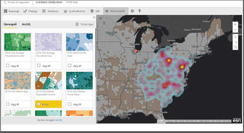

> [!TIP]
> Besök [Esris sida om Power BI](https://www.esri.com/powerbi) för att titta närmare på våra många exempel och läsa kundutlåtanden. Gå sedan till Esris [startsida för att komma igång med ArcGIS Maps för Power BI](https://doc.arcgis.com/en/maps-for-powerbi/get-started/about-maps-for-power-bi.htm).

## Användargodkännande
ArcGIS Maps for Power BI tillhandahålls av Esri (www.esri.com). Din användning av ArcGIS Maps för Power BI är föremål för Esris villkor och sekretesspolicy. Power BI-användare som vill använda de visuella objekten i ArcGIS Maps för Power BI, måste ge sitt samtycke i dialogrutan för medgivande.

**Resurser**

[Villkor](https://go.microsoft.com/fwlink/?LinkID=826322)

[Sekretesspolicy](https://go.microsoft.com/fwlink/?LinkID=826323)

[Produktsida för ArcGIS Maps för Power BI](https://www.esri.com/powerbi)

 

## Aktivera en ArcGIS-karta
ArcGIS-kartor är för närvarande tillgängliga i Power BI-tjänsten, Power BI Desktop och Power BI Mobile. Den här artikeln innehåller instruktioner för tjänsten och för Desktop.

### Aktivera en ArcGIS-karta ***i Power BI-tjänsten (app.powerbi.com)***
De här självstudierna använder sig av [Exempel på detaljhandelsanalys](sample-retail-analysis.md). Så här aktiverar du **ArcGIS Maps för Power BI**:

1. Välj kugghjulsikonen från den översta högra delen av menyraden och öppna **Inställningar**
   
    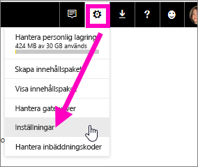
2. Markera kryssrutan **ArcGIS Maps för Power BI**. Du måste starta om Power BI när du har gjort valet.
   
    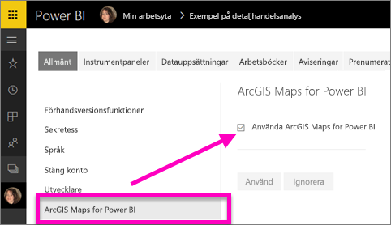
3. Öppna en rapport i [Redigeringsvy](service-reading-view-and-editing-view.md) och välj ArcGIS Maps för Power BI-ikonen från panelen Visualiseringar.
   
    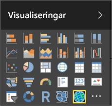
4. Power BI lägger till en tom ArcGIS-kartmall på rapportarbetsytan.
   
   

 

## Skapa ett visuellt objekt med ArcGIS Maps
Titta på när Will skapar några olika ArcGIS-kartvisualiseringar och följ sedan anvisningarna nedan för att prova själv med hjälp [Exempel på detaljhandelsanalys](sample-datasets.md).

<iframe width="560" height="315" src="https://www.youtube.com/embed/EKVvOZmxg9s" frameborder="0" allowfullscreen></iframe>

1. På panelen **Fält** drar du ett datafält till bucketerna **Plats** eller **Latitud** och/eller **Longitud**. I det här exemplet använder vi **Butik > Stad**.
   
   > [!NOTE]
   > ArcGIS Maps för Power BI identifierar automatiskt om de fält som du har valt visas bäst som en form eller en punkt på en karta. Du kan justera standardvärdet i inställningarna (se nedan).
   > 
   > 
   
    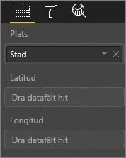
2. Omvandla visualiseringen till en ArcGIS-karta genom att välja mallen från panelen Visualiseringar.
3. Dra ett mått till bucketen **Storlek** från panelen **Fält** för att justera hur data visas. I det här exemplet använder vi **Försäljning > Last Year Sales (Förra årets försäljning)**.
   
    

## Inställningar och formatering för ArcGIS-kartor
Så här gör du för att få åtkomst till formateringsfunktionerna i **ArcGIS Maps för Power BI**:

1. Du kan få åtkomst till ytterligare funktioner genom att välja ellipserna i det övre högra hörnet av visualiseringen och välja **Redigera**,
   
   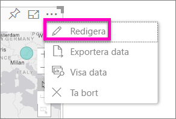
   
   Tillgängliga funktioner visas överst i visualiseringen. När du väljer en funktion öppnas ett åtgärdsfönster med detaljerade alternativ. 
   
   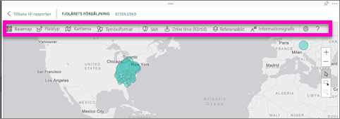
   
   > [!NOTE]
   > Mer information om inställningarna och funktionerna finns i **Detaljerad dokumentation** nedan.
   > 
   > 
2. Om du vill gå tillbaka till rapporten väljer du **Tillbaka till rapporten** från det övre vänstra hörnet av din rapportarbetsyta.

 

## Detaljerad dokumentation
**Esri** tillhandahåller [omfattande dokumentation](https://go.microsoft.com/fwlink/?LinkID=828772) om funktionsuppsättningen i **ArcGIS Maps för Power BI**.

## Översikt över funktioner
### Grundläggande kartor
Fyra grundläggande kartor tillhandahålls: Dark Gray Canvas (Mörkgrå arbetsyta), Light Gray Canvas (Ljusgrå arbetsyta), OpenStreetMap och Gator.  Gator är Arcgis grundläggande standardkarta.

Om du vill använda en grundläggande karta väljer du den i åtgärdsfönstret.

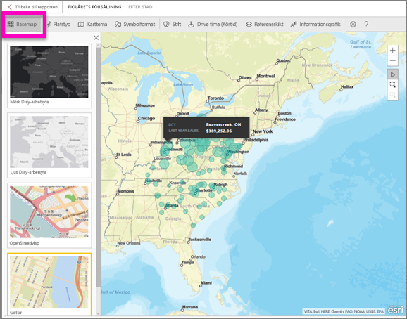

### Platstyp
ArgGIS Maps för Power BI identifierar automatiskt det bästa sättet att visa data på kartan. Den väljer mellan Punkter och Gränser. Med alternativen för Platstyp kan du finjustera de här valen.

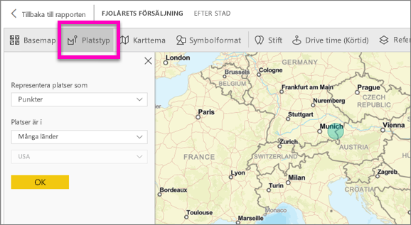

**Gränser** fungerar bara om dina data innehåller geografiska standardvärden. Esri räknat automatiskt ut den form som ska visas på kartan. Geografiska standardvärden är länder, provinser, postnummer och så vidare. Men precis som med geokodning kan det hända att Power BI inte kan identifiera att fältet ska vara en gräns som standard eller så kanske det inte har någon gräns för dina data.  

### Map theme (Karttema)
Det finns fyra kartteman. Temana för Location Only (Endast plats) och Storlek väljs automatiskt baserat på de fält som du binder till platsen och lägger till i bucketen **Storlek** i panelen Fält i Power BI. Vi använder för närvarande **Storlek**, så vi ändrar till **Termisk karta**.  

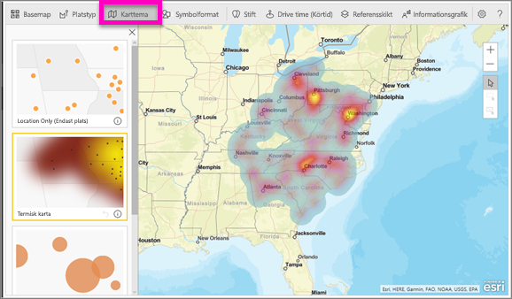

<table>
<tr><th>Tema</th><th>Beskrivning</th>
<tr>
<td>Location Only (Endast plats)</td>
<td>Ritar datapunkter eller fyllda gränser på kartan baserat på inställningarna i Platstyp.</td>
</tr>
<tr>
<td>Termisk karta</td>
<td>Ritar ett intensitetsdiagram över dina data på kartan.</td>
</tr>
<tr>
<td>Storlek</td>
<td>Ritar datapunkter på kartan vars storlek baseras på värdet i bucketen Storlek på panelen Fält.</td>
</tr>
<tr>
<td>Klustring</td>
<td>Ritar antalet datapunkter i regioner på kartan. </td>
</tr>
</table>

### Symbol style (Symbolformat)
Med olika symbolformat kan du fininställa hur data ska visas på kartan. Symbol style (Symbolformat) är sammanhangsberoende baserat på vilken platstyp och vilket karttema som har valts. Exemplet nedan visar Platstyp inställt på **Storlek** med flera justeringar av genomskinlighet, stil och storlek.

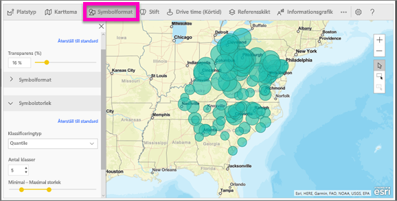

### Stift
Du kan uppmärksamma punkter på kartan genom att lägga till stift.  

1. Välj fliken **Stift**.
2. Ange nyckelord (till exempel adresser, platser och orienteringspunkter) i sökrutan och välj i listrutan. En symbol som visas på kartan och kartan zoomar automatiskt in på platsen. Sökresultaten sparas som platskort på panelen Stift. Du kan spara upp till 10 platskort.
   
   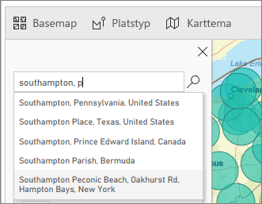
3. Power BI lägger till ett stift till platsen och du kan ändra färg på stiftet.
   
   
4. Lägg till och ta bort stift.
   
   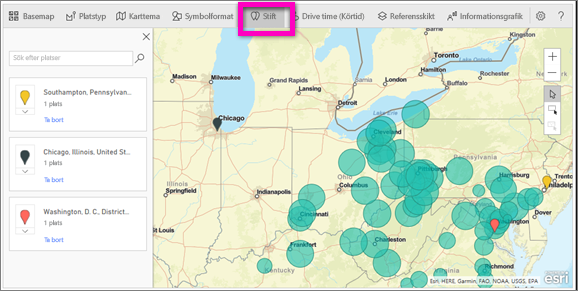

### Drive time (Körtid)
På panelen Drive time (Körtid) kan du välja en plats och sedan avgöra vilka andra kartfunktioner som finns inom en angiven radie eller körtid.  
    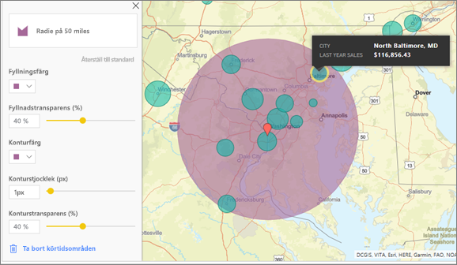

1. Välj fliken **Drive time (Körtid)** och välj verktyget för ett eller flera val. Välj stiftet för Washington D.C.
    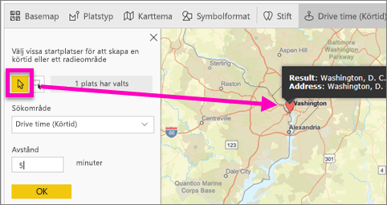
   
   > [!TIP]
   > Det är lättare att välja en plats om du zoomar in på kartan (med hjälp av +-ikonen).
   > 
   > 
2. Föreställ dig att du flyger till Washington D.C. på ett par dagar och vill ta reda på vilka butiker som finns inom ett rimligt köravstånd. Ändra sökområdet till **Radie** och avståndet till **50** engelska mil och välj OK.    
   
    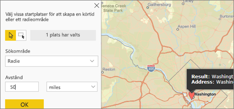
3. Radien visas i lila. Välj valfri plats för att visa detaljerad information om den. Du kan också formatera radien genom att ändra färgen och konturen.
   
    

### Referensskikt
#### Referensskikt – demografi
ArcGIS Maps för Power BI tillhandahåller ett urval av demografiska skikt som hjälper till att sätta data från Power BI i sin kontext.

1. Välj fliken **Referensskikt** och välj **Demografi**.
2. Varje skikt i listan har en kryssruta. Markera med en bock för att lägga till skiktet på kartan.  I det här exemplet har vi lagt till den genomsnittliga hushållsinkomsten. 
   
    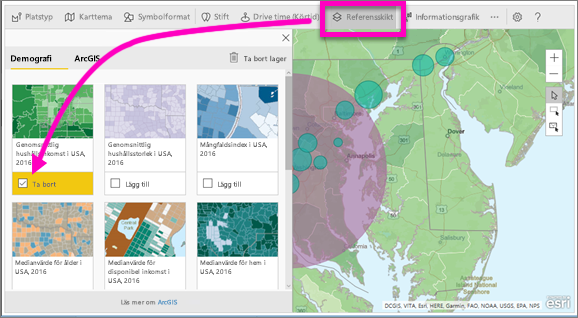
3. Varje skikt är också interaktivt. På samma sätt som du kan hovra över en bubbla för att visa information, kan du här klicka på ett skuggat område på kartan för att se ytterligare information. 
   
    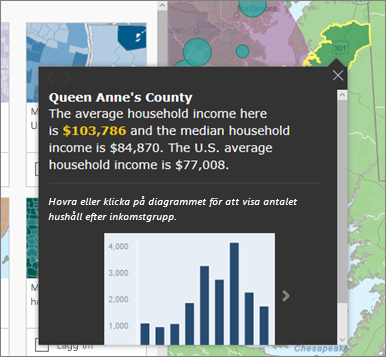

#### Referensskikt – ArcGIS
ArcGIS Online gör det möjligt för organisationer att publicera offentliga webbplatskartor. Dessutom ger Esri tillgång till en granskad uppsättning webbkartor via Living Atlas. På ArcGIS-fliken kan du söka igenom alla offentliga webbkartor eller Living Atlas-kartor och lägga till dem på kartan som referensskikt.

1. Välj fliken **Referensskikt** och välj **ArcGIS**.
2. Ange sökorden och välj sedan ett kartskikt. I det här exemplet har vi valt amerikanska kongressdistrikt.
   
    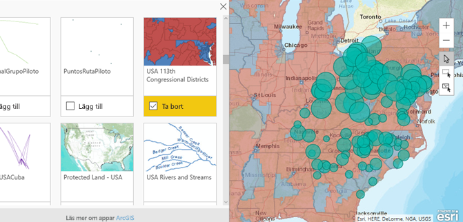
3. Om du vill se ytterligare information, väljer du ett skuggat område för att öppna *Select from reference layer (Välj från referensskikt)*. Använd verktyget för val av referensskikt för att markera gränser eller objekt på referensskiktet.

 

## Välja datapunkter
Du finns tre lägen för att välja datapunkter i ArcGIS Maps för Power BI.

Du ändrar läge med det här reglaget:

Välj enskilda datapunkter.

Ritar en rektangel på kartan och väljer de inneslutna datapunkterna.

 Medför att gränser eller polygoner inom referensskikt kan användas för att markera inneslutna datapunkter.

> [!NOTE]
> Du kan välja högst 250 datapunkter i taget.
> 
> 

 

## Få hjälp
**Esri** tillhandahåller [omfattande dokumentation](https://go.microsoft.com/fwlink/?LinkID=828772) om funktionsuppsättningen i **ArcGIS Maps för Power BI**.

Du kan ställa frågor, hitta den senaste informationen, rapportera problem och få svar i Power BI-[communityns tråd om **ArcGIS Maps för Power BI**](https://go.microsoft.com/fwlink/?LinkID=828771).

Om du har förslag på en förbättring kan du skicka det till [Power BI:s idélista](https://ideas.powerbi.com).

 

## Hantera användningen av ArcGIS Maps för Power BI i din organisation
Power BI gör det möjligt för användare, klientadministratörer och IT-administratörer att avgöra om ArcGIS Maps för Power BI ska användas.

**Användaralternativ** I Power BI Desktop kan användare sluta använda ArcGIS Maps för Power BI genom att inaktivera det på säkerhetsfliken i **Alternativ**. När ArcGIS Maps är inaktiverat läses det inte in som standard.

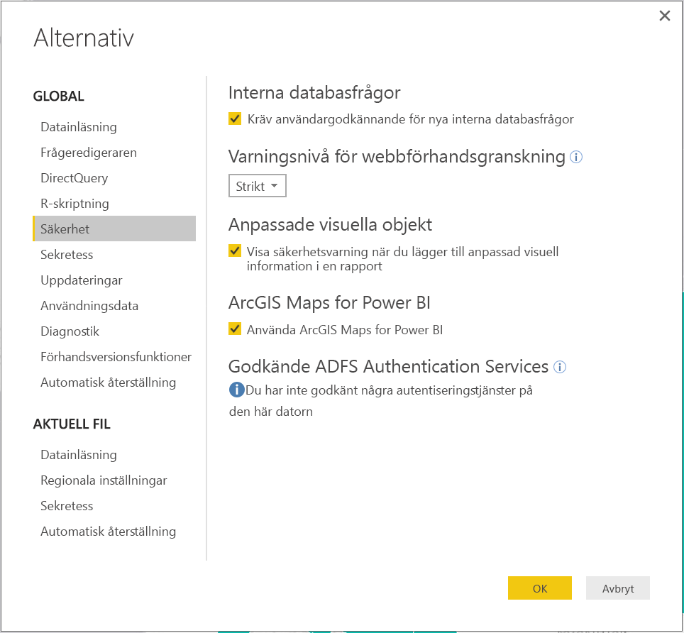

I Power BI-tjänsten kan användare sluta använda ArcGIS Maps för Power BI genom att inaktivera det på ArcGIS Maps för Power BI-fliken i användarinställningarna. När ArcGIS Maps är inaktiverat läses det inte in som standard.

**Alternativ för klientadministratörer** På PowerBI.com kan klientadministratörer förhindra alla klientanvändare från att använda ArcGIS Maps för Power BI genom att inaktivera det. När det händer visas inte längre ArcGIS Maps för Power BI-ikonen på panelen Visualiseringar i Power BI.

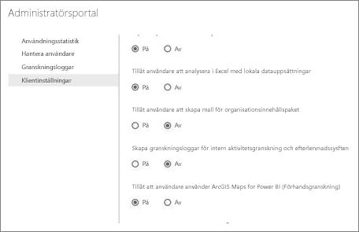

**Alternativ för IT-administratörer** Power BI Desktop stöder användning av **Grupprincip** för att inaktivera ArcGIS Maps för Power BI på en organisations distribuerade datorer.

<table>
<tr><th>Attribut</th><th>Värde</th>
</tr>
<tr>
<td>nyckel</td>
<td>Programvara\Principer\Microsoft\Power BI Desktop&lt;/td&gt;
</tr>
<tr>
<td>valueName</td>
<td>EnableArcGISMaps</td>
</tr>
</table>

Ett värde på 1 (decimal) aktiverar ArcGIS Maps för Power BI.

Ett värde på 0 (decimal) inaktiverar ArcGIS Maps för Power BI.

## Överväganden och begränsningar
ArcGIS Maps för Power BI finns tillgängligt i följande tjänster och appar:

<table>
<tr><th>Tjänst/app</th><th>Tillgängligt</th></tr>
<tr>
<td>Power BI Desktop</td>
<td>Ja</td>
</tr>
<tr>
<td>Power BI-tjänst (PowerBI.com)</td>
<td>Ja</td>
</tr>
<tr>
<td>Power BI Mobile-appar</td>
<td>Ja</td>
</tr>
<tr>
<td>Power BI Publicera på webben</td>
<td>Nej</td>
</tr>
<tr>
<td>Power BI Embedded</td>
<td>Nej</td>
</tr>
<tr>
<td>Power BI-tjänstinbäddning (PowerBI.com)</td>
<td>Nej</td>
</tr>
</table>

I tjänster eller program där ArcGIS Maps för Power BI inte är tillgängligt, visas visualiseringen som ett tomt visuellt objekt med Power BI-logotypen.

Vid geokodning av gatuadresser, geokodas enbart de första 1 500 adresserna. Geokodning av platsnamn eller länder omfattas inte av gränsen på 1 500 adresser.

 

**Hur fungerar ArcGIS Maps for Power BI?**
ArcGIS Maps for Power BI tillhandahålls av Esri (www.esri.com). Din användning av ArcGIS Maps for Power BI är föremål för Esris [villkor](https://go.microsoft.com/fwlink/?LinkID=8263222) och [sekretesspolicy](https://go.microsoft.com/fwlink/?LinkID=826323). Power BI-användare som vill använda de visuella objekten i ArcGIS Maps for Power BI måste ge sitt godkännande i dialogrutan (mer information finns i avsnittet Användargodkännande).  Användningen av ArcGIS Maps for Power BI från Esri är föremål för Esris villkor och sekretesspolicy. Det finns länkar till dessa från dialogrutan för godkännande. Alla användare måste ge sitt godkännande innan de kan börja använda ArcGIS Maps for Power BI. När användaren gett sitt godkännande skickas data som är kopplade till den visuella informationen till Esris tjänster för geokodning (eller mer), vilket innebär att platsinformationen omvandlas till latitud- och longitudinformation som kan visas på en karta. Utgå från att alla data som är kopplade till datavisualiseringen kan skickas till Esris tjänster. Esri tillhandahåller tjänster som grundläggande kartor, spatialanalyser, geokodning osv. De visuella objekten i ArcGIS Maps for Power BI samverkar med dessa tjänster genom en SSL-anslutning som skyddas av ett certifikat som tillhandahålls och hanteras av Esri. Mer information om ArcGIS Maps for Power BI finns på Esris [produktsida för ArcGIS Maps for Power BI](https://www.esri.com/powerbi).

När användare registrerar sig för en Plus-prenumeration på ArcGIS Maps for Power BI från Esri, upprättar de en direkt relation med Esri. Power BI skickar ingen personlig information om användaren till Esri. Användaren loggar in i och har förtroende för ett AAD-program som tillhandahålls av Esri med sin egen AAD-identitet. Därmed delar användaren sin personliga information direkt med Esri. När användaren lägger till Plus-innehåll till ett visuellt objekt i ArcGIS Maps for Power BI måste andra Power BI-användare också ha en Plus-prenumeration från Esri för att kunna visa eller redigera innehållet. 

Kontakta Esri via deras supportwebbplats om du har frågor som rör mer detaljerad teknisk information om hur Esris ArcGIS Maps for Power BI fungerar.

**Kostar det något att använda ArcGIS Maps för Power BI?**

ArcGIS Maps för Power BI är tillgängligt för alla Power BI-användare utan extra kostnad. Det är en komponent som tillhandahålls av **Esri** och din användning är föremål för de villkor och den sekretesspolicy som tillhandahålls av **Esri**, i enlighet med vad som nämnts tidigare i den här artikeln.

**Jag får ett felmeddelande i Power BI Desktop om att mitt cacheminne är fullt.**

Detta är ett programfel som vi håller på att åtgärda.  Under tiden kan du, för att rensa cacheminnet, försöka ta bort filer på den här platsen: C:\Användare\\AppData\Lokal\Microsoft\Power BI Desktop\CEF och sedan starta om Power BI.

**Stöder ArcGIS Maps för Power BI Esris Shapefiles?**

ArcGIS Maps för Power BI identifierar automatiskt standardgränser som länder/regioner, stater/provinser och postnummer. Om du behöver lägga till egna former kan du göra det med hjälp av [Shape Maps for Power BI Desktop (Preview) (Forma kartor för Power BI Desktop (förhandsversion))](desktop-shape-map.md).

**Kan jag visa mina ArcGIS-kartor offline?**

Nej, Power BI behöver nätverksanslutning för att visa kartor.

**Kan jag ansluta till mitt ArcGIS-onlinekonto från Power BI?**

Inte ännu. [Rösta på den här idén](https://ideas.powerbi.com/forums/265200-power-bi-ideas/suggestions/9154765-arcgis-geodatabases) så skickar vi dig ett e-postmeddelande när vi börjar arbeta på den här funktionen.  

## Nästa steg
[Interagera med en ArcGIS-karta som har delats med dig](power-bi-visualizations-arcgis.md)

[Blogginlägg som meddelar tillgängligheten för ArcGIS-kartor för Power BI](https://powerbi.microsoft.com/blog/announcing-arcgis-maps-for-power-bi-by-esri-preview/)

Har du fler frågor? [Fråga Power BI Community](http://community.powerbi.com/)

