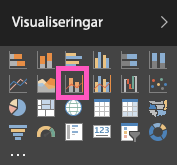

# Kombinationsdiagram i Power BI
I Power BI är ett kombinationsdiagram en enskild visualisering som kombinerar ett linjediagram med ett stapeldiagram. Om du kombinerar de två diagrammen till ett kan du göra en snabbare jämförelse av dina data.

Kombinationsdiagram kan ha en eller två Y-axlar.

## När du ska använda ett kombinationsdiagram
Kombinationsdiagram är ett bra alternativ:

* när du har ett linjediagram och ett stapeldiagram med samma X-axel,
* för att jämföra flera mått med olika värdeintervall,
* för att illustrera sambandet mellan två mätvärden i en visualisering,
* för att kontrollera om ett mätvärde uppfyller det mål som definieras av ett annat mätvärde,
* för att spara utrymme på arbetsytan.

### Förutsättningar
Kombinationsdiagram finns tillgängliga i Power BI-tjänsten och Power BI Desktop. Den här självstudien använder Power BI-tjänsten för att skapa ett kombinationsdiagram. Om du vill följa med, öppnar du Power BI-tjänsten och ansluter till exemplet Detaljhandelsanalys [anvisningar nedan](#create)).

## Skapa ett grundläggande kombinationsdiagram med en axel
Se hur Will skapar ett kombinationsdiagram med exemplet på försäljning och marknadsföring.

<iframe width="560" height="315" src="https://www.youtube.com/embed/lnv66cTZ5ho?list=PL1N57mwBHtN0JFoKSR0n-tBkUJHeMP2cP" frameborder="0" allowfullscreen></iframe>  

 Om du vill skapa ditt eget kombinationsdiagram, loggar du in på Power BI-tjänsten och väljer **Hämta data \> Exempel \> Exemplet detaljhandelsanalys > Anslut >Gå till instrumentpanel**.

1. Välj **Totalt antal butiker** från instrumentpanelen ”Exempel på detaljhandelsanalys” för att öppna rapporten ”Exempel på detaljhandelsanalys”.
2. Välj **Redigera rapport** för att öppna rapporten i redigeringsvyn.
3. [Lägg till en ny rapportsida](power-bi-report-add-page.md).
4. Skapa ett stapeldiagram som visar årets försäljning och bruttomarginal per månad.

    a.  Välj **Försäljning** \> **This Year Sales (Årets försäljning)** > **Värde** i fönstret Fält.

    b.  Dra **Försäljning** \> **Gross Margin This Year (Årets bruttomarginal)** till området **Värde**.

    c.  Välj **Tid**\>**FiscalMonth (Räkenskapsmånad)** och lägg till det i området **Axel**.

    
5. Välj ellipserna (...) i det övre högra hörnet av visualiseringen och välj **Sort by FiscalMonth (Sortera efter räkenskapsmånad)**. Du kan behöva välja den två gånger för att sortera stigande eller fallande.

6. Konvertera stapeldiagrammet till ett kombinationsdiagram. Välj **Linje- och grupperat stapeldiagram** i fönstret **Visualiseringar** med stapeldiagrammet markerat.

    
7. Från panelen **Fält** drar du **Försäljning** \> **Last Years Sales (Förra årets försäljning)** till behållaren **Radvärden**.

   

   Kombinationsdiagrammet bör se ut ungefär så här:

   

## Skapa ett kombinationsdiagram med två axlar
I det här steget ska vi jämföra bruttomarginal och försäljning.

1. Skapa ett nytt linjediagram som spårar **Bruttomarginal förra året %** efter **Månad**.  I januari var bruttomarginal % 35 %, med en topp på 45 % i april som sjönk i juli och fick ytterligare en topp igen i augusti. Ser vi ett liknande mönster för försäljningen föregående år och det här året?

   
2. Lägg till **This Year Sales (Årets försäljning) > Värde** och **Last Years Sales (Förra årets försäljning)** till linjediagrammet. Skalan för **Bruttomarginal förra året %** är mycket mindre än skalan för **Försäljning** vilket gör det svårt att jämföra.      

   
3. Konvertera linjediagrammet till ett Linjediagram och stående stapeldiagram om du vill göra det visuella objektet lättare att läsa och tolka.

   
4. Dra **Gross Margin% Last Year (Bruttomarginal % förra året)** från **Kolumnvärde** till **Radvärden**. Power BI skapar två axlar, vilket medför att datauppsättningarna kan skalas på olika sätt; den till vänster mäter dollar försäljning och den till höger procentandel.

       

## Lägga till rubriker på axlarna
1. Välj färgrollerikonen  för att öppna formateringsfönstret.
2. Välj nedpilen för att expandera alternativen för **y-axeln**.
3. För **Y-axel (kolumn)** anger du **Position** till **Vänster** och **Rubrik** till **På**,  **Format** till **Visa endast rubriken** och **Visa** som **Miljoner**.

   
4. Under **Y-axeln (kolumn)**, bläddrar du ned och kontrollerar att **Visa sekundär** är **På**. Detta visar alternativ för att formatera linjediagramsdelen i kombinationsdiagrammet.

   
5. För **Y-axeln (rad)** lämnar du **Position** som **Höger**, ställer in **Rubrik** till **På** och ställer in **Format** på **Visa endast rubriken**.

   Kombinationsdiagrammet visar nu dubbla axlar, båda med rubriker.

   

6. Du kan också ändra teckensnitt, storlek och färg och ställa in andra formateringsalternativ för att förbättra visning och läsbarhet av diagrammet.

Härifrån kan du vilja:

* [lägga till kombinationsdiagrammet som en panel på instrumentpanelen](service-dashboard-tiles.md),
* [Spara rapporten](service-report-save.md).

## Korsmarkering och korsfiltrering

Om du markerar en kolumn eller linje i ett kombinationsdiagram så korsmarkeras och korsfiltreras de övriga visualiseringarna på rapportsidan och vice versa. Använd [visuella interaktioner](service-reports-visual-interactions.md) för att ändra det här standardbeteendet.

## Nästa steg

[Översikt över visualiseringar i Power BI-rapporter](power-bi-report-visualizations.md)

[Visualiseringstyper i Power BI](power-bi-visualization-types-for-reports-and-q-and-a.md)

[Power BI – grundläggande begrepp](service-basic-concepts.md)

Har du fler frågor? [Prova Power BI Community](http://community.powerbi.com/)
