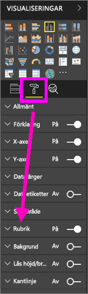
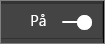
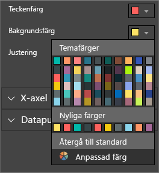
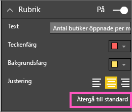
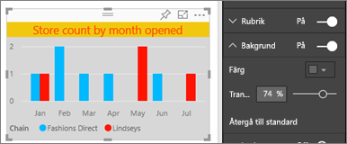
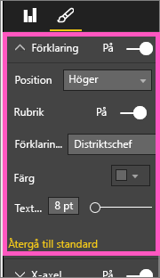
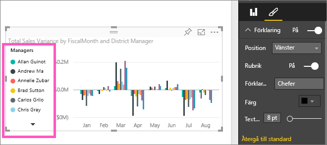

# Anpassa visualiseringens rubrik, bakgrund och förklaring (självstudier)
I den här självstudien lär du dig några olika sätt att anpassa dina visualiseringar.   Det finns många alternativ för att anpassa dina visualiseringar. Det bästa sättet att lära dig om alla är att utforska fönstret Formatering (välj roller-ikonen).  Om du vill komma igång visar i den här artikeln hur du anpassar en visualiserings rubrik, förklaring och bakgrund.  

Alla visualiseringar kan inte anpassas, [se den fullständiga listan](#list).  

Se Amanda anpassa visualiseringar i sin rapport (spola framåt till 4:50 i videon). Följ sedan instruktionerna under videon för att prova själv med dina egna data.

<iframe width="560" height="315" src="https://www.youtube.com/embed/IkJda4O7oGs" frameborder="0" allowfullscreen></iframe>

## Anpassa visualiseringstitlar i rapporter
Logga in till Power BI-tjänsten och öppna rapporten [Exempel på detaljhandelsanalys](sample-datasets.md) i [Redigeringsvyn](service-interact-with-a-report-in-editing-view.md).

> [!NOTE]
> När du fäster en visualisering på en instrumentpanel blir den en panel på instrumentpanelen.  Panelerna själva kan också anpassas med [nya rubriker och bildtexter, hyperlänkar samt ändra storlek](service-dashboard-edit-tile.md).
> 
> 

1. Gå till sidan ”Nya butiker” i rapporten och välj stapeldiagrammet ”Antal öppna butiker efter öppen månad...”.
2. I visualiseringspanelen väljer du färgrollerikonen för att visa formateringsalternativen.  och välj **rubrik** att expandera avsnittet.  
   
   
3. Aktivera och inaktivera **Rubrik** genom att välja på (eller av) med skjutreglaget. Lämna den **på** för tillfället.  
   
   
4. Ändra **rubriktexten** genom att skriva **Antal öppna butiker efter öppen månad** i textfältet.  
5. Ändra **Teckenfärg** till orange och **bakgrundsfärg** till gult.
   
   * Välj i listrutan och välj en färg från **temafärger**, **Senaste färger** eller **Anpassade färger**.
   * Välj i listrutan för att stänga färgfönstret.  
     
   
   Du kan alltid återgå till sidan genom att välja **Återgå till standard** i färgfönstret.
6. Öka textstorleken till 12.
7. Den sista anpassningen i diagrammet är att vi ändrar rubriken så att den befinner sig i mitten. Som standard är rubriken vänsterjusterad.  
   
   
    I detta läge i självstudierna bör det stående stapeldiagrammets **Rubrik** se ut ungefär så här:  
    
   
    Om du vill återställa alla anpassningar av rubriken som du har gjort hittills väljer du **återgå till standard** längst ned i anpassningsfönstret för **Rubrik**.  
    

## Anpassa visualiseringens bakgrund
Expandera alternativet Bakgrund i samma stapeldiagram.

1. Aktivera och inaktivera bakgrunden genom att välja på (eller av) med skjutreglaget. Lämna den **på** för tillfället.
2. Ändra bakgrundsfärgen till 74 % grå.
   
   * Välj i listrutan och välj en grå färg från **temafärger**, **Senaste färger** eller **Anpassade färger**.
   * Ändra genomskinligheten till 74 %.   
     
   
   Om du vill återställa alla anpassningar av bakgrunden som du har gjort hittills väljer du **återgå till standard** längst ned i anpassningsfönstret för **Bakgrund**.

## Anpassa visualiseringens förklaringar
1. Öppna rapportsidan **Översikt** och välj diagrammet”Total Sales Variance by FiscalMonth and District Manager”.
2. Välj penselikonen för att öppna formateringsfönstret på visualiseringsfliken.  
3. Visa **förklaring**salternativ.
   
      
4. Aktivera och inaktivera förklaringargenom att välja på (eller av) med skjutreglaget. Lämna den **på** för tillfället.
5. Flytta förklaringen till vänster sida av visualiseringen.    
6. Lägg till en förklaringsrubrik genom att växla **Rubrik** till **på** och skriva **Chefer** i fältet **förklaringens namn**.
   
   
   Om du vill återställa alla anpassningar av förklaringen som du har gjort hittills väljer du **återgå till standard** längst ned i anpassningsfönstret för **Förklaring**.

## Visualiseringstyper som kan anpassas
| Visualisering | Rubrik | Bakgrund | Förklaring |
|:--- |:--- |:--- |:--- |
| område |ja |ja |ja |
| stapel |ja |ja |ja |
| kort |ja |ja |saknas |
| flerradskort |ja |ja |saknas |
| kolumn |ja |ja |ja |
| kombination |ja |ja |ja |
| toroid |ja |ja |ja |
| ifylld karta |ja |ja |ja |
| funnel |ja |ja |saknas |
| gauge |ja |ja |saknas |
| kpi |ja |ja |saknas |
| linje |ja |ja |ja |
| karta |ja |ja |ja |
| matris |ja |ja |saknas |
| cirkel |ja |ja |ja |
| punkt |ja |ja |ja |
| utsnitt |ja |ja |saknas |
| tabell |ja |ja |saknas |
| textruta |nej |ja |saknas |
| trädkarta |ja |ja |ja |
| vattenfall |ja |ja |ja |

## Nästa steg
Mer om [Visualiseringar i Power BI-rapporter](power-bi-report-visualizations.md)  
[Anpassa x-axeln och y-axeln](power-bi-visualization-customize-x-axis-and-y-axis.md)  
[Anpassa färger och axelegenskaper](service-getting-started-with-color-formatting-and-axis-properties.md)  
[Power BI – grundläggande begrepp](service-basic-concepts.md)  
Har du fler frågor? [Prova Power BI Community](http://community.powerbi.com/)

