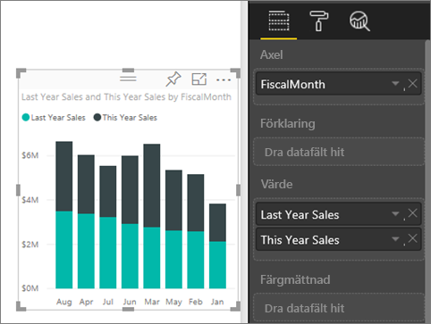
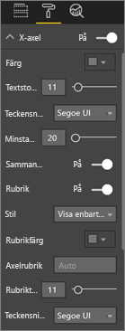
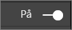
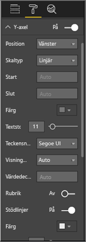
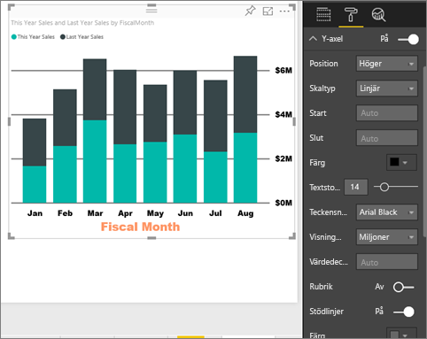
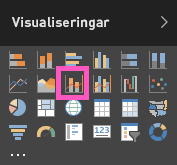
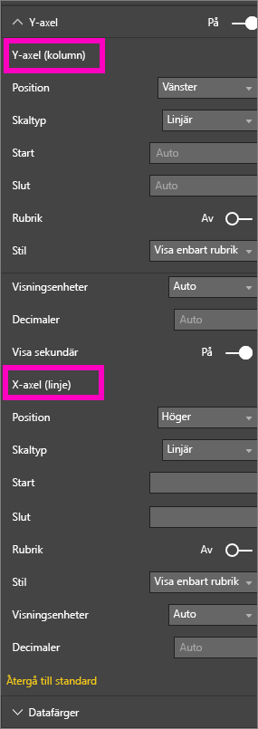
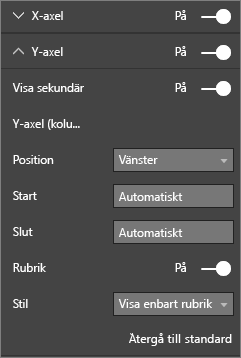

# Anpassa egenskaper för x-axeln och y-axeln (Självstudier)
I den här kursen lär du dig många olika sätt att anpassa x-axeln och y-axeln i visuella objekt. Det är inte alla axlar som kan anpassas. Cirkeldiagram, till exempel, har inga axlar. Anpassningsalternativen kan också variera från ett visuellt objekt till ett annat och det finns för många alternativ för att täcka dem i en enda artikel. Så tar vi en titt på några av de mest använda axelanpassningarna så att du kan vänja dig vid att använda fliken visuell formatering i arbetsytan för Power BI-rapporter.  

> [!NOTE]
> Det här avsnittet gäller för både Power BI-tjänsten och Power BI Desktop. Dessa anpassningar är tillgängliga när ikonen **Format** (rollerikonen  ) är markerad, och de är också tillgängliga i Power BI Desktop.  
>
>

Se hur Amanda anpassar sina X- och Y-axlar och visar olika sätt att styra sammanfogning när du ändrar detaljnivån uppåt och nedåt. Prova sedan själv genom att följa de stegvisa anvisningarna under videon med exemplet på Detaljhandelsexemplet.

<iframe width="560" height="315" src="https://www.youtube.com/embed/9DeAKM4SNJM" frameborder="0" allowfullscreen></iframe>

## Anpassade x-axlar i visuella objekt i rapporter
## Skapa en stapeldiagram-visualisering
Logga in till Power BI-tjänsten och öppna rapporten **Retail analys exempel** (detaljhandel) i [Redigeringsvyn](service-interact-with-a-report-in-editing-view.md). Om du vill följa med, kan du ansluta [exemplet för detaljhandelsanalys](sample-datasets.md).

1. Skapa ett ny stapeldiagram som visar försäljningen för det här året och förra årets försäljningsvärden enligt räkenskapsmånad.
2. Konvertera det till ett stående stapeldiagram.

    

## Anpassa X-axeln
1. I rutan visualiseringar och filter väljer du **Format** (roller ikonen  ) för att visa anpassningsalternativ.
2. Alternativ för att expandera X-axlarna.

   
3. Aktivera och inaktivera X-axeln genom att välja på (eller av) med skjutreglaget. Lämna den **på** för tillfället.  Du kanske vill stänga av X-axeln för att spara utrymme för mer data.

    
4. Formatera textfärg, storlek och teckensnitt. I det här exemplet är **textfärgen** svart, **textstorleken** 14 och **teckensnittet** Arial Black.  
5. Slå **På** rubriker för x-axeln och visa namnet på x-axeln – i det här fallet **FiscalMonth**.  
6. Formatera rubrikens textfärg, storlek och teckensnitt.  I det här exemplet är **rubrikfärgen** till orange, **axelrubriken** har ändrats till **räkenskapsmånad**, och **rubriktextstorleken** är 21.
7. För att sortera enligt räkenskapsmånad väljer du ellipser (...) i det övre högra hörnet av diagrammet och välj **Sort by FiscalMonth (Sortera efter räkenskapsmånad)**.

    Efter dessa anpassningar bör ditt stående stapeldiagram se ut ungefär så här:

     

Om du vill återställa alla anpassningar av x-axeln som du har gjort hittills väljer du **återgå till standard** längst ned i anpassningsfönstret för **x-axeln**.

## Anpassa Y-axeln
1. Alternativ för att expandera Y-axeln.

   

2. Aktivera och inaktivera Y-axeln genom att välja på (eller av) med skjutreglaget. Lämna den **på** för tillfället.  Du kan vilja stänga av Y-axeln för att spara utrymme för mer data.
   
    
3. Flytta y-axelns **Position** till höger.
4. Formatera textfärg, storlek och teckensnitt. I det här exemplet är **textfärgen** svart, **textstorleken** 14 och **teckensnittet** Arial Black.  
5. Behåll inställningen **Visa enheter** på miljoner och **Antal decimaler** på noll.
6. För det här visuella objektet förbättras inte visualiseringen av en rubrik för Y-axeln, så vi stänger av **Rubriken**.  
7. Vi behöver kontrollera stödlinjerna genom att ändra **Färgen** till en mörk grå och ökande **Toning** till 2.

    Efter dessa anpassningar bör ditt stående stapeldiagram se ut ungefär så här:

     

## Anpassa visuella objekt med två Y-axlar
Först måste du skapa ett kombinationsdiagram som visar hur antalet butiker påverkar försäljningen.  Det här är samma diagram som har skapats i den [kursen om kombinationsdiagram](power-bi-visualization-combo-chart.md). Sedan ska du formatera de två Y-axlarna.

### Skapa ett diagram med två Y-axlar
1. Skapa ett nytt linjediagram som spårar **Försäljning >Bruttomarginal %** förra året per **Tid > bokföringsmånad**.
2. Sortera visuella objekt per månad genom att markera ellipserna (...) och därefter **Sortera efter månad**

    

>[NOTE]: For help sorting by month, see [sorting by other criteria](power-bi-report-change-sort.md#other)
1. I januari var bruttomarginal % 35 %, med en topp på 45 % i april som sjönk i juli och fick ytterligare en topp igen i augusti. Ser vi ett liknande mönster för försäljningen föregående år och det här året?
2. Lägg till **This Year Sales (Årets försäljning) > Värde** och **Last Years Sales (Förra årets försäljning)** till linjediagrammet. Skalan för **GM% Last Year (Bruttomarginal % förra året)** (den blå linjen som löper längst med rutnätslinjen för 0M %) är mycket mindre än skalan för **Försäljning**, vilket gör det svårt att jämföra. Och Y-axelns etikettprocenttal är märkliga.      

   
5. Konvertera linjediagrammet till ett Linjediagram och stående stapeldiagram om du vill göra det visuella objektet lättare att läsa och tolka.

   

6. Dra **Gross Margin% Last Year (Bruttomarginal % förra året)** från **Kolumnvärde** till **Radvärden**. Nu har vi det stående stapeldiagram som vi skapade ovan ***plus*** ett linjediagram.  (Du kan också använda vad du lärde dig ovan för att formatera axlarnas teckenfärg och storlek.)
   

   Power BI skapar två axlar, vilket medför att datauppsättningarna kan skalas på olika sätt; den till vänster mäter dollar och den till höger procentandel.

   

### Formatera den sekundära y-axeln
1. I **visualiseringspanelen** väljer du färgrollerikonen för att visa formateringsalternativen.
2. Välj nedpilen för att expandera alternativen för y-axeln.
3. Bläddra i listan tills du hittar alternativ för **Visa sekundära**. Växla **Visa sekundära** från **Av** till **På**.

   

   
4. (Valfritt) Anpassa två axlar. Om du växlar **Position** för axelns kolumn eller radaxeln. Det går de två axlarna att växla sidor.

   

### Lägga till rubriker på axlarna
Med ett så komplicerat visuellt objekt hjälper det att lägga till axelrubriker.  Med titlar kan dina kollegor förstå vad ditt visuella objekt försöker berätta.

1. Växla **Rubrik** till **På** för **Y-axeln (kolumn)** och **X-axeln (rad)**.
2. Ange **Stil** för att **Endast visa rubriken**.

   
3. Kombinationsdiagrammet visar nu dubbla axlar, båda med rubriker.

   

Mer information finns i [Tips och råd om färgformatering, etiketter och axelegenskaper](service-tips-and-tricks-for-color-formatting.md).

## Överväganden och felsökning
Om x-axeln kategoriseras av rapportens ägare som en datumdatatyp kommer alternativet **Typ** att visas och du kan välja mellan kontinuerlig eller kategorisk.

## Nästa steg
Mer om [Visualiseringar i Power BI-rapporter](power-bi-report-visualizations.md)

[Anpassa r](power-bi-visualization-customize-title-background-and-legend.md)[ubriker, bakgrunder och förklaringar](power-bi-visualization-customize-title-background-and-legend.md)

[Anpassa färger och axelegenskaper](service-getting-started-with-color-formatting-and-axis-properties.md)

[Power BI – grundläggande begrepp](service-basic-concepts.md)

Har du fler frågor? [Prova Power BI Community](http://community.powerbi.com/)
