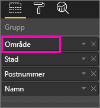
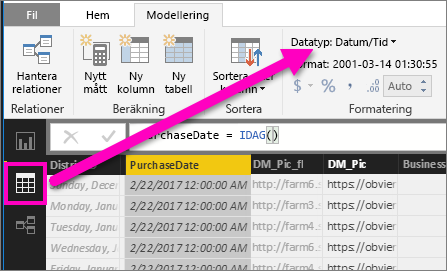

# Öka detaljnivån i en visualisering i Power BI
## Detaljnivån kräver en hierarki
När en visualisering har en hierarki kan du öka detaljnivån till att visa ytterligare information. Du kan till exempel ha en visualisering som kontrollerar OS-medaljantal enligt en hierarki som består av sport, gren och evenemang. Som standard visar visualiseringen medaljantal enligt sport – gymnastik, skidåkning, vattensport osv. Men eftersom den har en hierarki, skulle val av ett av de visuella elementen (till exempel ett stapel-, linje- eller bubbeldiagram), visa en allt mer detaljerad bild. Välj elementet **vattensporter** för att se data för simning, simhopp och vattenpolo.  Välj elementet **simhopp** för att visa detaljer för trampolin, plattform och synkroniserade simhopp.

Du kan lägga till hierarkier till rapporter som du äger men inte till de som delats med dig.
Är du osäker på vilka Power BI-visualiseringar som innehåller en hierarki?  Hovra över en visualisering och om du ser dessa kontroller för ökad detaljnivå i de övre hörnen, har din visualiseringen en hierarki.

    
   

Datum är en unik typ av hierarki. När du lägger till ett datumfält i en visualisering lägger Power BI automatiskt till en tidshierarki som innehåller år, kvartal, månad och dag. Mer information finns i [Visuella hierarkier och beteende för ökad detaljnivå](guided-learning/visualizations.yml?tutorial-step=18) eller titta på videon nedan.

  <iframe width="560" height="315" src="https://www.youtube.com/embed/MNAaHw4PxzE?list=PL1N57mwBHtN0JFoKSR0n-tBkUJHeMP2cP" frameborder="0" allowfullscreen></iframe>

> [!NOTE]
> Om du vill lära dig mer om att skapa hierarkier med hjälp av Power BI Desktop, titta på videon [Hur du skapar och lägger till hierarkier](https://youtu.be/q8WDUAiTGeU)
> 
> 

## Två metoder för att öka detaljnivån
Det finns två olika sätt att öka (och minska) detaljnivån i din visualisering.  Båda beskrivs i den här artikeln. Båda metoderna gör samma sak, så använd den du gillar mest.

> [!NOTE]
> För att följa med, [öppna exemplet för detaljhandelsanalys](sample-datasets.md) i Power BI-tjänsten och skapa ett treemap-diagram som kontrollerar (värdena) **totala enheter detta år** enligt (grupperna) **Område**, **Stad**, **Postnummer** och **Namn**.  
> 
> 

## Metod ett för ökad detaljnivå
Den här metoden använder de ikoner för ökad detaljnivå som visas de i övre hörnen av själva visualiseringen.

1. I Power BI, öppnar du en rapport i [Läsvyn eller Redigeringsvyn](service-reading-view-and-editing-view.md). Ökad detaljnivå kräver en visualisering med en hierarki. 
   
   En hierarki visas i animeringen nedan.  Visualiseringen har en hierarki som består av område, stad, postnummer och stadsnamn. Varje område har en eller flera städer, varje stad har ett eller flera postnummer osv. Visualiseringen visar som standard endast områdesdata, eftersom *Område* visas först i listan.
   
   
2. Om du vill aktivera ökad detaljnivå väljer du pilikonen längst upp till höger i visualiseringen. När ikonen är mörk är ökad detaljnivå aktiverat. Om du inte aktiverar ökad detaljnivå, kommer valet av ett visuellt element (till exempel ett stapel- eller bubbeldiagram) att korsfiltrera diagrammen på sidan.    
   
   
3. Om du vill öka detaljnivån **ett fält i taget** väljer du ett av elementen i visualiseringen. I ett stapeldiagram innebär det att klicka på någon av staplarna. I en trädkarta innebär det att klicka på något av **bladen**. Observera att rubriken ändras när du ändrar detaljnivån ner och upp igen. I den här animeringen ändras den från ”Totalt antal enheter i år enligt område” till ”totalt antal enheter i år enligt område och stad”, och sedan till ”Totalt antal enheter i år enligt område, stad och postnummer” till ”totalt antal enheter i år enligt område, stad, postnummer och namn”. Om du vill minska detaljnivån igen väljer du ikonen för **minskad detaljnivå** längst upp till vänster i visualiseringen, enligt bilden nedan.
   
   
4. Om du vill öka detaljnivån för ***alla fält samtidigt*** väljer du dubbelpilen längst upp till vänster i visualiseringen.
   
   
5. Om du vill minska detaljnivån igen väljer du uppåtpilen i det övre vänstra hörnet av visualiseringen.
   
   

## Metod två för ökad detaljnivå
I den här metoden använder du listrutan **Utforska** på den översta menyraden i Power BI.

1. I Power BI, öppnar du en rapport i [Läsvyn eller Redigeringsvyn](service-reading-view-and-editing-view.md). Ökad detaljnivå kräver en visualisering med en hierarki. 
   
   En hierarki visas på bilden nedan.  Visualiseringen har en hierarki som består av område, stad, postnummer och stadsnamn. Varje område har en eller flera städer, varje stad har ett eller flera postnummer osv. Visualiseringen visar som standard endast områdesdata, eftersom *Område* visas först i listan.
   
   
2. Om du vill aktivera ökad detaljnivå väljer du en visualisering för att göra den aktiv från den övre menyraden i Power BI och väljer **Utforska** > **Ökad detaljnivå**. Ikonen för ökad detaljnivå i det övre högra hörnet av visualiseringen ändras till en svart bakgrund.   
   
   
3. Då aktiverad, kan du öka detaljnivån ett fält i taget genom att välja ett av bladen i treemap-diagrammet. I det här exemplet har området som heter **NC** valts för att visa det totala antalet sålda enheter i år i North Carolina enligt stad.
   
   
4. Om du vill öka detaljnivån för alla fält samtidigt, väljer du **Utforska** > **Visa nästa nivå**.
   
   
5. Om du vill gå tillbaka upp, väljer du **Utforska** > **Minskad detaljnivå**.
   
   

6. Om du vill se de data som används för att skapa visualiseringar väljer du **Se data**. Data visas i ett fönster nedanför den visuella informationen. Det här fönstret är kvar när du fortsätter att gå igenom den visuella informationen. Mer information finns i [Visa data som används för att skapa visuell information](service-reports-show-data.md).

## Förstå hierarkins axel och grupp
Hierarkiaxeln och hierarkigruppen är mekanismer du kan använda för att öka och minska granulariteten för data som du vill visa. Data som kan ordnas i kategorier och underkategorier anses ha en hierarki. Detta omfattar naturligtvis datum och tider.

Du kan skapa en visualisering i Power BI som har en hierarki genom att välja ett eller flera datafält som läggs till i området **Axel** eller **Grupp**, tillsammans med data som du vill granska som datafält i området **Värden**. Dina data är hierarkiska om detaljnivåikonerna visas längst upp till vänster och höger i visualiseringen. 

Det enklaste är att tänka på det som två typer av hierarkiska data:
- Datum- och tidsdata – om du har ett datafält med datatypen DateTime har du redan hierarkiska data. Power BI skapar automatiskt en hierarki för alla datafält vars värden kan parsas i en [DateTime](https://msdn.microsoft.com/library/system.datetime.aspx)-struktur. Du behöver bara lägga till ett DateTime-fält i området **Axel** eller **Grupp**.
- Kategoridata – om dina data hämtas från samlingar som innehåller delsamlingar, eller har rader med data med gemensamma värden, har du hierarkiska data.

Med Power BI kan du expandera en eller alla delmängder. Du kan öka detaljnivån i dina data för att visa en enda delmängd på varje nivå, eller alla delmängder samtidigt på varje nivå. Du kan till exempel öka detaljnivån för ett visst år eller visa alla resultat för varje år nedåt i hierarkin. Du kan också minska detaljnivån på samma sätt.

I avsnitten nedan beskrivs ökad detaljnivå från den högsta vyn, mellanvyn och den lägsta vyn.

### Hierarkiska data och tidsdata
I det här exemplet kan du följa med i vårt [exempel på detaljhandelsanalys](sample-datasets.md) och skapa en visualisering av ett stående stapeldiagram med fokus på **Månad** (Axel) och **Total försäljning** (Värden).  

Även om datafältet Axel är **Månad** skapar det en **årskategori** i området **Axel**. Det beror på att Power BI ger en fullständig DateTime-struktur för alla värden som läses. Högst upp i hierarkin visas årets data.

Med läget för ökad detaljnivå aktiverat klickar du på stapeln i diagrammet för att gå nedåt en nivå i hierarkin. Tre staplar för data för de tillgängliga kvartalen visas. Bland ikonerna uppe till vänster väljer du alternativet för att **expandera allt nedåt en nivå i hierarkin**. Upprepa detta för att komma till nivån längst ner i hierarkin som visar resultat för varje månad.

Förutom visualiseringen kan vi se att hierarkin återspeglas i de data som återges för varje rapport. I följande tabell visas resultaten för att **Visa data** i en rapport med ökad detaljnivå från en månad eller alla månader. 

Observera att informationen är den samma för kvartals- och årsrapporter, men när du ökar detaljnivån till nivån för **Värden** ser du att den enkla rapporten är mer specifik, och att rapporten för alla månader innehåller mer data.

|Läget Expandera|År|Kvartal|Månad|Dag|
| ---|:---:|:---:|:---:|---|
|Enkel|||||
|Alla|||||

### Hierarkiska kategoridata
Data som har modellerats från samlingar och delsamlingar är hierarkiska. Ett bra exempel på detta är platsdata. Anta att du har en tabell i en datakälla med kolumner för land, region, stad och postnummer. Data som delar samma land, region och stad är hierarkiska.

I det här exemplet kan du följa med i [exemplet för detaljhandelsanalys](sample-datasets.md). Skapa en visualisering av ett stående stapeldiagram med fokus på **Totalt antal enheter i år** (Värden) enligt **Område**, **Stad**, **Postnummer** och **Namn** (Grupp).  

Se till att läget för ökad detaljnivå är aktiverat. Bland ikonerna längst upp till vänster väljer du alternativet för att **expandera allt nedåt en nivå i hierarkin** tre gånger.
Du ska nu vara på nivån längst ner i hierarkin, som visar resultat för område, stad och postnummer.

Förutom visualiseringen kan vi se att hierarkin återspeglas i de data som återges för varje rapport. I följande tabell visas resultaten för att **Visa data** i en rapport med ökad detaljnivå för ett område och alla områden. När du ökar detaljnivån kan du se hur den enkla rapporten blir mer specifik och att rapporten med alla områden innehåller mer data.

| Läget Expandera|Område|Stad|Postnummer|Namn|
| ---|:---:|:---:|:---:|---|
|Enkel|||||
|Alla|||||

## Överväganden och begränsningar
* Om tillägget av ett datumfält i en visualisering inte skapar en hierarki, kan det bero på att ”datum”-fältet faktiskt inte har sparats som ett datum. Om du äger datauppsättningen, öppna den i vyn *Data* i Power BI Desktop, välj den kolumn som innehåller datum och välj fliken Modellering och ändra **Datatyp** till **Datum** eller **Datum/Tid**. Om rapporten har delats med dig, kontakta ägaren om du vill begära ändringen.  
  
  

## Nästa steg
[Visualiseringar i Power BI-rapporter](power-bi-report-visualizations.md)

[Power BI-rapporter](service-reports.md)

[Power BI – grundläggande begrepp](service-basic-concepts.md)

Har du fler frågor? [Prova Power BI Community](http://community.powerbi.com/)

