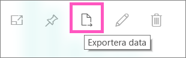
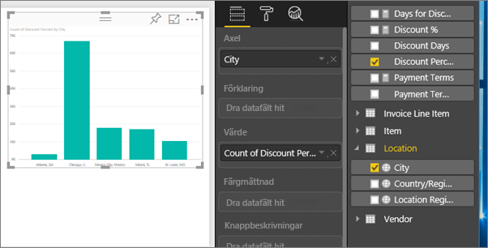
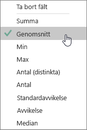
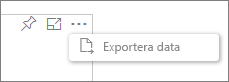
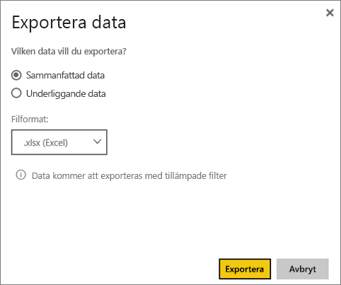

# Exportera data från visualiseringar
Om du vill se de data som används i en visualisering, kan du [visa dessa data i Power BI](service-reports-show-data.md) eller exportera data till Excel som en XLSX- eller CSV-fil.   

Här kan du se Will exportera data från en visualisering i sin rapport, spara den som .xlsx-fil och öppna den i Excel. Prova sedan själv genom att följa de stegvisa anvisningarna under videon.

<iframe width="560" height="315" src="https://www.youtube.com/embed/KjheMTGjDXw" frameborder="0" allowfullscreen></iframe>

## Från en visualisering på en Power BI-instrumentpanel
1. Välj ellipserna i det övre högra hörnet i visualiseringen.
   
    
2. Välj ikonen **Exportera data**.
   
    
3. Data exporteras till en csv-fil. Om visualiseringen filtreras kommer också nedladdade data att filtreras.
4. Din webbläsare uppmanar dig att spara filen.  När du sparat den ska du öppna .csv-filen i Excel.
   
    

## Från en visualisering i en rapport
Om du vill följa med kan öppna [exempelrapporten för anskaffningsanalys ](sample-procurement.md) i [Redigeringsvyn](service-reading-view-and-editing-view.md). [Lägg till en tom rapportsida](power-bi-report-add-page.md). Följ stegen nedan för att lägga till en samling och ett filter på visualiseringsnivå.

1. Skapa ett nytt stapeldiagram.  Från fönstret fält väljer du **Plats > Ort** och **Faktura > Rabattprocent**.  Du kan behöva flytta **Rabattprocent** till värdet. 
   
    
2. Ändra sammanställningen för **Rabattprocent** från **Antal** till **Medelvärde**. I värdet väljer du pilen till höger om **Rabattprocent** (det kan stå **Antal rabattprocent**) och sedan **Medelvärde**.
   
    
3. Lägg till ett filter i **Stad** att ta bort **Atlanta**.
   
   
   
   Vi är nu redo att testa båda alternativen för dataexport.
4. Välj ellipserna i det övre högra hörnet i visualiseringen. Välj **Exportera data**.
   
   
5. Om din visualiseringen har en mängd (ett exempel är om du har ändrat **Antal** till *Medelvärde*, **Summa** eller *Minimivärde*), har du två alternativ: **sammanfattade data** och **underliggande data**. För mer information om att förstå mängder kan du läsa [Mängder i Power BI](service-aggregates.md).
   
    
6. Välj **Sammanfattade data** > **Exportera** och välj .xlsx eller .csv. Power BI exporterar data.  Om du har tillämpat filter på visualiseringen exporteras data enligt filtret. När du väljer **Exportera** får du ett meddelande om att spara filten från webbläsaren. Öppna filen i Excel när du har sparat den.
   
   **Sammanfattade data**: Välj det här alternativet om du inte har en mängd eller om du har en mängd men vill inte se en fullständig uppdelning. Till exempel, om du har ett stapeldiagram med 4 staplar kommer du att få 4 rader med data. Sammanfattade data är tillgängliga som .xlsx och .csv.
   
   I det här exemplet visar vår Excel-export en summa för varje ort. Atlanta ingår inte i resultaten eftersom vi har filtrerat det.  Den första raden i vårt kalkylblad visar de filter som användes när data extraherades från Power BI.
   
   
7. Prova att välja **Underliggande data** > **Exportera** och välj .xlsx. Power BI exporterar data. Om du har tillämpat filter på visualiseringen exporteras data enligt filtret. När du väljer **Exportera** får du ett meddelande om att spara filten från webbläsaren. Öppna filen i Excel när du har sparat den.
   
   >[!WARNING]
   >När du exporterar underliggande data kan användare se alla detaljerade data – alla information i datakolumnerna. Power BI administratörer kan inaktivera detta för organisationen. Om du äger datauppsättningen kan du ställa in dina egna kolumner på ”dolda” så att de inte visas i listan Fält i Desktop eller Power BI-tjänsten.
   
   
   **Underliggande data**: Välj detta alternativ om din visualisering har en mängd och du vill se all underliggande information. I princip tas mängden bort om du väljer *Underliggande data*. När du väljer **Exportera**, exporteras data till en xlsx-fil och webbläsaren uppmanar dig att spara filen. Öppna filen i Excel när du har sparat den.
   
   I det här exemplet visar vår Excel-export en rad för varje Stadsrad i vår datauppsättning och rabattprocent för den posten. Med andra ord omvandlas data från en mängd till en detaljerad vy. Den första raden i vårt kalkylblad visar de filter som användes när data extraherades från Power BI.  
   
   

## Begränsningar och överväganden
* Det maximala antalet rader som kan exporteras från **Power BI Desktop** och **Power BI-tjänsten** till .csv är 30 000.
* Det maximala antalet rader som kan exporteras till .xlsx är 150 000.
* Export med *Underliggande data* fungerar inte om datakällan är en Analysis Services-liveanslutning och versionen som är äldre än 2016 och tabellerna i modellen inte har en unik nyckel.  
* Export med *Underliggande data* fungerar inte om alternativet *Visa objekt utan data* är aktiverat för visualiseringen som exporteras.
* När du använder DirectQuery är den maximala mängden data som kan exporteras 16 MB. Därmed kan mindre än det maximala antalet rader exporteras, särskilt om det finns många kolumner, data som är svåra att komprimera eller andra faktorer som påverkar filstorleken och minskar antalet rader som exporteras.
* Power BI har endast stöd för att exportera visuella objekt som använder enkla aggregationer. Exportera är inte tillgänglig för grafer med modeller eller rapportmått.
* Anpassade och R-visualiseringar stöds inte för tillfället.
* Exportera data är inte tillgängligt för användare utanför organisationen som använder en instrumentpanel som har delats med dem. 
* Om det finns unicode-tecken i .csv-filen, visas texten inte korrekt i Excel. Men det går bra att öppna den i Anteckningar. Valutasymboler och främmande ord är exempel på unicode-tecken. Lösningen för detta är att importera CSV-filen i Excel, i stället för att öppna CSV-filen direkt. Gör så här:
  
  1. Öppna Excel
  2. Från fliken **Data** väljer du **Hämta externa data** > **Från text**.
* Power BI-administratörer har möjlighet att inaktivera export av data.

## Nästa steg
[Instrumentpaneler i Power BI](service-dashboards.md)  
[Rapporter i Power BI](service-reports.md)  
[Power BI – grundläggande begrepp](service-basic-concepts.md)

Har du fler frågor? [Fråga Power BI Community](http://community.powerbi.com/)

