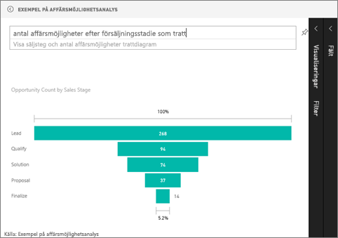

# Trattdiagram (självstudier)
Med ett trattdiagram kan du visualisera en linjär process med intilliggande steg. Ett trattdiagram över försäljning som följer kunderna genom stadier: \>Uppslag \> Uppslag med potential \> Kontrakt \> Sälj.  Trattens form ger en översikt över processens tillstånd.

Varje steg i trattens motsvarar en procentandel av det totala antalet. I de flesta fallen är ett trattdiagram format som en tratt, där det första stadiet är störst och varje följande steg är mindre än det föregående.  En päronformad tratt kan också vara användbar – den kan identifiera ett problem i processen.  Men vanligtvis är det första stadiet, ”intaget”, det största.

## När du ska använda ett trattdiagram
Trattdiagram är ett bra alternativ:

* När data är sekventiella och går genom minst 4 steg.
* När antalet ”objekt” i det första steget förväntas vara större än antalet i det sista steget.
* Om du vill beräkna potential (intäkter, försäljning, erbjudanden osv) i etapper.
* Om du vill beräkna och spåra konvertering och kvarhållning.
* Om du vill avslöja flaskhalsar i en linjär process.
* Om du vill spåra arbetsflödet i en kundvagn.
* Om du vill spåra förloppet och resultaten a en klickbaserad reklam-/marknadsföringskampanj.

## Arbeta med trattdiagram
Trattdiagram:

* Kan fästas från rapporter och frågor och svar.
* Kan sorteras.
* Stöd för multipler.
* Kan markeras och korsfiltreras mot andra visualiseringar på samma rapportsida.
* Kan användas för markera och korsfiltrera andra visualiseringar på samma rapportsida.

## Skapa ett enkelt trattdiagram
Se hur Will skapar ett trattdiagram med exemplet på försäljning och marknadsföring i den här videon.

<iframe width="560" height="315" src="https://www.youtube.com/embed/maTzOJSRB3g" frameborder="0" allowfullscreen></iframe>

Nu kan du skapa ett eget trattdiagram som visar antalet möjligheter i varje försäljningsstadium.

Dessa anvisningar använder sig av Exempel på affärsmöjlighetsanalys. Följ med i instruktionerna genom att [hämta exemplet](sample-datasets.md), logga in till Power BI och välja **Hämta data \> Exempel \> Exempel på affärsmöjlighetsanalys \> Anslut**.

1. Starta på en [tom rapportsida ](power-bi-report-add-page.md)i [redigeringsvyn](service-interact-with-a-report-in-editing-view.md) och välj fältet **SalesStage** \> **Försäljningssteg**.  
   
    
2. [Konvertera diagrammet](power-bi-report-change-visualization-type.md) till en tratt. Observera att **Försäljningssteg** är i brunnen **Grupp**. 
3. Från fönstret **Fält** väljer du **Fakta** \> **Antal affärsmöjligheter**.
   
    
4. Håll muspekaren över en stapel för att visa en mängd information.
   
   * Stegets namn
   * Antalet affärsmöjligheter som finns i det här steget just nu
   * Övergripande konverteringstakt (% av leads) 
   * Steget-till-steg (kallas även förlusttakt) som är % av det föregående steget (i det här fallet förslagssteg/lösningssteg)
     
     
5. [Lägg till tratten som panel i instrumentpanelen](service-dashboard-tiles.md). 
6. [Spara rapporten](service-report-save.md).

## Markering och korsfiltrering
Information om hur du använder filterfönstret finns i [Lägg till ett filter i en rapport](power-bi-report-add-filter.md).

Om du markerar ett fält i trattdiagrammet korsfiltreras de övriga visualiseringarna på rapportsidan, och vice versa. Följ med och lägg till ytterligare några visuella objekt på rapportsidan som innehåller trattdiagrammet.

1. Välj fältet **Förslag** i trattdiagrammet. Detta korsmarkerar de övriga visualiseringarna på sidan. Använd CTRL för att välja flera.
   
   
2. För att hantera hur diagram korsmarkeras och korsfiltrerar varandra, se [Visualiseringsinteraktioner i en Power BI-rapport](service-reports-visual-interactions.md)

## Skapa ett trattdiagram i frågor och svar
Markera en instrumentpanel som har minst en visualisering från datauppsättningen ”möjlighetsspårning”.  När du skriver en fråga i Frågor och svar söker Power BI efter svar i alla datauppsättningar som är associerade med (har fästa paneler) den valda instrumentpanelen. Mer information finns i [Power BI – grundläggande koncept](service-basic-concepts.md).

1. Markera en instrumentpanel som har minst en panel från datauppsättningen ”möjlighetsspårning”.
2. Skriv din fråga i Frågor och svar.
   
   
   
   Var noga med att lägga till ”som tratt” så att Power BI vet vilken typ av visuellt objekt som du föredrar.

## Nästa steg
[Visualiseringstyper i Power BI](power-bi-visualization-types-for-reports-and-q-and-a.md)

[Fästa en visualisering på en instrumentpanel](service-dashboard-pin-tile-from-report.md)

[Power BI – grundläggande begrepp](service-basic-concepts.md)

Har du fler frågor? [Prova Power BI Community](http://community.powerbi.com/)

