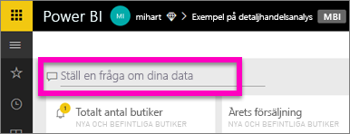
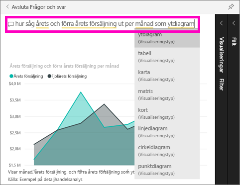

# Kom igång med Power BI-frågor och svar (snabbstart)
## Använd Power BI-frågor och svar med Exemplet på detaljhandelsanalys
Ibland är det snabbaste sättet att få svar från dina data att ställa en fråga med hjälp av naturligt språk.  I den här snabbstarten ska vi titta på två olika sätt att skapa samma visualisering: bygga den i en rapport och därefter ställa en fråga med Frågor och svar. Vi använder Power BI-tjänsten, men processen är nästan identisk med Power BI Desktop.

Om du vill följa med, måste du använda en rapport som du kan redigera så vi använder ett av de exempel som finns tillgängliga i Power BI.

## Metod 1: Använda rapportredigeraren
1. Välj **Hämta data** \> **Exempel** \> **Exempel på detaljhandelsanalys**  >   **Anslut** från din Power BI-arbetsyta.
   
    
2. Instrumentpanelen innehåller en ytdiagramspanel för ”förra årets försäljning och det här årets försäljning”.  Välj den här panelen. 
   
   * Om den här panelen skapades med Frågor och svar, öppnas Frågor och svar om du väljer den. 
   * Men den här panelen skapades i en rapport så rapporten öppnas på den sida som innehåller den här visualiseringen.
3. Öppna rapporten i redigeringsvyn genom att välja **Redigera rapport**.  Om du inte är ägare till en rapport kan du inte öppna den i redigeringsvyn.
   
    
4. Välj ytdiagrammet och granska inställningarna i **Fält**-fönstret.  Rapportskaparen byggde det här diagrammet genom att välja dessa tre värden (**Tid > FiscalMonth (Räkenskapsmånad)**, **Försäljning > This Year Sales (Årets försäljning)**, **Försäljning > Last Years Sales (Förra årets försäljning) > Värde**) och ordna dem i områdena **Axel** och **Värden**.
   
    

## Metod 2: Använda Frågor och svar
Hur skapar vi samma linjediagram med Frågor och svar?

1. Gå tillbaka till instrumentpanelen för Exempel på detaljhandelsanalys.
2. Med hjälp av naturligt språk skriver du in något i stil med följande i frågerutan:
   
   **hur såg årets och förra årets försäljning ut per månad som ytdiagram**
   
   När du skriver din fråga väljer Frågor och svar den bästa visualiseringen för att visa ditt svar och visualiseringen ändras dynamiskt när du ändrar frågan. Frågor och svar hjälper dig också formatera din fråga med förslag, automatisk komplettering och stavningskorrigeringar.
   
   När du har skrivit klart frågan är resultatet exakt samma diagram som vi såg i rapporten.  Men det gick mycket snabbare att skapa det på det här viset!
   
   
3. På liknande sätt som när du arbetar med rapporter, har du i Frågor och svar också åtkomst till fönstren Visualiseringar, Filter och Fält.  Öppna dessa fönster för att utforska och ändra ditt visuella objekt ytterligare.
4. Välj fästikonen  för att fästa diagrammet på din instrumentpanel.

## Nästa steg
[Frågor och svar i Power BI](power-bi-q-and-a.md)

[Få dina data att fungera bra med Frågor och svar i Power BI](service-prepare-data-for-q-and-a.md)

Har du fler frågor? [Prova Power BI Community](http://community.powerbi.com/)

