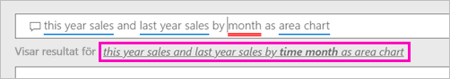

# Skapa en visualisering med Power BI frågor och svar

Ibland är det snabbaste sättet att få svar från dina data att ställa en fråga med hjälp av naturligt språk.  I den här artikeln ska vi titta på två olika sätt att skapa samma visualisering: börja ställa en fråga med frågor och svar och andra: bygga den i en rapport. Vi använder Power BI-tjänsten för att skapa det visuella objektet i rapporten, men processen är nästan identisk med Power BI Desktop.

Om du vill följa med, måste du använda en rapport som du kan redigera så vi använder ett av de exempel som finns tillgängliga i Power BI.

## Skapa ett visuellt objekt med frågor och svar

Hur kan vi gå om hur du skapar det här linjediagrammet med frågor och svar?

1. Välj **Hämta data** \> **Exempel** \> **Exempel på detaljhandelsanalys**  >   **Anslut** från din Power BI-arbetsyta.

1. Öppna exempelinstrumentpanelen detaljhandelsanalys och placera markören i frågor och svar, **Ställ en fråga om dina data**.

    

2. I frågor och svar, skriver du något som liknar den här frågan:
   
    **årets försäljning och förra årets försäljning per månad som ytdiagram**
   
    När du skriver din fråga väljer Frågor och svar den bästa visualiseringen för att visa ditt svar och visualiseringen ändras dynamiskt när du ändrar frågan. Frågor och svar hjälper dig också formatera din fråga med förslag, automatisk komplettering och stavningskorrigeringar. Frågor och svar rekommenderar en liten formulering ändring ”: årets försäljning och förra årets försäljning per *månad* som ytdiagram”.  

    

4. Välj meningen att godkänna förslaget. 
   
   När du har skrivit din fråga, är resultatet samma diagram som visas i instrumentpanelen.
   
   

4. Välj fästikonen för att fästa diagrammet på din instrumentpanel  i det övre högra hörnet.

## Skapa ett visuellt objekt i rapportredigeraren

1. Gå tillbaka till instrumentpanelen för Exempel på detaljhandelsanalys.
   
2. Instrumentpanelen innehåller samma ytdiagramspanel för ”förra årets försäljning och årets försäljning”.  Välj den här panelen. Markera inte den panel som du skapade med frågor och svar. Om du väljer den öppnas frågor och svar. Den ursprungliga ytdiagramspanel skapades i en rapport så rapporten öppnas på den sida som innehåller den här visualiseringen.

    

1. Öppna rapporten i redigeringsvyn genom att välja **Redigera rapport**.  Om du inte är ägare till en rapport kan du inte öppna den i redigeringsvyn.
   
    
4. Välj ytdiagrammet och granska inställningarna i **Fält**-fönstret.  Rapportskaparen byggde det här diagrammet genom att välja dessa tre värden (**förra årets försäljning** och **försäljning detta år > värde** från den **försäljning** tabellen, och  **Räkenskapsmånad** från den **tid** tabellen) och ordna dem i den **axel** och **värden** källor.
   
    

    Du kan se de till slut med samma visuella objekt. När den skapades på så sätt inte var för komplicerad. Men när den skapades med frågor och svar har enklare!

## Nästa steg

- [Använd frågor och svar i instrumentpaneler och rapporter](power-bi-tutorial-q-and-a.md)  
- [Frågor och svar för konsumenter](consumer/end-user-q-and-a.md)
- [Få dina data att fungera bra med Frågor och svar i Power BI](service-prepare-data-for-q-and-a.md)

Har du fler frågor? [Prova Power BI Community](http://community.powerbi.com/)

