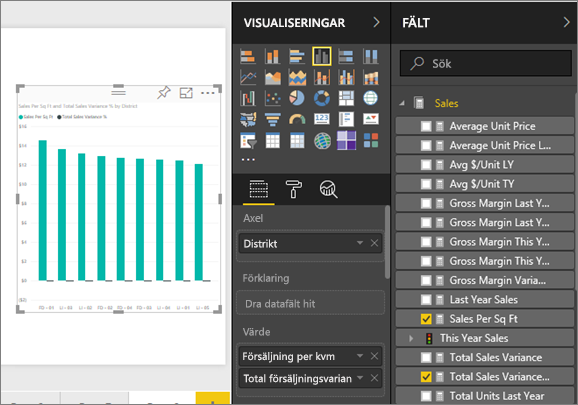
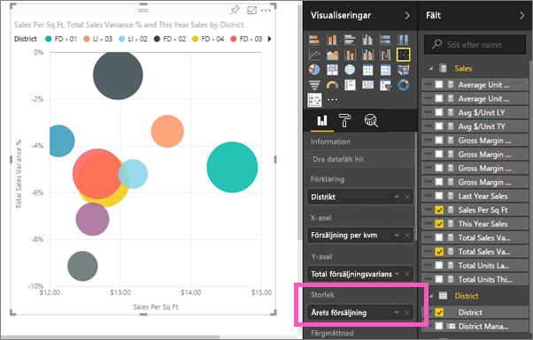
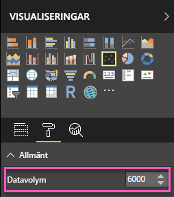
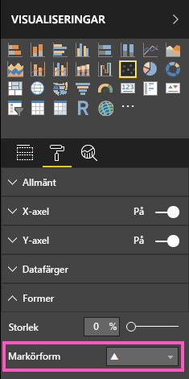
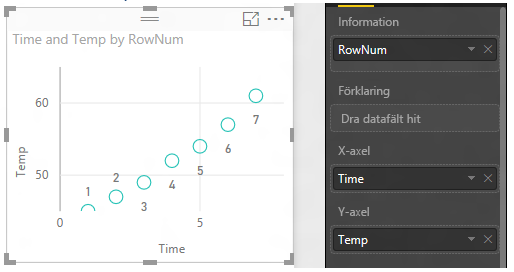
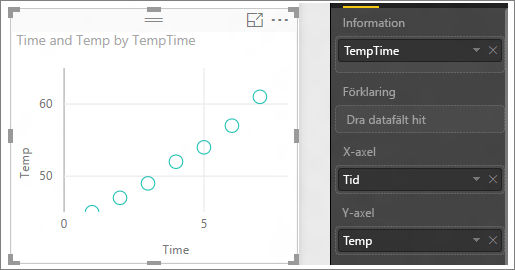

# Punktdiagram och bubbeldiagram i Power BI
Ett punktdiagram har alltid två värdeaxlar som visar en uppsättning numeriska data längs en vågrät axel och en annan uppsättning numeriska värden längs en lodrät axel. Diagrammet visar punkter i skärningspunkten för ett numeriskt X- och Y-värde och kombinerar dessa värden till separata datapunkter. Dessa datapunkter kan vara jämnt eller ojämnt fördelade på den horisontala axeln, beroende på datan.

Ett bubbeldiagram ersätter datapunkterna med bubblor, med en *bubbelstorlek* som motsvarar en dimension av datan.

Du kan ange antalet datapunkter  

## När du vill använda ett punktdiagram eller bubbeldiagram
### Punktdiagram är ett bra alternativ:
* för att visa relationer mellan 2 (punktdiagram) eller 3 (bubbeldiagram) **numeriska** värden.
* för att rita två grupper med värden som en serie xy-koordinater.
* i stället för ett linjediagram när du vill ändra skalan på den horisontala axeln    
* för att aktivera den vågräta axeln i en logaritmisk skala.
* för att visa arbetsbladets data som inkluderar par eller grupperade uppsättningar med värden. Du kan justera oberoende skalor av axlar för att visa mer information om grupperade värden i punktdiagrammet.
* för att visa mönster i stora mängder data, till exempel genom att visa linjära eller icke-linjära trender, kluster och avvikare.
* för att jämföra ett stort antal datapunkter utan hänsyn till tid.  Ju mer data som inkluderas i ett punktdiagram, desto bättre jämförelser kan du göra.

### Bubbeldiagram är ett bra alternativ:
* m dina data har 3 dataserier som alla innehåller en uppsättning med värden.
* för att presentera finansiella data.  Olika bubbelstorlekar är användbara för att visuellt betona specifika värden.
* att använda med kvadranter.

## Skapa ett punktdiagram
Titta på det här videoklippet och se Skapa ett punktdiagram och följ stegen nedan för att skapa en egen.

<iframe width="560" height="315" src="https://www.youtube.com/embed/PVcfPoVE3Ys?list=PL1N57mwBHtN0JFoKSR0n-tBkUJHeMP2cP" frameborder="0" allowfullscreen></iframe>

Dessa anvisningar använder sig av Exempel på detaljhandelsanalys. Om du vill följa med kan du [hämta exemplet](sample-datasets.md) för Power BI-tjänsten (app.powerbi.com) eller Power BI Desktop.   

1. Välj den gula plusikonen för att skapa en [tom rapportsida ](power-bi-report-add-page.md).
 
2. Välj följande fält från fönstret Fält:
   - **Försäljning** > **Försäljning efter kvm**
   - **Försäljning** > **Total försäljningsvarians %**
   - **Distrikt** > **Distrikt**

     

     Om du inte använder Power BI-tjänsten, se till att du öppnar rapporten i [Redigeringsvyn](service-interact-with-a-report-in-editing-view.md).

3. Konvertera till ett punktdiagram. På panelen Visualiseringar väljer du ytdiagramsikonen.

   .

4. Dra **Distrikt** från **Information** till **Förklaring**. Nu visas ett punktdiagram som visar **Total försäljningsvarians %** längs Y-axeln och **Försäljning per kvadratmeter** längs X-axeln. Datapunkternas färger representerar distrikt:

    

Nu ska vi lägga till en tredje dimension.

## Skapa ett bubbeldiagram

1. Från fönstret **Fält** drar du **Försäljning** > **Försäljning detta år** > **Värdet** till området **Storlek**. Datapunkterna expanderar till storlekar som motsvarar försäljningsvärdet.
   
   

2. Håll muspekaren över en bubbla. Storleken på bubblan reflekterar **försäljning detta år**.
   
    

3. Om du vill ange antalet datapunkter som ska visas i bubbeldiagrammet går du till **Format**-avsnittet i fönstret **Visualiseringar**, expanderar kortet **Allmänt** och justerar **Datavolym**. Du kan ange en största datavolym på upp till 10 000. För högre volymer föreslår vi att du först testar så att prestanda inte försämras. 

     

   > [!NOTE]
   > Eftersom fler datapunkter kan innebära en längre inläsningstid, bör du testa dina rapporter på webben och mobilt för att säkerställa att prestandan matchar dina användares förväntningar om du väljer att publicera rapporter med gränser i den högre änden av skalan. Tänk på att du bör testa resultaten för olika formfaktorer för att säkerställa bra prestanda för datapunkter med höga nummer.

4. Du kan [formatera visualiseringens färger, etiketter, rubriker, bakgrund med mera](service-getting-started-with-color-formatting-and-axis-properties.md). Överväg att lägga till markörformer på varje linje för att [förbättra tillgängligheten](desktop-accessibility.md). Med olika markörformer för varje linje är det enklare för rapportanvändare att skilja linjer (eller områden) från varandra. Välj markörform genom att expandera kortet **Former** och välja en markörform.

      

   Du kan också ändra markörformen till en romb, triangel eller kvadrat:

   

## Överväganden och felsökning

### **Ditt punktdiagram har endast en datapunkt**
Har du skapat ett punktdiagram där du bara ser en datapunkt som samlar alla värdena på X- och Y-axlarna?  Eller samlar diagrammet alla värden längs en enda vågrät eller lodrät linje?

Lös problemet genom att lägga till ett fält i området **Information** som talar om för Power BI hur värdena ska grupperas. Fältet måste vara unikt för varje punkt som du vill rita.  
Som ett enkel radnummer eller ID-fält:

Eller om du inte har detta i dina data, skapa ett fält som tillsammans sammanfogar X- och Y-värden till något unikt för varje plats:

Skapa ett nytt fält genom att [använda Power BI Desktop frågeredigeraren för att lägga till en indexkolumn](desktop-add-custom-column.md) i din datauppsättning.  Lägg sedan till den här kolumnen till området **Information** i din visualisering.

## Nästa steg
[Visualiseringstyper i Power BI](power-bi-visualization-types-for-reports-and-q-and-a.md)

[Registrera dig för en kostnadsfri utvärderingsversion](https://powerbi.microsoft.com/get-started/)  

Har du fler frågor? [Prova Power BI Community](http://community.powerbi.com/)

