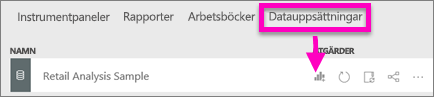
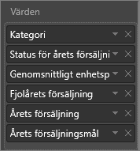
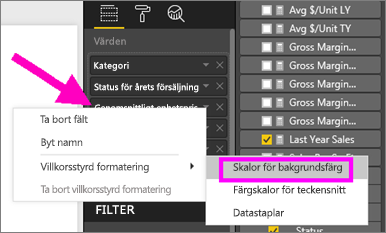
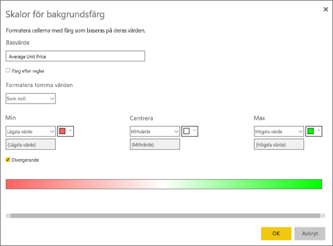
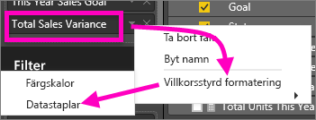
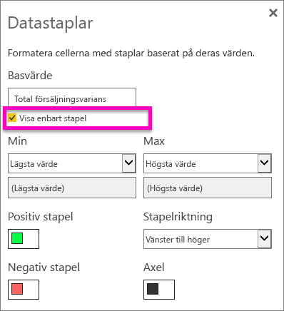

# Arbeta med tabeller i Power BI-rapporter och instrumentpaneler (självstudier)
En tabell är ett rutnät som innehåller relaterade data i en logisk serie med rader och kolumner. Det kan också innehålla rubriker och en rad för summor. Tabeller fungerar bra med kvantitativa jämförelser där du tittar på många värden för en enskild kategori. I den här tabellen visas till exempel 5 olika mått för **Kategori**.

## När du ska en tabell
Tabeller är ett bra alternativ:

* för att visa och jämföra detaljerade data och exakta värden (istället för visuella representationer)
* för att visa data i tabellformat
* att visa numeriska data efter kategorier   

> [!NOTE]
> Om en tabell har för många värden, bör du omvandla den till en matris och/eller ändra detaljnivån.
> 
> 

## Skapa en tabell
Om du vill hänga på loggar du in i Power BI och väljer **Hämta data > Exempel > Exempel på detaljhandelsanalys**. Vi ska skapa tabellen som visas ovan för att visa försäljningsvärden efter kategori för objektet.

1. I **Min arbetsyta** väljer du fliken datauppsättningar och rulla till Exempel på detaljhandelsanalys som du precis lade till.  Välj ikonen **Skapa rapport**.
   
    
2. I rapportredigeraren väljer du **Objekt** > **Kategori**.  Power BI skapar automatiskt en tabell som listar alla kategorier.
   
    
3. Välj **Försäljning > Genomsnittligt enhetspris** och **Försäljning > Senaste årets försäljning** och **Försäljning > Försäljning detta år** och välja alla 3 alternativ (värde, mål, status).   
4. Identifiera **Värden** i fönstret visualiseringar och dra och släpp värdena tills ordningen på diagramkolumnerna matchar den första bilden på den här sidan.  Dina värden bör se ut så här.
   
    
5. Fäst tabellen på instrumentpanelen genom att välja häftstift-ikonen  
   
     

## Formatera tabellen
Det finns många sätt att formatera en tabell och vi presenterar endast några av dem här. Ett bra sätt att lära dig om de andra formateringsalternativen är att öppna fönstret formatering (roller-ikonen ) och utforska.

* Försök att formatera tabellrutnätet. Här vi har lagt till ett blått lodrätt rutnät, lagt till utrymme i raderna, ökat kantlinjen och ändra textstorleken något.
  
    
  
    
* För kolumnrubrikerna har vi ändrat bakgrundsfärgen, lagt till en kantlinje och ökat teckenstorleken. 
  
    
  
    
* Här är vår slutliga tabell efter ytterligare lite formatering. Eftersom det finns så många formateringsalternativ är det bästa sättet att lära dig är att börja med en vanlig tabell, öppna formateringsfönstret  och börja utforska. 
  
    

### Villkorsstyrd formatering
En typ av formatering kallas *villkorsstyrd formatering* och denna tillämpas på fälten i **Värden** i fönstret **Visualiseringar** i Power BI-tjänsten eller Desktop. 

Med villkorsstyrd formatering för tabeller kan du specificera anpassade cellbakgrundsfärger och teckenfärg baserat på cellvärden, inklusive toningar. 

1. I fönstret **Visuella objekt** i Power BI Desktop väljer du nedpilen bredvid värdet i brunnen **Värden** som du vill formatera (eller högerklicka på fältet). Du kan endast hantera villkorsstyrd formatering för fälten i området **Värden** i brunnen **Fält**.
   
    
2. Välj **Skalor för bakgrundsfärg**. I dialogrutan som visas kan du konfigurera färgen, samt *minimi-* och *max*värden. Om du väljer rutan **Avvikande** kan du konfigurera ett valfritt *Centrumvärde*.
   
    
   
    Vi kan lägga till anpassad formatering våra värden för Genomsnittligt enhetspris. Välj **Divergerande**, lägg till färger och välj **OK**. 
   
    
3. Lägg till ett nytt fält i tabellen som innehåller både positiva och negativa värden.  Välj **Försäljning > Total försäljningsvarians**. 
   
    
4. Lägg till datastapeln villkorsstyrd formatering genom att välja nedåtpilen bredvid **Total försäljningsvarians** och välja **Villkorsstyrd formatering > Datastaplar**.
   
    
5. I dialogrutan som visas, ange färger för **Positiv stapel**, **Negativ stapel**, markera bredvid **Visa endast liggande** och gör eventuella andra ändringar.
   
    
   
    När du väljer **OK** ersätter datastaplar de numeriska värdena i tabellen, vilket gör den lättare att söka igenom.
   
    
6. Om du vill ta bort villkorlig formatering från en visualisering, bara högerklickar du på fältet igen och väljer **ta bort villkorsstyrd formatering**.

> [!TIP]
> Villkorsstyrd formatering är också tillgängligt från fönstret formatering (rollerikonen). Välj värdet att formatera och växla sedan **färgskalor** eller **datastaplar** till På för att använda standardinställningarna eller, om du vill anpassa inställningarna, välj **Avancerade kontroller**.
> 
> 

## Justera kolumnbredden i en tabell
Power BI trunkerar ibland en kolumnrubrik i en rapport eller på en instrumentpanel. Om du vill visa hela kolumnnamnet håller du muspekaren över utrymmet till höger om rubriken för att visa dubbelpilarna, markera och dra.

Har du fler frågor? [Prova Power BI Community](http://community.powerbi.com/)

