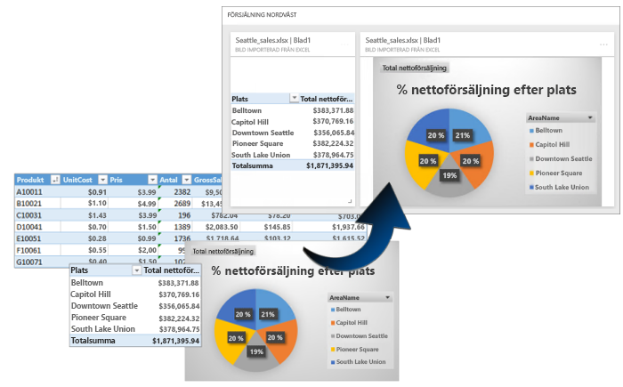
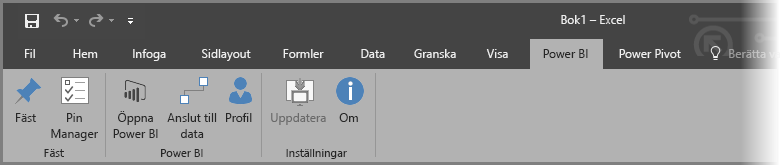
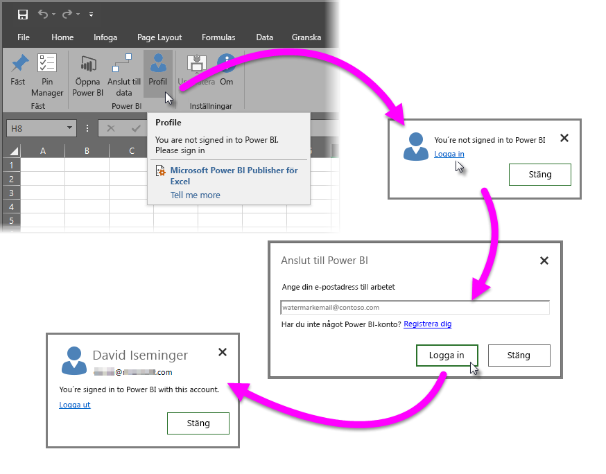
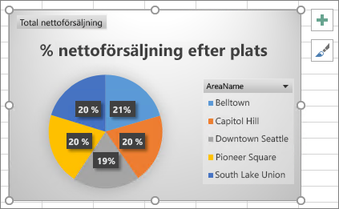
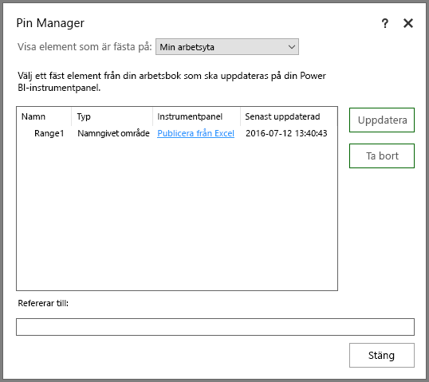
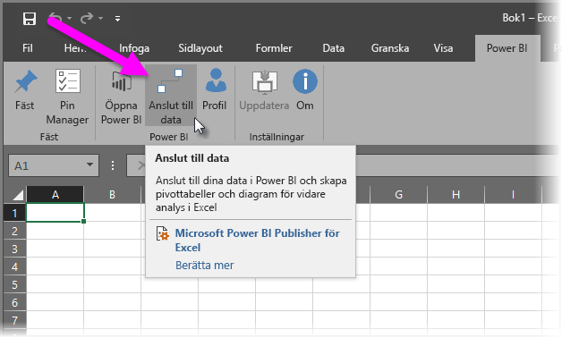
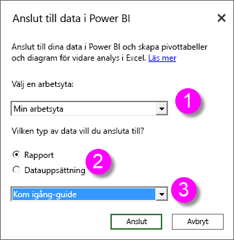
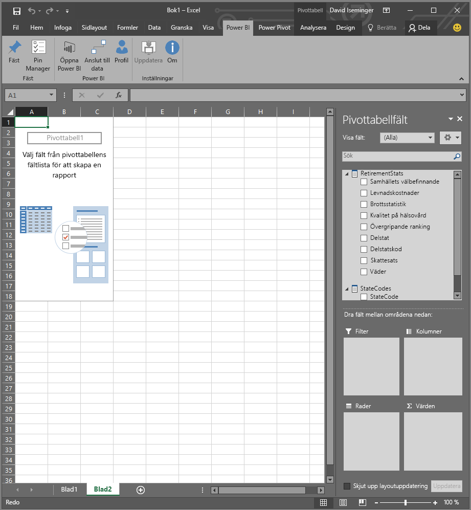
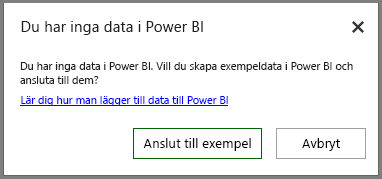

# Power BI Publisher för Excel
Med Microsoft **Power BI Publisher för Excel**, kan du ta ögonblicksbilder av dina viktigaste insikter i Excel som pivottabeller, diagram och intervall och fästa dem till instrumentpaneler i Power BI.

Vad kan du fästa? Vad som helst i ett Excel-kalkylblad. Du kan välja ett cellområde från ett enkelt kalkylark eller en tabell, en pivottabell eller ett pivotdiagram, illustrationer och bilder, text.

Du kan inte fästa: du kan inte fästa 3D-kartor eller visualiseringar i Power View-ark. Det finns vissa element som du kan fästa, men som inte skulle vara nån mening med, som ett utsnitt eller tidslinjefilter.

När du fäster ett element från Excel, läggs en ny panel till i en ny eller befintlig instrumentpanel i Power BI. Den nya panelen är en ögonblicksbild så den är inte dynamisk men du kan fortfarande uppdatera den. Om du till exempel gör en ändring i en pivottabell eller ett diagram som redan har fästs, uppdateras instrumentpanelen i Power BI inte automatiskt, men du kan fortfarande uppdatera dina fästa element med hjälp av **Pin Manager**. Du kan läsa mer om **Pin Manager** i följande avsnitt.

## Hämta och installera
Power BI Publisher för Excel är ett tillägg som du kan hämta och installera på skrivbordsversioner av Microsoft Excel 2007 och senare.

[Hämta Power BI Publisher för Excel](http://go.microsoft.com/fwlink/?LinkId=715729)

När du har installerat utgivaren, visas en ny **Power BI**-menyflik i Excel där kan du logga in (eller logga ut) ur Power BI, fästa element till instrumentpaneler och hantera element som du redan har fäst.

Tillägget **Power BI Publisher för Excel** är aktiverat som standard, men om du inte ser menyfliken för Power BI i Excel av någon anledning, måste du aktivera det. Klicka på **fil** > **alternativ** > **tillägg** > **COM-tillägg**. Välj **Microsoft Power BI Publisher för Excel**.

## Fäst ett cellområde på en instrumentpanel
Du kan markera alla cellområden från ditt kalkylblad och fästa en ögonblicksbild av det intervallet till en befintlig eller ny instrumentpanel i Power BI. Du kan fästa samma ögonblicksbild till flera instrumentpaneler också.

Om du vill börja, måste du kontrollera att du är inloggad på Power BI.

1. Välj **profil** från menyfliken **Power BI** i Excel. Om du har redan loggat in till Power BI, visas en dialogruta som visar vilket konto du för närvarande är inloggad med. Om detta är det konto som du vill använda bra – går du till nästa steg för att fästa intervallet. Välj *logga ut* om du vill använda ett annat Power BI-konto. Gå till nästa steg (steg 2) om du inte är inloggad.
   
   
2. Om du inte har loggat in, väljer du länken **logga in** som visas när du väljer **profil** från menyfliken **Power BI** i Excel, i dialogtypen **Anslut till Power BI** i e-postadressen för Power BI-kontot som du vill använda och välj sedan **logga in**.
   
   

När du har loggat in, följer du dessa steg för att fästa ett intervall på en instrumentpanel:

1. I Excel, markerar du **Power BI**-menyfliken för att se menyfliksknappen **fäst**.
2. Välj ett intervall från din Excel-arbetsbok.
3. Klicka på knappen **fäst** från menyfliken **Power BI** för att visa **dialogrutan fäst till instrumentpanelen**. Om du inte redan är inloggad på Power BI, uppmanas du att göra detta. Välj en arbetsyta från listmenyn **arbetsyta**. Om du vill fästa till din egen instrumentpanel, verifierar du att **Min arbetsyta** är valt. Om du vill fästa på en instrumentpanel i en grupparbetsyta, väljer du gruppen från listmenyn.
4. Välj om du vill fästa till en *befintlig instrumentpanel* eller skapa en *ny instrumentpanel*.
5. Klicka på **okej** för att fästa ditt urval på instrumentpanelen.
6. I **fäst på instrumentpanelen**, väljer du en befintlig instrumentpanel i arbetsytan eller skapar en ny och klickar sedan på **Ok**-knappen.
   
   

## Fästa ett diagram till en instrumentpanel
Klicka bara på diagrammet och sedan på fäst .

## Hantera fästa element
Med **Pin Manager**, kan du uppdatera ett fäst elements associerade panel i Power BI. Du kan också ta bort fästningen mellan ett element som du redan har fäst till instrumentpanelerna i Power BI.

Om du vill uppdatera paneler på din instrumentpanel i **Pin Manager** väljer du ett eller flera element och välj sedan **uppdatera**.

Om du vill ta bort mappningen mellan ett fäst element i Excel och den associerade panelen i en instrumentpanel, måste du ta bort **ta bort**. När du väljer **ta bort**, tar du *inte* bort elementet från ditt Excel-kalkylblad eller tar bort den associerade panelen på instrumentpanelen. Du tar bort fästningen, eller *mappningen*, mellan dem. Det borttagna elementet visas inte längre i **Pin Manager**. Om du fäster elementet igen, visas det som en ny panel.

Om du vill ta bort ett fäst element (en panel) från en instrumentpanel, behöver du göra det i Power BI. I panelen som du vill ta bort, väljer du **öppna meny**-ikonen  och väljer sedan **ta bort panelen**  .

## Anslut till data i Power BI
Från och med juli 2016-versionen av **Power BI Publisher för Excel** (inklusive den aktuella versionen, länkade till ovan), kan du ansluta direkt till data i Power BI-tjänsten och analysera data i Excel med hjälp av pivottabeller och Pivotdiagram. Den här funktionen gör det enkelt att använda Power BI-data och Excel tillsammans för att analysera data som är viktigast för dig.

Förbättringarna inkluderar:

* Alla drivrutiner som krävs för att ansluta till data i Power BI uppdateras automatiskt med varje version. Du behöver inte installera eller hantera dessa drivrutiner själv.
* Du behöver inte längre hämta .odc-filer för att skapa anslutningar. **Power BI Publisher för Excel** skapar anslutningar automatiskt när du väljer vilken rapport eller datauppsättning som du vill använda.
* Nu kan du skapa flera anslutningar och pivottabeller i samma arbetsbok
* Fel är bättre och specifika för **Power BI Publisher för Excel**, istället för att vara Exce-standardmeddelanden

### Så här ansluter du till Power BI-data i Excel
Följ de här enkla stegen för att ansluta till Power BI-data med hjälp av **Power BI Publisher för Excel**:

1. Kontrollera att du är inloggad på Power BI. Stegen som beskriver hur du loggar in (eller loggar in med ett annat konto) anges tidigare i den här artikeln.
2. När du är inloggad på Power BI med det konto som du vill använda, väljer du **anslut till data** från **Power BI**-menyfliken i Excel.
   
   
3. Excel ansluter till Power BI med hjälp av en HTTPS-anslutning och visar dialogrutan **anslut till data i Power BI** där du kan välja den *arbetsyta* som du vill välja data från (1, i bilden nedan), vilken *datatyp* du vill ansluta till, antingen en **rapport** eller en **datuppsättning** (2) och en listmeny (3) som låter dig välja vilken  *tillgänglig rapport eller datauppsättning* som ska anslutas.
   
   
4. När du gör dina val och väljer **anslut** från dialogrutan **anslut till data i Power BI**, förbereder Excel en pivottabell och visar panelen **pivottabellfält** där du kan välja fält från dina anslutna Power BI-data och skapa tabeller eller diagram som hjälper dig att analysera data.
   
   

Om du inte har några data i Power BI, identifierar Excel det och erbjuder att skapa exempeldata att ansluta till och testa.

Det finns några saker att tänka på i den här versionen av **Power BI Publisher för Excel**:

* **Delade data** – Data som har delats med dig, men inte är direkt synliga för dig i Power BI är inte tillgänglig i **anslut till data**.
* **SSAS lokal** – om datauppsättningen du väljer kommer från en lokal SQL Server Analysis Services (SSAS) och datauppsättningen i Power BI använder DirectQuery för att komma åt data, ansluter **Power BI Publisher för Excel** till dessa data via en lokal nätverksanslutning och går *inte* via Power BI för att ansluta till data. Därför måste alla användare som försöker ansluta till sådana datauppsättningar, vara anslutna till det lokala nätverket och vara autentiserade för åtkomst till dessa data med hjälp av den autentiseringsmetod som används av Analysis Services-instansen där data lagras.
* **Nödvändiga drivrutiner** - **Power BI Publisher för Excel** installerar alla nödvändiga drivrutiner för att den här funktionen ska fungera automatiskt. Bland dessa automatiskt installerade drivrutiner är Excel OLE DB-drivrutinen för Analysis Services. Om drivrutinen har tagits bort av användaren (eller av någon annan anledning), fungerar inte anslutningen till Power BI-data.
* **Datuppsättningen måste ha mått** – datauppsättningen måste ha modellmått som definierats för att Excel ska kunna behandla åtgärderna som värden i pivottabeller och för att analysera data korrekt. Läs mer om [mått](desktop-measures.md).
* **Stöd för grupper** – datauppsättningar som delas med personer utanför den angivna gruppen stöds inte och kan inte anslutas till.
* **Kostnadsfri kontra Pro-prenumeration** – aktiviteter associerade med grupper stöds inte för kostnadsfria Power BI-användare och därför ser de inga datauppsättningar eller rapporter som delats med en grupp i deras egen arbetsyta.
* **Delade rapporter eller datauppsättningar** – Rapporter eller datauppsättningar som delats med dig kan inte anslutas till.
* **Använd tabeller istället för datamodeller** – datauppsättningar och rapporter som skapas genom att importera bara tabeller från Excel (utan en datamodell) stöds inte just nu och kan inte anslutas till.

När du har skapat övertygande diagram eller andra visuella objekt, till exempel ett dataintervall, kan du enkelt fästa dem till en instrumentpanel i Power BI, enligt beskrivningen tidigare i den här artikeln.

## Relaterade artiklar
Det finns många sätt att använda Excel och Power BI tillsammans och få ut det bästa av båda. Mer information finns i följande artikel.

* [Analysera i Excel](service-analyze-in-excel.md)
* [Felsökning för analys i Excel](desktop-troubleshooting-analyze-in-excel.md)

