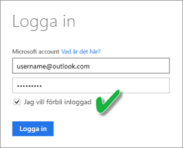

# Uppdatera en datauppsättning som skapats från en .CSV-fil i OneDrive eller SharePoint Online
## Vilka är fördelarna?
När du ansluter till en .csv-fil i OneDrive eller SharePoint Online skapas en datauppsättning i Power BI. Data från .csv-filen importeras därefter till datauppsättningen i Power BI. Power BI ansluter sedan automatiskt till filen och uppdaterar ändringarna med datauppsättningen i Power BI. Om du redigerar .csv-filen i OneDrive eller SharePoint Online kommer dessa ändringar visas i Power BI när du har sparat, vanligtvis inom ungefär en timme. Alla visualiseringar i Power BI som baseras på datauppsättningen uppdateras också.

Om filerna finns i en delad mapp i OneDrive för företag eller SharePoint Online kan andra användare arbeta med samma fil. När du har sparat uppdateras ändringar som görs automatiskt i Power BI, vanligen inom en timme.

Många organisationer kör processer som automatiskt frågar databaser efter data som sedan sparas till en .csv-fil varje dag. Om filen lagras i OneDrive eller SharePoint Online och samma fil skrivs över varje dag, kan du ansluta till filen i Power BI – till skillnad från en ny fil med ett annat namn som skapas varje dag. Datauppsättningen som ansluter till filen kommer att synkroniseras strax efter att filen i OneDrive eller SharePoint Online uppdateras. Alla visualiseringar i som baseras på datauppsättningen uppdateras också automatiskt.

## Vad stöds?
Filer med kommaavgränsade värden är enkla textfiler, så anslutningar till externa datakällor och rapporter stöds inte. Du kan inte schemalägga en uppdatering av en datauppsättning som skapats från en kommaavgränsad fil. Men om filen finns i OneDrive eller SharePoint Online synkroniserar Power BI alla ändringar i filen med datauppsättningen automatiskt ungefär varje timme.

## OneDrive eller OneDrive för företag. Vad är skillnaden?
Om du både har en privat OneDrive och en OneDrive för företag, bör du ha alla filer som du vill ansluta till i Power BI i din OneDrive för företag. Skälet är följande: Du använder förmodligen två olika konton för att logga in till dem.

Det är vanligtvis inga problem att ansluta till OneDrive för företag i Power BI eftersom det konto som du använder för att logga in på Power BI ofta är samma konto som används för att logga in på OneDrive för företag. Men din privata OneDrive loggar du troligen in på med ett annat [Microsoft-konto](https://account.microsoft.com).

När du loggar in på ditt Microsoft-konto bör du markera Jag vill förbli inloggad. Power BI kan sedan synkronisera uppdateringarna med datauppsättningar i Power BI

Om du gör ändringar i .csv-filen på OneDrive som inte kan synkroniseras med datauppsättningen i Power BI eftersom autentiseringsuppgifterna för ditt Microsoft-konto har ändrats, måste du ansluta till filen och importera den igen från din privata OneDrive.

## Om något går fel
Om data i .csv-filen på OneDrive ändras och dessa ändringar inte avspeglas i Power BI, är det troligt att Power BI inte kan ansluta till OneDrive. Försök att ansluta till filen och importera den igen. Om du uppmanas att logga in bör du kontrollera att du har markerat **Jag vill förbli inloggad**.

## Nästa steg
[Verktyg vid felsökning av uppdateringsproblem](service-gateway-onprem-tshoot.md)
[Felsökning av uppdateringsscenarier](refresh-troubleshooting-refresh-scenarios.md)

Har du fler frågor? [Fråga Power BI Community](https://community.powerbi.com/)

