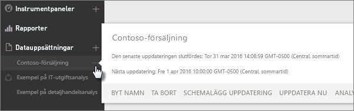
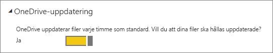
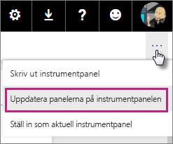
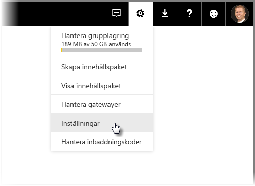
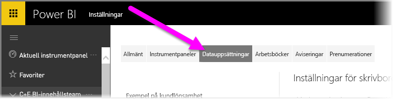
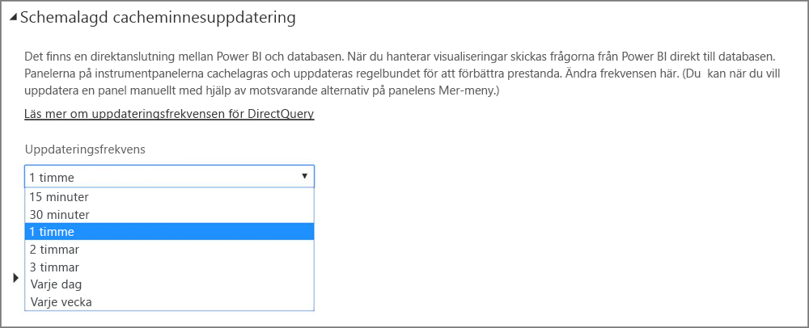

# Datauppdatering i Power BI
Att se till att du alltid har den senaste informationen är ofta betydelsefullt för att kunna fatta rätt beslut. Du har förmodligen redan använt Hämta data i Power BI för att ansluta till och ladda upp vissa data, skapat vissa rapporter och en instrumentpanel. Nu ska du se till att dina data är verkligen är aktuella och bäst.

I många fall behöver du inte göra något alls. Vissa data, som från ett Salesforce- eller Marketo-innehållspaket, uppdateras automatiskt åt dig. Om din anslutning använder en live-anslutning eller DirectQuery, kommer datan att uppdateras så att den är aktuell. Men i andra fall, exempelvis med en Excel-arbetsbok eller Power BI Desktop-fil som ansluter till en extern datakälla online eller lokalt, måste du uppdatera manuellt eller konfigurera ett uppdateringsschema så att Power BI kan uppdatera datan i dina rapporter och instrumentpaneler åt dig.

Den här artikeln, tillsammans med några andra, är avsedd att hjälpa dig att förstå hur data som uppdateras i Power BI fungerar i praktiken, om du behöver konfigurera ett uppdateringsschema och vad som ska finnas för att datan ska kunna uppdateras.

## Förstå datauppdatering
Det är viktigt att förstå vad det är du uppdaterar och varifrån du får dina data innan du installerar uppdateringen.

En *datakälla* är den plats som de data som du utforskar i dina rapporter och instrumentpaneler kommer från, till exempel en onlinetjänst som Google Analytics eller QuickBooks, en databas i molnet som Azure SQL Database, eller en databas eller fil på en lokal dator eller server i din organisation. Alla dessa är datakällor. Typen av datakälla bestämmer hur data från den uppdateras. Vi ska gå in på uppdatering för varje typ av datakälla lite senare i avsnittet [Vad kan uppdateras?](#what-can-be-refreshed).

En *datauppsättning* skapas automatiskt i Power BI när du använder Hämta data för att ansluta till och överföra data från ett innehållspaket, en fil eller om du ansluter till en live-datakälla. Du kan publicera din fil direkt till Power BI-tjänsten i Power BI Desktop och Excel 2016 på samma sätt som när du använder Hämta data.

I dessa fall skapas en datauppsättning som visas i Min arbetsyta, grupp eller container i Power BI-tjänsten. När du väljer **ellipsen (...)**  för en datauppsättning kan du utforska datan i en rapport, redigera inställningarna och konfigurera uppdateringen.

En datauppsättning kan hämta data från en eller flera datakällor. Du kan till exempel använda Power BI Desktop för att hämta data från en SQL Database i din organisation och hämta andra data från ett OData-flöde online. När du sedan publicerar filen till Power BI skapas en enda datauppsättning, men med datakällor för både SQL Database och OData-flödet.

En datauppsättning innehåller information om datakällorna, autentiseringsuppgifterna för datakällan och i de flesta fall en underordnad datauppsättning som kopieras från datakällan. När du skapar visualiseringar i rapporter och instrumentpaneler, tittar du på datan i datauppsättningen. Vid en live-anslutning som Azure SQL Database definierar datauppsättningen de data som du ser direkt från datakällan. Vid en live-anslutning till Analysis Services kommer datauppsättningsdefinitionen direkt från Analysis Services.

> *När du uppdaterar data uppdateras datan i den datauppsättning som lagras i Power BI från datakällan. Den här uppdateringen är en fullständig uppdatering som inte är inkrementell.*
> 
> 

När du uppdaterar data i en datauppsättning, oavsett om det är med Uppdatera nu eller genom att konfigurera ett uppdateringsschema, använder Power BI informationen i datauppsättningen för att ansluta till de datakällor som definierats för den, frågar efter uppdaterade data och läser sedan in den uppdaterade informationen i datauppsättningen. Alla visualiseringar i dina rapporter eller instrumentpaneler som baseras på dessa data uppdateras automatiskt.

Innan vi går vidare finns det något annat som är mycket viktigt att förstå:

> *Oavsett hur ofta du uppdaterar datauppsättningen eller hur ofta du tittar på live-data, måste datan i datakällan uppdateras först.*
> 
> 

De flesta organisationer bearbetar data en gång om dagen, vanligtvis på kvällen. Om du schemalägger uppdatering av en datauppsättning som skapats från en Power BI Desktop-fil som ansluter till en lokal databas och IT-avdelningen kör bearbetning av SQL-databasen en gång varje kväll, behöver du bara konfigurera schemalagd uppdatering en gång per dag. Till exempel efter bearbetning av databasen, men innan du kommer till arbetet. Naturligtvis är detta inte alltid fallet. Med Power BI finns många sätt att ansluta till datakällor som uppdateras ofta eller i realtid.

## Typer av uppdatering
Det finns fyra huvudsakliga typer av uppdatering i Power BI. Paketuppdatering, modell-/datauppdatering, paneluppdatering och uppdatering av visuella containrar.

### Paketuppdatering
Detta synkroniserar Power BI Desktop eller Excel, filen mellan Power BI-tjänsten och OneDrive, eller SharePoint Online. Det hämtar inte data från den ursprungliga datakällan. Datauppsättningen i Power BI uppdateras bara med det som finns i filen i OneDrive eller SharePoint Online.

### Modell-/datauppdatering
Detta avser att uppdatera datauppsättningen i Power BI-tjänsten med data från den ursprungliga datakällan. Detta görs genom att antingen använda schemalagd uppdatering eller att uppdatera nu. Det kräver en gateway för lokala datakällor.

### Paneluppdatering
Paneluppdateringen uppdaterar cacheminnet för visuella panelobjekt i instrumentpanelen när datan ändras. Detta görs var 15:e minut. Du kan också tvinga fram en uppdatering av panelen genom att välja **ellipsen (...)**  i det övre högra hörnet i en instrumentpanel och välja **Uppdatera instrumentpanel**.

Mer information kring vanliga fel vid paneluppdateringar finns i [Felsöka panelfel](refresh-troubleshooting-tile-errors.md).

### Uppdatering av visuella containrar
Uppdaterar den visuella containern med cachelagrade visuella rapportobjekt inom en rapport när data ändras.

## Vad kan uppdateras?
I Power BI använder du vanligtvis Hämta data när du importerar data från en fil på en lokal enhet, OneDrive eller SharePoint Online, publicerar en rapport från Power BI Desktop eller ansluter direkt till en databas i molnet i din organisation. Nästan alla data i Power BI kan uppdateras, men om du behöver det eller inte beror på hur din datauppsättning har skapats och vilka datakällor den ansluter till. Nu ska vi titta på hur var och en av dessa uppdaterar data.

Innan vi går vidare följer här några viktiga definitioner som du bör känna till:

**Automatisk uppdatering** – Detta innebär att det inte krävs någon användarkonfiguration för att uppdatera datauppsättningen regelbundet. Inställningarna för datauppdateringar är konfigurerade åt dig av Power BI. Uppdateringen sker vanligtvis en gång per dag för leverantörer av onlinetjänster. För filer som lästs in från OneDrive görs en automatisk uppdatering varje timme för data som inte kommer från en extern datakälla. Även om du kan konfigurera olika schemauppdateringsinställningar och uppdatera manuellt, behöver du förmodligen inte göra det.

**Användarkonfigurerad manuell eller schemalagd uppdatering** – Detta innebär att du manuellt uppdaterar en datauppsättning med hjälp av Uppdatera nu eller konfigurerar ett uppdateringsschema med hjälp av Uppdatera schema i inställningarna för en datauppsättning. Den här typen av uppdatering krävs för Power BI Desktop-filer och Excel-arbetsböcker som ansluter till externa datakällor online eller lokalt.

> [!NOTE]
> När du konfigurerar en tid för schemalagd uppdatering kan det finnas en fördröjning på upp till en timme innan den startar.
> 
> 

**Live/DirectQuery** – Detta innebär att det finns en live-anslutning mellan Power BI och datakällan. För lokala datakällor måste administratören ha en datakälla som konfigurerats i en företagsgateway, men användaren kanske inte behöver agera.

> [!NOTE]
> För att förbättra prestandan uppdateras instrumentpaneler automatiskt med data som är anslutna via DirectQuery. Du kan också uppdatera en panel manuellt när du vill genom att använda menyn **Mer** i panelen.
> 
> 

## Lokala filer och filer i OneDrive eller SharePoint Online
Datauppdatering stöds för Power BI Desktop-filer och Excel-arbetsböcker som ansluter till externa datakällor online eller lokalt. Detta kommer endast uppdatera datan för datauppsättningen i Power BI-tjänsten. Det kommer inte att uppdatera din lokala fil.

Att behålla sina filer i OneDrive eller SharePoint Online och ansluta till dem från Power BI ger stor flexibilitet. Men den flexibiliteten är också det som är svårast att förstå. Schemalagd uppdatering för filer som lagras i OneDrive eller SharePoint Online skiljer sig från paketuppdatering. Du kan läsa mer i avsnittet [Typer av uppdatering](#types-of-refresh).

### Power BI Desktop-fil

| **Datakälla** | **Automatisk uppdatering** | **Användarkonfigurerad manuell eller schemalagd uppdatering** | **Gateway krävs** |
| --- | --- | --- | --- |
| Hämta data (i menyfliksområdet) används för att ansluta till och fråga efter data från alla online-datakällor i listan. |Nej |Ja |Nej (se nedan) |
| Hämta data används för att ansluta till och utforska en live-databas i Analysis Services. |Ja |Nej |Ja |
| Hämta data används för att ansluta till och utforska en lokal DirectQuery-datakälla som stöds. |Ja |Nej |Ja |
| Hämta data används för att ansluta till och fråga efter data från en Azure SQL Database, Azure SQL Data Warehouse, Azure HDInsight Spark. |Ja |Ja |Nej |
| Hämta data används för att ansluta till och fråga efter data från alla lokala datakällor i listan utom Hadoop-filen (HDFS) och Microsoft Exchange. |Nej |Ja |Ja |

> [!NOTE]
> Om du använder funktionen [**Web.Page**](https://msdn.microsoft.com/library/mt260924.aspx), behöver du en gateway om du har återpublicerat datauppsättningen eller rapporten efter 18 november 2016.
> 
> 

Mer information finns i [Uppdatera en datauppsättning som skapats från en Power BI Desktop-fil i OneDrive](refresh-desktop-file-onedrive.md).

### Excel-arbetsbok

| **Datakälla** | **Automatisk uppdatering** | **Användarkonfigurerad manuell eller schemalagd uppdatering** | **Gateway krävs** |
| --- | --- | --- | --- |
| Datatabellerna i ett kalkylblad blir inte inlästa i Excel-datamodellen. |Ja, varje timme *(endast OneDrive/SharePoint Online)* |Endast manuellt *(endast OneDrive/SharePoint Online)* |Nej |
| Datatabeller i ett kalkylblad länkas till en tabell i Excel-datamodellen (länkade tabeller). |Ja, varje timme *(endast OneDrive/SharePoint Online)* |Endast manuellt *(endast OneDrive/SharePoint Online)* |Nej |
| Power Query* används för att ansluta till och fråga efter data från alla online-datakällor i listan samt för att läsa in data till Excel-datamodellen. |Nej |Ja |Nej |
| Power Query* används för att ansluta till och fråga efter data från alla lokala datakällor i listan, utom Hadoop-filen (HDFS) och Microsoft Exchange samt för att läsa in data i Excel-datamodellen. |Nej |Ja |Ja |
| Power Pivot används för att ansluta till och fråga efter data från alla online-datakällor i listan samt för att läsa in data i Excel-datamodellen. |Nej |Ja |Nej |
| Power Pivot används för att ansluta till och fråga efter data från alla lokala datakällor i listan samt för att läsa in data i Excel-datamodellen. |Nej |Ja |Ja |

*\* Power Query kallas för Hämta och transformera data i Excel 2016.*

Mer information finns i [Uppdatera en datauppsättning som skapats från en Excel-arbetsbok i OneDrive](refresh-excel-file-onedrive.md).

### Fil med kommaavgränsade värden (.csv) i OneDrive eller SharePoint Online

| **Datakälla** | **Automatisk uppdatering** | **Användarkonfigurerad manuell eller schemalagd uppdatering** | **Gateway krävs** |
| --- | --- | --- | --- |
| Enkelt kommaavgränsat värde |Ja, varje timme |Endast manuellt |Nej |

Mer detaljerad information finns i [Uppdatera en datauppsättning som skapats från en fil med kommaavgränsade värden (.csv) i OneDrive](refresh-csv-file-onedrive.md).

## Innehållspaket
Det finns två typer av innehållspaket i Power BI:

**Innehållspaket från onlinetjänster**: som t.ex. Adobe Analytics, SalesForce och Dynamics CRM Online. Datauppsättningar som skapas från onlinetjänster uppdateras automatiskt en gång om dagen. Även om det antagligen inte behövs, kan du uppdatera eller konfigurera ett uppdateringsschema manuellt. Eftersom onlinetjänsterna finns i molnet krävs det inte någon gateway.

**Organisationsinnehållspaket**: skapas och delas av användare i din organisation. Innehållspaketanvändarna kan inte konfigurera något uppdateringsschema eller uppdatera manuellt. Det är bara innehållspaketets skapare som kan installera uppdateringar för datauppsättningarna i innehållspaketet. Uppdaterade inställningar ärvs med datauppsättningen.

### Innehållspaket från onlinetjänster

| **Datakälla** | **Automatisk uppdatering** | **Användarkonfigurerad manuell eller schemalagd uppdatering** | **Gateway krävs** |
| --- | --- | --- | --- |
| Onlinetjänster i Hämta data &gt; tjänster |Ja |Ja |Nej |

### Organisationsinnehållspaket
Vilka uppdateringsfunktioner för en datauppsättning som ingår i ett organisationsinnehållspaket beror på datauppsättningen. Se informationen ovan i förhållande till lokala filer, OneDrive eller SharePoint Online.

Läs mer i [Introduktion till organisationsinnehållspaket](service-organizational-content-pack-introduction.md).

## Live-anslutningar och DirectQuery för lokala datakällor
Med en lokal datagateway kan du ställa frågor från Power BI till dina lokala datakällor. När du hanterar visualiseringar skickas frågorna från Power BI direkt till databasen. Uppdaterade data returneras och visualiseringarna uppdateras. Eftersom det inte finns någon direkt anslutning mellan Power BI och databasen, finns det inget behov av att schemalägga en uppdatering.

När du ansluter till en SSAS-datakälla (SQL Service Analysis Services) med hjälp av en live-anslutning, kan live-anslutningen till en SSAS-datakälla köras mot cache-minnet även vid inläsningen av en rapport, till skillnad från när DirectQuery används. Detta förbättrar prestandan för rapporten. Du kan begära den senaste informationen från SSAS-datakällan med hjälp av knappen **Uppdatera**. Ägarna av SSAS-datakällor kan konfigurera en schemalagd cacheminnesuppdatering för datauppsättningen så att rapporterna är så aktuella som det krävs. 

När du konfigurerar en datakälla med den lokala datagatewayen kan du använda datakällan som alternativ till den schemalagda uppdateringen. Det gör du i stället för att använda din personliga gateway.

> [!NOTE]
> Om datauppsättningen har konfigurerats för en live- eller DirectQuery-anslutning, uppdateras den ungefär varje timme eller när en interaktion med datan inträffar. Du kan justera *uppdateringsfrekvensen* manuellt i alternativet *Schemalagd cacheminnesuppdatering* i Power BI-tjänsten.
> 
> 

| **Datakälla** | **Live/DirectQuery** | **Användarkonfigurerad manuell eller schemalagd uppdatering** | **Gateway krävs** |
| --- | --- | --- | --- |
| Analysis Services-tabell |Ja |Ja |Ja |
| Flerdimensionella Analysis Services |Ja |Ja |Ja |
| SQL Server |Ja |Ja |Ja |
| SAP HANA |Ja |Ja |Ja |
| Oracle |Ja |Ja |Ja |
| Teradata |Ja |Ja |Ja |

Läs mer i [Lokal datagateway](service-gateway-onprem.md)

## Databaser i molnet
Med DirectQuery finns det ingen direkt anslutning mellan Power BI och databasen i molnet. När du hanterar visualiseringar skickas frågorna från Power BI direkt till databasen. Uppdaterade data returneras och visualiseringarna uppdateras. Och eftersom både Power BI-tjänsten och datakällan finns i molnet, finns det inte något behov av en personlig gateway.

Om det inte finns några användaråtgärder i en visualisering, uppdateras datan automatiskt ungefär varje timme. Du kan ändra uppdateringsfrekvensen med alternativet *Schemalagd cacheminnesuppdatering*.

Om du vill ange frekvens väljer du **kugghjulsikonen** i det övre högra hörnet av Power BI-tjänsten. Välj sedan **Inställningar**.

Sidan **Inställningar** visas, där du kan välja den datauppsättning som du vill justera frekvensen för. På sidan väljer du fliken **Datauppsättningar** överst.

När du väljer datauppsättning visas i den högra fönstret en uppsättning alternativ för datauppsättningen. För DirectQuery/Live-anslutningen kan du ange uppdateringsfrekvens från 15 minuter till en gång i veckan i den nedrullningsbara meny som visas i följande bild.

| **Datakälla** | **Live/DirectQuery** | **Användarkonfigurerad manuell eller schemalagd uppdatering** | **Gateway krävs** |
| --- | --- | --- | --- |
| SQL Azure-informationslager |Ja |Ja |Nej |
| Spark i HDInsight |Ja |Ja |Nej |

Läs mer i [Azure och Power BI](service-azure-and-power-bi.md).

## Realtidsinstrumentpaneler
Realtidsinstrumentpanelerna använder Microsoft Power BI REST API eller Microsoft Stream Analytics för att säkerställa att datan är uppdaterad. Eftersom realtidsinstrumentpaneler inte kräver att användarna konfigurerar uppdateringar, ligger de utanför innehållet för den här artikeln.

| **Datakälla** | **Automatiskt** | **Användarkonfigurerad manuell eller schemalagd uppdatering** | **Gateway krävs** |
| --- | --- | --- | --- |
| Anpassade appar som utvecklats med Power BI Rest API eller Microsoft Stream Analytics |Ja, liveuppspelning |Nej |Nej |

## Konfigurera schemalagd uppdatering
Information om hur du konfigurerar schemalagda uppdateringar finns i [Konfigurera schemalagd uppdatering](refresh-scheduled-refresh.md)

## Vanliga scenarier för datauppdatering
Ibland är det lättare att lära sig om datauppdateringar i Power BI genom att titta på exempel. Här följer några vanliga scenarier för datauppdatering:

### Excel-arbetsbok med datatabeller
Du har en Excel-arbetsbok med flera datatabeller, men ingen av dem har lästs in i Excel-datamodellen. Du använder Hämta data för att överföra arbetsboksfilen från den lokala enheten till Power BI och skapa en instrumentpanel. Men nu har du gjort vissa ändringar i ett par av arbetsbokens tabeller på den lokala enheten och du vill uppdatera din instrumentpanel i Power BI med dina nya data.

Uppdatering stöds tyvärr inte i det här scenariot. För att kunna uppdatera datauppsättningen för instrumentpanelen, måste du ladda upp arbetsboken på nytt. Det finns dock en riktigt bra lösning: Lägg arbetsboken på OneDrive eller SharePoint Online!

När du ansluter till en fil på OneDrive eller SharePoint Online visas dina rapporter och instrumentpaneler på samma sätt som i filen. I det här fallet Excel-arbetsboken. Power BI kontrollerar automatiskt om det finns uppdateringar av filen en gång i timmen. Om du gör ändringar i arbetsboken (som lagras i OneDrive eller SharePoint Online), visas ändringarna i din instrumentpanel och dina rapporter inom en timme. Du behöver inte konfigurera uppdateringen alls. Men om du vill se uppdateringarna i Power BI direkt kan du uppdatera datauppsättningen manuellt genom att använda Uppdatera nu.

Läs mer i [Excel-data i Power BI](service-excel-workbook-files.md) eller [Uppdatera en datauppsättning som skapats från en Excel-arbetsbok i OneDrive](refresh-excel-file-onedrive.md).

### Excel-arbetsboken ansluter till en SQL-databas i företaget
Vi antar att du har en Excel-arbetsbok med namnet SalesReport.xlsx på den lokala datorn. Power Query i Excel har använts för att ansluta till en SQL-databas på en server i företaget och har frågat efter försäljningsdata som lästs in i datamodellen. Varje morgon öppnar du arbetsboken och klickar på Uppdatera för att uppdatera dina pivottabeller.

Nu vill du utforska dina försäljningsdata i Power BI, så du använder Hämta data för att ansluta till och ladda upp arbetsboken SalesReport.xlsx från din lokala enhet.

I det här fallet kan du uppdatera datan i datauppsättningen SalesReport.xlsx manuellt eller konfigurera ett uppdateringsschema. Eftersom datan egentligen kommer från SQL-databasen i ditt företag, måste du ladda ned och installera en gateway. När du har installerat och konfigurerat gatewayen måste du gå till datauppsättningens inställningar och logga in på datakällan, men du bara behöver göra detta en gång. Du kan därefter konfigurera ett uppdateringsschema så att Power BI automatiskt ansluter till SQL-databasen och hämtar uppdaterade data. Dina rapporter och instrumentpaneler kommer också att uppdateras automatiskt.

> [!NOTE]
> Detta kommer endast uppdatera datan i datauppsättningen i Power BI-tjänsten. Din lokala fil uppdateras inte med uppdateringen.
> 
> 

Läs mer i [Excel-data i Power BI](service-excel-workbook-files.md), [Power BI Gateway – Personal](service-gateway-personal-mode.md), [Lokal datagateway](service-gateway-onprem.md), [Uppdatera en datauppsättning som skapats från en Excel-arbetsbok på en lokal enhet](refresh-excel-file-local-drive.md).

### Power BI Desktop-fil med data från ett OData-flöde
I det här fallet använder du Hämta data i Power BI Desktop för att ansluta till och importera insamlade data från ett OData-flöde.  Du skapar flera rapporter i Power BI Desktop, namnger sedan filen WACensus och sparar den på en resurs i ditt företag. Du kan sedan publicera filen till Power BI-tjänsten.

I det här fallet kan du uppdatera data i datauppsättningen SalesReport.xlsx manuellt eller konfigurera ett uppdateringsschema. Eftersom data i datakällan kommer från ett OData-flöde online behöver du inte installera någon gateway, men du måste gå till WACensus-datauppsättningens inställningar och logga in på OData-datakällan. Du kan sedan konfigurera ett uppdateringsschema så att Power BI automatiskt ansluter till OData-flödet och hämtar uppdaterade data. Dina rapporter och instrumentpaneler kommer också att uppdateras automatiskt.

Läs mer i [Publicera från Power BI Desktop](desktop-upload-desktop-files.md), [Uppdatera en datauppsättning som skapats från en Power BI Desktop-fil på en lokal enhet](refresh-desktop-file-local-drive.md), [Uppdatera en datauppsättning som skapats från en Power BI Desktop-fil på OneDrive](refresh-desktop-file-onedrive.md).

### Delat innehållspaket från en annan användare i din organisation
Du har anslutit till ett organisationsinnehållspaket. Det innehåller en instrumentpanel, flera rapporter och en datauppsättning.

I det här scenariot kan du inte konfigurera någon uppdatering för datauppsättningen. Dataanalytikern som skapade innehållspaketet ansvarar för att datauppsättningen uppdateras, beroende på vilka datakällor som använts.

Om dina instrumentpaneler och rapporter från innehållspaketet inte uppdateras, ska du vända dig till dataanalytikern som skapade innehållspaketet.

Läs mer i [Introduktion till organisationsinnehållspaket](service-organizational-content-pack-introduction.md), [Arbeta med organisationsinnehållspaket](service-organizational-content-pack-copy-refresh-access.md).

### Innehållspaket från en onlineleverantör som exempelvis Salesforce
I Power BI använde du Hämta data för att ansluta till och importera data från en onlineleverantör som exempelvis Salesforce. Det innebär att du inte behöver göra så mycket mer. Din Salesforce-datauppsättning är schemalagd automatiskt till att uppdateras en gång om dagen. 

Som de flesta onlineleverantörer uppdaterar Salesforce data en gång per dygn, vanligtvis på natten. Du kan uppdatera Salesforce-datauppsättningen manuellt eller konfigurera ett uppdateringsschema, men det är inte nödvändigt eftersom Power BI uppdaterar datauppsättningen automatiskt och dina rapporter och instrumentpaneler också kommer att uppdateras.

Läs mer i [Salesforce-innehållspaket för Power BI](service-connect-to-salesforce.md).

## Felsökning
Om något går fel beror det vanligtvis på att Power BI inte kan logga in på datakällorna, eller att datauppsättningen ansluter till en lokal datakälla och gatewayen är offline. Kontrollera att Power BI kan logga in på datakällor. Om det lösenord som du använder för att logga in på en datakälla ändras eller om Power BI loggas ut från en datakälla, bör du försöka logga in på dina datakällor igen i datakällans autentiseringsuppgifter.

Mer information om felsökning finns i [Verktyg vid felsökning av uppdateringsproblem](service-gateway-onprem-tshoot.md) och [Felsökning av uppdateringsscenarier](refresh-troubleshooting-refresh-scenarios.md).

## Nästa steg
[Verktyg vid felsökning av uppdateringsproblem](service-gateway-onprem-tshoot.md)  
[Felsökning av uppdateringsscenarier](refresh-troubleshooting-refresh-scenarios.md)  
[Power BI Gateway – Personal](service-gateway-personal-mode.md)  
[Lokal datagateway](service-gateway-onprem.md)  

Har du fler frågor? [Fråga Power BI Community](http://community.powerbi.com/)

