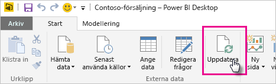
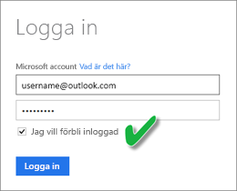

# Uppdatera en datauppsättning som lagras på OneDrive eller SharePoint Online
Importera filer från OneDrive eller SharePoint Online i Power BI-tjänsten är ett bra sätt att kontrollera att det arbete som du gör i **Power BI Desktop** förblir synkroniserat med Power BI-tjänsten.

## Fördelarna med att lagra en Power BI Desktop-fil i OneDrive eller SharePoint Online
När du lagrar en **Power BI Desktop**-fil på OneDrive eller SharePoint Online kommer alla data som du har läst in i din filmodell importeras till datauppsättningen och alla **rapporter** som du har skapat i filen läses in i Rapporter i Power BI. Om du gör ändringar i din fil på OneDrive eller SharePoint Online, som att lägga till nya åtgärder, ändra kolumnnamn eller redigera visualiseringar, kommer ändringarna när du sparar att uppdateras även i Power BI-tjänsten, vanligtvis inom ungefär en timme.

Du kan utföra manuell engångsuppdatering direkt i Power BI Desktop genom att välja Uppdatera på menyfliken Start. När du väljer Uppdatera här kommer data i *filens* modell att uppdateras med uppdaterade data från den ursprungliga datakällan. Den här typen av uppdatering sker helt inom Power BI Desktop programmet och skiljer sig från manuell eller schemalagd uppdatering i Power BI och det är viktigt att förstå skillnaden.

När du importerar Power BI Desktop-fil från OneDrive eller SharePoint Online, läses data, tillsammans med annan information om modellen, in i en datauppsättning i Power BI. I Power BI-tjänsten, inte Power BI Desktop, kan du behöva uppdatera data i datauppsättningen eftersom det är dessa som dina rapporter i Power BI-tjänsten bygger på. Eftersom datakällorna är externa kan du manuellt uppdatera datauppsättningen genom att använda **Uppdatera nu**. Du kan också konfigurera ett uppdateringsschema med hjälp av **Schemalägg uppdatering**.

När du uppdaterar datauppsättningen ansluter Power BI inte till filen på OneDrive eller SharePoint Online, för att fråga efter uppdaterade data. Den använder informationen i datauppsättningen för att ansluta direkt till datakällor för att söka efter uppdaterade data som den sedan läser in i datauppsättningen. Uppdaterade data i datauppsättningen synkroniseras inte tillbaka till filen på OneDrive eller SharePoint Online.

## Vad stöds?
I Power BI stöds Uppdatera nu och Schemalägg uppdatering för datauppsättningar som skapas från Power BI Desktop-filer som importerats från en lokal enhet där Hämta data/Frågeredigeraren används för att ansluta till och läsa in data från någon av följande datakällor:

### Power BI Gateway - Personal
* Alla datakällor online som visas i Hämta data och Frågeredigeraren i Power BI Desktop.
* Alla lokala datakällor som visas i Hämta data och Frågeredigeraren i Power BI Desktop, förutom Hadoop-filer (HDFS) och Microsoft Exchange.

<!-- Refresh Data sources-->
[!INCLUDE [refresh-datasources](./includes/refresh-datasources.md)]

> [!NOTE]
> En gateway måste vara installerad och köras för att Power BI ska kunna ansluta till lokala datakällor och uppdatera datauppsättningen.
> 
> 

## OneDrive eller OneDrive för företag. Vad är skillnaden?
Om du både har en personlig OneDrive och OneDrive för företag, bör du behålla alla filer som du vill importera till Power BI på OneDrive för företag. Skälet är att Du använder förmodligen två olika konton för att logga in till dem.

Det är vanligtvis inga problem att ansluta till OneDrive för företag i Power BI eftersom det konto som du använder för att logga in på Power BI ofta är samma konto som används för att logga in på OneDrive för företag. Men på din personliga OneDrive loggar du troligen in med ett annat [Microsoft-konto](https://account.microsoft.com).

När du loggar in med ditt Microsoft-konto bör du markera Jag vill förbli inloggad. Power BI kan sedan synkronisera alla uppdateringar som du gör i filen i Power BI Desktop med datauppsättningarna i Power BI  
    

Om du gör ändringar i din fil på OneDrive som inte kan synkroniseras med datauppsättningen eller rapporterna i Power BI, eftersom autentiseringsuppgifterna för ditt Microsoft-konto kan ha ändrats, måste du ansluta till och importera din fil igen från din personliga OneDrive.

## Hur gör jag för att schemalägga uppdateringar?
När du konfigurerar ett uppdateringsschema, ansluter Power BI direkt till datakällorna med anslutningsinformationen och autentiseringsuppgifterna i datauppsättningen för att fråga efter uppdaterade data, och läser sedan in uppdaterade data i datauppsättningen. Även alla visualiseringar i rapporter och på instrumentpaneler baserade på den datauppsättningen i Power BI-tjänsten uppdateras.

Mer information om hur du konfigurerar schemalagda uppdateringar finns i [Konfigurera schemalagd uppdatering](refresh-scheduled-refresh.md).

## Om något går fel
Om något går fel beror det vanligtvis på att Power BI inte kan logga in till datakällor, eller att gatewayen är offline om datauppsättningen ansluter till en lokal datakälla. Kontrollera att Power BI kan logga in till datakällor. Om det lösenord som du använder för att logga in till en datakälla ändras eller om Power BI loggas ut från en datakälla, bör du försöka logga in till dina datakällor igen i datakällans autentiseringsuppgifter.

Om du gör ändringar i Power BI Desktop-filen på OneDrive och spara, och dessa ändringar inte avspeglas i Power BI inom en timme, kan det bero på att Power BI inte kan ansluta till ditt OneDrive. Försök att ansluta till filen på OneDrive igen. Om du uppmanas att logga in bör du kontrollera att du har markerat Jag vill förbli inloggad. Eftersom Power BI inte kunde ansluta till ditt OneDrive för att synkronisera med filen måste du importera filen igen.

Se till att lämna **Skicka ett e-postmeddelande till mig om uppdateringen misslyckas** markerat. Du vill veta direkt om en schemalagd uppdatering misslyckas.

## Felsökning
Ibland går det inte som förväntat att uppdatera data. Vanligtvis rör problemet en gateway. Ta en titt på artiklarna för gatewayfelsökning där du hittar verktyg och information om kända problem.

[Felsöka den lokala datagatewayen](service-gateway-onprem-tshoot.md)

[Felsöka Power BI Gateway – Personal](service-admin-troubleshooting-power-bi-personal-gateway.md)

Har du fler frågor? [Fråga Power BI Community](http://community.powerbi.com/)

