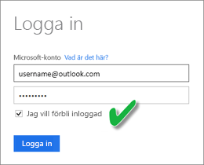

# Uppdatera en datauppsättning som skapats från en Excel-arbetsbok på OneDrive eller SharePoint Online
Du kan importera Excel-arbetsböcker som lagras på din lokala dator eller i lagringsutrymmen i molnet, till exempel OneDrive för företag eller SharePoint Online. Vi ska titta på fördelarna med att använda lagring i molnet för dina Excel-filer. Mer information om hur du importerar Excel-filer till Power BI finns i [Hämta data från Excel-arbetsboksfiler](service-excel-workbook-files.md).

## Vilka är fördelarna?
Importera filer från OneDrive eller SharePoint Online är ett bra sätt att kontrollera att det arbete som du gör i Excel förblir synkroniserat med Power BI-tjänsten. Alla data som du har läst in i din filmodell importeras till datauppsättningen och alla rapporter som du har skapat i filen läses in i Rapporter i Power BI. Om du gör ändringar i din fil på OneDrive eller SharePoint Online, som att lägga till nya åtgärder, ändra kolumnnamn eller redigera visualiseringar, kommer ändringarna när du sparar att uppdateras även i Power BI, vanligtvis inom ungefär en timme.

När du importerar en Excel-arbetsbok från ditt personliga OneDrive, importeras alla data i arbetsboken som tabeller i kalkylblad och/eller data som läses in i Excel-datamodellen och strukturen för datamodellen, till en ny datauppsättning i Power BI. Alla Power View-visualiseringar återskapas i Rapporter. Power BI ansluter automatiskt till arbetsboken på OneDrive eller SharePoint Online ungefär en gång i timmen för att söka efter uppdateringar. Om arbetsboken har ändrats, uppdaterar Power BI datauppsättningen och rapporterna i Power BI-tjänsten.

Du kan uppdatera på datauppsättningen i Power BI-tjänsten. När du uppdaterar datauppsättningen manuellt eller schemalägger en uppdatering för den, ansluter Power BI direkt till de externa datakällorna för att fråga efter uppdaterade data som Power BI därefter läser in i datauppsättningen. Uppdatering av en datauppsättning inifrån Power BI uppdaterar inte data i arbetsboken på OneDrive eller SharePoint Online. 

## Vad stöds?
I Power BI stöds Uppdatera nu och Schemalägg uppdatering för datauppsättningar som skapas från Power BI Desktop-filer som importerats från en lokal enhet där Hämta data/Frågeredigeraren används för att ansluta till och läsa in data från någon av följande datakällor:  

### Power BI Gateway - Personal
* Alla datakällor online som visas i Hämta data och Frågeredigeraren i Power BI Desktop.
* Alla lokala datakällor som visas i Hämta data och Frågeredigeraren i Power BI Desktop, förutom Hadoop-filer (HDFS) och Microsoft Exchange.

<!-- Refresh Data sources-->
[!INCLUDE [refresh-datasources](./includes/refresh-datasources.md)]

> [!NOTE]
> En gateway måste vara installerad och köras för att Power BI ska kunna ansluta till lokala datakällor och uppdatera datauppsättningen.
> 
> 

## OneDrive eller OneDrive för företag. Vad är skillnaden?
Om du både har en personlig OneDrive och OneDrive för företag, bör du behålla alla filer som du vill importera till Power BI på OneDrive för företag. Skälet är att du förmodligen använder två olika konton för att logga in till dem.

Det är vanligtvis inga problem att ansluta till OneDrive för företag i Power BI eftersom det konto som du använder för att logga in på Power BI ofta är samma konto som används för att logga in på OneDrive för företag. Men på din personliga OneDrive loggar du troligen in med ett annat [Microsoft-konto](http://www.microsoft.com/account/default.aspx).

När du loggar in med ditt Microsoft-konto bör du markera Jag vill förbli inloggad. Power BI kan sedan synkronisera alla uppdateringar som du gör i filen i Power BI Desktop med datauppsättningarna i Power BI  
    

Om du gör ändringar i din fil på OneDrive som inte kan synkroniseras med datauppsättningen eller rapporterna i Power BI, eftersom autentiseringsuppgifterna för ditt Microsoft-konto kan ha ändrats, måste du ansluta till och importera din fil igen från din personliga OneDrive.

## Alternativ för att ansluta till en Excel-fil
När du ansluter till en Excel-arbetsbok i OneDrive för företag eller SharePoint Online, har du två alternativ för hur du hämtar vad som finns i din arbetsbok till Power BI.

[**Importera Excel-data till Power BI** ](service-excel-workbook-files.md#import-or-connect-to-an-excel-workbook-from-power-bi) – När du importerar en Excel-arbetsbok från OneDrive för företag eller SharePoint Online, fungerar det som det beskrivs ovan.

[**Anslut, hantera och visa Excel i Power BI** ](service-excel-workbook-files.md#one-excel-workbook--two-ways-to-use-it) – När du använder det här alternativet skapar du en anslutning från Power BI direkt till din arbetsbok på OneDrive för företag eller SharePoint Online.

När du ansluter till en Excel-arbetsbok på det här sättet, skapas inte någon datauppsättning i Power BI. Arbetsboken visas dock i Power BI-tjänsten under Rapporter med en Excel-symbol bredvid namnet. Till skillnad från Excel Online kan du när du ansluter till din arbetsbok från Power BI, om arbetsboken har anslutningar till externa datakällor som skickar data till Excel-datamodellen, konfigurera ett uppdateringsschema.

När du konfigurerar ett uppdateringsschema på det här sättet är den enda skillnaden att uppdaterade data hamnar i arbetsbokens datamodell på OneDrive eller SharePoint Online, istället för i en datauppsättning i Power BI.

## Hur gör jag för att vara säker på att data har lästs in i Excel-datamodellen?
När du använder Power Query (Hämta & Transformera data i Excel 2016) för att ansluta till en datakälla, har du flera alternativ för var du vill läsa in dessa data. För att säkerställa att du läser in data i datamodellen, måste du välja alternativet **Lägg till dessa data i datamodellen** i dialogrutan **Läsa in till**.

> [!NOTE]
> De här bilderna visar Excel 2016.
> 
> 

I **Navigator** klickar du på **Läs in till ...**  
    

Eller, om du klickar på **Redigera** i Navigator, så öppnas Frågeredigeraren. Där kan du klicka på **Stäng och läs in till ...**  
    

I **Läs in till** måste du sedan kontrollera att du väljer **Lägg till dessa data i datamodellen**.  
    

### Vad händer om jag använder Hämta externa Data i Power Pivot?
Inga problem. När du använder Power Pivot för att ansluta till och fråga efter data från en lokal datakälla eller datakälla online, läses dina data in automatiskt till datamodellen.

## Hur gör jag för att schemalägga uppdateringar?
När du konfigurerar ett uppdateringsschema, ansluter Power BI direkt till datakällorna med anslutningsinformationen och autentiseringsuppgifterna i datauppsättningen för att fråga efter uppdaterade data, och läser sedan in uppdaterade data i datauppsättningen. Även alla visualiseringar i rapporter och på instrumentpaneler baserade på den datauppsättningen i Power BI-tjänsten uppdateras.

Mer information om hur du konfigurerar schemalagda uppdateringar finns i [Konfigurera schemalagd uppdatering](refresh-scheduled-refresh.md).

## Om något går fel
Om något går fel beror det vanligtvis på att Power BI inte kan logga in till datakällor, eller att gatewayen är offline om datauppsättningen ansluter till en lokal datakälla. Kontrollera att Power BI kan logga in till datakällor. Om det lösenord som du använder för att logga in till en datakälla ändras eller om Power BI loggas ut från en datakälla, bör du försöka logga in till dina datakällor igen i datakällans autentiseringsuppgifter.

Se till att lämna **Skicka ett e-postmeddelande till mig om uppdateringen misslyckas** markerat. Du vill veta direkt om en schemalagd uppdatering misslyckas.

## Viktiga meddelanden
\* Uppdatering stöds inte för OData-flöden som ansluts till och efterfrågas från Power Pivot. Använd Power Query när du använder ett OData-flöde som datakälla.

## Felsökning
Ibland går det inte som förväntat att uppdatera data. Vanligtvis rör problemet en gateway. Ta en titt på artiklarna för gatewayfelsökning där du hittar verktyg och information om kända problem.

[Felsöka den lokala datagatewayen](service-gateway-onprem-tshoot.md)

[Felsöka Power BI Gateway – Personal](service-admin-troubleshooting-power-bi-personal-gateway.md)

Har du fler frågor? [Prova Power BI Community](http://community.powerbi.com/)

