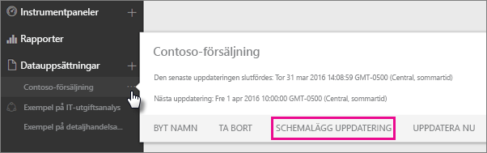
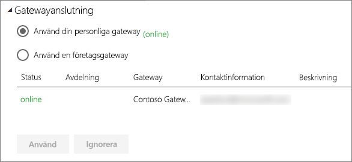
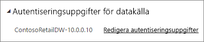
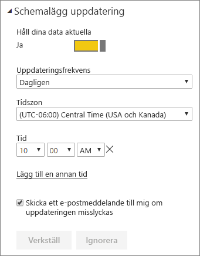

# Konfigurera schemalagd uppdatering

>[!NOTE]
>Efter två månaders inaktivitet pausas schemalagd uppdatering för en datauppsättning. Mer information finns i [*Schemalagd uppdatering*](#scheduled-refresh) senare i den här artikeln.

I den här artikeln beskrivs tillgängliga alternativ för schemalagd uppdatering av både [Lokal datagateway (personligt läge)](service-gateway-personal-mode.md) och [Lokal datagateway](service-gateway-onprem.md). Du anger uppdateringsalternativ i följande områden i Power BI-tjänsten: **Gateway-anslutning**, **Autentiseringsuppgifter för datakälla** och **Schemalagd uppdatering**. Vi går igenom dem i tur och ordning. Du kan läsa mer om datauppdatering, bland annat vilka begränsningar som gäller för uppdateringsscheman, i [Datauppdatering](refresh-data.md#data-refresh).

Så här öppnar du skärmen **Schemalagd uppdatering**:

1. Välj **Fler alternativ** (...) bredvid en datamängd som visas under **Datamängder** i navigeringsfönstret.
2. Välj **Uppdatera schema**.

    

## Gatewayanslutning

Olika alternativ visas beroende på om du har en personlig eller en företagsgateway online och tillgänglig.

Om ingen gateway är tillgänglig visas **Gatewayanslutning** som inaktiverat. Du kan även se ett meddelande om hur du installerar den personliga gatewayen.

Om du har en personlig gateway konfigurerad kan du välja den om den är online. Den visas som offline om den inte är tillgänglig.

Du kan också välja företagsgatewayen om du har en sådan tillgänglig. En företagsgateway visas bara som tillgänglig om ditt konto finns med på fliken **Användare** för datakällan som har konfigurerats för en viss gateway.

## Datakällans autentiseringsuppgifter

### Power BI Gateway - Personal

Om du använder den personliga gatewayen för att uppdatera data, måste ange autentiseringsuppgifterna för att ansluta till serverdatakällan. Om du har anslutit till ett innehållspaket från en onlinetjänst överförs de autentiseringsuppgifter du har angett för anslutningen till den schemalagda uppdateringen.

Du behöver bara logga in till datakällor första gången du uppdaterar den aktuella datamängden. När autentiseringsuppgifterna har angetts sparas de för datauppsättningen.

> [!NOTE]
> Om lösenordet du använder för att logga in till en datakälla upphör att gälla eller har ändras måste du för vissa autentiseringsmetoder även ändra det för datakällan i **Autentiseringsuppgifter för datakällan**.

Om något går fel beror problemet oftast antingen på att gatewayen är offline, eftersom den inte kan logga in till Windows och starta tjänsten, eller att Power BI inte kan logga in till datakällorna för att fråga efter uppdaterade data. Kontrollera datauppsättningens inställningar om uppdateringen misslyckas. Om gatewaytjänsten är offline visas felet i **Status**. Om Power BI inte kan logga in till datakällorna, visas ett fel i Autentiseringsuppgifter för datakälla.

### Lokal datagateway

Du behöver inte ange autentiseringsuppgifter som definierats för datakällan av gatewayadministratören om du använder den lokala datagatewayen för att uppdatera data.

> [!NOTE]
> När du ansluter till lokala SharePoint för datauppdatering, har Power BI endast stöd för autentiseringsmekanismerna *Anonym*, *Grundläggande* och *Windows (NTLM/Kerberos)* . Power BI stöder inte *ADFS* eller *några formulärbaserade autentiserings*mekanismer för datauppdatering av lokala SharePoint-datakällor.

## Schemalagd uppdatering

Du definierar frekvens och tidpunkter för att uppdatera datauppsättningen i avsnittet **Schemalagd uppdatering**. För vissa datakällor behöver du inte konfigurera någon gateway för uppdatering medan andra datakällor behöver en gateway.

Ställ in skjutreglaget **Håll dina data aktuella** på **På** för att konfigurera inställningarna.

> [!NOTE]
> Power BI-tjänsten har som mål att initiera datauppdateringen inom **15 minuter** från din schemalagda uppdateringstid.

> [!NOTE]
> Efter två månaders inaktivitet pausas schemalagd uppdatering för en datauppsättning. En datauppsättning betraktas som inaktiv när ingen användare har besökt någon instrumentpanel eller rapport som bygger på datauppsättningen. När det händer får ägaren till datamängden ett e-postmeddelande som anger att den schemalagda uppdateringen har pausats. Uppdateringsschema för datamängden visas sedan som **inaktiverat**. Om du vill återuppta schemalagd uppdatering besöker du helt enkelt någon av instrumentpanelerna eller rapporterna som bygger på datauppsättningen.

## Vad stöds?

Vissa datauppsättningar stöds för olika gatewayar för schemalagd uppdatering. Nedan följer en referens för att få en uppfattning om vad som är tillgängligt.

### Power BI Gateway – Personal

**Power BI Desktop**

* Alla datakällor online som visas i **Hämta data** och Frågeredigeraren i Power BI Desktop.
* Alla lokala datakällor som visas i **Hämta data** och Frågeredigeraren i Power BI Desktop, förutom Hadoop-filer (HDFS) och Microsoft Exchange.

**Excel**

* Alla online-datakällor som visas i Power Query.
* Alla lokala datakällor som visas i Power Query förutom Hadoop-filer (HDFS) och Microsoft Exchange.
* Alla online-datakällor som visas i Power Pivot.
* Alla lokala datakällor som visas i Power Query förutom Hadoop-filer (HDFS) och Microsoft Exchange.

> [!NOTE]
> I Excel 2016 eller senare visas Power Query i avsnittet **Data** i menyfliksområdet under **Hämta och transformera data**.

### Power BI Gateway

Du kan läsa mer om vilka datakällor som stöds i [Power BI-datakällor](power-bi-data-sources.md).

## Felsökning
Ibland går det inte som förväntat att uppdatera data. Vanligtvis rör problemet en gateway. Ta en titt på artiklarna för gatewayfelsökning där du hittar verktyg och information om kända problem.

- [Felsöka den lokala datagatewayen](service-gateway-onprem-tshoot.md)
- [Felsöka Power BI Gateway – Personal](service-admin-troubleshooting-power-bi-personal-gateway.md)

## Nästa steg

- [Datauppdatering i Power BI](refresh-data.md)  
- [Power BI Gateway – Personal](service-gateway-personal-mode.md)  
- [Lokal datagateway (personligt läge)](service-gateway-onprem.md)  
- [Felsöka den lokala datagatewayen](service-gateway-onprem-tshoot.md)  
- [Felsöka Power BI Gateway – Personal](service-admin-troubleshooting-power-bi-personal-gateway.md)  

Har du fler frågor? [Fråga Power BI Community](https://community.powerbi.com/)