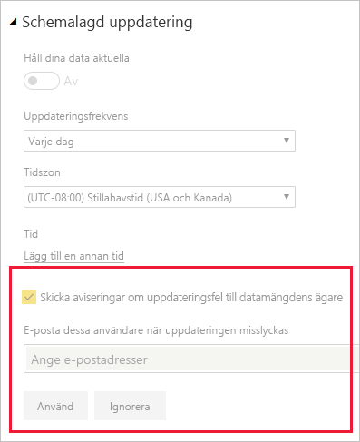

# Felsöka uppdateringsscenarier

Här hittar du information om olika scenarier som du kan stöta på när du uppdaterar data i Power BI-tjänsten.

> [!NOTE]
> Om det uppstår ett fel som inte finns i listan nedan och det orsakar problem kan du be om mer hjälp på [community-webbplatsen](http://community.powerbi.com/), eller så kan du skapa ett [supportärende](https://powerbi.microsoft.com/support/).
>
>

## E-postmeddelanden

Kontakta Power BI-administratören om du hamnat i den här artikeln från ett e-postmeddelande och du inte längre vill ta emot e-postmeddelanden om uppdateringsproblem. Be administratören att ta bort din e-postadress eller en e-postlista du prenumererar på från lämpliga datamängder i Power BI. De kan göra detta från följande område i administratörsportalen för Power BI.

## Uppdatering med hjälp av webbanslutningen fungerar inte korrekt

Om du har ett webbanslutningsskript som använder funktionen [**Web.Page**](https://msdn.microsoft.com/library/mt260924.aspx) och du har uppdaterat din datauppsättning eller rapport efter den 18 november 2016, måste du använda en gateway för att uppdateringen ska fungera korrekt.

## Datakälla utan stöd för uppdatering

När du konfigurerar en datauppsättning, kan du få ett felmeddelande om att datauppsättningen använder en datakälla som inte stöds för uppdatering. Mer information finns i [Felsöka datakälla utan stöd för uppdatering](service-admin-troubleshoot-unsupported-data-source-for-refresh.md).

## Instrumentpanelen återger inte ändringar efter uppdatering

Vänta ungefär 10–15 minuter för att uppdateringen ska återspeglas på instrumentpanelens paneler. Om den fortfarande inte visas, fäster du visualiseringen på instrumentpanelen på nytt.

## GatewayNotReachable när du anger autentiseringsuppgifter

Du kan stöta på felet `GatewayNotReachable` när du försöker ange autentiseringsuppgifter för en datakälla. Detta kan bero på en inaktuell gateway. Installera den senaste gatewayen och försök igen.

## Bearbetningsfel: Följande systemfel uppstod: Typmatchningsfel

Detta kan bero på ett problem med M-skriptet i din Power BI Desktop-fil eller Excel-arbetsbok. Det kan också bero på en inaktuell version av Power BI Desktop.

## Paneluppdateringsfel

En lista över fel som kan uppstå med panelerna på instrumentpaneler och förklaringar till dessa visas i [Felsöka panelfel](refresh-troubleshooting-tile-errors.md).

## Uppdateringen misslyckas vid uppdatering av data från källor som använder AAD OAuth

Ett Azure Active Directory (**AAD**) OAuth-token som används av flera olika datakällor upphör att gälla om ungefär en timme. Du kan hamna i situationer där inläsning av data tar längre tid än den tid du har på dig innan ditt token upphör att gälla (mer än en timme), eftersom Power BI-tjänsten väntar upp till två timmar vid inläsning av data. I dessa fall kan processen för datainläsning misslyckas och ett fel relaterat till autentiseringsuppgifter kan visas.

De datakällor som använder AAD OAuth är bland annat **Microsoft Dynamics CRM Online**, **SharePoint Online** (SPO) och så vidare. Om du ansluter till sådana datakällor och får ett fel relaterat till autentiseringsuppgifter när datainläsningen tar mer än en timme, kan detta vara orsaken.

Microsoft undersöker en lösning som medför att datainläsningsprocessen uppdaterar din token och fortsätter. Om din Dynamics CRM Online- eller SharePoint Online-instans (eller annan AAD OAuth-datakälla) är så stor att den kan överskrida datainläsningströskeln för en tvåtimmarsperiod kan det hända att även Power BI-tjänsten tar en datainläsnings-timeout.

Observera också att du måste använda samma konto som du använder för att logga in i **Power BI-tjänsten** för att uppdateringen ska fungera korrekt vid anslutning till en **SharePoint Online**-datakälla med AAD OAuth.

## Gränser för okomprimerade data vid uppdatering

Den maximala storleken för datauppsättningar som importerats till **Power BI-tjänsten** är 1 GB. Dessa datauppsättningar är kraftigt komprimerade för att säkerställa hög prestanda. Dessutom begränsar tjänsten mängden okomprimerade data som bearbetas under uppdateringen till 10 GB vid delad kapacitet. Denna begränsning rör komprimeringen och är därför mycket högre än 1 GB. Datauppsättningar i Power BI Premium omfattas inte av den här gränsen. Om uppdateringen i Power BI-tjänsten misslyckas av det här skälet, kan du minska mängden data som importeras till Power BI och försöka igen.

## Timeout vid schemalagd uppdatering

Tidsgränsen för schemalagd uppdatering för importerade datauppsättningar är två timmar. Denna timeout ökar till fem timmar för datauppsättningar på **Premium**-arbetsytor. Om du överskrider den här gränsen kan du minska datamängdens storlek eller komplexitet, eller dela upp den i mindre delar.

## Fel i schemalagd uppdatering

Om en schemalagd uppdatering misslyckas fyra gånger i rad inaktiveras uppdateringen i Power BI. Åtgärda det bakomliggande problemet och aktivera sedan den schemalagda uppdateringen igen.

## Åtkomst till resursen är förbjuden  

Det här felet kan inträffa på grund av att cachelagrade autentiseringsuppgifter har upphört att gälla. Rensa cacheminnet för webbläsaren genom att logga in i Power BI och gå till https://app.powerbi.com?alwaysPromptForContentProviderCreds=true. Detta tvingar fram en uppdatering av dina autentiseringsuppgifter.

## Uppdatering av data misslyckades på grund av ändring av lösenord eller att autentiseringsuppgifterna har upphört att gälla

Datauppdateringar kan också misslyckas på grund av att cachelagrade autentiseringsuppgifter har upphört att gälla. Rensa cacheminnet för webbläsaren genom att logga in i Power BI och gå till https://app.powerbi.com?alwaysPromptForContentProviderCreds=true. Detta tvingar fram en uppdatering av dina autentiseringsuppgifter.

## Nästa steg

- [Datauppdatering i Power BI](refresh-data.md)  
- [Felsöka den lokala datagatewayen](service-gateway-onprem-tshoot.md)  
- [Felsöka Power BI Gateway – Personal](service-admin-troubleshooting-power-bi-personal-gateway.md)  

Har du fler frågor? [Prova att fråga Microsofts Power BI-community](http://community.powerbi.com/)

