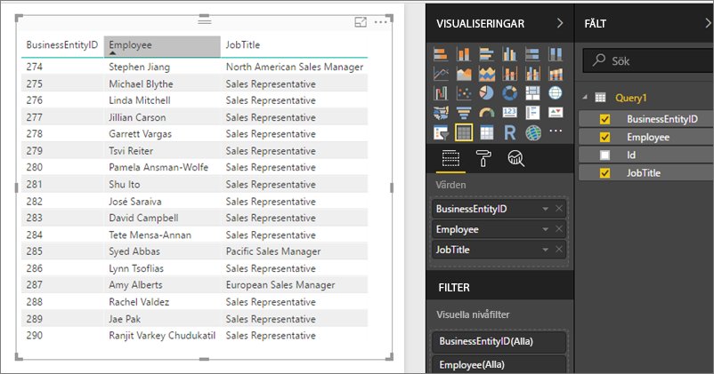

# Åtkomst till delade datauppsättningar som OData-flöden i Power BI-rapportservern
Du kan komma åt delade datauppsättningar från Power BI Desktop med ett OData-flöde.

1. Med OData-flödets URL kan du ansluta till OData-källan.
   
    
2. När du fört dina data till Power BI Desktop, kan du ändra dem i Frågeredigeraren.
   
    
3. Nu kan du använda dina data när du ska skapa rapporter.
   
    

Se till att använda **Avancerade alternativ** så att du kan aktivera öppna typkolumner och formatera kolumnerna i enlighet med detta i Power Query efter behov.

Läs mer om att [ansluta till OData-flöden i Power BI Desktop](../connect-data/desktop-connect-odata.md).

Fler frågor? [Fråga Power BI Community](https://community.powerbi.com/)

