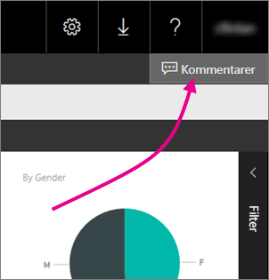
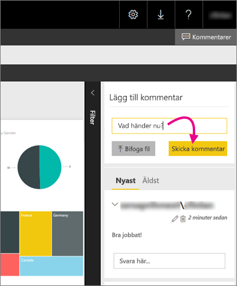

# Lägga till kommentarer i en rapport i en rapportserver
Du kan lägga till kommentarer i rapporter, till exempel Power BI-rapporter i webbportalen för en rapportserver. Kommentarerna interagerar med rapporten och visas för alla med visningsbehörighet för rapporten. Mer information finns i avsnittet [Behörighet](#permissions).

## Lägg till eller visa kommentarer
1. Öppna en sidnumrerad eller Power BI-rapport på en rapportserver.
2. Välj **Kommentarer** i det övre högra hörnet av panelen.
   
    
   
    Du kan se alla befintliga kommentarer i rutan Kommentarer.
3. Skriv kommentaren och välj sedan **Skicka kommentar**.
   
    
   
    Kommentaren visas i fönstret på webbportalen, tillsammans med eventuella tidigare kommentarer. De visas inte i rapporten på Power BI-appar.
   
   > [!TIP]
   > Visste du att? Du kan [kommentera Power BI-rapporter i Power BI-appar](../consumer/mobile/mobile-annotate-and-share-a-tile-from-the-mobile-apps.md) och dela kommenterade rapporter med andra.
   > 
   > 

## Behörigheter
Beroende på dina behörigheter kan du:

* Inte se kommentarer.
* Alla kommentarer och skicka, redigera och ta bort dina egna.
* Visa alla kommentarer, skicka, redigera och ta bort dina egna samt ta bort andra personers kommentarer.

## Nästa steg
* [Vad är Power BI-rapportservern?](get-started.md)  

Har du fler frågor? [Fråga Power BI Community](https://community.powerbi.com/)

