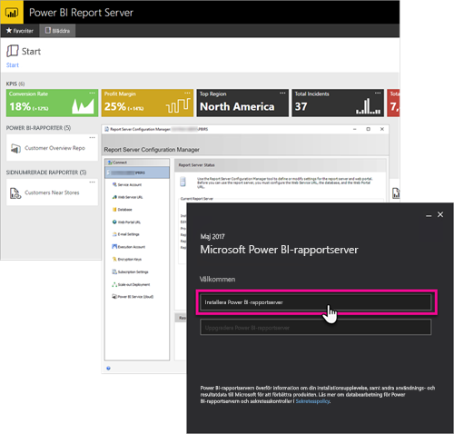

# Översikt över handboken för administratörer, Power BI-rapportservern
Välkommen till handboken för administratörer för Power BI-rapportservern, en lokal plats för att lagra och hantera dina mobila Power BI-rapporter och sidnumrerade rapporter.

Den här handboken hjälper dig att förstå koncepten för att planera, distribuera och hantera din Power BI-rapportserver.

## Installation och migrering
Du behöver installera Power BI-rapportservern för att börja använda den. Vi har information som gör att du kan hantera den här uppgiften.

Innan du börjar installera, uppgradera eller migrera till Power BI-rapportservern, bör du ta en titt på rapportserverns [systemkrav](system-requirements.md).

### Installera
Om du distribuerar en ny Power BI-rapportserver kan du använda följande dokument som hjälp. En snabbstart är tillgänglig för att komma igång snabbt. Eller så kan du titta närmare på installationsdokumenten för fullständig information.

* [Snabbstart: Installera Power BI-rapportserver](quickstart-install-report-server.md)
* [Installera Power BI-rapportservern](install-report-server.md)

### Migrering
Det finns ingen uppgradering på plats för SQL Server Reporting Services. Om du har en befintlig SQL Server Reporting Services-instans som du vill göra till en Power BI-rapportserver måste du migrera den. Det finns också andra orsaker till varför du kanske skulle vilja utföra en migrering. Läs igenom migreringsdokumentet för mer information.

[Migrera en rapportserverinstallation](migrate-report-server.md)

## Konfigurera rapportservern
Du har flera alternativ att välja mellan när du ska konfigurera rapportservern. Ska du använda SSL? Konfigurerar du en e-postserver? Vill du interagera med Power BI-tjänsten för att fästa visualiseringar?

Merparten av din konfiguration sker i rapportserverns konfigurationshanterare. Titta närmare på [konfigurationshanterarens](https://docs.microsoft.com/sql/reporting-services/install-windows/reporting-services-configuration-manager-native-mode) dokumentationen för mer information.

## Säkerhet
Säkerhet och skydd är viktigt för alla organisationer. Du kan lära dig om autentisering, auktorisering, roller och behörigheter i dokumentationen om [säkerhet](https://docs.microsoft.com/sql/reporting-services/security/reporting-services-security-and-protection).

## Nästa steg
[Snabbstart: Installera Power BI-rapportserver](quickstart-install-report-server.md)  
[Så här hittar du rapportserverns produktnyckel](find-product-key.md)  
[Installera Power BI Desktop som har optimerats för Power BI-rapportservern](install-powerbi-desktop.md)  
[Installera Report Builder](https://docs.microsoft.com/sql/reporting-services/install-windows/install-report-builder)  
[Ladda ned SQL Server Data Tools (SSDT)](http://go.microsoft.com/fwlink/?LinkID=616714)

Har du fler frågor? [Fråga Power BI Community](https://community.powerbi.com/)

