# <a name="configure-power-bi-report-server-with-azure-application-proxy"></a>Konfigurera en Power BI-rapportserver med Azure-programproxy

Den här artikeln beskriver hur du använder Azure Active Directory-programproxy för att ansluta till Power BI-rapportserver och SQL Server Reporting Services (SSRS) 2016 och senare. Med den här integrationen kan användare som inte sitter i företagsnätverket få åtkomst till sina rapporter på Power BI-rapportserver och Reporting Services från klientens webbläsare och skyddas av Azure Active Directory (AD). Läs mer om fjärråtkomst till lokala program via [Azure Active Directory-programproxy](https://docs.microsoft.com/azure/active-directory/manage-apps/application-proxy).

## <a name="environment-details"></a>Miljöinformation

Vi använde dessa värden i exemplet vi skapade. 

- Domän: umacontoso.com
- Power BI-rapportserver: PBIRSAZUREAPP.umacontoso.com
- SQL Server-datakälla: SQLSERVERAZURE.umacontoso.com

## <a name="configure-power-bi-report-server"></a>Konfigurera Power BI-rapportserver

När du har installerat Power BI-rapportservern (vi antar att du har en virtuell Azure-dator) konfigurerar du webbadresserna för Power BI-rapportserverns webbtjänst och webbportal med hjälp av följande steg:

1. Skapa regler för inkommande och utgående trafik på den virtuella datorns brandvägg för port 80 (port 443 om du har konfigurerat https-URL:er). Skapa också inkommande och utgående regler för virtuella Azure-datorer från Azure Portal för TCP-protokoll – port 80.
2. Det DNS-namn som har konfigurerats för den virtuella datorn i vår miljö är `pbirsazureapp.eastus.cloudapp.azure.com`.
3. Konfigurera URL:en för Power BI-rapportserverns externa webbtjänst och webbportal genom att välja fliken **Avancerat** > knappen **Lägg till** > välj **Värddatornamn** och lägga till värdnamnet (DNS-namn) på det vis som visas här.

    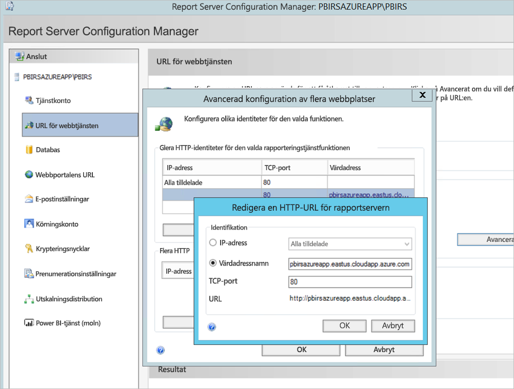

1. Vi utförde föregående steg för området webbtjänst och webbportal och hämtade URL:erna som registrerats på Report Server-konfigurationshanteraren:

    - `https://pbirsazureapp.eastus.cloudapp.azure.com/ReportServer`
    - `https://pbirsazureapp.eastus.cloudapp.azure.com/Reports`

2. I Azure Portal ser vi två IP-adresser för den virtuella datorn i området nätverk 

    - **Offentlig IP-adress**. 
    - **Privat IP**. 
    
    Den offentliga IP-adressen används för åtkomst från utanför den virtuella datorn.

3. Därför lade vi till värdfilposten på den virtuella datorn (Power BI-rapportserver) för att inkludera den offentliga IP-adressen och värdnamnet `pbirsazureapp.eastus.cloudapp.azure.com`.
4. Observera att när du startar om den virtuella datorn kan den dynamiska IP-adressen ändras och du kan behöva lägga till rätt IP-adress igen i värdfilen. För att undvika detta kan du markera den offentliga IP-adressen som statisk i Azure Portal.
5. URL:erna för webbtjänst och webbportal bör vara tillgängliga när ovanstående ändringar har gjorts.
6. Vid åtkomst till URL:en `https://pbirsazureapp.eastus.cloudapp.azure.com/ReportServer` på servern uppmanas vi tre gånger att ange autentiseringsuppgifter och ser en tom skärm.
7. Ange följande registervärden:

    Registernyckel `HKEY\_LOCAL\_MACHINE \SYSTEM\CurrentControlset\Control \Lsa\ MSV1\_0`

1. Lägg till ett nytt värde `BackConnectionHostNames`, ett värde för flera strängar och ange värdnamnet `pbirsazureapp.eastus.cloudapp.azure.com`.

Därefter har vi även åtkomst till URL:erna på servern.

## <a name="configure-power-bi-report-server-to-work-with-kerberos"></a>Konfigurera Power BI-rapportservern för att arbeta med Kerberos

### <a name="1-configure-the-authentication-type"></a>1. Konfigurera autentiseringstypen

Vi måste konfigurera autentiseringstypen för rapportservern att tillåta Kerberos-begränsad delegering. Konfigurationen sker i **rsreportserver.config**-filen.

I filen rsreportserver.config identifierar du avsnittet **autentisering/AuthenticationTypes**.

Vi vill försäkra oss om att RSWindowsNegotiate visas och är först i listan över autentiseringstyper. Det bör se ut ungefär så här.

```
<AuthenticationTypes>

    <RSWindowsNegotiate/>

</AuthenticationTypes>
```

Om du måste ändra konfigurationsfilen ska du **avbryta och starta om rapportservertjänsten** från Report Server-konfigurationshanteraren för att se till att ändringarna börjar gälla.

### <a name="2-register-service-principal-names-spns"></a>2. Registrera tjänstens huvudnamn (SPN)

Öppna kommandotolken som administratör och utför följande steg.

Registrera följande SPN under kontot **Power BI Report Server-tjänstkonto** med hjälp av följande kommandon

```
setspn -s http/ Netbios name\_of\_Power BI Report Server\_server<space> Power BI Report Server\_ServiceAccount

setspn -s http/ FQDN\_of Power BI Report Server\_server<space> Power BI Report Server\_ServiceAccount
```

Registrera följande SPN under SQL Server-tjänstkontot med hjälp av följande kommandon (för en standardinstans av SQL Server):

```
setspn -s MSSQLSVC/FQDN\_of\_SQL\_Server: 1433 (PortNumber) <SQL service service account>

setspn -s MSSQLSVC/FQDN\_of\_SQL\_Server<SQL service service account>
```

### <a name="3-configure-delegation-settings"></a>3. Konfigurera delegeringsinställningar

Vi måste konfigurera delegeringsinställningar på rapportserverns tjänstkonto.

1. Öppna Active Directory-användare och datorer.
2. Öppna egenskaperna för rapportserverns tjänstkonto i Active Directory-användare och -datorer.
3. Vi vill konfigurera begränsad delegering med protokollövergång. Med begränsad delegering, måste du vara uttrycklig med vilka tjänster vi vill delegera till.
4. Högerklicka på **rapportserverkontot** och välj **Egenskaper**.
5. Välj fliken **delegering**.
6. Välj **lita på den här datorn enbart för delegering till angivna tjänster**.
7. Välj **Använd valfritt autentiseringsprotokoll**.
8. Under **Tjänster som det här kontot kan ge delegerade autentiseringsuppgifter till** väljer du **Lägg till**.
9. I den nya dialogrutan väljer du **Användare eller datorer**.
10. Ange **tjänstkontot** för SQL Server-tjänsten och välj **Ok**.

    Det börjar med MSSQLSVC.

1. Lägg till SPN.
2. Välj **OK**. Du bör nu se SPN:et i listan.

De här stegen hjälper dig att konfigurera Power BI-rapportservern för arbete med Kerberos-autentiseringsmekanismen och få testanslutningen till datakällan att fungera på den lokala datorn.

## <a name="configure-azure-application-proxy-connector"></a>Konfigurera anslutningsprogram för Azure-programproxy

Läs artikeln om [konfiguration för anslutningsprogram för programproxy](https://docs.microsoft.com/azure/active-directory/manage-apps/application-proxy-add-on-premises-application#add-an-on-premises-app-to-azure-ad)

Vi installerade anslutningsprogrammet för programproxy på Power BI Report Server men du kan konfigurera det på en fristående server och se till att delegeringen är korrekt inställd.

### <a name="ensure-the-connector-is-trusted-for-delegation"></a>Se till att anslutningsprogrammet är betrott för delegering

Se till att anslutningsprogrammet är betrott för delegering till det SPN som läggs till i Report Server-programpoolkontot.

Konfigurera Kerberos-begränsad delegering (KCD) så att Azure AD-programproxy-tjänsten kan delegera användaridentiteter till Report Server-programpoolkontot. Konfigurera KCD genom att låta anslutningsprogrammet för programproxy hämta Kerberos-biljetter för användare som har autentiserats i Azure AD. Sedan skickar servern kontexten till målprogrammet eller Power BI-rapportservern i det här fallet.

Om du vill konfigurera KCD upprepar du följande steg för varje anslutningsprogram.

1. Logga in på en domänkontrollant som domänadministratör och öppna sedan **Active Directory-användare och -datorer**.
2. Hitta den dator som anslutningen körs på.
3. Dubbelklicka på datorn och välj sedan fliken **Delegering**.
4. Ställ in inställningarna för delegering på **Den här datorn är endast betrodd för delegering till de tjänster som anges**. Välj sedan **Använd valfritt autentiseringsprotokoll**.
5. Välj **Lägg till** och välj sedan **Användare eller datorer**.
6. Ange det tjänstkonto som används för Power BI-rapportservern. Detta är det konto där du har lagt till SPN-namnet i rapportserverkonfigurationen.
7. Klicka på **OK**. 
8. Spara ändringarna genom att klicka på **OK** igen.

## <a name="publish-through-azure-ad-application-proxy"></a>Publicera via Azure-AD-programproxy

Nu är du redo att konfigurera Azure AD-programproxyn.

Publicera Power BI-rapportservern via programproxyn med följande inställningar. Stegvisa instruktioner om hur du publicerar ett program via programproxyn finns i [Publicera program med Azure AD-programproxy](https://docs.microsoft.com/azure/active-directory/manage-apps/application-proxy-add-on-premises-application#add-an-on-premises-app-to-azure-ad).

- **Intern webbadress**: Ange URL:en till den rapportserver som anslutningen kan nå i företagsnätverket. Kontrollera att den här URL:en kan kontaktas från den server som anslutningen är installerad på. Ett bra tips är att använda en toppnivådomän som `https://servername/` för att undvika problem med undersökvägar som publicerats via programproxy. Använd till exempel `https://servername/` och inte `https://servername/reports/` eller `https://servername/reportserver/`. Vi har konfigurerat vår miljö med `https://pbirsazureapp.eastus.cloudapp.azure.com/`.

    > [!NOTE]
    > Vi rekommenderar att du använder en säker HTTPS-anslutning till rapportservern. Mer information finns i [Konfigurera SSL-anslutningar på en rapportserver i enhetligt läge](https://docs.microsoft.com/sql/reporting-services/security/configure-ssl-connections-on-a-native-mode-report-server?view=sql-server-2017).

- **Extern URL**: Ange den offentliga URL:en som den mobila Power BI-appen ska ansluta till. Det kan till exempel se ut som `https://reports.contoso.com` om en anpassad domän används. Om du vill använda en anpassad domän, laddar du upp ett certifikat för domänen och pekar en DNS-post till standard msappproxy.net-domänen för ditt program. Detaljerade anvisningar finns i [Arbeta med anpassade domäner i Azure AD-programproxy](https://docs.microsoft.com/azure/active-directory/manage-apps/application-proxy-configure-custom-domain).

Vi har konfigurerat den externa URL:en som ska vara `https://pbirsazureapp-umacontoso2410.msappproxy.net/` för vår miljö.

- **Förautentiseringsmetod**: Azure Active Directory.
- **Anslutningsgrupp:** Standard.

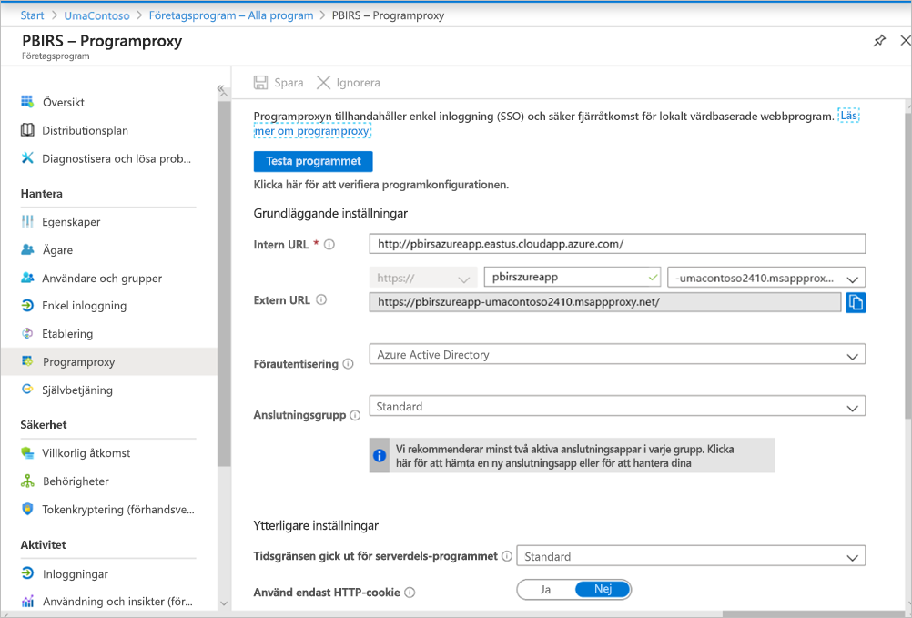

Inga ändringar har gjorts i avsnittet **Ytterligare inställningar**. Det har konfigurerats för att fungera med standardalternativen.

> [!IMPORTANT]
> Observera att egenskapen **Tidsgränsen gick ut för serverdels-programmet** är inställd på **Standard** (85 sekunder) när du konfigurerar programproxyn. Om du har rapporter som tar längre tid än 85 sekunder att köra ställer du in den här egenskapen på **Lång** (180 sekunder), vilket är det högsta möjliga tidsgränsvärdet. När den är inställd på **Lång** måste alla rapporter slutföras inom 180 sekunder. Annars överskrider de tidsgränsen, vilket resulterar i ett fel.


### <a name="configure-single-sign-on"></a>Konfigurera enkel inloggning

När din app har publicerats konfigurerar du inställningarna för enkel inloggning med följande steg:

1. På sidan program i portalen väljer du **Enkel inloggning**.
2. Som **Läge för enkel inloggning** väljer du **Integrerad Windows-autentisering**.
3. Ange **Internt program-SPN** som det värde som du angav tidigare. Du kan identifiera det här värdet med hjälp av följande steg:

    - Försök att köra en rapport eller utföra en testanslutning till datakällan så att en Kerberos-biljett skapas.
    - När du har kört rapporten/testanslutningen öppnar du kommandotolken och kör kommandot: `klist`. I avsnittet result bör du se en biljett med `http/` som SPN. Om det är samma som det SPN som du har konfigurerat med Power BI-rapportservern använder du detta SPN i det här avsnittet.

1. Välj **Delegerad inloggningsidentitet** för anslutningen som ska användas för användarnas räkning. Mer information finns i [Arbeta med olika lokala och molnbaserade identiteter](https://docs.microsoft.com/azure/active-directory/manage-apps/application-proxy-configure-single-sign-on-with-kcd#working-with-different-on-premises-and-cloud-identities).

    Vi rekommenderar att du använder användarens huvudnamn. I vårt exempel konfigurerade vi det för att fungera med följande alternativet för **Användarens huvudnamn**:

    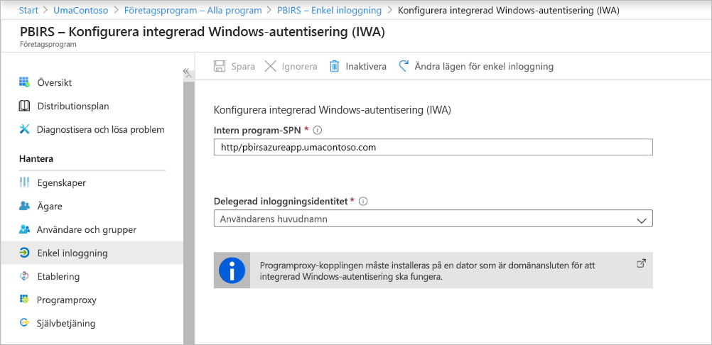

1. Klicka på **Spara** för att spara dina ändringar.

### <a name="finish-setting-up-your-application"></a>Slutför konfigurationen av ditt program

Slutför konfigurationen av programmet genom att gå till området **Användare och grupper** och tilldela användare åtkomst till det här programmet.

1. Konfigurera området **Autentisering** i appregistrering för Power BI-rapportserverprogrammet enligt följande för **Omdirigerings-URL:er** och **Avancerade inställningar**:

    - Skapa en ny omdirigerings-URL och konfigurera den med **Typ** = **Webb** och **Omdirigerings-URI** = `https://pbirsazureapp-umacontoso2410.msappproxy.net/`
    - I avsnittet **Avancerade inställningar** ställer du in **Utloggnings-URL** på `https://pbirsazureapp-umacontoso2410.msappproxy.net/?Appproxy=logout`

    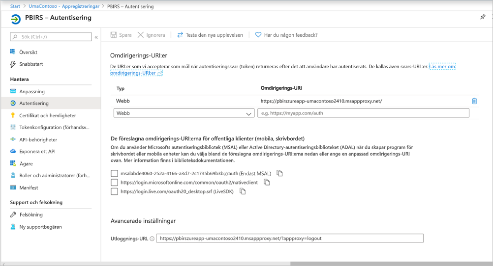

1. Fortsätt att konfigurera området **Autentisering** i appregistrering för Power BI Report Server-programmet enligt följande för **Implicit beviljande**, **Standardklienttyp** och **Kontotyper som stöds**:

    - Ange **Implicit beviljande** till **ID-tokens**.
    - Ange **Standardklienttyp** som **Ingen**.
    - Ange **Kontotyper som stöds** som **Endast konton i den här organisationskatalogen (endast UmaContoso – enskild klient)** .

    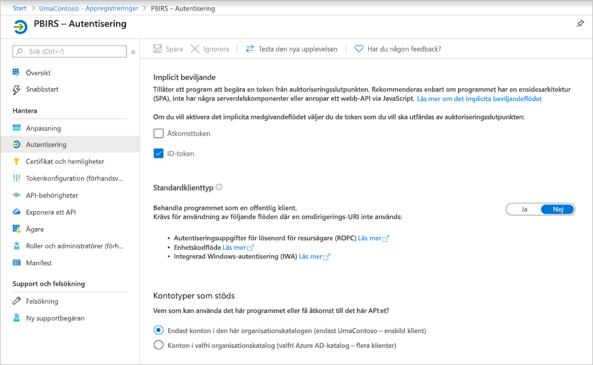

1. När den enkla inloggningen har konfigurerats och URL:en `https://pbirsazureapp-umacontoso2410.msappproxy.net` fungerar måste vi kontrollera att det konto som vi loggar in med är synkroniserat med kontot som behörigheterna tillhandahålls i Power BI-rapportservern.

1. Vi måste först konfigurera den anpassade domän som vi planerar att använda i inloggningen och kontrollera att den är verifierad
2. I det här fallet köpte vi en domän med namnet umacontoso.com och konfigurerade DNS-zonen med posterna. Du kan också prova att använda `onmicrosoft.com`-domänen och synkronisera den med lokal AD.

    Se artikeln [Självstudie: Mappa ett befintligt anpassat DNS-namn till Azure App Service](https://docs.microsoft.com/Azure/app-service/app-service-web-tutorial-custom-domain) som referens.

1. När DNS-posten för den anpassade domänen har verifierats bör du kunna se statusen som **Verifierad** som motsvarar domänen från portalen.

    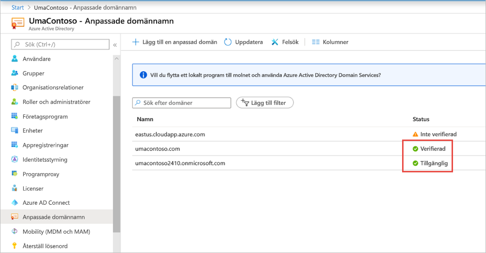

1. Installera Microsoft Azure AD Connect på domänkontrollanten och konfigurera den så att den synkroniseras med Azure AD.

    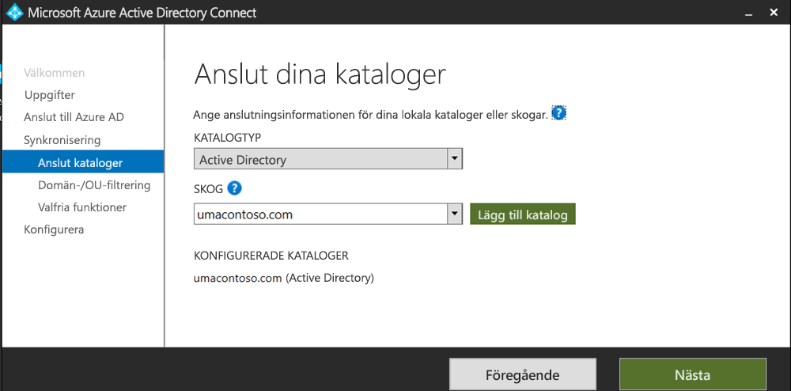

1. När Azure AD har synkroniserats med lokal AD ser vi följande status från Azure Portal:

    

1. När synkroniseringen är klar öppnar du även AD-domäner och förtroenden på domänkontrollanten. Högerklicka på Active Directory-domäner och -förtroenden > Egenskaper och lägg till UPN. I vår miljö är `umacontoso.com` den anpassade domän som vi har köpt.

1. När du har lagt till UPN bör du kunna konfigurera användarkontona med UPN så att Azure AD-kontot och det lokala AD-kontot är anslutna och att token identifieras vid autentisering.

    AD-domännamnet visas i listrutan i avsnittet **Användarens inloggningsnamn** när du har gjort föregående steg. Konfigurera användarnamnet och välj domän i listrutan i avsnittet **Användarens inloggningsnamn** i egenskaperna för AD-användare.

    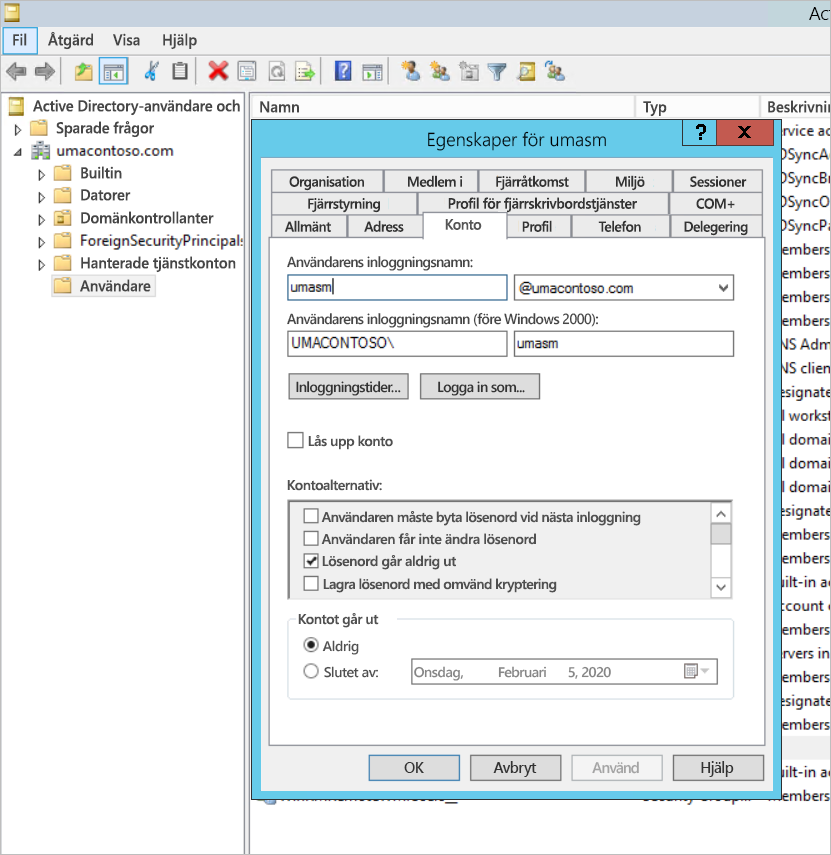

1. När AD-synkroniseringen har slutförts visas det lokala AD-kontot i Azure Portal under avsnittet **Användare och grupper** i programmet. Källan för kontot är **Windows Server AD.**
2. Att logga in med `umasm@umacontoso.com` motsvarar att använda Windows-autentiseringsuppgifter `Umacontoso\umasm`.

    Föregående steg är tillämpliga om du har konfigurerat lokalt AD och planerar att synkronisera det med Azure AD.

    Lyckad inloggning när du har implementerat ovanstående steg:

    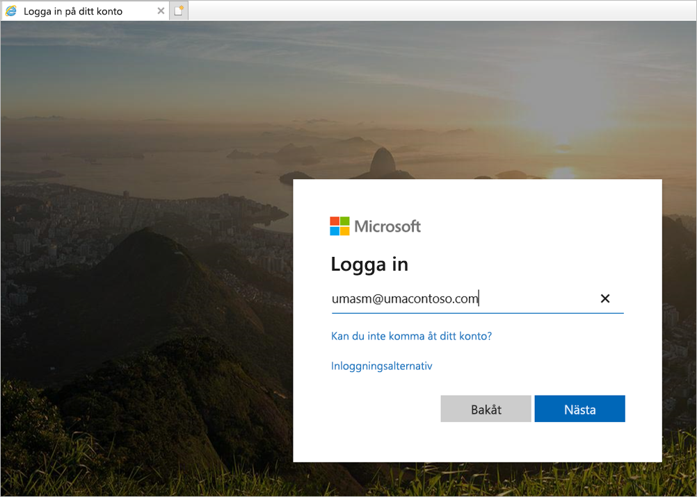

    Följt av att webbportalen visas:

    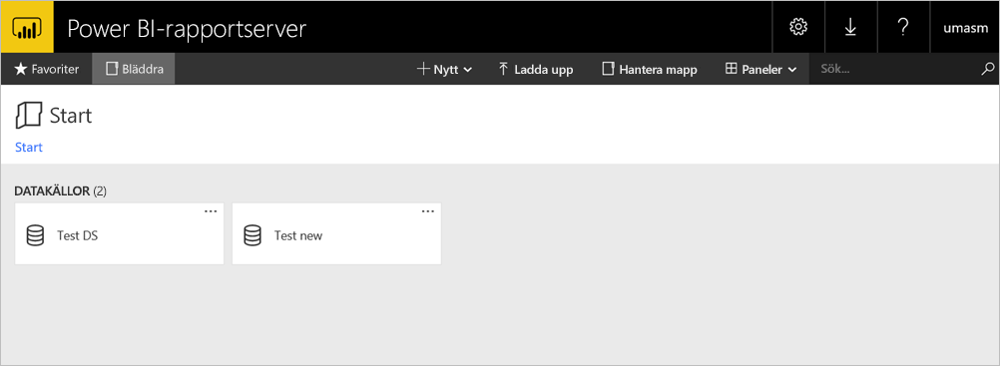

    Med en lyckad testanslutning till datakällan med Kerberos som autentisering:

    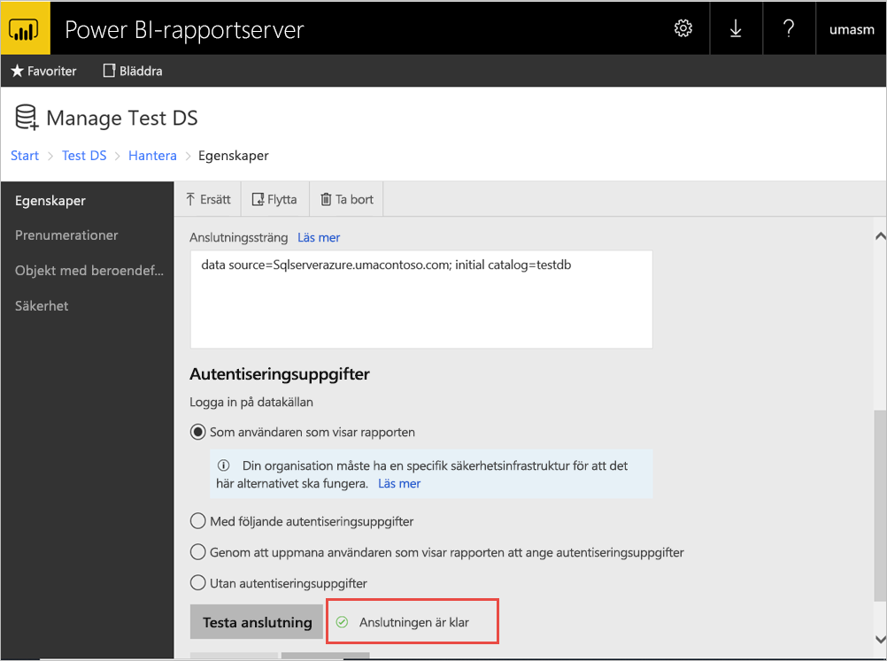

## <a name="access-from-power-bi-mobile-apps"></a>Åtkomst från Power BI-mobilappar

### <a name="configure-the-application-registration"></a>Konfigurera programregistrering

Innan Power BI-mobilappen kan ansluta och komma åt Power BI-rapportservern måste du konfigurera programregistreringen som skapades automatiskt för dig i [Publicera via Azure AD-programproxy](#publish-through-azure-ad-application-proxy) tidigare i den här artikeln.

1. På sidan **Översikt** i Azure Active Directory väljer du **Appregistreringar**.
2. På fliken **Alla program** söker du efter det program som du skapade för Power BI-rapportservern.
3. Välj programmet och välj **Autentisering**.
4. Lägg till följande omdirigerings-URI:er baserat på vilken plattform du använder.

    När du konfigurerar appen för Power BI Mobile **iOS** lägger du till följande omdirigerings-URI:er av typen offentlig klient (mobil och stationär dator):

    - `msauth://code/mspbi-adal%3a%2f%2fcom.microsoft.powerbimobile`
    - `msauth://code/mspbi-adalms%3a%2f%2fcom.microsoft.powerbimobilems`
    - `mspbi-adal://com.microsoft.powerbimobile`
    - `mspbi-adalms://com.microsoft.powerbimobilems`

    När du konfigurerar appen för Power BI Mobile **Android** lägger du till följande omdirigerings-URI:er av typen offentlig klient (mobil och stationär dator):

    - `urn:ietf:wg:oauth:2.0:oob`
    - `mspbi-adal://com.microsoft.powerbimobile`
    - `msauth://com.microsoft.powerbim/g79ekQEgXBL5foHfTlO2TPawrbI%3D`
    - `msauth://com.microsoft.powerbim/izba1HXNWrSmQ7ZvMXgqeZPtNEU%3D`

    När du konfigurerar appen för både Power BI Mobile iOS och Android lägger du till följande omdirigerings-URI av typen offentlig klient (mobil och stationär) till listan över omdirigerings-URI: er som har konfigurerats för iOS:

    - `urn:ietf:wg:oauth:2.0:oob`

    > [!IMPORTANT]
    > Omdirigerings-URI:erna måste läggas till för att programmet ska fungera korrekt.

### <a name="connect-from-the-power-bi-mobile-apps"></a>Anslut från Power BI-mobilapparna

1. I Power BI-mobilappen ansluter du till rapportserverinstansen. Anslut genom att ange **Externt URL** för det program som du har publicerat via programproxyn.
2. Välj **Anslut**. Du dirigeras till inloggningssidan för Azure Active Directory.
3. Ange giltiga autentiseringsuppgifter för användaren och välj **Logga in**. Du ser elementen från rapportservern.

## <a name="next-steps"></a>Nästa steg

[Aktivera fjärråtkomst till Power BI Mobile med Azure AD-programproxy](https://docs.microsoft.com/azure/active-directory/manage-apps/application-proxy-integrate-with-power-bi)

Har du fler frågor? [Fråga Power BI Community](https://community.powerbi.com/)

                
