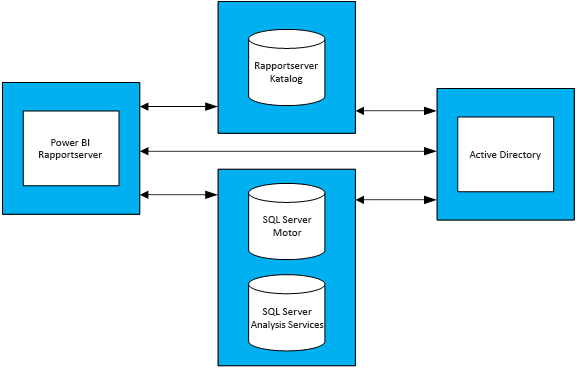

# Vägledning för kapacitetsplanering för Power BI-rapportserver
Power BI Report Server är en rapporteringslösning som för företag och BI som kunderna kan använda och distribuera lokalt, bakom brandväggen. Den kombinerar stödet för interaktiva rapporter hos Power BI Desktop med den lokala serverplattformen för SQL Server Reporting Services. Med intensiv och växande användning av analys och rapportering i företag, kan det vara en utmaning att budgetera maskinvaruinfrastrukturen och de programvarulicenser som krävs för att skala upp till en företagsanvändarbas. Det här dokumentet ger vägledning om kapacitetsplanering för rapportservern för Power BI genom att dela resultatet av ett flertal belastningstestkörningar av olika arbetsbelastningar mot en rapportserver. Medan olika organisationers rapporter, frågor och användningsmönster varierar mycket, utgör de resultat som visas i det här dokumentet, tillsammans med faktiska tester och en detaljerad beskrivning av hur de utfördes, en referenspunkt för vem som helst i tidigt stadium av planeringsprocessen för att distribuera Power BI-rapportservern.

## Sammanfattning
Vi körde två olika typer av arbetsbelastningar mot Power BI Report Server. Varje arbetsbelastning bestod av att återge olika typer av rapporter samt utföra olika åtgärder för webbportalen. 

* I arbetsbelastningen ”Intensiv Power BI-rapport” var den vanligaste åtgärden (det vill säga åtgärden som utfördes 60 % av gångerna) återgivning av Power BI-rapporter.
* I arbetsbelastningen ”Intensiv sidnumrerad rapport” var den vanligaste åtgärden återgivning av sidnumrerade rapporter.

Med en servertopologi med fyra servrar för Power BI-rapportservern och en förväntan att mer än 5 % av användarna använder en rapportserver vid något tillfälle, beskriver följande tabell det maximala antalet användare som Power BI-rapportservern kan hantera med minst 99 % tillförlitlighet. 

| Arbetsbelastning | 8 kärnor/32 GB RAM | 16 kärnor/64 GB RAM |
| --- | --- | --- |
| **Power BI-rapport, intensiv** (> 60%) |1 000 användare |3 000 användare |
| **Rapport med sidbrytning (RDL), intensiv** (> 60%) |2 000 användare |3 200 användare |

I varje körning var CPU den mest belastade resursen. På grund av detta skulle ett större antal kärnor hos Power BI-rapportservern öka tillförlitligheten mer än att öka mängden minne eller hårddiskutrymme. 

## Testmetod
Den använda testtopologin baseras på virtuella datorer i Microsoft Azure i stället för leverantörsspecifik fysisk maskinvara. Alla datorer befann sig i regioner i USA. Detta speglar den allmänna trenden för virtualisering av maskinvaran, såväl lokalt som i det offentliga molnet. 

### Topologi för Power BI-rapportservern
Distributionen av Power BI-rapportservern består av följande virtuella datorer:

* Active Directory-domänkontrollant: detta krävs av SQL Server Database Engine, SQL Server Analysis Services och Power BI-rapportservern att på ett säkert sätt autentisera alla begäranden.
* SQL Server Database Engine och SQL Server Analysis Services: här lagras alla databaser som rapporterna ska använda när vi renderade dem.
* Power BI-rapportserver
* Databas för Power BI-rapportserver. Rapportserverns databas finns på en annan dator än Power BI-rapportservern så att den inte behöver konkurrera med SQL Server Database Engine för minne-, CPU-, nätverks- och diskresurser.

En fullständig konfiguration av varje virtuell dator som används i topologin finns i bilaga 1.1, Topologi för Power BI-rapportservern och bilaga 1.2 Power BI-rapportserverns konfiguration av virtuella datorer.

### Tester
Testerna som används i belastningstestkörningarna är allmänt tillgängliga i ett GitHub-projekt som heter Reporting Services LoadTest (se https://github.com/Microsoft/Reporting-Services-LoadTest). Med det här verktyget kan du studera prestanda, tillförlitlighet, skalbarhet och egenskaper för återställning av SQL Server Reporting Services och Power BI-rapportservern. Det här projektet består av fyra testfall:

* Tester som simulerar återgivningen av Power BI-rapporter,
* Tester som simulerar återgivningen av mobilrapporter,
* Tester som simulerar återgivningen av små och stora sidnumrerade rapporter och 
* Tester som simulerar körning av olika typer av åtgärder för webbportalen. 

Alla tester har skrivits för att utföra en åtgärd från slutpunkt till slutpunkt (till exempel rapportåtergivning, skapa en ny datakälla, med mera). Detta sker genom att göra en eller flera webbegäranden till rapportservern (via API: er). I verkligheten kan en användare behöver utföra några mellanliggande åtgärder för att slutföra en av dessa åtgärder för slutpunkt till slutpunkt. Till exempel, för att återge en rapport måste en användare gå till webbportalen, fortsätta till mappen där rapporten befinner sig och sedan klicka på rapporten för att visa den. Medan testerna inte utför alla nödvändiga åtgärder för att slutföra en aktivitet för slutpunkt till slutpunkt används större delen av den belastning som Power BI-rapportservern skulle uppleva. Du kan läsa mer om de olika rapporterna och åtgärderna som utförs genom att utforska GitHub-projektet.

### Arbetsbelastningar
Det finns 2 arbetsbelastningsprofiler som används för testning: Intensiv Power BI-rapport och intensiv rapport med sidbrytning. Tabellen nedan beskriver distributionen av begäranden som körs mot rapportservern.

| Aktivitet | Intensiv Power BI-rapport, förekomstfrekvens | Intensiv sidnumrerad rapport, förekomstfrekvens |
| --- | --- | --- |
| **Återgivning av Power BI-rapporter** |60 % |10 % |
| **Återgivning av sidnumrerade (RDL) rapporter** |30% |60 % |
| **Återgivning av mobilrapporter** |5 % |20% |
| **Web portalåtgärder** |5 % |10 % |

### Användarbelastning
För varje testkörning utfördes testerna baserat på frekvensen som definieras i någon av de två arbetsbelastningarna. Testerna började med 20 samtidiga användarförfrågningar till rapportservern. Användarbelastningen ökades sedan gradvis tills tillförlitligheten hade sjunkit under målet på 99 %.

## Resultat
### Kapacitet för samtidiga användare
Som tidigare nämnts började testerna med 20 samtidiga användare som skickade begäranden till rapportservern. Antalet samtidiga användare ökades sedan gradvis tills 1 % av alla begäranden misslyckades. Resultaten i följande tabell visar antalet samtidiga användarbegäranden som servern kan hantera vid maximal belastning med en lägre misslyckandegrad än 1 %.

| Arbetsbelastning | 8 kärnor/32 GB | 16 kärnor/64 GB |
| --- | --- | --- |
| **Power BI-rapport, intensiv** |50 samtidiga användare |150 samtidiga användare |
| **Rapport med sidbrytning (RDL), intensiv** |100 samtidiga användare |160 samtidiga användare |

### Total användarkapacitet
På Microsoft har vi en produktionsdistribution för Power BI-rapportservern som flera team använde. När vi analyserar den faktiska användningen av den här miljön, kan vi se att antalet samtidiga användare vid en given tidpunkt (även under den dagliga belastningen) inte tenderar att överskrida 5 % av den totala användarbasen. Med 5 % samtidig användning som prestandamått extrapolerade vi den sammanlagda användarbasen som Power BI-rapportservern kan hantera med 99 % tillförlitlighet.

| Arbetsbelastning | 8 kärnor/32 GB | 16 kärnor/64 GB |
| --- | --- | --- |
| **Power BI-rapport, intensiv** |1 000 användare |3 000 användare |
| **Rapport med sidbrytning (RDL), intensiv** |2 000 användare |3 200 användare |

### Visa resultat
Välj en rapport för att visa resultatet av belastningstestet.

| Arbetsbelastning | 8 kärnor/32 GB | 16 kärnor/64 GB |
| --- | --- | --- |
| **Power BI-rapport, intensiv** |[Visa – 8 kärnor](https://msit.powerbi.com/view?r=eyJrIjoiMDhhNGY4NGQtNGRhYy00Yzk4LTk2MzAtYzFlNWI5NjBkMGFiIiwidCI6IjcyZjk4OGJmLTg2ZjEtNDFhZi05MWFiLTJkN2NkMDExZGI0NyIsImMiOjV9) |[Visa – 16 kärnor](https://msit.powerbi.com/view?r=eyJrIjoiNDBiODk1OGUtYTAyOC00MzVhLThmZmYtNzVjNTFjNzMwYzkwIiwidCI6IjcyZjk4OGJmLTg2ZjEtNDFhZi05MWFiLTJkN2NkMDExZGI0NyIsImMiOjV9) |
| **Rapport med sidbrytning (RDL), intensiv** |[Visa – 8 kärnor](https://msit.powerbi.com/view?r=eyJrIjoiNDFiZWYzMTktZGIxNS00MzcwLThjODQtMmJkMGRiZWEzNjhlIiwidCI6IjcyZjk4OGJmLTg2ZjEtNDFhZi05MWFiLTJkN2NkMDExZGI0NyIsImMiOjV9) |[Visa – 16 kärnor](https://msit.powerbi.com/view?r=eyJrIjoiOTU0YjJkYTgtNDg4Yy00NzlhLWIwMGYtMzg4YWI2MjNmOTZjIiwidCI6IjcyZjk4OGJmLTg2ZjEtNDFhZi05MWFiLTJkN2NkMDExZGI0NyIsImMiOjV9) |

<iframe width="640" height="360" src="https://msit.powerbi.com/view?r=eyJrIjoiMDhhNGY4NGQtNGRhYy00Yzk4LTk2MzAtYzFlNWI5NjBkMGFiIiwidCI6IjcyZjk4OGJmLTg2ZjEtNDFhZi05MWFiLTJkN2NkMDExZGI0NyIsImMiOjV9" frameborder="0" allowFullScreen="true"></iframe>

<iframe width="640" height="360" src="https://msit.powerbi.com/view?r=eyJrIjoiNDBiODk1OGUtYTAyOC00MzVhLThmZmYtNzVjNTFjNzMwYzkwIiwidCI6IjcyZjk4OGJmLTg2ZjEtNDFhZi05MWFiLTJkN2NkMDExZGI0NyIsImMiOjV9" frameborder="0" allowFullScreen="true"></iframe>

<iframe width="640" height="360" src="https://msit.powerbi.com/view?r=eyJrIjoiNDFiZWYzMTktZGIxNS00MzcwLThjODQtMmJkMGRiZWEzNjhlIiwidCI6IjcyZjk4OGJmLTg2ZjEtNDFhZi05MWFiLTJkN2NkMDExZGI0NyIsImMiOjV9" frameborder="0" allowFullScreen="true"></iframe>

<iframe width="640" height="360" src="https://msit.powerbi.com/view?r=eyJrIjoiOTU0YjJkYTgtNDg4Yy00NzlhLWIwMGYtMzg4YWI2MjNmOTZjIiwidCI6IjcyZjk4OGJmLTg2ZjEtNDFhZi05MWFiLTJkN2NkMDExZGI0NyIsImMiOjV9" frameborder="0" allowFullScreen="true"></iframe>

## Sammanfattning
För varje belastningstestkörning var CPU den mest belastade resursen vid maxbelastningen på Power BI-rapportserverdatorn. På grund av detta är en ökning av antalet kärnor den första förbättringen som bör ske. Alternativt kan du skala ut genom att lägga till fler servrar som är värdar för Power BI-rapportservern i din topologi.

Resultaten i den här artikeln har härletts från att köra en specifik uppsättning rapporter som förbrukar en specifik datauppsättning med en specifik upprepning. Det är en användbar referenspunkt, men tänk på att din användning beror på dina rapporter, frågor, användningsmönster och distribution av din Power BI-rapportserver.

## Bilaga
### 1 Topologi
**1.1 Topologi för Power BI-rapportservern**

För att endast fokusera på Power BI-rapportserverns beteende under olika konfigurationer åtgärdades VM-konfigurationen för varje typ av dator (förutom för den dator som är värd för Power BI-rapportservern). Varje dator har etablerats enligt andra generationens (v2) D-seriedatorer med premium-lagringsdiskar. Du hittar detaljerad information om varje VM-storlek under avsnittet ”Allmänt” på https://azure.microsoft.com/en-us/pricing/details/virtual-machines/windows/.

| Virtuell datortyp | Processor | Minne | Azure VM-storlek |
| --- | --- | --- | --- |
| **Active Directory-domänkontrollant** |2 kärnor |7 GB |Standard_DS2_v2 |
| **SQL Server Database Engine och Analysis Services** |16 kärnor |56 GB |Standard_DS5_v2 |
| **Reportserverns databas** |16 kärnor |56 GB |Standard_DS5_v2 |

**1.2 Power BI-rapportserver, konfiguration av virtuell dator** 

Olika konfigurationer för processor och minnet användes för den virtuella datorn som är värd för Power BI-rapportservern. Till skillnad från andra virtuella datorer har varje dator etablerats enligt tredje generationens (v3) D-seriedatorer med premium-lagringsdiskar. Du hittar detaljerad information om denna VM-storlek under avsnittet ”Allmänt” på https://azure.microsoft.com/en-us/pricing/details/virtual-machines/windows/.

| Virtuell dator | Processor | Minne | Azure VM-storlek |
| --- | --- | --- | --- |
| **Power BI-rapportserver (liten)** |8 kärnor |32 GB |Standard_D8S_v3 |
| **Power BI-rapportserver (stor)** |16 kärnor |64 GB |vStandard_D16S_v3 |

### 2 Kör verktyget LoadTest
Om du vill köra verktyget Reporting Services LoadTest mot din eller en Microsoft Azure-distribution av Power BI-rapportservern ska du följa dessa steg.

1. Klona projektet Reporting Services LoadTest från GitHub (https://github.com/Microsoft/Reporting-Services-LoadTest).
2. Du hittar lösningsfilen RSLoadTests.sln i projektkatalogen. Öppna filen i Visual Studio 2015 eller senare.
3. Avgör om du vill köra det här verktyget mot din distribution av Power BI-rapportserver och en distribution av Power BI-rapportserver i Microsoft Azure. Om du tänker köra den mot din egen distribution går du till steg 5.
4. Följ anvisningarna som visas på https://github.com/Microsoft/Reporting-Services-LoadTest#create-a-sql-server-reporting-services-load-environment-in-azure för att skapa en Power BI-rapportservermiljö i Azure.
5. Följ anvisningarna som visas på https://github.com/Microsoft/Reporting-Services-LoadTest#load-test-execution för att köra testerna när du är klar med att distribuera miljön.

Har du fler frågor? [Fråga Power BI Community](https://community.powerbi.com/)

