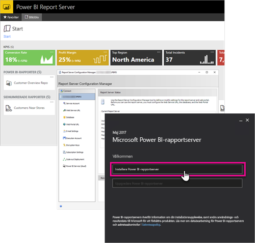

# Översikt i handbok för utvecklare, Power BI-rapportserver

Välkommen till handboken för utvecklare för Power BI-rapportservern, en lokal plats där du kan lagra och hantera dina mobila och sidnumrerade rapporter samt Power BI-rapporter.

Den här handboken visar vilka alternativ du som utvecklare har när du arbetar med Power BI-rapportservern.

## Bädda in

Du kan bädda in inom en iFrame i alla rapporter i Power BI-rapportservern genom att lägga till frågesträngsparametern `?rs:Embed=true` i URL:en. Den här tekniken fungerar med såväl Power BI-rapporter som andra rapporttyper.

### Rapportvisningskontroll

Du kan använda rapportvisningskontrollen i sidnumrerade rapporter. Med den kan du placera kontrollen i ett .NET-fönster eller i ett webbprogram. Mer information finns i [Kom igång med rapportvisningskontrollen](https://docs.microsoft.com/sql/reporting-services/application-integration/integrating-reporting-services-using-reportviewer-controls-get-started).

## API:er

Det finns flera API-alternativ som kan användas när man interagerar med Power BI-rapportservern. Den här tekniken inkluderar följande.

* [REST API:er](rest-api.md)
* [URL-åtkomst](https://docs.microsoft.com/sql/reporting-services/url-access-ssrs)
* [WMI-provider](https://docs.microsoft.com/sql/reporting-services/wmi-provider-library-reference/reporting-services-wmi-provider-library-reference-ssrs)

Du kan också använda den öppna källans [PowerShell-verktyg](https://github.com/Microsoft/ReportingServicesTools) till att hantera rapportservern.

> [!NOTE]
> PowerShell-verktygen stöder inte Power BI Desktop-filer (.pbix) än.

## Anpassade tillägg

Tilläggsbiblioteket är en uppsättning klasser, gränssnitt och värdetyper som ingår i Power BI-rapportservern. Biblioteket ger åtkomst till systemets funktionalitet och är avsett att vara grunden som Microsoft .NET Framework-programmen kan använda för att utöka antalet komponenter i Power BI-rapportservern.

Det finns flera typer av tillägg som du kan skapa.

* Databearbetningstillägg
* Leveranstillägg
* Renderingstillägg för sidnumrerade rapporter
* Säkerhetstillägg

Läs mer i [Tilläggsbibliotek](https://docs.microsoft.com/sql/reporting-services/extensions/reporting-services-extension-library).

## Nästa steg

[Kom igång med rapportvisningskontrollen](https://docs.microsoft.com/sql/reporting-services/application-integration/integrating-reporting-services-using-reportviewer-controls-get-started)  
[Skapa program med hjälp av webbtjänsten och .NET Framework](https://docs.microsoft.com/sql/reporting-services/report-server-web-service/net-framework/building-applications-using-the-web-service-and-the-net-framework)  
[URL-åtkomst](https://docs.microsoft.com/sql/reporting-services/url-access-ssrs)  
[Tilläggsbibliotek](https://docs.microsoft.com/sql/reporting-services/extensions/reporting-services-extension-library)  
[WMI-provider](https://docs.microsoft.com/sql/reporting-services/wmi-provider-library-reference/reporting-services-wmi-provider-library-reference-ssrs)

Har du fler frågor? [Fråga Power BI Community](https://community.powerbi.com/)