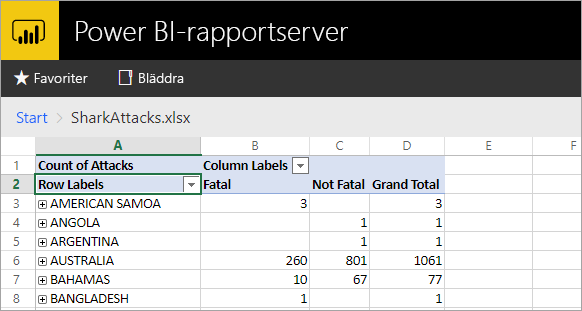
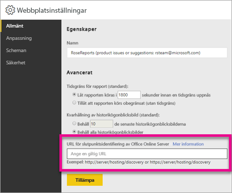

# <a name="configure-your-report-server-to-host-excel-workbooks-using-office-online-server-oos"></a>Konfigurera rapportservern för att hantera Excel-arbetsböcker med hjälp av Office Online Server (OOS)

Förutom att kunna se Power BI-rapporter i webbportalen, kan Power BI-rapportserver nu vara värd för Excel-arbetsböcker med [Office Online Server](https://docs.microsoft.com/officeonlineserver/office-online-server-overview) (OOS). Din rapportserver blir en enda plats för att publicera och visa Microsoft BI-innehåll för självbetjäning.



## <a name="prepare-server-to-run-office-online-server"></a>Förbereda servern för att köra Office Online Server

Utföra dessa procedurer på servern där du kör Office Online-Server. Den här servern måste vara Windows Server 2012 R2 eller Windows Server 2016. Windows Server 2016 kräver Office Online Server från april 2017 eller senare.

### <a name="install-prerequisite-software-for-office-online-server"></a>Installera nödvändig programvara för Office Online-Server

1. Öppna Windows PowerShell-kommandotolken som administratör och kör det här kommandot för att installera nödvändiga roller och tjänster.

    **Windows Server 2012 R2:**

    ```powershell
    Add-WindowsFeature Web-Server,Web-Mgmt-Tools,Web-Mgmt-Console,Web-WebServer,Web-Common-Http,Web-Default-Doc,Web-Static-Content,Web-Performance,Web-Stat-Compression,Web-Dyn-Compression,Web-Security,Web-Filtering,Web-Windows-Auth,Web-App-Dev,Web-Net-Ext45,Web-Asp-Net45,Web-ISAPI-Ext,Web-ISAPI-Filter,Web-Includes,InkandHandwritingServices,NET-Framework-Features,NET-Framework-Core,NET-HTTP-Activation,NET-Non-HTTP-Activ,NET-WCF-HTTP-Activation45,Windows-Identity-Foundation,Server-Media-Foundation
    ```

    **Windows Server 2016:**

    ```powershell
    Add-WindowsFeature Web-Server,Web-Mgmt-Tools,Web-Mgmt-Console,Web-WebServer,Web-Common-Http,Web-Default-Doc,Web-Static-Content,Web-Performance,Web-Stat-Compression,Web-Dyn-Compression,Web-Security,Web-Filtering,Web-Windows-Auth,Web-App-Dev,Web-Net-Ext45,Web-Asp-Net45,Web-ISAPI-Ext,Web-ISAPI-Filter,Web-Includes,NET-Framework-Features,NET-Framework-45-Features,NET-Framework-Core,NET-Framework-45-Core,NET-HTTP-Activation,NET-Non-HTTP-Activ,NET-WCF-HTTP-Activation45,Windows-Identity-Foundation,Server-Media-Foundation
    ```

    Starta om servern vid behov.
2. Installera följande programvara:

   * [.NET Framework 4.5.2](https://go.microsoft.com/fwlink/p/?LinkId=510096)
   * [Visual C++ Redistributable-paket för Visual Studio 2013](https://www.microsoft.com/download/details.aspx?id=40784)
   * [Visual C++ Redistributable för Visual Studio 2015](https://go.microsoft.com/fwlink/p/?LinkId=620071)
   * [Microsoft.IdentityModel.Extention.dll](https://go.microsoft.com/fwlink/p/?LinkId=620072)

### <a name="install-office-online-server"></a>Installera Office Online Server

Observera att Office Online-Server måste finnas i samma Active Directory-skog som dess användare samt eventuella externa datakällor som du planerar att använda om du planerar att använda Excel Online funktioner som använder åtkomst till externa data (till exempel Power Pivot) med Windows-baserad autentisering.

1. Hämta Office Online Server från [Volume Licensing Service Center (VLSC)](http://go.microsoft.com/fwlink/p/?LinkId=256561). Filen finns under Office-produkterna på VLSC-portalen. För utveckling kan du hämta OOS från MSDN-prenumeranthämtningar.
2. Kör Setup.exe.
3. På sidan **Läsa licensvillkor för programvara från Microsoft** väljer du **Jag accepterar villkoren i avtalet** och väljer **Fortsätt**.
4. På sidan **Välj filsökväg** väljer du den mapp där du vill att Office Online Server-filer ska installeras (till exempel C:\Program Files\Microsoft Office Web Apps\*) och sedan **Installera nu**. Om den angivna mappen inte finns skapas den åt dig.

    Vi rekommenderar att du installerar Office Online Server på systemenheten.

5. När installationen av Office Online Server är klar väljer du **Stäng**.

### <a name="install-language-packs-for-office-web-apps-server-optional"></a>Installera språkpaket för Office Web Apps-Server (valfritt)

Med Office Online Server-språkpaketet kan användarna visa webbaserade Office-filer på flera språk.

Följ dessa steg om du vill installera språkpaket.

1. Hämta Office Online Server-språkpaketet från [Microsoft Download Center](http://go.microsoft.com/fwlink/p/?LinkId=798136).
2. Kör **wacserverlanguagepack.exe**.
3. I guiden för Office Online Server-språkpaketetet på sidan **Läsa licensvillkor för programvara från Microsoft** väljer du **Jag accepterar villkoren i avtalet** och väljer **Fortsätt**.
4. När installationen av Office Online Server är klar väljer du **Stäng**.

## <a name="deploy-office-online-server"></a>Distribuera Office Online Server

### <a name="create-the-office-online-server-farm-https"></a>Skapa Office Online-servergruppen (HTTPS)

Använd kommandot New-OfficeWebAppsFarm för att skapa en ny Office Online-servergrupp som består av en enda server, som visas i följande exempel.

```powershell
New-OfficeWebAppsFarm -InternalUrl "https://server.contoso.com" -ExternalUrl "https://wacweb01.contoso.com" -CertificateName "OfficeWebApps Certificate"
```

**Parametrar**

* **–InternalURL** är det fullständigt kvalificerade domännamnet (FQDN) på servern som kör Office Online Server, till exempel `http://servername.contoso.com`.
* **– ExternalURL** är ett FQDN som kan användas på Internet.
* **– CertificateName** är det egna namnet för certifikatet.

### <a name="create-the-office-online-server-farm-http"></a>Skapa Office Online-servergruppen (HTTP)

Använd kommandot New-OfficeWebAppsFarm för att skapa en ny Office Online-servergrupp som består av en enda server, som visas i följande exempel.

```powershell
New-OfficeWebAppsFarm -InternalURL "http://servername" -AllowHttp
```

**Parametrar**

* **– InternalURL** är namnet på servern som kör Office Online Server, till exempel `http://servername`.
* **– AllowHttp** konfigurerar servergruppen för HTTP.

### <a name="verify-that-the-office-online-server-farm-was-created-successfully"></a>Kontrollera att Office Online-servergruppen har skapats

När gruppen har skapats visas information om gruppen i Windows PowerShell-kommandotolken. För att kontrollera att Office Online Server har installerats och konfigurerats korrekt ska du använda en webbläsare för att få åtkomst till Office Online Servers identifierings-URL, vilket visas i följande exempel. Identifierings-URL:en är parametern *InternalUrl* som du angav när du konfigurerade Office Online-servergruppen, följt av */värd/identifiering*, till exempel:

```
<InternalUrl>/hosting/discovery
```

Om Office Online Servern fungerar som förväntat, bör du se en Web Application Open Platform Interface Protocol (WOPI)-identifierings-XML-fil i webbläsaren. De första raderna i filen bör likna följande exempel:

```xml
<?xml version="1.0" encoding="utf-8" ?> 
<wopi-discovery>
<net-zone name="internal-http">
<app name="Excel" favIconUrl="<InternalUrl>/x/_layouts/images/FavIcon_Excel.ico" checkLicense="true">
<action name="view" ext="ods" default="true" urlsrc="<InternalUrl>/x/_layouts/xlviewerinternal.aspx?<ui=UI_LLCC&><rs=DC_LLCC&>" /> 
<action name="view" ext="xls" default="true" urlsrc="<InternalUrl>/x/_layouts/xlviewerinternal.aspx?<ui=UI_LLCC&><rs=DC_LLCC&>" /> 
<action name="view" ext="xlsb" default="true" urlsrc="<InternalUrl>/x/_layouts/xlviewerinternal.aspx?<ui=UI_LLCC&><rs=DC_LLCC&>" /> 
<action name="view" ext="xlsm" default="true" urlsrc="<InternalUrl>/x/_layouts/xlviewerinternal.aspx?<ui=UI_LLCC&><rs=DC_LLCC&>" /> 
```

### <a name="configure-excel-workbook-maximum-size"></a>Konfigurera maxstorleken för Excel-arbetsböcker

Den maximala storleken för alla filer i Power BI-rapportservern är 100 MB. Om du vill anpassa dig till detta måste du ställa in det manuellt i OOS.

```powershell
Set-OfficeWebAppsFarm -ExcelWorkbookSizeMax 100
```

## <a name="using-effectiveusername-with-analysis-services"></a>Använd EffectiveUserName med Analysis Services

För att tillåta live-anslutningar till Analysis Service för anslutningar inom en Excel-arbetsbok som använder EffectiveUserName. För att OOS ska kunna använda EffectiveUserName behöver du lägga till datorkontot för OOS-servern som administratör för Analysis Services-instansen. Management Studio för SQL Server 2016 eller senare krävs för att göra detta.

Endast inbäddade Analysis Services-anslutningar stöds för närvarande i en Excel-arbetsbok. Användarkontot måste ha behörighet för att ansluta till Analysis Services eftersom det inte går att skapa en proxyanslutning för användaren.

Kör följande PowerShell-kommandon på OOS-servern.

```powershell
Set-OfficeWebAppsFarm -ExcelUseEffectiveUserName:$true
Set-OfficeWebAppsFarm -ExcelAllowExternalData:$true
Set-OfficeWebAppsFarm -ExcelWarnOnDataRefresh:$false
```

## <a name="configure-a-power-pivot-instance-for-data-models"></a>Konfigurera en Power Pivot-instans för datamodeller

Genom att installera en instans för Analysis Services Power Pivot-läge kan du arbeta med Excel-arbetsböcker som använder Power Pivot. Kontrollera att instansnamnet är *POWERPIVOT*. Lägg till datorkontot för OOS-servern som administratör för Analysis Services Power Pivot-lägesinstansen. Management Studio för SQL Server 2016 eller senare krävs för att göra detta.

Kör följande kommando i OOS för att använda Power Pivot-lägesinstans.

```powershell
New-OfficeWebAppsExcelBIServer -ServerId <server_name>\POWERPIVOT
```

Om du inte redan tillåter externa data från Analysis Services-steget ovan, kör du följande kommando.

```powershell
Set-OfficeWebAppsFarm -ExcelAllowExternalData:$true
```

### <a name="firewall-considerations"></a>Överväganden för brandvägg

För att undvika brandväggsproblem kan behöva du öppna portarna 2382 och 2383. Du kan också lägga till *msmdsrv.exe* för Power Pivot-instansen som en brandväggsprincip.

## <a name="configure-power-bi-report-server-to-use-the-oos-server"></a>Konfigurera Power BI-rapportservern för att använda OOS-Server

På sidan **Allmänna** på **Webbplatsinställningar** anger du URL:en för OOS identifiering. Webbadressen för OOS-identifiering är *InternalUrl* som används för att distribuera OOS-servern, följt av */hosting/discovery*. Till exempel `http://servername/hosting/discovery`, för HTTP. Och `https://server.contoso.com/hosting/discovery` för HTTPS.

För att komma till **Webbplatsinställningar** väljer du den **kugghjulsikonen** uppe till höger och sedan **Webbplatsinställningar**.

Det är endast användare med rollen **Systemadministratör** som kan se inställningar för identifierings-URL:en för Office Online Server.



När du har angett URL:en för identifiering och väljer **Verkställ** visas en vald Excel-arbetsbok i webbportalen.

## <a name="limitations-and-considerations"></a>Begränsningar och överväganden

* Du har bara läsbehörighet med arbetsböcker.

## <a name="next-steps"></a>Nästa steg

[Administratörsöversikt](admin-handbook-overview.md)  
[Installera Power BI-rapportserver](install-report-server.md)  
[Hämta Report Builder](https://www.microsoft.com/download/details.aspx?id=53613)  
[Ladda ned SQL Server Data Tools (SSDT)](http://go.microsoft.com/fwlink/?LinkID=616714)

Har du fler frågor? [Fråga Power BI Community](https://community.powerbi.com/)
