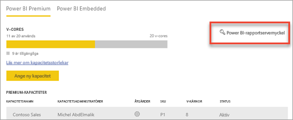
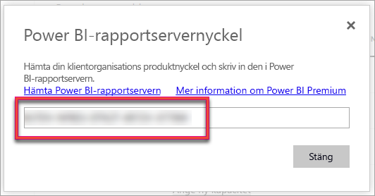
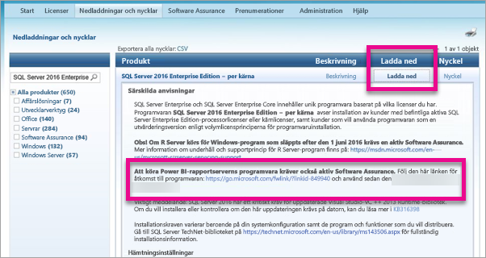

# Så här hittar du rapportserverns produktnyckel
Lär dig hur du hittar produktnyckeln för Power BI-rapportservern för att installera servern i en produktionsmiljö.

<iframe width="640" height="360" src="https://www.youtube.com/embed/6CQnf-NGtpU?rel=0&amp;showinfo=0" frameborder="0" allowfullscreen></iframe>

Du har hämtat Power BI-rapportservern och du har ett SQL Server Enterprise Software Assurance-avtal. Eller också har du köpt Power BI Premium. Du vill installera servern i en produktionsmiljö, men du behöver en produktnyckel för att göra det. Var finns produktnyckeln? 

Produktnyckeln ska finnas på någon av följande platser, beroende på vad du har köpt.

## Om du har köpt Power BI Premium
Om du har köpt Power BI Premium så kommer du att ha tillgång till din produktnyckel för Power BI-raportservern i fliken **kapacitetsinställningar** i Power BI-administratörsportalen. Den finns endast tillgänglig för globala administratörer eller användare som har tilldelats rollen Power BI-tjänstadministratör.

Om du väljer **Power BI-rapportservernyckel** så visas en dialogruta med din produktnyckel. Du kan kopiera den och använda den med installationen.

## Software Assurance-avtal för köpt programvara
Om du har ett SQL Server Enterprise SA-avtal, kan du få din produktnyckel från [Volume Licensing Service Center](https://www.microsoft.com/Licensing/servicecenter/). Titta under det senaste servicepaketet för den senaste versionen av SQL Server. Om du inte ser det, tittar du under RTM-versionen av den senaste versionen av SQL Server.

> [!NOTE]
> Du behöver titta under nedladdningar. Inte avsnittet nycklar.
> 
> 

## Nästa steg
[Installera Power BI-rapportserver](install-report-server.md)  
[Installera Power BI Desktop som har optimerats för Power BI-rapportservern](install-powerbi-desktop.md)  
[Hämta Report Builder](https://www.microsoft.com/download/details.aspx?id=53613)  
[Ladda ned SQL Server Data Tools (SSDT)](http://go.microsoft.com/fwlink/?LinkID=616714)

Har du fler frågor? [Fråga Power BI Community](https://community.powerbi.com/)

