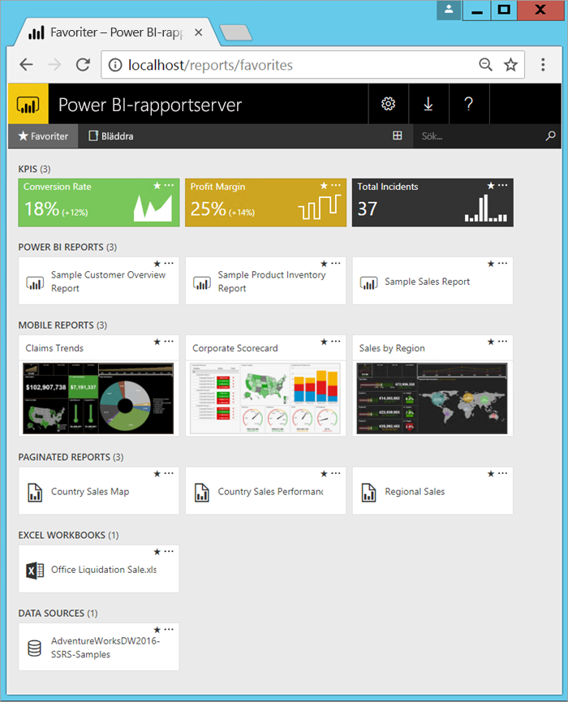

# Vad är Power BI-rapportserver?

Power BI-rapportservern är en lokal rapportserver med en webbportal som du kan använda för att visa och hantera rapporter och KPI:er. Tillsammans med den får du verktyg för att skapa Power BI-rapporter, sidnumrerade rapporter, mobila rapporter och KPI: er. Användarna kan använda rapporterna på olika sätt: visa dem i en webbläsare eller en mobil enhet eller som e-post i sin i inkorg.

## Jämföra Power BI-rapportserver 
Power BI-rapportserver är lik både SQL Server Reporting Services och Power BI-tjänsten online, men på olika sätt. Precis som Power BI-tjänsten är Power BI Report Server värd för Power BI-rapporter (.PBIX), Excel-filer och sidnumrerade rapporter (.RDL). Precis som Reporting Services är Power BI Report Server lokal. Power BI Report Server är en supermängd av Reporting Services: allt som du kan göra i Reporting Services kan du göra med Power BI-rapportservern och mer, tillsammans med stöd för Power BI-rapporter. Se [Jämföra Power BI-rapportservern och Power BI-tjänsten](compare-report-server-service.md) för mer information.

## Licensiera Power BI-rapportserver
Power BI-rapportserver finns tillgänglig via två olika licenser: [Power BI Premium](../service-premium-what-is.md) och [SQL Server Enterprise Edition](https://www.microsoft.com/sql-server/sql-server-2017-editions) med Software Assurance. Med Power BI Premium-licensen kan du skapa en hybrid distributionsblandning för moln och lokalt.  

> [!NOTE]
> När det gäller Power BI Premium inkluderas Microsoft Power BI-rapportserver enbart med P SKU:er. Det inkluderas inte med EM SKU:er.

## Webbportalen
Startpunkten för Power BI-rapportservern är en säker webbportal som du kan visa i alla moderna webbläsare. Här kan du komma åt alla dina rapporter och KPI:er. Innehållet på webbportalen ordnas i en traditionell mapphierarki. I din mappar är innehåll grupperade efter typ: Power BI-rapporter, mobila rapporter, sidnumrerade rapporter, KPI:er och Excel-arbetsböcker. Delade datamängder och delade datakällor finns i sina egna mappar och ska användas som byggstenar för dina rapporter. Du kan tagga favoriter om du vill visa dem i en enda mapp. Och du kan skapa KPI:er direkt i webbportalen. 

Du kan hantera innehållet i webbportalen beroende på dina behörigheter. Du kan även schemalägga rapportbearbetning, få åtkomst till rapporter på begäran och prenumerera på publicerade rapporter. Du kan också använda din egen anpassade [företagsanpassning](https://docs.microsoft.com/sql/reporting-services/branding-the-web-portal) till webbportalen. 

Mer om webbportalen för [Power BI-rapportserver](https://docs.microsoft.com/sql/reporting-services/web-portal-ssrs-native-mode).

## Power BI-rapporter
Du skapar Power BI-rapporter (.PBIX) med versionen av Power BI Desktop som är optimerad för rapportservern. Sedan publicerar du dem och visar dem i webbportalen i din egen miljö.

En Power BI-rapport visar en datamodell från flera perspektiv med visualiseringar som representerar olika fynd och insikter från datamodellen.  En rapport kan ha en enda visualisering eller sidor som är fulla av visualiseringar. Beroende på din roll kan du läsa och utforska rapporter eller skapa dem för andra.

Läs mer om hur du [installerar Microsoft Power BI Desktop](install-powerbi-desktop.md).

## Sidnumrerade rapporter
Sidbrytningsrapporter (.RDL) är rapporter i dokumentformat med visualiseringar där tabeller expanderar vågrätt och lodrätt för att visa alla sina data, och fortsätter från sida till sida enligt behov. Det är bra för att skapa dokument med fast layout och bra utseende som är optimerade för utskrift, till exempel PDF- och Word-filer. 

Du kan skapa sidnumrerade rapporter med [Report Builder](https://docs.microsoft.com/sql/reporting-services/report-builder/report-builder-in-sql-server-2016) eller rapportdesignern i [SQL Server Data Tools (SSDT)](https://docs.microsoft.com/sql/reporting-services/tools/reporting-services-in-sql-server-data-tools-ssdt).

## Reporting Services-mobila rapporter
Mobila rapporter ansluter till lokala data och har en dynamisk layout som anpassar sig efter olika enheter och hur du håller dem. Du skapar dem med SQL Server Mobile Report Publisher.

Mer om [Reporting Services-mobila rapporter](https://docs.microsoft.com/sql/reporting-services/mobile-reports/create-mobile-reports-with-sql-server-mobile-report-publisher). 

## Programmeringsfunktioner för rapportservern
Dra nytta av Power BI-rapportserverns programmeringsfunktioner för att utöka och anpassa dina rapporter med API:er för att integrera eller utöka data och rapportbearbetning i anpassade program.

Fler [utvecklardokumentation för rapportservern](https://docs.microsoft.com/sql/reporting-services/reporting-services-developer-documentation).

## Nästa steg
[Installera Power BI-rapportserver](install-report-server.md)  
[Hämta Report Builder](https://www.microsoft.com/download/details.aspx?id=53613)  

Har du fler frågor? [Fråga Power BI Community](https://community.powerbi.com/)

