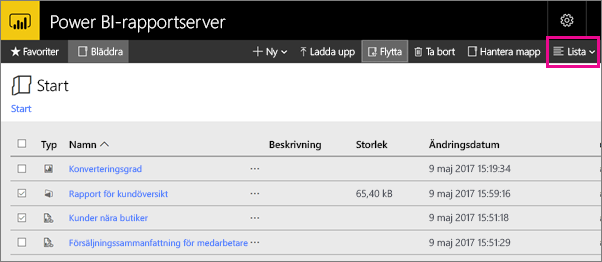

# Navigera webbportalen för Power BI-rapportserver
Webbportalen för Power BI-rapportserver är en lokal plats för att visa, lagra och hantera dina Power BI, mobila och sidnumrerade rapporter och KPI:er.

Du kan visa webbportalen i alla moderna webbläsare. Rapporter och KPI:er i webbportalen är uppdelade i mappar och du kan markera dem som favoriter. Du kan även lagra Excel-arbetsböcker där. Från webbportalen kan du starta de verktyg du behöver för att skapa rapporter:

* **Power BI-rapporter** skapas med Power BI Desktop: visa dem i webbportalen och Power BI-mobilapparna.
* **Sidnumrerade rapporter** skapas i Report Builder: dokument med ett modernt utseende och fast layout som är optimerade för utskrift.
* **KPI:er** skapas direkt i webbportalen.

I webbportalen kan du bläddra igenom mapparna på rapportservern eller söka efter specifika rapporter. Du kan visa en rapport, dess allmänna egenskaper och tidigare kopior av rapporten som finns i rapporthistoriken. Beroende på dina behörigheter, kan du även kunna prenumerera på rapporter för leverans till din inkorgen eller en delad mapp i filsystemet.

## Webbportaluppgifter
Du kan använda webbportalen för ett antal uppgifter, inklusive de här:

* Visa, sök, skriv ut och prenumerera på rapporter.
* Skapa, skydda och bibehåll mapphierarkin för att organisera objekt på servern.
* Konfigurera egenskaper för rapportkörning, rapporthistorik och rapportparametrar.
* Skapa delade scheman och delade datakällor för att göra scheman och datakällanslutningar mer hanterbara.
* Skapa datadrivna prenumerationer för att distribuera rapporter till en stor lista över mottagare.
* Skapa länkade rapporter att återanvända och ändra syftet för en befintlig rapport på olika sätt.
* Ladda ned och öppna gemensamma verktyg, till exempel Power BI Desktop (rapportserver), Report Builder och Mobile Report Publisher.
* [Skapa KPI:er](https://docs.microsoft.com/sql/reporting-services/working-with-kpis-in-reporting-services).
* Skicka feedback eller begär funktioner.
* [Anpassning av webbportalen](https://docs.microsoft.com/sql/reporting-services/branding-the-web-portal)
* [Arbeta med KPI:er](https://docs.microsoft.com/sql/reporting-services/working-with-kpis-in-reporting-services)
* [Arbeta med delade datauppsättningar](https://docs.microsoft.com/sql/reporting-services/work-with-shared-datasets-web-portal)

## Webbportalsroller och behörigheter
Webbportalen är ett webbprogram som körs i en webbläsare. När du startar webbportalen, är de sidor, länkar och alternativ som du ser beroende av de behörigheter som du har på rapportservern. Om du har tilldelats en roll med fullständiga behörigheter, har du åtkomst till en fullständig uppsättning programmenyer och -sidor för att hantera en rapportserver. Om du har tilldelats en roll med behörigheter att visa och köra rapporter, visas bara menyer och sidor som du behöver för de aktiviteterna. Du kan ha olika rolltilldelningar för olika rapportservrar eller till och med för olika rapporter och mappar på en enda rapportserver.

## Starta webbportalen
1. Öppna din webbläsare.
   
    Se den här listan över [webbläsare och versioner som stöds](browser-support.md).
2. I adressfältet, skriver du webbportalens URL.
   
    Som standard är URL:en *http://[ComputerName]/reports*.
   
    Rapportservern kan ha konfigurerats för att använda en specifik port. Till exempel *http://[ComputerName]:80/reports* eller *http://[ComputerName]:8080/reports*
   
    Du ser att webbportalen grupperar objekt i dessa kategorier:
   
   * KPI:er
   * Mobila rapporter
   * Sidnumrerade rapporter
   * Power BI Desktop-rapporter
   * Excel-arbetsböcker
   * Datauppsättningar
   * Datakällor
   * Resurser

## Skapa och redigera Power BI Desktop-rapporter (.pbix-filer)
Du kan visa, ladda upp, skapa, organisera och hantera behörigheter för Power BI Desktop-rapporter i webbportalen.

### Skapa en Power BI Desktop-rapport
1. Välj **ny** > **Power BI-rapport**.
   
    
   
    Power BI Desktop-appen öppnas.
   
    
2. Skapa din Power BI-rapport. Se [snabbstart: Power BI-rapporter](quickstart-create-powerbi-report.md) för information.
3. Ladda upp din rapport på rapportservern.

### Redigera en befintlig Power BI Desktop-rapport
1. Välj ellipsen (**...**) i övre högra hörnet i rapportpanelen > **redigera i Power BI Desktop**.
   
    
   
    Power BI Desktop-appen öppnas.
2. Gör dina ändringar och spara... [hur?]

## Skapa och redigera sidnumrerade rapporter (.rdl-filer)
Du kan visa, ladda upp, skapa, organisera och hantera behörigheter för sidnumrerade rapporter i webbportalen.

### Skapa en sidnumrerad rapport
1. Välj **ny** > **sidnumrerad rapport**.
   
    Report Builder-appen öppnas.
   
    
2. Skapa din sidnumrerade rapport. Se [snabbstart: sidnumrerade rapporter](quickstart-create-paginated-report.md) för information.
3. Ladda upp din rapport på rapportservern.

### Redigera en befintlig sidnumrerad rapport
1. Välj ellipsen (...) i det övre högra hörnet i rapportpanelen > **redigera i Report Builder**.
   
    
   
    Report Builder-appen öppnas.
2. Gör dina ändringar och spara.

## Ladda upp och organisera Excel-arbetsböcker
Du kan ladda upp, organisera och hantera behörigheter för Power BI Desktop-rapporter och Excel-arbetsböcker. De kommer att grupperas tillsammans i webbportalen.

Arbetsböckerna lagras i Power BI-rapportserver, på liknande sätt som andra resursfiler. Om du väljer en av arbetsböckerna så laddas den ned lokalt på ditt skrivbord. Du kan spara ändringarna genom att överföra den till rapportservern igen.

## Hantera objekt i webbportalen
Power BI-rapportserver ger dig detaljerad kontroll över de objekt som du lagrar på webbportalen. Du kan till exempel konfigurera prenumerationer, cachelagring, ögonblicksbilder och säkerhet för individuella sidnumrerade rapporter.

1. Välj ellipsen (...) i det övre högra hörnet av ett objekt och välj sedan **Hantera**.
   
    
2. Välj egenskapen eller den andra funktionen du vill ange.
   
    
3. Välj **Tillämpa**.

Läs mer om att [arbeta med prenumerationer i webbportalen](https://docs.microsoft.com/sql/reporting-services/working-with-subscriptions-web-portal).

## Tagga dina favoritrapporter och KPI:er
Du kan tagga de rapporter och KPI:er som du vill ska vara favoriter. De är lättare att hitta eftersom de är samlade i en enda favoritmapp, både i webbportalen och i Power BI-mobilappar. 

1. Välj ellipsen (**...** ) i det övre högra hörnet av den KPI eller rapport som du vill göra till en favorit och välj **lägg till i favoriter**.
   
    
2. Välj **favoriter** från webbportalens menyflik för att se dem tillsammans med dina andra favoriter på favoriter-sidan i webbportalen.
   
    
   
    I Power BI-mobilappar ser du nu de här favoriterna tillsammans med dina favoritinstrumentpaneler från Power BI-tjänsten.
   
    

## Dölj eller hantera objekt i webbportalen
Du kan dölja objekt i webbportalen och du kan välja att visa dolda objekt.

### Dölj ett objekt
1. Välj ellipsen (...) i det övre högra hörnet av ett objekt och välj sedan **Hantera**.
   
    
2. Välj **dölj det här objektet**.
   
    
3. Välj **Tillämpa**.

### Visa dolda objekt
1. Välj **paneler** (eller **lista**) i det övre högra hörnet > **visa dolda objekt**.
   
    Objekten visas. De är gråa, men du kan fortfarande öppna och redigera dem.
   
    

## Sök efter objekt
Du kan ange en sökterm så ser du allt som du kan komma åt. Resultatet är kategoriserade i KPI:er, rapporter, datauppsättningar och andra objekt. Du kan interagera med resultaten och lägga till dem i dina favoriter.  

## Flytta eller ta bort objekt i listvyn
Som standard visar webbportalen innehållet i panelvyn.

Du kan växla till listvy, där det är enkelt att flytta eller ta bort flera objekt i taget. 

1. Select **panel** > **-listan**.
   
    
2. Välj objekt och välj sedan **flytta** eller **ta bort**.

## Nästa steg
[Användarhandbok](user-handbook-overview.md)  
[Snabbstart: Sidnumrerade rapporter](quickstart-create-paginated-report.md)  
[Snabbstart: Power BI-rapporter](quickstart-create-powerbi-report.md)

Har du fler frågor? [Fråga Power BI Community](https://community.powerbi.com/)

